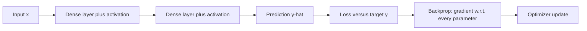

# Neural Network Fundamentals

A neural network is a differentiable function assembled from affine maps and nonlinearities. The simplest dense layer computes

$$
h=\phi(xW+b),
$$

Here $x$ is the input row or batch, $W$ and $b$ are learned weights and biases, $\phi$ is the activation function, and $h$ is the hidden representation passed to the next layer.

and a stack composes those maps:

$$
f_\theta(x)=f_L(f_{L-1}(\cdots f_1(x))).
$$

The parameter set $\theta$ contains the weights and biases across all layers. The composition means each layer transforms the representation produced by the previous layer.

The nonlinearity is what makes the model more than a linear projection; without [activation functions](activation-functions.md), any stack of dense layers collapses to one affine layer. Training chooses parameters $\theta$ by minimizing a [loss function](loss-functions.md), usually with gradients from [backpropagation](backpropagation.md) and updates from an [optimizer](optimizers.md).

## The forward and backward pass

Using the network and training it are two passes over the same layers:

1. **Forward pass.** Feed the input $x$ into the first layer, compute the affine map $xW_1+b_1$, apply the activation $\phi$, and pass the result to the next layer. Repeat until the output layer produces the prediction $\hat y=f_\theta(x)$.
2. **Loss.** Score the prediction against the target $y$ with a [loss](loss-functions.md) $L(\hat y,y)$, a single scalar measuring how wrong the prediction is.
3. **Backward pass.** Run [backpropagation](backpropagation.md), which works through this pass in detail: starting from $\partial L/\partial\hat y$, it applies the chain rule layer by layer, from output back to input, to obtain the gradient $\partial L/\partial\theta$ for every weight and bias.
4. **Update.** An [optimizer](optimizers.md) moves each parameter against its gradient, $\theta\leftarrow\theta-\eta\,\partial L/\partial\theta$ with learning rate $\eta$, and the loop repeats on the next batch.



## Intuition

Hidden layers learn intermediate coordinates that make the target easier to predict. In vision those coordinates may resemble edges or parts; in tabular data they may be interactions that were not manually encoded. The same mechanism also creates the usual risks: a high-capacity network can memorize small data, and a bad loss or initialization can make the optimization problem look harder than the prediction problem really is.

## Worked example

The code trains a tiny network on XOR, a four-point problem that requires a hidden nonlinear representation. It is a compact demonstration of why the activation layer matters.

```python
import torch
import torch.nn.functional as F

torch.manual_seed(1)
X = torch.tensor([[0., 0.], [0., 1.], [1., 0.], [1., 1.]])
y = torch.tensor([[0.], [1.], [1.], [0.]])
net = torch.nn.Sequential(torch.nn.Linear(2, 4), torch.nn.Tanh(), torch.nn.Linear(4, 1))
opt = torch.optim.SGD(net.parameters(), lr=0.5)
loss0 = F.binary_cross_entropy_with_logits(net(X), y).item()
for _ in range(400):
    opt.zero_grad()
    loss = F.binary_cross_entropy_with_logits(net(X), y)
    loss.backward()
    opt.step()
probs = torch.sigmoid(net(X)).detach().flatten()
print("loss_before", round(loss0, 4), "loss_after", round(loss.item(), 4))
print("probabilities", torch.round(probs, decimals=3).tolist())
print("predictions", (probs > 0.5).int().tolist())
```

Observed output:

```text
loss_before 0.6955 loss_after 0.0267
probabilities [0.017000000923871994, 0.9679999947547913, 0.9739999771118164, 0.029999999329447746]
predictions [0, 1, 1, 0]
```

The hidden tanh layer lets the network represent XOR, which a purely linear classifier cannot separate in the original two coordinates.

## Caveats

Depth and width are capacity, not quality. The training loop only optimizes the chosen objective; it does not guarantee calibration, robustness, or causal structure. Debug from the pieces: inspect the loss, gradients, activation ranges, and validation errors before changing architecture.

## References

- [Goodfellow, Bengio, and Courville, Deep Learning, Chapter 6: Deep Feedforward Networks](https://www.deeplearningbook.org/contents/mlp.html)
- [Nielsen, Neural Networks and Deep Learning, Chapter 1: Using neural nets to recognize handwritten digits](http://neuralnetworksanddeeplearning.com/chap1.html)
- [PyTorch documentation: Autograd mechanics](https://docs.pytorch.org/docs/2.7/notes/autograd.html)

> [!nav]
> **Section** — [Deep Learning](index.md)
>
> [Multilayer Perceptrons →](multilayer-perceptrons.md)
>
> **Learning path** — [Deep learning](../00-home-and-navigation/learning-paths.md#deep-learning)
>
> [← Deep Learning](index.md) [Backpropagation →](backpropagation.md)
