# Optimizers

An optimizer consumes gradients from [backpropagation](backpropagation.md) and changes parameters. Plain SGD follows the local slope; momentum accumulates a velocity; Adam rescales updates with running first and second moments. These rules are usually more consequential than small architecture changes when the [loss](loss-functions.md) is noisy or sparse.

## Defining math

SGD updates

$$
\theta_{t+1}=\theta_t-\eta g_t.
$$

Here $\theta_t$ is the parameter vector at step $t$, $g_t=\nabla_\theta \ell(\theta_t)$ is the current gradient of the training loss, and $\eta$ is the learning rate. The formula says "move opposite the slope"; it says nothing about past gradients.

Momentum keeps a velocity:

$$
v_t=\mu v_{t-1}+g_t,\qquad \theta_{t+1}=\theta_t-\eta v_t.
$$

The coefficient $\mu\in[0,1)$ controls how much previous velocity is retained. Momentum therefore smooths noisy gradients and can keep moving through shallow regions where a single mini-batch gradient is weak.

Adam uses bias-corrected moments:

$$
m_t=\beta_1m_{t-1}+(1-\beta_1)g_t,\quad
v_t=\beta_2v_{t-1}+(1-\beta_2)g_t^2,
$$

$$
\theta_{t+1}=\theta_t-\eta\frac{\hat m_t}{\sqrt{\hat v_t}+\epsilon}.
$$

In Adam, $m_t$ tracks the average signed gradient and $v_t$ tracks the average squared gradient, both elementwise. The corrected terms $\hat m_t$ and $\hat v_t$ remove early-step initialization bias, and $\epsilon$ prevents division by zero. Parameters with consistently large squared gradients get smaller normalized steps than parameters with small recent gradients.

[Mixed precision](mixed-precision.md) often changes the optimizer implementation because master weights, scaling, and fused kernels affect numerical behavior.

The difference is visible even in one dimension: SGD reacts only to the current gradient, momentum overshoots less once velocity points toward the basin, and Adam adapts the step scale from recent gradient magnitude.



## Worked example

The code applies the same three scalar gradients to SGD, momentum, and Adam so the final parameter values can be compared without architecture or data effects.

```python
import torch

grads = [torch.tensor(0.8), torch.tensor(-0.2), torch.tensor(0.4)]
theta_sgd = theta_mom = theta_adam = torch.tensor(1.0)
v = m = s = torch.tensor(0.0)
for t, g in enumerate(grads, 1):
    theta_sgd = theta_sgd - 0.1 * g
    v = 0.9 * v + g
    theta_mom = theta_mom - 0.1 * v
    m = 0.9 * m + 0.1 * g
    s = 0.999 * s + 0.001 * g * g
    theta_adam = theta_adam - 0.1 * (m / (1 - 0.9 ** t)) / ((s / (1 - 0.999 ** t)).sqrt() + 1e-8)
print("theta_sgd", round(theta_sgd.item(), 4))
print("theta_momentum", round(theta_mom.item(), 4))
print("theta_adam", round(theta_adam.item(), 4))
```

Observed output:

```text
theta_sgd 0.9
theta_momentum 0.7812
theta_adam 0.7925
```

The same gradient sequence gives different final parameters because momentum carries history and Adam normalizes by recent squared gradients.

## Caveats

Adam's adaptivity is useful for sparse or poorly scaled gradients, but weight decay should usually be decoupled when the intended penalty is true L2-style shrinkage. Learning-rate schedules, warmup, batch size, and gradient clipping are part of the optimizer design, not afterthoughts.

## References

- [Kingma and Ba, 2014, Adam: A Method for Stochastic Optimization](https://arxiv.org/abs/1412.6980)
- [PyTorch documentation: Adam](https://docs.pytorch.org/docs/2.7/generated/torch.optim.Adam.html)
- [Goodfellow, Bengio, and Courville, Deep Learning, Chapter 8](https://www.deeplearningbook.org/contents/optimization.html)

> **Section — [Deep Learning](index.md):** ← [Loss Functions](loss-functions.md) · [Initialization](initialization.md) →

> **Learning path — [Deep learning](../00-home-and-navigation/learning-paths.md#deep-learning):** ← [Backpropagation](backpropagation.md) · [Transformers](transformers.md) →
