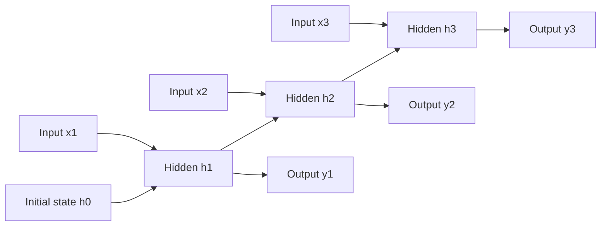

# Recurrent Neural Networks

A recurrent neural network processes a sequence by carrying a hidden state forward. The same transition function is reused at every step, so an RNN can accept variable-length inputs while sharing parameters. [LSTM and GRU](lstm-and-gru.md) add gates to this basic recurrence; [attention](attention.md) and [transformers](transformers.md) replace the single state bottleneck with direct pairwise interactions.

## How a recurrent network works

An RNN reads a sequence one step at a time, keeping a hidden state that summarizes everything seen so far. At each step it combines the current input with the previous hidden state to produce a new hidden state, reusing the _same_ weights at every step — which is what lets it handle sequences of any length. The vanilla recurrence is

$$
h_t=\phi(W_xx_t+W_hh_{t-1}+b), \qquad y_t=g(W_yh_t).
$$

Here $x_t$ is the input at time step $t$, $h_t$ is the hidden state after seeing that input, and $y_t$ is the output or prediction for that step. The matrices $W_x$, $W_h$, and $W_y$ are shared across all time steps; $\phi$ is the recurrent nonlinearity, such as tanh, and $g$ is the output mapping.

Unrolling the recurrence over time makes the shared weights and the single state path visible. Each hidden state depends on the current input and the previous state, and every step reuses the same $W_x$, $W_h$, and $W_y$:



Training uses backpropagation through time: unfold the recurrence over $T$ steps and apply [backpropagation](backpropagation.md) through the shared copies of $W_x,W_h,W_y$. Gradients include products of recurrent Jacobians,

$$
\frac{\partial h_T}{\partial h_t}=\prod_{k=t+1}^{T}\frac{\partial h_k}{\partial h_{k-1}},
$$

The product says that a gradient from the final state must pass through every intermediate transition between $t$ and $T$. If the factors repeatedly have norms below one, the gradient vanishes; if they repeatedly have norms above one, it can explode.

## Worked example

This snippet runs a small recurrent update through a sequence and reports hidden-state norms plus the final hidden vector.

```python
import torch

torch.manual_seed(4)
xs = torch.randn(4, 2)
Wx = torch.randn(2, 3) * 0.4
Wh = torch.eye(3) * 0.7
h = torch.zeros(3)
states = []
for x in xs:
    h = torch.tanh(x @ Wx + h @ Wh)
    states.append(h.norm().item())
print("hidden_norms", [round(v, 3) for v in states])
print("final_hidden", torch.round(h, decimals=3).tolist())
```

Observed output:

```text
hidden_norms [0.757, 0.953, 0.99, 0.524]
final_hidden [0.515999972820282, -0.07500000298023224, -0.05700000002980232]
```

Each hidden state combines the current input with the previous hidden state. The final vector is a compressed summary of all four inputs, which is useful but also a bottleneck.

## History and adoption

Recurrent networks began with Elman and Jordan networks in the late 1980s, which added a recurrent state to a feed-forward net so it could model order. The [vanishing-gradient](vanishing-and-exploding-gradients.md) problem limited how far these vanilla RNNs could carry information, motivating gated variants: the [LSTM](lstm-and-gru.md) in 1997 and the simpler GRU in 2014, both of which use gates to protect a memory path across many steps. Encoder-decoder ("sequence to sequence") RNNs then became the standard for machine translation, and adding an [attention](attention.md) mechanism between encoder and decoder removed the single-vector bottleneck. That attention step was ultimately generalized into the [transformer](transformers.md), which dropped recurrence entirely and now dominates long-context sequence modeling. RNNs remain useful where strict streaming, small state, or low per-step latency matters.

## Caveats

Long sequences expose the product-of-Jacobians problem. Truncated backpropagation reduces memory and compute but limits credit assignment length. Hidden states are order-sensitive, so shuffling or padding mistakes create real modeling errors rather than harmless preprocessing noise.

## References

- [Goodfellow, Bengio, and Courville, Deep Learning, Chapter 10: Sequence Modeling](https://www.deeplearningbook.org/contents/rnn.html)
- [Elman, 1990, Finding Structure in Time](https://doi.org/10.1207/s15516709cog1402_1)
- [Hochreiter and Schmidhuber, 1997, Long Short-Term Memory](https://doi.org/10.1162/neco.1997.9.8.1735)
- [Cho et al., 2014, Learning Phrase Representations using RNN Encoder-Decoder for Statistical Machine Translation](https://arxiv.org/abs/1406.1078)

> [!nav]
> **Section** — [Deep Learning](index.md)
>
> [← Convolutional Neural Networks](convolutional-neural-networks.md) [LSTM and GRU →](lstm-and-gru.md)
