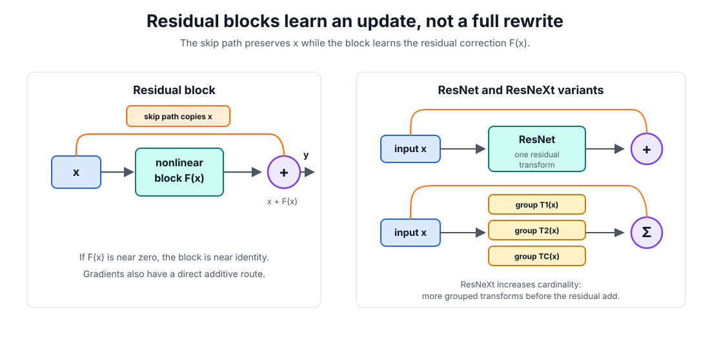

# Residual Connections

A residual connection copies a block input around a nonlinear transformation and adds it back to the result. Instead of forcing the block to learn a full new representation, the block learns a correction.

## Residual blocks

A plain neural-network block computes

$$
y=F(x).
$$

A residual block computes

$$
y=x+F(x).
$$

The copied $x$ term is the skip path. The learned part $F(x)$ is the residual: it says how the block should change the input. If the input and output shapes differ, the skip path uses a projection $P$, often a linear layer or $1\times1$ convolution:

$$
y=P(x)+F(x).
$$

## Intuition

Residual connections make identity behavior easy. If a block is not useful, it can learn $F(x)\approx0$, so the output remains close to $x$. That is easier than asking a stack of nonlinear layers to rediscover the identity function from scratch.

They also help gradients. For $y=x+F(x)$,

$$
\frac{\partial y}{\partial x}=I+\frac{\partial F}{\partial x}.
$$

The identity term gives [backpropagation](backpropagation.md) a direct additive route through the block. This helps mitigate [vanishing gradients](vanishing-and-exploding-gradients.md), because the backward signal does not have to pass only through the nonlinear branch. It also improves gradient-scale stability in very deep stacks, especially together with [normalization](normalization.md) and careful [initialization](initialization.md), but exploding gradients can still happen.

## ResNet and ResNeXt

ResNet made residual blocks a standard tool for very deep CNNs. A basic ResNet block keeps the same principle as above: the convolutional stack computes $F(x)$, the skip path carries $x$, and the block outputs $x+F(x)$. When the number of channels or spatial resolution changes, ResNet uses a projection on the skip path so the addition is shape-compatible.

ResNeXt keeps the residual form but changes the internal residual transform. Instead of one transform, it aggregates several grouped transformations:

$$
y=x+\sum_{i=1}^{C}T_i(x).
$$

Here $T_i$ is one grouped transform and $C$ is the cardinality, meaning the number of parallel groups. Cardinality is another capacity knob besides depth and width: the model can learn several related transformations and merge them before adding the residual path. In implementation, this is commonly represented with grouped convolutions.

ResNet and ResNeXt are therefore not separate ideas from residual connections. They are concrete CNN architectures that use the same skip-path principle with different choices for the residual branch.

## Where they appear

Residual connections are central in ResNet and ResNeXt CNN backbones; see [CNN architectures](../09-computer-vision/cnn-architectures.md) for their vision context. They also appear in [transformers](transformers.md), where attention and position-wise MLP sublayers are wrapped with residual additions. In both cases, the principle is the same: preserve a usable information path while the sublayer learns a useful update.

## Caveats

Residual paths are an optimization aid, not a substitute for architecture design. If shapes change, the projection path must be chosen carefully. If residual branches are poorly scaled, the network can still become unstable; this is why transformer variants pay attention to pre-norm versus post-norm ordering and why very deep residual CNNs depend on normalization and initialization details.

## References

- [He et al., 2015, Deep Residual Learning for Image Recognition](https://arxiv.org/abs/1512.03385)
- [Xie et al., 2016, Aggregated Residual Transformations for Deep Neural Networks](https://arxiv.org/abs/1611.05431)
- [Vaswani et al., 2017, Attention Is All You Need](https://arxiv.org/abs/1706.03762)

> [!nav]
> **Section** — [Deep Learning](index.md)
>
> [← Regularization](regularization.md) [Convolutional Neural Networks →](convolutional-neural-networks.md)
