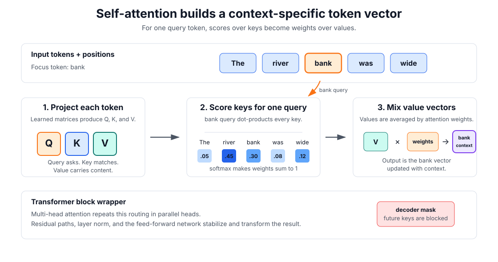
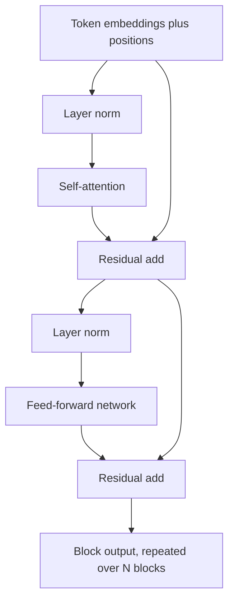

# Transformers

Transformers replace recurrent state updates with stacks of [attention](attention.md), position-wise [MLPs](multilayer-perceptrons.md), residual paths, and [normalization](normalization.md). They process tokens, patches, or other items in parallel, then use attention masks and positional information to control what each position can use. This is why they sit behind modern [BERT-style encoders](../08-natural-language-processing/bert-style-encoders.md) and autoregressive [language models](../11-generative-ai/language-model-architecture.md).

Conceptually, a transformer is a repeated token-mixing block. Each input item starts as a vector: a word piece from [tokenization](../08-natural-language-processing/tokenization.md), an image patch in a [vision transformer](../09-computer-vision/vision-transformers.md), a video tubelet in a [video transformer](../10-video-understanding/video-transformers.md), or another modality-specific token. Self-attention lets every token ask which other tokens are relevant, then builds a new context-aware representation from their information.

## Attention mechanism

The core operation is scaled dot-product attention:

$$
\operatorname{Attention}(Q,K,V)=
\operatorname{softmax}\left(\frac{QK^\top+M}{\sqrt{d_k}}\right)V.
$$

Here $Q$, $K$, and $V$ are learned linear projections of the token representations, $d_k$ is the key dimension, and $M$ is an optional mask. In an encoder, $M$ usually allows all positions to see one another. In a decoder language model, $M$ blocks future positions so token $t$ cannot attend to tokens after $t$.

The attention mechanism can be read step by step:

1. Start with token embeddings plus positional information so the model knows both content and order.
2. Project each token into a query, key, and value. A query represents what a token is looking for; a key represents what a token offers for matching; a value carries the information that can be copied or mixed.
3. Compare queries to keys with dot products. For token $i$, the row $Q_iK^\top$ scores how much token $i$ should use every visible token.
4. Divide by $\sqrt{d_k}$ so dot products stay numerically well scaled, add the mask, and apply softmax so the scores become weights that sum to one.
5. Multiply those weights by $V$. The output at position $i$ is a weighted average of value vectors from the visible positions.
6. Repeat the operation in multiple heads. Each head has its own projections, so one head may track syntax, another entity identity, another local context, and another long-range reference.
7. Add the result through a residual path, normalize, pass it through a position-wise MLP, and stack many blocks.



## Network architecture

Attention is only the token-mixing sublayer. A full transformer block wraps attention with [residual connections](residual-connections.md), [normalization](normalization.md), and a position-wise [multilayer perceptron](multilayer-perceptrons.md). The residual paths preserve a direct route for information and gradients; layer normalization keeps activation scales usable; the MLP is applied independently to each token vector.

"Position-wise" means that the same MLP is applied separately to every sequence position. Let $H\in\mathbb R^{n\times d_{\text{model}}}$ be the matrix of hidden states for one sequence: $n$ is the number of tokens, $d_{\text{model}}$ is the width of each token vector, and row $h_i\in\mathbb R^{d_{\text{model}}}$ is the hidden vector for token position $i$. The feed-forward sublayer maps each row with the same learned parameters:

$$
\operatorname{FFN}(H)_i=W_2\phi(W_1h_i+b_1)+b_2.
$$

Here $W_1$ and $b_1$ project the token vector into a wider hidden layer, $\phi$ is an [activation function](activation-functions.md) such as [GELU or SwiGLU](activation-functions.md#gelu-and-swiglu), and $W_2$ and $b_2$ project it back to $d_{\text{model}}$. The subscript $i$ on $\operatorname{FFN}(H)_i$ means "the output row for token position $i$." There is no mixing between token positions inside this MLP. Token-to-token information exchange happens in attention; the position-wise MLP only transforms the feature channels of each already-contextualized token vector.

A common modern variant is the pre-norm block, where layer normalization happens before each sublayer rather than after the residual addition:

$$
h' = h + \operatorname{SelfAttention}(\operatorname{LN}(h)),
$$

$$
h_{\text{out}} = h' + \operatorname{FFN}(\operatorname{LN}(h')).
$$

The `FFN` abbreviation in transformer diagrams refers to that position-wise MLP sublayer. Attention lets tokens exchange information across positions; the FFN/MLP then transforms features inside each token, often by expanding the hidden width, applying [GELU or SwiGLU](activation-functions.md#gelu-and-swiglu), and projecting back to the model width.

Encoder blocks usually use bidirectional self-attention. Decoder language models use a causal mask so token $t$ cannot attend to positions $>t$, avoiding label leakage.



## Worked example

This snippet builds a causal attention mask and feed-forward block output to show how decoder attention excludes future tokens.

```python
import math, torch

torch.manual_seed(7)
X = torch.randn(3, 4)
Q = K = V = X
mask = torch.triu(torch.ones(3, 3) * float("-inf"), diagonal=1)
weights = ((Q @ K.T) / math.sqrt(4) + mask).softmax(-1)
attn = weights @ V
ffn = torch.relu(attn @ torch.randn(4, 8)) @ torch.randn(8, 4)
print("causal_weights", torch.round(weights, decimals=3).tolist())
print("block_output_shape", list(ffn.shape))
```

Observed output:

```text
causal_weights [[1.0, 0.0, 0.0], [0.017999999225139618, 0.9819999933242798, 0.0], [0.07400000095367432, 0.33000001311302185, 0.5950000286102295]]
block_output_shape [3, 4]
```

The upper-triangular mask forces the first token to see only itself and the second token to ignore the third. The block preserves sequence length and embedding width.

## History and adoption

Transformers grew out of sequence-to-sequence research in machine translation. Earlier systems commonly used recurrent or convolutional encoder-decoder networks, often with an attention mechanism added between encoder and decoder states. The 2017 paper "Attention Is All You Need" made the decisive architectural move: remove recurrence and convolution from the sequence model and use attention, positional encodings, residual connections, normalization, and position-wise feed-forward networks as the main stack. The immediate results were strong machine-translation scores with much better parallel training than recurrent models.

The next wave turned the architecture into a transfer-learning backbone. OpenAI's 2018 GPT work paired a transformer language model with unsupervised pretraining and supervised fine-tuning. Google's 2018 BERT showed that bidirectional transformer encoders pretrained on unlabeled text could be fine-tuned for many understanding tasks, including question answering and natural-language inference. T5 later unified many NLP tasks as text-to-text transformations, strengthening the idea that a single transformer backbone could serve many tasks after pretraining.

Decoder-only transformers then became the dominant architecture for large generative language models. GPT-3 showed that scaling an autoregressive transformer to 175 billion parameters produced strong zero-shot and few-shot behavior from prompts without gradient updates. That lineage connects directly to modern [language model architecture](../11-generative-ai/language-model-architecture.md), [pretraining](../11-generative-ai/pretraining.md), [fine-tuning](fine-tuning.md), and [model serving](../14-ml-engineering-and-mlops/model-serving.md).

The same token-and-attention recipe moved beyond text. [Vision transformers](../09-computer-vision/vision-transformers.md) treat image patches as tokens and became competitive with convolutional networks when pretrained at scale. DETR used a transformer encoder-decoder to frame [object detection](../09-computer-vision/object-detection.md) as set prediction. [Video transformers](../10-video-understanding/video-transformers.md) extend the idea to space-time tokens. [Multimodal learning](multimodal-learning.md) systems use self-attention and cross-attention to connect text, images, audio, and video; [RAG](../11-generative-ai/rag.md), [dense retrieval](../12-information-retrieval-and-search/dense-retrieval.md), and [reranking](../12-information-retrieval-and-search/reranking.md) often depend on transformer encoders or decoders for representations and scoring.

Transformers also became state of the art in domains that are not naturally text. AlphaFold2 used attention-based modules, including geometry-aware attention, to model proteins and achieved a major leap in protein-structure prediction. Modern diffusion and image-generation systems often combine convolutional, autoencoding, and transformer components; newer generator backbones increasingly use transformer-style token processing alongside or instead of U-Net-style designs.

The common reason for adoption is not that attention is universally best. It is that transformers provide a scalable interface: represent the problem as tokens, let attention route information globally, pretrain on large data, then adapt the same backbone to many downstream tasks.

## Caveats

Quadratic attention cost is the obvious bottleneck, but positional encoding and masking are equally decisive. A larger context window does not imply reliable use of distant evidence. Pre-norm and post-norm variants can train differently even when parameter counts match. Attention weights are routing weights, not complete explanations of model behavior; see [attention](attention.md) for that caveat in more detail.

## References

- [Vaswani et al., 2017, Attention Is All You Need](https://arxiv.org/abs/1706.03762)
- [Bahdanau et al., 2014, Neural Machine Translation by Jointly Learning to Align and Translate](https://arxiv.org/abs/1409.0473)
- [Radford et al., 2018, Improving Language Understanding by Generative Pre-Training](https://openai.com/index/language-unsupervised/)
- [Devlin et al., 2018, BERT: Pre-training of Deep Bidirectional Transformers for Language Understanding](https://arxiv.org/abs/1810.04805)
- [Raffel et al., 2020, Exploring the Limits of Transfer Learning with a Unified Text-to-Text Transformer](https://arxiv.org/abs/1910.10683)
- [Brown et al., 2020, Language Models are Few-Shot Learners](https://arxiv.org/abs/2005.14165)
- [Dosovitskiy et al., 2020, An Image is Worth 16x16 Words](https://arxiv.org/abs/2010.11929)
- [Carion et al., 2020, End-to-End Object Detection with Transformers](https://arxiv.org/abs/2005.12872)
- [Jumper et al., 2021, Highly accurate protein structure prediction with AlphaFold](https://www.nature.com/articles/s41586-021-03819-2)
- [PyTorch documentation: TransformerEncoderLayer](https://docs.pytorch.org/docs/2.7/generated/torch.nn.TransformerEncoderLayer.html)

> [!nav]
> **Section** — [Deep Learning](index.md)
>
> [← Attention](attention.md) [Representation Learning →](representation-learning.md)
>
> **Learning path** — [Deep learning](../00-home-and-navigation/learning-paths.md#deep-learning)
>
> [← Optimizers](optimizers.md)
