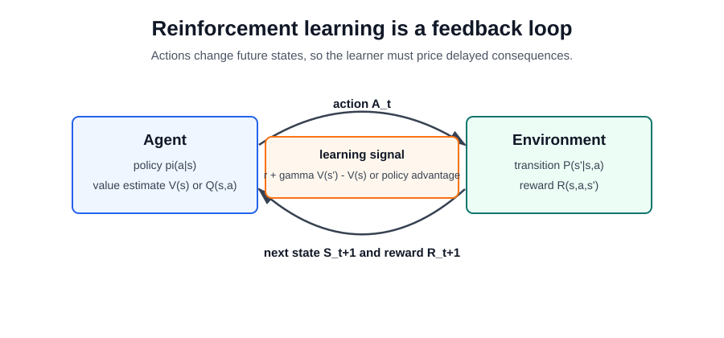

# Reinforcement Learning

Reinforcement learning studies agents that choose actions, observe consequences, and improve a policy from reward feedback. Unlike supervised learning, the training signal is delayed and action-dependent: the data distribution changes when the policy changes.

The core loop is simple, but the learning problem is hard because actions affect future states. A driving policy that brakes now changes the next position, the available future actions, and the reward sequence. This is why RL pages keep the agent-environment interface, value estimation, exploration, and evaluation separate.

## Subtopics

- [Markov Decision Processes](markov-decision-processes.md)
- [Value Functions and Bellman Equations](value-functions-and-bellman-equations.md)
- [Q-Learning and DQN](q-learning-and-dqn.md)
- [Policy Gradients and Actor-Critic Methods](policy-gradients-and-actor-critic.md)
- [Offline and Model-Based Reinforcement Learning](offline-and-model-based-reinforcement-learning.md)
- [Reinforcement Learning from Human Feedback](reinforcement-learning-from-human-feedback.md)

## Learning Map

Start with [Markov decision processes](markov-decision-processes.md) to name states, actions, rewards, transitions, and discounting. Then read [value functions and Bellman equations](value-functions-and-bellman-equations.md) to see how future reward becomes a recursive prediction problem.

For algorithms, [Q-learning and DQN](q-learning-and-dqn.md) covers value-based control, while [policy gradients and actor-critic methods](policy-gradients-and-actor-critic.md) covers direct policy optimization. [Offline and model-based RL](offline-and-model-based-reinforcement-learning.md) explains methods that learn from logged data or learned dynamics instead of unrestricted trial-and-error. [RLHF](reinforcement-learning-from-human-feedback.md) connects reward modeling and preference optimization to [LLM training](../11-generative-ai/llm-training.md).

## When RL Is the Right Tool

Use RL when the decision affects future observations and rewards. Examples include robotics, games, autonomous driving, recommender policies with long-term objectives, resource allocation, and preference alignment. If each example can be labeled independently and the action does not change future data, supervised learning is usually simpler and more reliable.

## Common Failure Modes

RL can exploit misspecified rewards, overfit simulators, learn unsafe exploration behavior, and appear strong in training while failing under distribution shift. Good RL systems therefore need reward audits, off-policy evaluation, held-out environments, safety constraints, and deployment monitoring.

## Connections

- [Markov Chains](../02-probability-and-statistics/markov-chains.md) are the probabilistic backbone of Markov decision processes.
- [Deep Learning](../06-deep-learning/index.md) provides function approximators for high-dimensional policies and value functions.
- [LLM Training](../11-generative-ai/llm-training.md) uses self-supervised pretraining, instruction tuning, and sometimes preference-based RL.
- [Autonomous Driving](../19-domain-applications/autonomous-driving.md) uses RL selectively for planning, control, simulation, and policy optimization, but production stacks also rely heavily on perception, prediction, and safety engineering.

## References

- [Sutton and Barto, 2018, Reinforcement Learning: An Introduction](http://incompleteideas.net/book/the-book-2nd.html)
- [Mnih et al., 2013, Playing Atari with Deep Reinforcement Learning](https://arxiv.org/abs/1312.5602)
- [Schulman et al., 2017, Proximal Policy Optimization Algorithms](https://arxiv.org/abs/1707.06347)
- [Haarnoja et al., 2018, Soft Actor-Critic Algorithms and Applications](https://arxiv.org/abs/1812.05905)
- [Ouyang et al., 2022, Training Language Models to Follow Instructions with Human Feedback](https://arxiv.org/abs/2203.02155)
