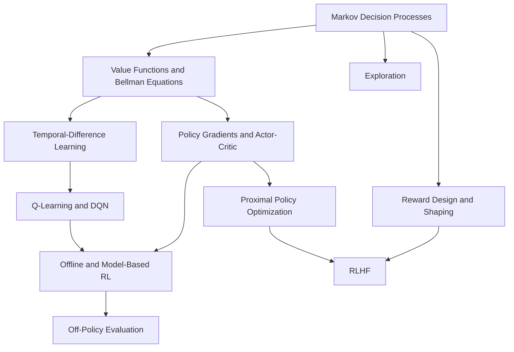

# Reinforcement Learning

Reinforcement learning studies agents that choose actions, observe consequences, and improve a policy from reward feedback. Unlike supervised learning, the training signal is delayed and action-dependent: the data distribution changes when the policy changes.

The core loop is simple, but the learning problem is hard because actions affect future states. A driving policy that brakes now changes the next position, the available future actions, and the reward sequence. This is why RL pages keep the agent-environment interface, value estimation, exploration, and evaluation separate.

## Knowledge map

The section builds from the formal frame (MDPs) up through value-based and policy-based algorithms, then the practical problems of exploration, reward design, and offline learning, and finally preference-based optimization. Arrows point from a prerequisite to what it enables.

## Reading path

Read the section in this order to go from the formal setup to deployment concerns.

1. [Markov Decision Processes](markov-decision-processes.md): the formal frame — states, actions, rewards, transitions, and discounting.
2. [Value Functions and Bellman Equations](value-functions-and-bellman-equations.md): how future reward becomes a recursive prediction problem.
3. [Temporal-Difference Learning](temporal-difference-learning.md): learning values online by bootstrapping, and on-policy versus off-policy targets.
4. [Q-Learning and DQN](q-learning-and-dqn.md): value-based control, from tabular updates to deep Q-networks.
5. [Policy Gradients and Actor-Critic Methods](policy-gradients-and-actor-critic.md): optimizing the policy directly with an advantage-shaped signal.
6. [Proximal Policy Optimization](proximal-policy-optimization.md): the stable policy-update method that became the RLHF workhorse.
7. [Exploration in Reinforcement Learning](exploration-in-reinforcement-learning.md): gathering enough information when actions change future states.
8. [Reward Design and Shaping](reward-design-and-shaping.md): specifying an objective the agent cannot game.
9. [Offline and Model-Based Reinforcement Learning](offline-and-model-based-reinforcement-learning.md): learning from logged data or learned dynamics instead of free exploration.
10. [Off-Policy Evaluation](off-policy-evaluation.md): estimating a new policy's value before it is ever run live.
11. [Reinforcement Learning from Human Feedback](reinforcement-learning-from-human-feedback.md): preference-based optimization and the bridge to LLM training.

## When RL Is the Right Tool

Use RL when the decision affects future observations and rewards. Examples include robotics, games, autonomous driving, recommender policies with long-term objectives, resource allocation, and preference alignment. If each example can be labeled independently and the action does not change future data, supervised learning is usually simpler and more reliable.

## Common Failure Modes

RL can exploit misspecified rewards, overfit simulators, learn unsafe exploration behavior, and appear strong in training while failing under distribution shift. Good RL systems therefore need reward audits, off-policy evaluation, held-out environments, safety constraints, and deployment monitoring.

## Connections

- [Markov Chains](../02-probability-and-statistics/markov-chains.md) are the probabilistic backbone of Markov decision processes.
- [Deep Learning](../06-deep-learning/index.md) provides function approximators for high-dimensional policies and value functions.
- [LLM Training](../11-generative-ai/llm-training.md) uses self-supervised pretraining, instruction tuning, and sometimes preference-based RL.
- [Autonomous Driving](../19-domain-applications/autonomous-driving.md) uses RL selectively for planning, control, simulation, and policy optimization, but production stacks also rely heavily on perception, prediction, and safety engineering.

## References

- [Sutton and Barto, 2018, Reinforcement Learning: An Introduction](http://incompleteideas.net/book/the-book-2nd.html)
- [Mnih et al., 2013, Playing Atari with Deep Reinforcement Learning](https://arxiv.org/abs/1312.5602)
- [Schulman et al., 2017, Proximal Policy Optimization Algorithms](https://arxiv.org/abs/1707.06347)
- [Haarnoja et al., 2018, Soft Actor-Critic Algorithms and Applications](https://arxiv.org/abs/1812.05905)
- [Ouyang et al., 2022, Training Language Models to Follow Instructions with Human Feedback](https://arxiv.org/abs/2203.02155)

> **Learning path — [Reinforcement learning](../00-home-and-navigation/learning-paths.md#reinforcement-learning):** [Markov Decision Processes](markov-decision-processes.md) →
