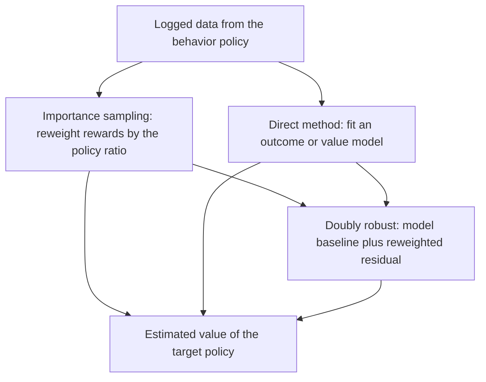

# Off-Policy Evaluation

Off-policy evaluation (OPE) estimates the value of a **target policy** $\pi_e$ using data collected by a different **behavior policy** $\pi_b$, without deploying $\pi_e$. It is essential wherever running the new policy live is costly or risky: recommenders, healthcare, ads, autonomous systems, and any [offline RL](offline-and-model-based-reinforcement-learning.md) pipeline that must decide whether a learned policy is safe to ship.

## The Problem

We want the expected return of the target policy,

$$
V(\pi_e)=\mathbb{E}_{\tau\sim\pi_e}\!\left[\sum_t \gamma^{t} r_t\right],
$$

but every logged trajectory $\tau$ was generated by $\pi_b$. The data distribution is therefore wrong for the quantity we care about, and correcting for that mismatch is the whole task.

## Importance Sampling

Inverse propensity scoring reweights logged rewards by how much more likely the target policy was to take the observed actions. For a single decision with logged reward $r$, action $a$, and context $x$:

$$
\hat V_{\text{IPS}}=\frac{1}{n}\sum_{i=1}^{n}\frac{\pi_e(a_i\mid x_i)}{\pi_b(a_i\mid x_i)}\,r_i.
$$

This is unbiased when $\pi_b$ has support everywhere $\pi_e$ does and the logged propensities $\pi_b(a\mid x)$ are known. Its weakness is variance: when the two policies disagree, weights blow up. **Weighted (self-normalized) IPS** divides by the sum of weights, trading a little bias for much lower variance. In the sequential case, per-decision importance sampling multiplies the per-step ratios along the trajectory, and variance compounds with horizon.

## Direct Method

The direct method fits a model of outcomes, such as a reward model or a fitted-Q evaluation (FQE) of the value function, then evaluates the target policy against the model:

$$
\hat V_{\text{DM}}=\frac{1}{n}\sum_i \hat Q(x_i,\pi_e(x_i)).
$$

It has low variance but is biased whenever the model is wrong, especially for actions the target policy favors but the data rarely contains.

## Doubly Robust Estimation

The doubly robust estimator combines the two, using the model as a baseline and importance sampling to correct its residual:

$$
\hat V_{\text{DR}}=\frac{1}{n}\sum_i\left[\hat Q(x_i,\pi_e)+\frac{\pi_e(a_i\mid x_i)}{\pi_b(a_i\mid x_i)}\big(r_i-\hat Q(x_i,a_i)\big)\right].
$$

It is unbiased if _either_ the propensities or the outcome model is correct, and it typically has lower variance than plain IPS because the model absorbs most of the signal and importance weights only correct the residual.

## Estimator Trade-offs

| Estimator     | Bias                                    | Variance | Key requirement                   |
| ------------- | --------------------------------------- | -------- | --------------------------------- |
| IPS           | unbiased (with full support)            | high     | known behavior propensities       |
| Weighted IPS  | slightly biased                         | lower    | known propensities                |
| Direct method | biased if model wrong                   | low      | accurate outcome/value model      |
| Doubly robust | unbiased if model _or_ propensity right | medium   | one of the two components correct |

## Worked IPS Calculation

Suppose a logged action had behavior probability $\pi_b=0.25$, target probability $\pi_e=0.5$, and reward $r=4$. Its importance weight is $0.5/0.25=2$, so this sample contributes $2\cdot 4=8$ to the IPS average. An action the target policy avoids ($\pi_e$ small) is down-weighted toward zero.

## Caveats

OPE fails silently when the behavior policy is deterministic or unknown (no valid propensities), when support is missing (the target does things never logged), and when effective sample size collapses because a few trajectories carry almost all the weight. Report effective sample size and confidence intervals, and prefer staged online tests for final validation.

## Connections

- [Offline and Model-Based RL](offline-and-model-based-reinforcement-learning.md) needs OPE to select and gate policies before deployment.
- [Offline Evaluation](../17-experimentation-and-evaluation/offline-evaluation.md) covers the broader practice of estimating system quality without live traffic.
- [Contextual Bandits](../04-recommendation-systems/contextual-bandits.md) are the one-step special case where IPS and doubly robust estimators originate.

## References

- [Dudík, Langford, and Li, 2011, Doubly Robust Policy Evaluation and Learning](https://arxiv.org/abs/1103.4601)
- [Jiang and Li, 2016, Doubly Robust Off-Policy Value Evaluation for Reinforcement Learning](https://arxiv.org/abs/1511.03722)
- [Thomas and Brunskill, 2016, Data-Efficient Off-Policy Policy Evaluation for Reinforcement Learning](https://arxiv.org/abs/1604.00923)

> **Section — [Reinforcement Learning](index.md):** ← [Offline and Model-Based Reinforcement Learning](offline-and-model-based-reinforcement-learning.md) · [Reinforcement Learning from Human Feedback](reinforcement-learning-from-human-feedback.md) →
