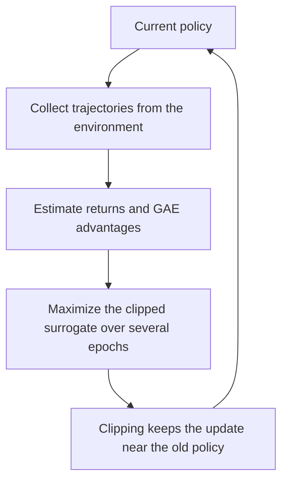

# Proximal Policy Optimization

Proximal Policy Optimization (PPO) is a policy-gradient method designed to take the largest useful improvement step without destabilizing training. A raw policy gradient can push the policy so far that the data it was estimated from no longer describes it, collapsing performance. PPO constrains each update to stay close to the policy that gathered the data, which makes it stable enough to be the default choice in continuous control and in [RLHF](reinforcement-learning-from-human-feedback.md).

## The Update Ratio

PPO works with the probability ratio between the new and old policies for the action actually taken:

$$
r_t(\theta)=\frac{\pi_\theta(a_t\mid s_t)}{\pi_{\theta_{\text{old}}}(a_t\mid s_t)}.
$$

A ratio above 1 means the new policy makes the action more likely. Multiplying this ratio by the advantage $\hat A_t$ gives the importance-weighted policy-gradient objective, but maximizing it directly allows unbounded steps.

## Clipped Surrogate Objective

PPO clips the ratio so that moving it beyond a band $[1-\epsilon,\,1+\epsilon]$ yields no further objective gain:

$$
L^{\text{CLIP}}(\theta)=\mathbb{E}_t\Big[\min\big(r_t(\theta)\hat A_t,\ \operatorname{clip}(r_t(\theta),1-\epsilon,1+\epsilon)\hat A_t\big)\Big].
$$

The $\min$ makes the bound one-sided in the right direction: for a positive advantage, improvement is capped once the action is already $1+\epsilon$ times more likely; for a negative advantage, the penalty is capped symmetrically. A typical $\epsilon$ is $0.1$–$0.2$. This is a cheap, first-order approximation to the trust region that TRPO enforces with a hard KL constraint.

## Advantage Estimation

The advantage $\hat A_t$ measures how much better an action was than the policy's average at that state. PPO usually estimates it with generalized advantage estimation (GAE), which blends multi-step [temporal-difference](temporal-difference-learning.md) errors:

$$
\hat A_t=\sum_{l\ge 0}(\gamma\lambda)^{l}\,\delta_{t+l},\qquad \delta_t=r_t+\gamma V(s_{t+1})-V(s_t).
$$

The parameter $\lambda$ trades bias for variance exactly as in TD($\lambda$). A learned value function $V$ acts as the critic and is trained alongside the policy.

## Algorithm Sketch



```text
repeat:
  run the current policy to collect a batch of trajectories
  compute rewards, value estimates, and GAE advantages
  for several epochs over minibatches:
    compute ratio r_t(theta) against the old policy
    maximize the clipped surrogate + value loss + entropy bonus
  set old policy <- current policy
```

Reusing each batch for several epochs is what makes PPO more sample-efficient than a single-step policy gradient, while clipping keeps those repeated updates from drifting too far.

## Why PPO Dominates RLHF

In [RLHF](reinforcement-learning-from-human-feedback.md), the policy is a language model, the reward comes from a learned reward model, and a KL penalty to the original model keeps generations on-distribution. PPO fits because it is robust to noisy, learned rewards, needs little hyperparameter surgery, and its clipping plus KL control directly limit how far the model moves from its supervised starting point, guarding against reward over-optimization.

## Caveats

PPO is still on-policy and discards data after a few epochs, so it is less sample-efficient than strong off-policy methods like soft actor-critic. Its clip is a heuristic, not a true trust region, and performance is sensitive to advantage normalization, learning rate, and the number of epochs per batch.

## Connections

- [Policy Gradients and Actor-Critic Methods](policy-gradients-and-actor-critic.md) provide the objective and the critic PPO builds on.
- [Reinforcement Learning from Human Feedback](reinforcement-learning-from-human-feedback.md) uses PPO as its optimizer with an added KL penalty.
- [LLM Training](../11-generative-ai/llm-training.md) places PPO-based alignment in the wider training pipeline.

## References

- [Schulman et al., 2017, Proximal Policy Optimization Algorithms](https://arxiv.org/abs/1707.06347)
- [Schulman et al., 2015, Trust Region Policy Optimization](https://arxiv.org/abs/1502.05477)
- [Schulman et al., 2016, High-Dimensional Continuous Control Using Generalized Advantage Estimation](https://arxiv.org/abs/1506.02438)
- [Ouyang et al., 2022, Training Language Models to Follow Instructions with Human Feedback](https://arxiv.org/abs/2203.02155)

> **Section — [Reinforcement Learning](index.md):** ← [Policy Gradients and Actor-Critic Methods](policy-gradients-and-actor-critic.md) · [Exploration in Reinforcement Learning](exploration-in-reinforcement-learning.md) →
