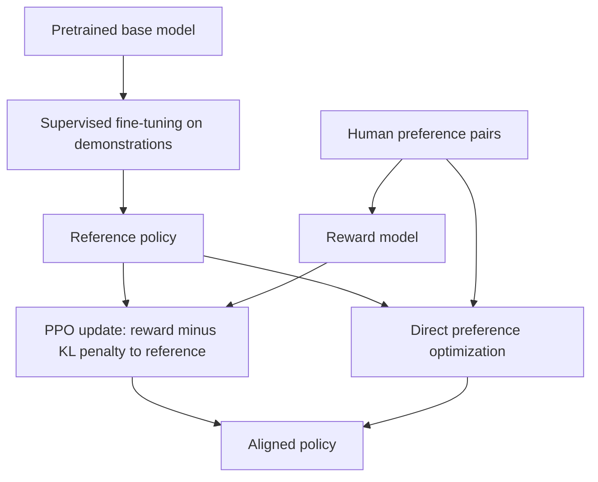

# Reinforcement Learning from Human Feedback

Reinforcement learning from human feedback (RLHF) trains models from preferences rather than only from gold labels. For language models, humans or AI judges compare candidate responses. A reward model learns which responses are preferred, and the policy is optimized to produce higher-reward responses while staying close to a reference model.

## Preference Data

A preference example contains a prompt $x$, a chosen response $y_w$, and a rejected response $y_l$. A common reward model uses the Bradley-Terry likelihood:

$$
P(y_w\succ y_l\mid x)
=\sigma\left(r_\phi(x,y_w)-r_\phi(x,y_l)\right),
$$

where $r_\phi$ is the learned reward and $\sigma$ is the logistic function. The reward model is not an oracle; it is a learned proxy for annotator preference.

## KL-Regularized Policy Optimization

KL means [Kullback-Leibler divergence](../01-mathematical-foundations/kl-divergence.md), a directed measure of how much one distribution differs from another. In RLHF, the distribution being controlled is usually the trained policy $\pi(\cdot\mid x)$ relative to a reference policy $\pi_{\mathrm{ref}}(\cdot\mid x)$.

After reward modeling, the policy can be optimized with an objective like

$$
\max_\pi\;
\mathbb{E}_{x,y\sim\pi}\left[
r_\phi(x,y)
-\beta\,D_{\mathrm{KL}}\left(\pi(\cdot\mid x)\,\|\,\pi_{\mathrm{ref}}(\cdot\mid x)\right)
\right].
$$

The reward term pushes the model toward preferred responses. The KL penalty keeps it close to the reference policy, usually the supervised instruction-tuned model, so optimization does not exploit reward-model flaws too aggressively. In LLM training notes, "KL objective" often means this reward-minus-KL regularized objective, not a pure KL-minimization task.

## Typical LLM Training Stage

| Stage                  | Data                          | Objective                          | Role                                            |
| ---------------------- | ----------------------------- | ---------------------------------- | ----------------------------------------------- |
| Supervised fine-tuning | demonstrations                | next-token loss on target response | teaches instruction following                   |
| Preference modeling    | chosen/rejected pairs         | pairwise reward loss               | estimates which response is preferred           |
| RLHF policy update     | prompts and sampled responses | reward minus KL penalty            | improves preference reward while limiting drift |

This is why RLHF belongs both to [reinforcement learning](index.md) and [LLM training](../11-generative-ai/llm-training.md).

## Direct Preference Optimization

Direct Preference Optimization (DPO) avoids a separate reward-model-plus-RL loop by optimizing the policy directly from preference pairs:

$$
L_{\mathrm{DPO}}(\theta)
=-\mathbb{E}
\left[
\log\sigma\left(
\beta\log\frac{\pi_\theta(y_w\mid x)}{\pi_{\mathrm{ref}}(y_w\mid x)}
-\beta\log\frac{\pi_\theta(y_l\mid x)}{\pi_{\mathrm{ref}}(y_l\mid x)}
\right)
\right].
$$

The chosen response is pushed up relative to the reference model, and the rejected response is pushed down relative to the same reference. This often makes preference optimization simpler to implement than [PPO](policy-gradients-and-actor-critic.md#ppo)-based RLHF, though the quality still depends on data, evaluation, and the suitability of the preference objective.

## PPO Loop

A PPO loop is the iterative reinforcement-learning stage used in many classic RLHF pipelines. The current policy samples responses, the reward model scores them, the KL penalty compares the current policy to the reference policy, and [PPO](policy-gradients-and-actor-critic.md#ppo) updates the policy under a clipped objective. That loop is more operationally complex than DPO because it needs sampling, reward evaluation, KL control, optimizer updates, and monitoring for reward hacking or policy drift.

## Caveats

Preference optimization can reward verbosity, sycophancy, over-refusal, or stylistic features that annotators prefer in isolation but users do not want in a real workflow. It also does not replace retrieval, tool safety, privacy controls, or domain evaluation. A model can score well on preference data and still fail under adversarial prompts, long-horizon agent tasks, or specialized professional standards.

## Connections

- [LLM Training](../11-generative-ai/llm-training.md) places RLHF after pretraining and supervised instruction tuning.
- [Alignment](../11-generative-ai/alignment.md) covers training and runtime controls around preference optimization.
- [Policy Gradients and Actor-Critic Methods](policy-gradients-and-actor-critic.md#ppo) explains PPO and the actor-critic machinery often used in RLHF.

## References

- [Christiano et al., 2017, Deep Reinforcement Learning from Human Preferences](https://arxiv.org/abs/1706.03741)
- [Ouyang et al., 2022, Training Language Models to Follow Instructions with Human Feedback](https://arxiv.org/abs/2203.02155)
- [Bai et al., 2022, Training a Helpful and Harmless Assistant with Reinforcement Learning from Human Feedback](https://arxiv.org/abs/2204.05862)
- [Rafailov et al., 2023, Direct Preference Optimization](https://arxiv.org/abs/2305.18290)

> **Section — [Reinforcement Learning](index.md):** ← [Off-Policy Evaluation](off-policy-evaluation.md)

> **Learning path — [Reinforcement learning](../00-home-and-navigation/learning-paths.md#reinforcement-learning):** ← [Policy Gradients and Actor-Critic Methods](policy-gradients-and-actor-critic.md)
