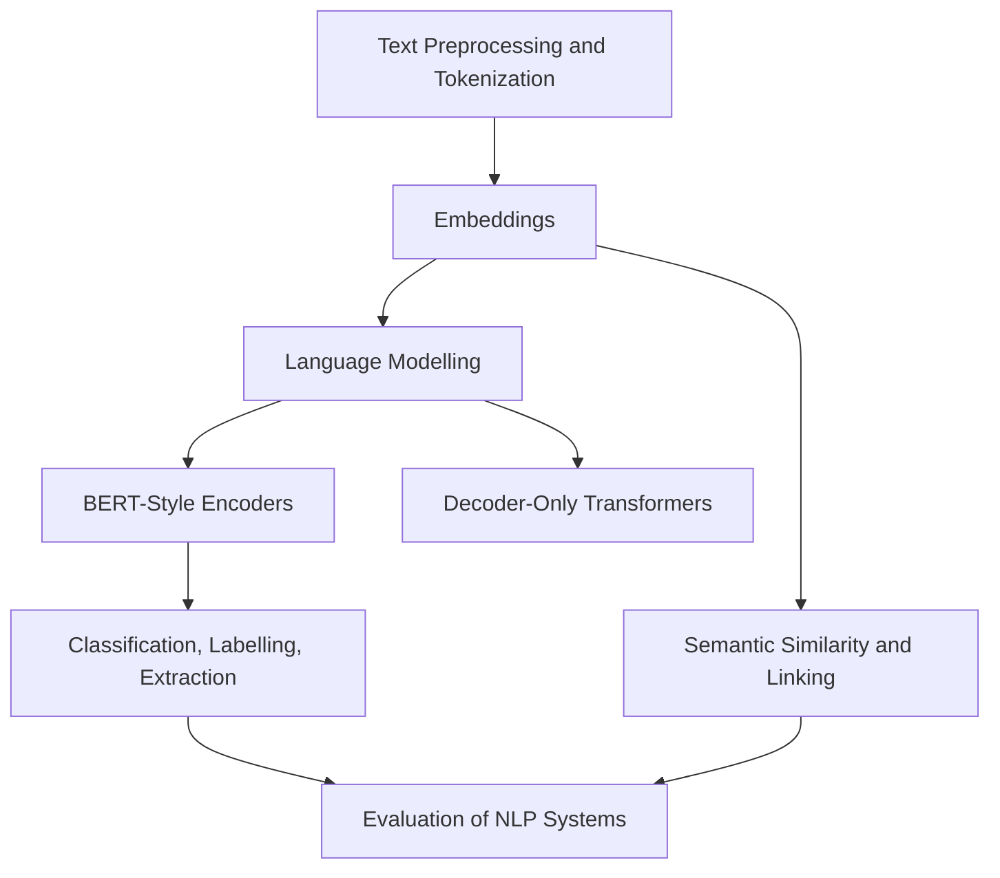

# Natural Language Processing

Natural language processing covers models and systems that turn text into tokens, labels, spans, embeddings, structured records, or generated language. This section focuses on language-specific tasks and evaluation contracts; broader foundation-model training and agent workflows live in [Generative AI and Agentic Systems](../11-generative-ai/index.md), while retrieval systems live in [Information Retrieval and Search](../12-information-retrieval-and-search/index.md).

The practical distinction is output shape. Text classification predicts document-level labels, sequence labelling predicts token or span annotations, semantic similarity compares meanings, and document understanding combines OCR, layout, text, and extraction.

## Knowledge map

Representation comes first (preprocessing, tokenization, embeddings), then language models, then the task families they power, all judged by task-appropriate evaluation.

## Reading path

Read representation, then models, then the task families, ending on evaluation.

1. [Text Preprocessing](text-preprocessing.md): normalization before anything else.
2. [Tokenization](tokenization.md): choosing the units a model consumes.
3. [Embeddings](embeddings.md): dense vector representations of tokens and text.
4. [Language Modelling](language-modelling.md): predicting text and scoring likelihood.
5. [BERT-Style Encoders](bert-style-encoders.md): bidirectional encoders for understanding tasks.
6. [Decoder-Only Transformers](decoder-only-transformers.md): causal models for generation.
7. [Text Classification](text-classification.md): document-level label prediction.
8. [Topic Classification](topic-classification.md): assigning subject categories.
9. [Urgency Classification](urgency-classification.md): cost-sensitive triage of messages.
10. [Sequence Labelling](sequence-labelling.md): token-level tagging.
11. [Named Entity Recognition](named-entity-recognition.md): extracting typed entity spans.
12. [Information Extraction](information-extraction.md): turning text into structured records.
13. [Entity Linking and Matching](entity-linking-and-matching.md): resolving mentions to canonical entities.
14. [Semantic Textual Similarity](semantic-textual-similarity.md): comparing meanings across texts.
15. [Summarization](summarization.md): extractive and abstractive condensation.
16. [OCR and Handwritten Text Recognition](ocr-and-handwritten-text-recognition.md): reading text from images.
17. [Document Understanding](document-understanding.md): combining layout, text, and extraction.
18. [Evaluation of NLP Systems](evaluation-of-nlp-systems.md): metrics and confidence intervals for language tasks.

## Connections

- [Deep Learning](../06-deep-learning/index.md) supplies the transformer architectures underneath.
- [Generative AI](../11-generative-ai/index.md) and [Information Retrieval](../12-information-retrieval-and-search/index.md) build on these representations and tasks.

> [!nav]
> **Learning path** — [Natural language processing](../00-home-and-navigation/learning-paths.md#natural-language-processing)
>
> [Tokenization →](tokenization.md)
