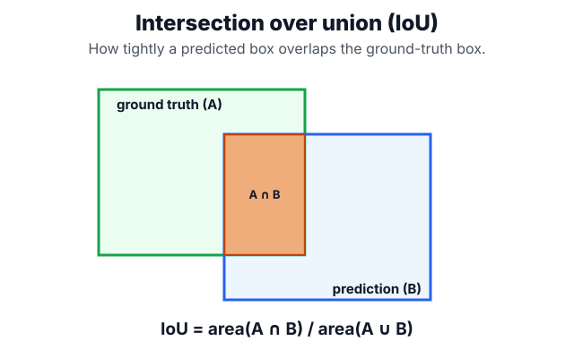
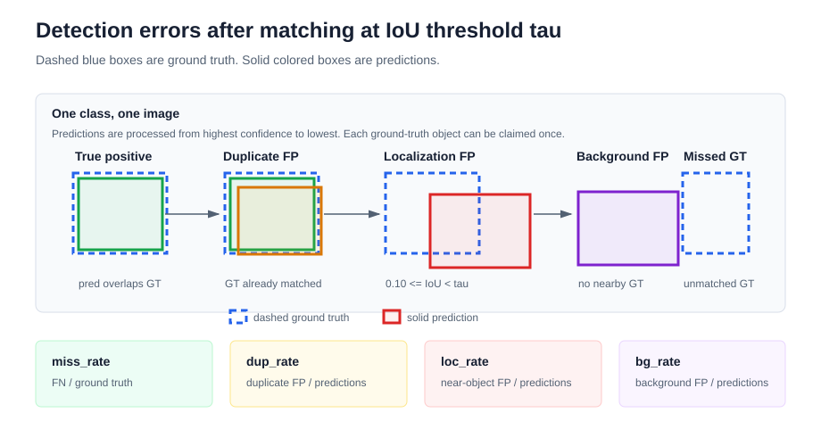
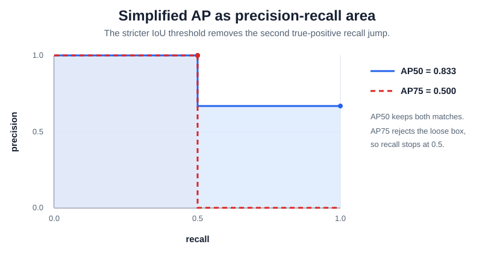
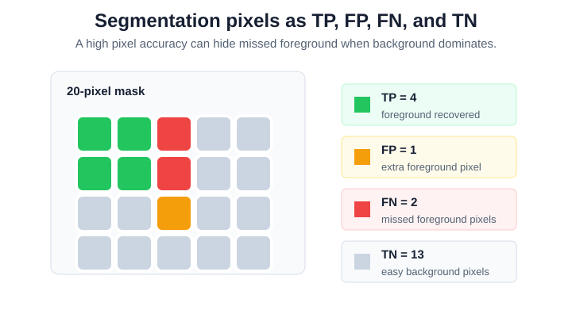

# Detection and Segmentation Metrics

Detection and segmentation metrics answer two different questions: did the model assign the right class or instance, and did it localize the region tightly enough? They sit between [object detection](object-detection.md), [semantic segmentation](semantic-segmentation.md), [instance segmentation](instance-segmentation.md), and practical [model benchmarking](model-benchmarking.md), because the same visual error can look good or bad depending on the metric.

## Overlap metrics

Most detection and segmentation metrics start from the same overlap question. Let $A$ be the predicted region and $B$ be the ground-truth region. For a detector, $A$ and $B$ may be bounding boxes. For segmentation, they may be binary masks, class masks, instance masks, or 3D voxel sets.

Intersection over union, also called Jaccard overlap, compares the area they share with the area they jointly cover:

$$
\mathrm{IoU}(A,B)=\frac{|A\cap B|}{|A\cup B|}.
$$



For a binary mask, the same quantity can be written with pixel or voxel counts:

$$
\mathrm{IoU}=\frac{TP}{TP+FP+FN}.
$$

Here $TP$ is the number of positive pixels predicted correctly, $FP$ is the number of background pixels incorrectly predicted as positive, and $FN$ is the number of positive pixels missed by the model. True-negative background pixels do not appear in IoU, which is why IoU remains meaningful when most of the image is background.

Dice is common for masks, especially in medical work and small-object segmentation:

$$
\mathrm{Dice}(A,B)=\frac{2|A\cap B|}{|A|+|B|}.
$$

In pixel-count form:

$$
\mathrm{Dice}=\frac{2TP}{2TP+FP+FN}.
$$

Dice and IoU rank binary segmentations similarly but use different scales. If $J=\mathrm{IoU}$ and $D=\mathrm{Dice}$ for the same binary mask, then

$$
D=\frac{2J}{1+J}.
$$

$$
J=\frac{D}{2-D}.
$$

Dice is therefore larger than IoU except at 0 and 1. A mask with $\mathrm{IoU}=0.5$ has $\mathrm{Dice}=0.667$, so Dice can look more forgiving even though it is measuring the same overlap counts.

## Detection matching and AP

Object detectors output scored boxes or masks, not one label per image. Evaluation therefore has to decide whether each predicted instance matches a real instance. For a given class and IoU threshold $\tau$, the usual rule is:

1. Evaluate one class at a time.
2. Sort that class's predictions by confidence score from highest to lowest.
3. For each prediction, find the unmatched ground-truth object of the same class with the largest IoU.
4. Count the prediction as a true positive if that IoU is at least $\tau$.
5. Count it as a false positive if the IoU is too low or the matching ground-truth object was already claimed by a higher-scored prediction.
6. Count any unclaimed ground-truth object as a false negative after the ranked predictions have been processed.
7. Sweep down the ranked list to form precision-recall points and compute average precision.

A wrong-class detection is best understood per class. If a model predicts `dog` on a ground-truth `cat`, the prediction is a false positive for `dog`, and the unclaimed `cat` is a false negative for `cat`. Class confusion therefore hurts both the predicted class and the true class.

At rank $k$ in the sorted prediction list, precision and recall are:

$$
\mathrm{precision}_k=\frac{\mathrm{TP}_k}{\mathrm{TP}_k+\mathrm{FP}_k},\qquad
\mathrm{recall}_k=\frac{\mathrm{TP}_k}{N_{\mathrm{gt}}}.
$$

Average precision summarizes the precision-recall curve induced by confidence sorting. There are several AP conventions:

| Convention                        | How AP is computed                                                                  | Why it matters                                                                           |
| --------------------------------- | ----------------------------------------------------------------------------------- | ---------------------------------------------------------------------------------------- |
| Step-area AP                      | Adds precision only when recall increases                                           | Easy to understand and useful for small worked examples                                  |
| Interpolated precision envelope   | Replaces precision at a recall level with the best precision at any higher recall   | Avoids over-penalizing local wiggles in the ranked list                                  |
| VOC-style 11-point AP             | Samples interpolated precision at recall levels $0.0,0.1,\ldots,1.0$                | Historical benchmark convention for PASCAL VOC detection                                 |
| COCO-style 101-point AP           | Samples interpolated precision at 101 recall levels                                 | The common modern object-detection convention in COCO-style evaluation                   |
| COCO AP averaged over IoU cutoffs | Averages AP over $\tau\in\{0.50,0.55,\ldots,0.95\}$ and then usually across classes | Rewards both object discovery and tight localization; stricter than reporting one cutoff |

When reading a paper, model card, or dashboard, treat bare "AP" as incomplete unless the IoU threshold, class averaging, object-size slicing, and box-versus-mask target are specified.

## AP and AR naming

Deep learning detector reports often mix framework field names with benchmark concepts. It helps to separate the quantity, the target geometry, and the averaging rule.

| Name                          | Meaning                                                                                     | Interpretation                                                          |
| ----------------------------- | ------------------------------------------------------------------------------------------- | ----------------------------------------------------------------------- |
| AP50                          | AP at $\tau=0.50$                                                                           | loose localization; useful for asking whether objects are roughly found |
| AP75                          | AP at $\tau=0.75$                                                                           | tighter localization; sensitive to sloppy boxes or masks                |
| AP@[.50:.95] or COCO AP       | AP averaged over IoU thresholds 0.50 to 0.95 in steps of 0.05                               | overall detection quality across loose and strict localization          |
| bbox AP                       | AP computed with box IoU                                                                    | box detection quality                                                   |
| mask AP                       | AP computed with mask IoU                                                                   | instance-segmentation quality after detection and mask prediction       |
| per-class AP                  | AP for one class                                                                            | class-specific ranking, localization, and recall                        |
| mean AP or mAP                | AP averaged across classes, sometimes also across IoU thresholds                            | model-level summary; the exact averaging rule must be stated            |
| AP small, AP medium, AP large | AP restricted to object-size slices                                                         | scale-specific failures, especially missed small objects                |
| AR@1, AR@10, AR@100           | maximum recall averaged over IoU thresholds with at most 1, 10, or 100 detections per image | proposal capacity and ranking under a fixed detection budget            |

AP50 can look strong even when boxes are visibly loose. AP75 drops when the detector usually finds the right object but localizes it poorly. If both AP50 and AP75 are low, the model is often missing objects, confusing classes, ranking bad detections too high, or being suppressed by post-processing such as NMS. For deep learning detector models, report AP50, AP75, the COCO-style averaged AP, per-class AP, and size-sliced AP when the application cares about localization quality rather than only rough discovery.

In COCO-style bbox and segmentation evaluation, the default parameter grid uses IoU thresholds $0.50,0.55,\ldots,0.95$, recall thresholds $0.00,0.01,\ldots,1.00$, area ranges for all/small/medium/large objects, and `maxDets` values `[1, 10, 100]`. The headline AP summaries are usually reported with at most 100 detections per image. AR summaries expose the detection cap explicitly as AR@1, AR@10, and AR@100.

COCO-style average recall is related to [Recall at K](../12-information-retrieval-and-search/ranking-and-retrieval-metrics.md), but it is not identical to retrieval Recall@K. In detector evaluation, the evaluator caps each image at a maximum number of detections, computes recall after IoU-based matching, and averages over IoU thresholds, and often reports slices by object area. Low AR@10 and much higher AR@100 means the detector can produce usable boxes, but it ranks too many lower-quality predictions above them. Low AR@100 means the objects are missing even when many predictions are allowed.

Reports usually compute metrics at two levels. A per-class row evaluates one category, such as `person`, `car`, or `defect`. A model-summary row averages or sums across classes so competing detectors can be compared on one line. Keep both: a strong mean can hide a class that is never detected.

| Metric family        | Per-class meaning                                                                                      | Model-summary meaning                                        |
| -------------------- | ------------------------------------------------------------------------------------------------------ | ------------------------------------------------------------ |
| `ap`, `ap50`, `ap75` | average precision for one class at the library's stated default, 0.50, or 0.75 IoU                     | `mAP`, `mAP50`, and `mAP75`, averaged across classes         |
| `coco_map`           | class AP averaged over IoU thresholds 0.50 to 0.95                                                     | COCO-style mean AP across classes and IoU thresholds         |
| `ar@10`, `ar@100`    | maximum recall for one class with at most 10 or 100 detections per image, averaged over IoU thresholds | mean average recall across classes at the same detection cap |
| `acc1`, `f1`         | thresholded operating-point metrics after matching predictions                                         | mean operating-point metrics across classes                  |
| `tp`, `fp`, `fn`     | matched detections, unmatched detections, and unmatched ground truth                                   | absolute counts, usually summed across classes               |
| `num_gt`, `num_pred` | class-specific denominators for rate metrics                                                           | dataset totals or class means, depending on the report       |

`ap`, `ap50`, and `ap75` are ranking metrics: they depend on the order induced by confidence scores and do not require choosing one deployment threshold. `acc1`, `f1`, `tp`, `fp`, and `fn` are operating-point metrics: they require a fixed score threshold, IoU threshold, class policy, and post-processing setup. They are useful for product gates because they say what the model would do at the configured operating point, but they should not replace AP curves during model comparison.

## Detection error analysis

AP explains ranking quality, but it does not say which detector failure dominated. A useful detector error taxonomy starts from matching at the default IoU threshold $\tau$. Here $\tau$ is the IoU cutoff for accepting a prediction as a match, such as $0.50$ or $0.75$. After matching, false positives and false negatives can be divided into interpretable buckets:



| Metric      | Definition                                     | Interpretation                                                                          |
| ----------- | ---------------------------------------------- | --------------------------------------------------------------------------------------- |
| `miss_rate` | $FN/N_{\mathrm{gt}}$                           | fraction of ground-truth objects not recovered at the operating point                   |
| `dup_rate`  | $FP_{\mathrm{duplicate}}/N_{\mathrm{pred}}$    | extra predictions on a ground-truth object already claimed by a higher-scored detection |
| `loc_rate`  | $FP_{\mathrm{localization}}/N_{\mathrm{pred}}$ | predictions near a ground-truth object but below the matching IoU threshold             |
| `bg_rate`   | $FP_{\mathrm{background}}/N_{\mathrm{pred}}$   | predictions that do not meaningfully overlap any ground-truth object                    |

In the diagram, the dashed blue rectangles are ground-truth boxes and the solid colored rectangles are model predictions. A localization false positive is not discarded from evaluation; it is counted as an unmatched prediction because its best overlap with a ground-truth box is below $\tau$. A background false positive is also an unmatched prediction, but its overlap with every ground-truth object is so small that it is better interpreted as a spurious detection than a loose box around a real object.

Here $N_{\mathrm{gt}}$ is the number of ground-truth objects and $N_{\mathrm{pred}}$ is the number of predictions considered at the operating point. A common localization bucket is $0.10\le\mathrm{IoU}<\tau$: the prediction is in the neighborhood of a real object but is not tight enough to count as a match. A background bucket such as $\mathrm{IoU}<0.10$ catches spurious boxes on image regions without labelled objects.

These rates make detector debugging more direct. High `miss_rate` points to recall, scale, occlusion, or class-imbalance problems. High `dup_rate` points to NMS, score calibration, or duplicate proposal issues. High `loc_rate` points to box regression, anchor geometry, mask quality, or annotation tightness. High `bg_rate` points to hard negatives, background confusion, or an overly permissive confidence threshold.

## Segmentation metrics

Segmentation evaluation depends on the output type. [Semantic segmentation](semantic-segmentation.md) predicts one class per pixel. [Instance segmentation](instance-segmentation.md) predicts separate object masks and can use the same AP machinery as detection, with mask IoU instead of box IoU. [MRI segmentation](mri-segmentation.md) and other medical settings often evaluate 3D voxel masks, physical volume, and millimeter-level surface distance.

| Metric                 | Typical setting                           | Mathematical model                                                                    | Use when                                                                           |
| ---------------------- | ----------------------------------------- | ------------------------------------------------------------------------------------- | ---------------------------------------------------------------------------------- |
| Pixel accuracy         | semantic segmentation                     | $(TP+TN)/(TP+TN+FP+FN)$ for binary masks, or correct pixels divided by all pixels     | classes are balanced enough that background cannot dominate the score              |
| Class IoU              | semantic segmentation                     | $TP_c/(TP_c+FP_c+FN_c)$ for class $c$                                                 | false regions and missed regions both matter                                       |
| Mean IoU               | semantic segmentation benchmarks          | average of class IoUs, usually unweighted                                             | rare classes should count as much as frequent classes                              |
| Frequency-weighted IoU | semantic segmentation                     | class IoUs weighted by each class's pixel frequency                                   | common classes should dominate the summary                                         |
| Dice or mask F1        | binary, medical, and foreground masks     | $2TP/(2TP+FP+FN)$                                                                     | overlap of a positive structure matters more than true-negative background         |
| Soft Dice              | segmentation loss and probabilistic masks | replaces hard counts with sums of probabilities                                       | training a mask model or evaluating calibrated soft masks before thresholding      |
| PQ, SQ, RQ             | panoptic segmentation                     | matched segment IoU combined with instance recognition counts                         | both "thing" instances and amorphous "stuff" regions are evaluated together        |
| Boundary F-score       | boundary-sensitive segmentation           | precision and recall between predicted and reference boundary pixels within tolerance | contours matter more than region area, such as road edges or anatomical boundaries |
| Hausdorff distance     | medical and safety-critical segmentation  | maximum nearest-boundary distance between predicted and reference surfaces            | worst-case boundary errors matter                                                  |
| ASSD                   | medical and 3D segmentation               | average symmetric surface distance between predicted and reference surfaces           | typical boundary displacement matters in physical units                            |
| Volume difference      | medical segmentation                      | predicted volume minus reference volume, often normalized by reference volume         | the downstream task consumes physical volume or burden estimates                   |
| Surface Dice           | medical segmentation                      | fraction of predicted and reference surface points within a distance tolerance        | small boundary deviations are acceptable but clinically large deviations are not   |

Class IoU and mean IoU generalize binary IoU. For each class $c$, treat pixels of class $c$ as positive and all other pixels as negative:

$$
\mathrm{IoU}_c=\frac{TP_c}{TP_c+FP_c+FN_c}.
$$

Then mean IoU averages across $C$ classes:

$$
\mathrm{mIoU}=\frac{1}{C}\sum_{c=1}^{C}\mathrm{IoU}_c.
$$

Frequency-weighted IoU instead weights each class by its ground-truth pixel frequency $w_c$:

$$
\mathrm{FWIoU}=\sum_{c=1}^{C}w_c\mathrm{IoU}_c.
$$

$$
w_c=\frac{N_c}{\sum_j N_j}.
$$

Here $N_c$ is the number of ground-truth pixels of class $c$. Mean IoU is harsher on rare-class failures; frequency-weighted IoU is closer to global region quality.

Soft Dice replaces binary predictions $\hat y_i\in\{0,1\}$ with probabilities $p_i\in[0,1]$:

$$
\mathrm{SoftDice}=\frac{2\sum_i p_i y_i+\epsilon}{\sum_i p_i+\sum_i y_i+\epsilon}.
$$

The small $\epsilon$ prevents division by zero. Soft Dice is often used as a training objective because it optimizes overlap directly, but it can hide calibration problems: two masks with the same soft Dice may imply different probability quality.

## Panoptic metrics

Panoptic segmentation assigns every pixel both a semantic class and, for countable "thing" categories, an instance identity. Its central metric is Panoptic Quality, which combines region accuracy with instance recognition. For one class, match predicted segments $p$ to ground-truth segments $g$ when they have the same class and $\mathrm{IoU}(p,g)>0.5$. Let $TP$ be the matched pairs, $FP$ unmatched predicted segments, and $FN$ unmatched ground-truth segments. Then

$$
\mathrm{PQ}=\frac{\sum_{(p,g)\in TP}\mathrm{IoU}(p,g)}{|TP|+\frac{1}{2}|FP|+\frac{1}{2}|FN|}.
$$

This can be decomposed into segmentation quality and recognition quality:

$$
\mathrm{SQ}=\frac{\sum_{(p,g)\in TP}\mathrm{IoU}(p,g)}{|TP|}.
$$

$$
\mathrm{RQ}=\frac{|TP|}{|TP|+\frac{1}{2}|FP|+\frac{1}{2}|FN|}.
$$

$$
\mathrm{PQ}=\mathrm{SQ}\cdot\mathrm{RQ}.
$$

SQ asks how good the matched masks are once the object or region is recognized. RQ behaves like an instance-level F1 score: missed segments and extra segments reduce it even if the matched masks are clean. Benchmarks often average PQ across classes and report separate summaries for "thing" classes, such as cars and people, and "stuff" classes, such as road or sky. Panoptic benchmark implementations may also define ignored, void, or crowd regions; those rules affect which pixels and segments enter $TP$, $FP$, and $FN$.

## Boundary and surface metrics

Boundary and surface metrics evaluate where the contour lies. Let $\partial A$ and $\partial B$ be predicted and reference boundaries. A boundary F-score declares a predicted boundary pixel correct if it lies within a tolerance radius $\delta$ of a reference boundary pixel, then computes the ordinary F1 score from boundary precision $P_\partial$ and boundary recall $R_\partial$. Boundary precision is the fraction of predicted boundary pixels within tolerance of the reference boundary. Boundary recall is the fraction of reference boundary pixels recovered by the predicted boundary:

$$
\mathrm{BF}_\delta=\frac{2P_\partial R_\partial}{P_\partial+R_\partial}.
$$

Hausdorff distance uses the largest nearest-boundary error:

$$
h(\partial A,\partial B)=\max_{a\in\partial A}\min_{b\in\partial B}\|a-b\|_2.
$$

$$
\mathrm{HD}(\partial A,\partial B)=\max\{h(\partial A,\partial B),h(\partial B,\partial A)\}.
$$

Average symmetric surface distance replaces the maximum with an average over both boundary directions:

$$
\mathrm{ASSD}(\partial A,\partial B)=\frac{\sum_{a\in\partial A}d(a,\partial B)+\sum_{b\in\partial B}d(b,\partial A)}{|\partial A|+|\partial B|}.
$$

Here $d(a,\partial B)=\min_{b\in\partial B}\|a-b\|_2$. Surface Dice uses a distance tolerance $\delta$ and measures the fraction of surface points close enough to the other surface. In a simplified unweighted form:

$$
\mathrm{SurfaceDice}_\delta=\frac{|\{a\in\partial A:d(a,\partial B)\le\delta\}|+|\{b\in\partial B:d(b,\partial A)\le\delta\}|}{|\partial A|+|\partial B|}.
$$

Hausdorff distance catches a single severe outlier; ASSD describes typical surface error; Surface Dice answers whether the boundary is within an acceptable tolerance. In 3D medical segmentation, these distances should be computed in physical units using voxel spacing, not just voxel indices. Surface implementations often weight by surface elements rather than raw voxel counts so anisotropic spacing is handled more faithfully.

## Worked examples

### Detection example

This snippet computes box IoUs, assigns detections by score, and derives precision-recall points plus average precision at IoU 0.50 and 0.75. The third prediction has IoU 0.667 with the second ground-truth box, so it is good enough for AP50 but not AP75.

```python
gt = [(0, 0, 2, 2), (3, 0, 5, 2)]
pred = [(0, 0, 2, 2), (0.2, 0, 2.2, 2), (3.4, 0, 5.4, 2), (6, 0, 8, 2)]
scores = [0.95, 0.85, 0.70, 0.40]


def area(box):
    x1, y1, x2, y2 = box
    return max(0, x2 - x1) * max(0, y2 - y1)


def box_iou(a, b):
    ax1, ay1, ax2, ay2 = a
    bx1, by1, bx2, by2 = b
    overlap = (
        max(ax1, bx1),
        max(ay1, by1),
        min(ax2, bx2),
        min(ay2, by2),
    )
    inter = area(overlap)
    return inter / (area(a) + area(b) - inter)


def round_row(row):
    return [round(x, 3) for x in row]


def precision_recall_at(threshold):
    iou = [[box_iou(p, g) for g in gt] for p in pred]
    order = sorted(range(len(pred)), key=lambda i: -scores[i])
    matched, flags = set(), []

    for i in order:
        best_gt = max(range(len(gt)), key=lambda j: iou[i][j])
        ok = iou[i][best_gt] >= threshold and best_gt not in matched
        flags.append(1 if ok else 0)
        if ok:
            matched.add(best_gt)

    tp_seen = 0
    precision, recall = [], []
    for rank, flag in enumerate(flags, start=1):
        tp_seen += flag
        precision.append(tp_seen / rank)
        recall.append(tp_seen / len(gt))

    # Step-area AP: add precision only when this prediction increases recall.
    ap = sum(p * flag / len(gt) for p, flag in zip(precision, flags))
    return flags, precision, recall, ap


iou = [[box_iou(p, g) for g in gt] for p in pred]
print("iou_matrix")
for row in iou:
    print(round_row(row))
for threshold in [0.50, 0.75]:
    flags, precision, recall, ap = precision_recall_at(threshold)
    print(f"threshold {threshold:.2f}")
    print("tp_flags_by_score", flags)
    print("precision", round_row(precision))
    print("recall", round_row(recall))
    print("ap", round(ap, 3))
```

Observed output:

```text
iou_matrix
[1.0, 0.0]
[0.818, 0.0]
[0.0, 0.667]
[0.0, 0.0]
threshold 0.50
tp_flags_by_score [1, 0, 1, 0]
precision [1.0, 0.5, 0.667, 0.5]
recall [0.5, 0.5, 1.0, 1.0]
ap 0.833
threshold 0.75
tp_flags_by_score [1, 0, 0, 0]
precision [1.0, 0.5, 0.333, 0.25]
recall [0.5, 0.5, 0.5, 0.5]
ap 0.5
```

At IoU 0.50, the first and third predictions match the two ground-truth objects, so recall reaches 1.0 and AP50 is 0.833. The second prediction overlaps the first object but becomes a false positive because that ground-truth object was already matched by the higher-scored first prediction.

At IoU 0.75, the third prediction no longer matches because its IoU is only 0.667. Recall never rises above 0.5, so AP75 falls to 0.5. This gap means the detector is finding the second object roughly but not localizing it tightly enough. A [rotated object detection](rotated-object-detection.md) benchmark changes only the overlap geometry; the matching logic is the same.

The simplified AP above uses the area added at each true-positive step. COCO's official implementation samples precision at 101 recall thresholds and reports multiple summaries, including AP at IoU 0.50, AP at IoU 0.75, and AP averaged over IoU thresholds from 0.50 to 0.95. The interpretation is the same: higher IoU thresholds turn localization errors into false positives and missed ground truths.



### Segmentation example

Suppose a binary segmentation task has 20 pixels. The foreground class is a small lesion or defect, and the background covers most of the image. After thresholding the predicted mask, the pixel confusion table is:



| Count | Meaning                               | Value |
| ----: | ------------------------------------- | ----: |
|  $TP$ | foreground pixel predicted foreground |     4 |
|  $FP$ | background pixel predicted foreground |     1 |
|  $FN$ | foreground pixel predicted background |     2 |
|  $TN$ | background pixel predicted background |    13 |

Pixel accuracy is high:

$$
\mathrm{accuracy}=\frac{TP+TN}{TP+FP+FN+TN}=\frac{17}{20}=0.85.
$$

IoU and Dice tell a more cautious story:

$$
\mathrm{IoU}=\frac{TP}{TP+FP+FN}=\frac{4}{7}=0.571.
$$

$$
\mathrm{Dice}=\frac{2TP}{2TP+FP+FN}=\frac{8}{11}=0.727.
$$

The model got 85 percent of pixels right, but that number is dominated by the 13 true-negative background pixels. For a small foreground object, IoU and Dice are more informative because they focus on the foreground region and penalize both the missed lesion pixels and the false positive pixel.

If this were a three-class semantic segmentation problem, the same idea would be applied one class at a time. A road-scene model might report IoU for `road`, `vehicle`, and `person`, then average those values as mean IoU. If this were a medical 3D mask, the report would usually add physical volume error and surface-distance metrics because two masks can have similar Dice but different boundary quality.

## Caveats

Pixel accuracy can be meaningless when background dominates a mask. IoU punishes small boundary errors heavily on tiny objects, while Dice can look forgiving when a large structure is mostly correct. Boundary metrics depend on the tolerance radius and on whether distances are measured in pixels, voxels, or physical units. AP hides the identity of the failure: missed rare classes, duplicate boxes, poor boundaries, poor confidence ranking, class confusion, and calibration errors all collapse into one scalar. Always inspect per-class metrics, object-size slices, confidence thresholds, masks, boundaries, and qualitative overlays before choosing a detector or segmenter.

## References

- [scikit-learn documentation: `average_precision_score`](https://scikit-learn.org/stable/modules/generated/sklearn.metrics.average_precision_score.html)
- [Microsoft COCO: Common Objects in Context](https://arxiv.org/abs/1405.0312)
- [COCO API: `COCOeval`](https://github.com/cocodataset/cocoapi/blob/master/PythonAPI/pycocotools/cocoeval.py)
- [Fully Convolutional Networks for Semantic Segmentation](https://doi.org/10.1109/TPAMI.2016.2572683)
- [Panoptic Segmentation](https://arxiv.org/abs/1801.00868)
- [Cityscapes benchmark suite](https://www.cityscapes-dataset.com/benchmarks/)
- [Contour Detection and Hierarchical Image Segmentation](https://www2.eecs.berkeley.edu/Research/Projects/CS/vision/grouping/resources.html)
- [Metrics for evaluating 3D medical image segmentation: analysis, selection, and tool](https://pmc.ncbi.nlm.nih.gov/articles/PMC4533825/)
- [DeepMind `surface-distance`](https://github.com/google-deepmind/surface-distance)

> [!nav]
> **Section** — [Computer Vision](index.md)
>
> [← Instance Segmentation](instance-segmentation.md) [CNN Architectures →](cnn-architectures.md)
>
> **Learning path** — [Computer vision](../00-home-and-navigation/learning-paths.md#computer-vision)
>
> [← Object Detection](object-detection.md) [Vision Transformers →](vision-transformers.md)
