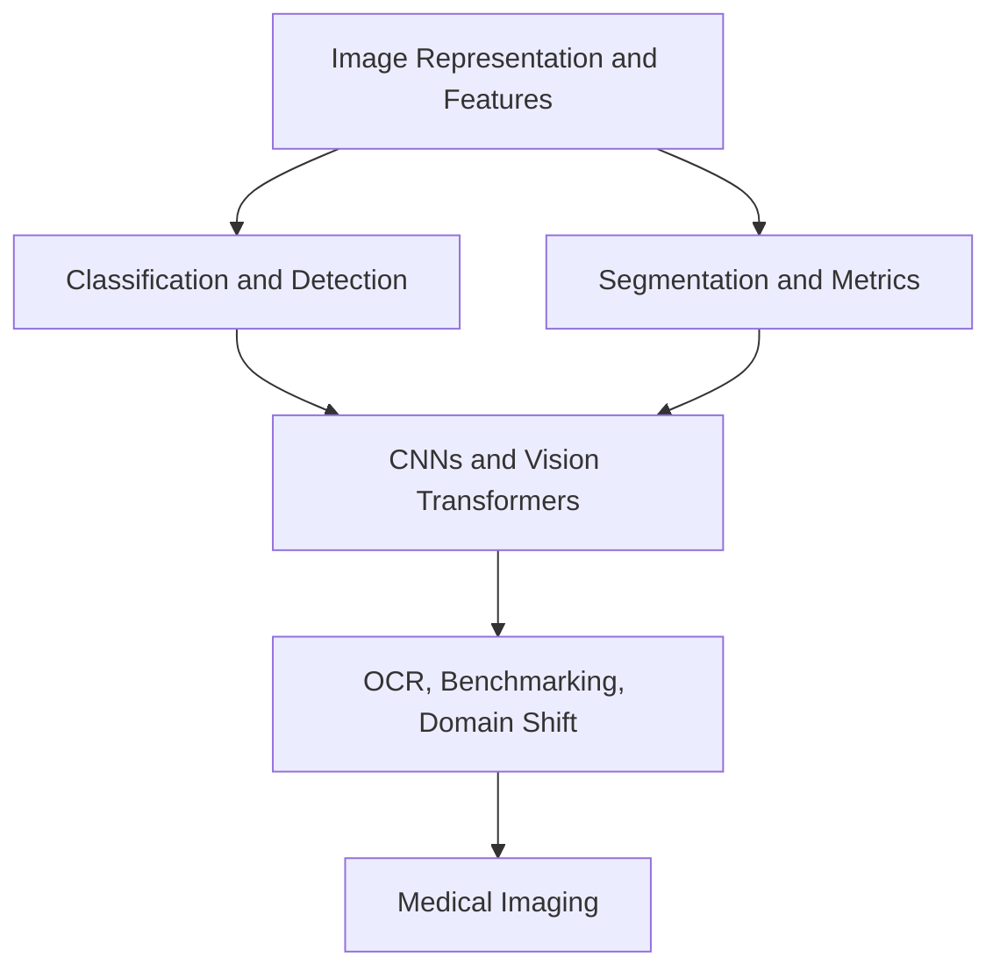

# Computer Vision

Computer vision covers image representations, classical and learned visual features, recognition, detection, segmentation, retrieval, and visual foundation models. Medical imaging is treated here as a specialized computer-vision subdomain rather than a separate top-level area: it uses the same representation, detection, segmentation, benchmarking, and domain-shift tools, but with clinical validation constraints.

## Knowledge map

Image representation and features come first, then the recognition, detection, and segmentation tasks, then the backbones that power them, and finally applied and medical systems.

## Reading path

Read image foundations, then recognition and segmentation, then backbones, applied systems, and the medical subdomain.

1. [Image Representation](image-representation.md): pixels, channels, and tensor layout.
2. [Classical Image Processing](classical-image-processing.md): filters and gradients before learned features.
3. [Feature Extraction](feature-extraction.md): hand-designed descriptors and what they capture.
4. [Data Augmentation](data-augmentation.md): label-consistent transforms that expand training data.
5. [Image Classification](image-classification.md): whole-image label prediction.
6. [Object Detection](object-detection.md): localizing and classifying objects with boxes.
7. [Rotated Object Detection](rotated-object-detection.md): oriented boxes for rotated objects.
8. [Pose Estimation](pose-estimation.md): locating keypoints and body structure.
9. [Semantic Segmentation](semantic-segmentation.md): per-pixel class labels.
10. [Instance Segmentation](instance-segmentation.md): per-object masks.
11. [Detection and Segmentation Metrics](detection-and-segmentation-metrics.md): IoU, average precision, and Dice.
12. [CNN Architectures](cnn-architectures.md): convolutional backbones and receptive fields.
13. [Vision Transformers](vision-transformers.md): patch-token attention models for images.
14. [Self-Supervised Visual Learning](self-supervised-visual-learning.md): pretraining without labels.
15. [Content-Based Image Retrieval](content-based-image-retrieval.md): nearest-neighbor search over image embeddings.
16. [OCR Pipelines](ocr-pipelines.md): detecting and reading text in images.
17. [Document Image Analysis and Field Extraction](document-image-analysis-and-field-extraction.md): structured extraction from document images.
18. [Model Benchmarking](model-benchmarking.md): comparing vision models fairly.
19. [Domain Shift](domain-shift.md): accuracy loss when deployment data differs from training.
20. [Synthetic Data](synthetic-data.md): rendered or generated training images and their transfer gap.
21. [Medical Image Analysis](medical-image-analysis.md): vision under clinical validation constraints.
22. [MRI Segmentation](mri-segmentation.md): volumetric lesion and organ masks.
23. [MRI Classification](mri-classification.md): patient-level prediction and honest splits.

## Connections

- [Deep Learning](../06-deep-learning/index.md) supplies the CNN and transformer backbones.
- [Video Understanding](../10-video-understanding/index.md) extends these methods across time, and [Domain Applications](../19-domain-applications/index.md) uses them end to end.

> [!nav]
> **Learning path** — [Computer vision](../00-home-and-navigation/learning-paths.md#computer-vision)
>
> [Image Representation →](image-representation.md)
