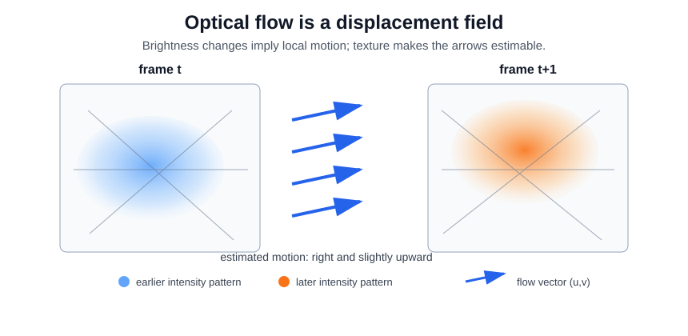

# Optical Flow

Optical flow estimates the apparent 2D motion field between nearby frames. It is lower-level than [temporal action recognition](temporal-action-recognition.md): instead of naming the action, it asks how local image intensity is moving. That motion field can be fed to [two-stream models](two-stream-models.md), used as a cue in [person tracking and track aggregation](person-tracking-and-track-aggregation.md), or treated as one component of broader [spatial and temporal modelling](spatial-and-temporal-modelling.md).

## Defining math

Brightness constancy assumes a point keeps the same intensity as it moves:

$$
I(x+u, y+v, t+1) \approx I(x,y,t).
$$

First-order expansion gives the optical-flow constraint

$$
I_x u + I_y v + I_t = 0.
$$

One pixel gives one equation for two unknowns, so Lucas-Kanade solves a local least-squares problem over a window:

$$
\hat{\mathbf v} = \arg\min_{\mathbf v=(u,v)} \sum_{q\in W} (I_x(q)u + I_y(q)v + I_t(q))^2.
$$

Horn-Schunck instead adds a global smoothness penalty so neighboring flow vectors prefer to vary slowly. The shared intuition is simple: image gradients say which displacement would explain the observed temporal change, while extra spatial assumptions resolve the aperture ambiguity.

## Worked example

```python
import warnings
import numpy as np
from scipy.ndimage import shift

warnings.filterwarnings("ignore", category=RuntimeWarning)
np.random.seed(9)
h, w = 40, 40
y, x = np.mgrid[0:h, 0:w]
frame1 = np.exp(-((x-19)**2 + (y-21)**2) / 70.0) + 0.35*np.sin(x/3.5) + 0.2*np.cos(y/4.0)
true_u, true_v = 0.70, -0.40
frame2 = shift(frame1, shift=(true_v, true_u), order=1, mode="nearest")
Ix = (np.roll(frame1, -1, axis=1) - np.roll(frame1, 1, axis=1)) / 2
Iy = (np.roll(frame1, -1, axis=0) - np.roll(frame1, 1, axis=0)) / 2
It = frame2 - frame1
mask = np.zeros_like(frame1, dtype=bool)
mask[6:-6, 6:-6] = True
A = np.column_stack([Ix[mask], Iy[mask]])
b = -It[mask]
flow, *_ = np.linalg.lstsq(A, b, rcond=None)
res = A @ flow - b
print("true_flow_u_v", np.round([true_u, true_v], 3).tolist())
print("estimated_u_v", np.round(flow, 3).tolist())
print("mean_abs_constraint_residual", round(float(np.mean(np.abs(res))), 5))
```

Observed output:

```text
true_flow_u_v [0.7, -0.4]
estimated_u_v [0.681, -0.402]
mean_abs_constraint_residual 0.00548
```

The local linearization recovers the synthetic subpixel shift closely. It works here because the texture has gradients in multiple directions; a flat patch or a single straight edge would make the least-squares system poorly conditioned.

The visual picture is a field of small displacement arrows. A uniform right-and-up shift has similar arrows across textured regions, but reliable estimation still depends on local gradients:



## Caveats

Brightness constancy breaks under lighting changes, specularities, motion blur, and occlusion. Large displacements need pyramids or learned matching because the first-order approximation is local. Flow is also apparent image motion, not necessarily physical 3D motion: camera movement, parallax, and rolling shutter can dominate the field.

## References

- [Lucas and Kanade, 1981, An iterative image registration technique with an application to stereo vision](https://www.ri.cmu.edu/pub_files/pub3/lucas_bruce_d_1981_1/lucas_bruce_d_1981_1.pdf)
- [Horn and Schunck, 1981, Determining optical flow](https://doi.org/10.1016/0004-3702(81)90024-2)
