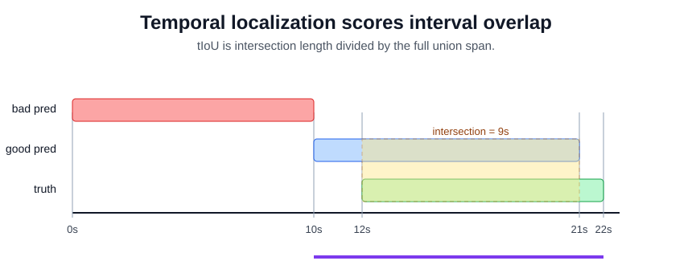

# Temporal Localization

Temporal localization marks when an event starts and ends in an untrimmed video. [Temporal action recognition](temporal-action-recognition.md) may say "goal attempt"; localization must output a segment such as 12.0s to 22.0s. This is the bridge from clip classification to usable timelines, alerts, and search indexes.

## Defining math

For a predicted segment $\hat s=[\hat t_1,\hat t_2]$ and ground truth $s=[t_1,t_2]$, temporal intersection-over-union is

$$
\operatorname{tIoU}(\hat s,s)=
\frac{\max(0,\min(\hat t_2,t_2)-\max(\hat t_1,t_1))}
\max(\hat t_2,t_2)-\min(\hat t_1,t_1)}.
$$

Detectors score candidate segments, then evaluate mean average precision at one or more tIoU thresholds. [Sliding-window inference](sliding-window-inference.md) is the simplest proposal mechanism; modern [video transformers](video-transformers.md) can predict sparse temporal proposals directly.

## Worked example

For ground truth $s=[12,22]$, compare two proposed segments:

| segment | interval | intersection | union span | tIoU | boundary error |
|---|---:|---:|---:|---:|---:|
| good proposal | $[10,21]$ | $21-12=9$ | $22-10=12$ | $9/12=0.75$ | start $-2$s, end $-1$s |
| bad proposal | $[0,10]$ | $0$ | $22-0=22$ | $0/22=0$ | no overlap |

The good segment overlaps substantially but starts two seconds early and ends one second early. For a highlight reel that may be fine; for a safety trigger it may not.

## Caveats

Ambiguous boundaries make annotation and evaluation noisy. High tIoU thresholds punish small timing errors on short actions. Models trained on trimmed clips often fail on background-heavy video because the negative temporal context is different.

## References

- [Wu et al., 2021, Towards High-Quality Temporal Action Detection with Sparse Proposals](https://arxiv.org/abs/2109.08847)
- [Kay et al., 2017, The Kinetics Human Action Video Dataset](https://arxiv.org/abs/1705.06950)
