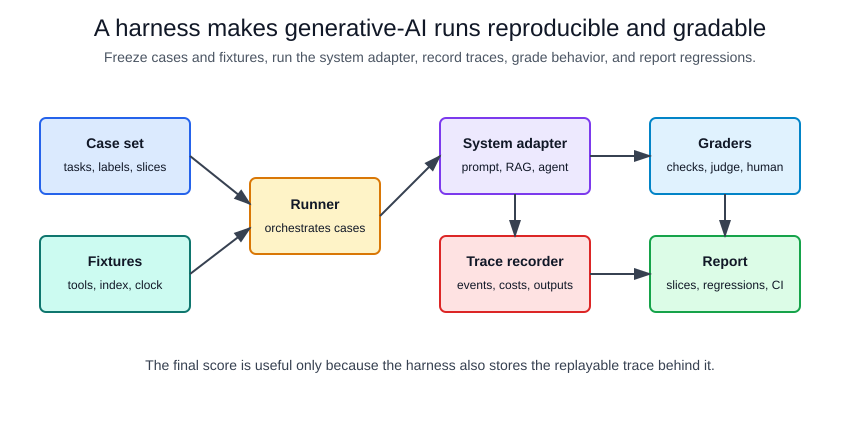

# Harnesses

A harness is the controlled wrapper around a generative-AI system. It fixes inputs, prompts, model settings, retrieval fixtures, tool fixtures, graders, metrics, and reporting so runs can be compared. Without a harness, an evaluation result is often just a transcript: useful for debugging one case, but too under-specified to reproduce or trust as a regression signal.

Harnesses are especially important for [RAG evaluation](rag-evaluation.md), [agent evaluation](agent-evaluation.md), [LLM-as-judge](llm-as-judge.md), and [tool use and function calling](tool-use-and-function-calling.md), because the final answer is only one part of the behavior. A good harness records the path that produced the answer.

## Mechanism

At minimum, a harness has five parts:

| part | responsibility | common failure if missing |
|---|---|---|
| Case set | Frozen tasks, expected evidence, user context, and slice labels | The benchmark drifts when examples are edited ad hoc. |
| System adapter | Calls the prompt, RAG pipeline, agent loop, or model endpoint with fixed settings | The runner cannot compare versions because each system is invoked differently. |
| Fixtures | Stubbed tools, retrieval indexes, permission state, clocks, and external APIs | Results change because live dependencies change. |
| Graders | Deterministic checks, rubric checks, model judges, and human review queues | The suite grades style but misses unsupported claims or unsafe tool calls. |
| Reporter | Stores traces, metrics, costs, latency, failures, and release comparisons | Failures cannot be debugged or linked to code/prompt changes. |

The harness should produce a trace record, not only a score. For one case $i$, a practical pass predicate is

$$
P_i = O_i \land E_i \land S_i \land G_i \land B_i,
$$

where $O_i$ is outcome correctness, $E_i$ is required evidence coverage, $S_i$ is safety and policy compliance, $G_i$ is grader agreement above threshold, and $B_i$ is budget compliance. Aggregate pass rate is useful, but release decisions should also inspect slice-level regressions:

$$
\operatorname{pass\ rate}(s)=\frac{1}{|D_s|}\sum_{i\in D_s}P_i.
$$

## Harness Architecture



The runner owns reproducibility. The system adapter owns product-specific calls. The trace recorder owns observability. Graders should read the trace and artifacts, not just the final answer, because retrieval misses, forbidden tool calls, and citation errors can be invisible in fluent text.

## Concrete Artifact

This compact harness spec shows the contract a runner needs. The exact file format is less important than the boundaries it names.

```yaml
harness: policy_rag_regression
version: 2026-07-13
system_under_test:
  adapter: rag_answerer
  model: pinned-or-release-candidate
  temperature: 0
  max_output_tokens: 600
fixtures:
  retrieval_index: policy_snapshot_2026_07
  clock: "2026-07-13T09:00:00Z"
  tools:
    search_policy:
      mode: replay
      fixture: search_policy_responses.jsonl
cases:
  path: eval_cases/policy_rag.jsonl
  required_fields:
    - case_id
    - question
    - expected_sources
    - answerability
    - risk_slice
graders:
  deterministic:
    - name: required_source_recall
      threshold: 1.0
    - name: citation_coverage
      threshold: 0.9
    - name: no_forbidden_tool_calls
      threshold: 1.0
  model_judge:
    name: answer_support
    rubric: supported_by_retrieved_evidence
    threshold: 0.8
report:
  group_by:
    - risk_slice
    - answerability
  fail_on:
    pass_rate_drop: 0.02
    p95_latency_ms: 4000
    avg_cost_usd: 0.05
```

The spec freezes the model settings, retrieval snapshot, tool replay data, case schema, graders, grouping keys, and release thresholds. That makes a regression actionable: if `required_source_recall` drops, the owner looks at retrieval; if `answer_support` drops while source recall is stable, the owner looks at context construction or generation.

## Trace Contract

A harness should store one trace per case with enough detail to replay or debug the run:

| trace field | why it matters |
|---|---|
| `case_id`, prompt version, model version | Ties a result to the tested artifact. |
| Retrieved source IDs and ranks | Separates retrieval failure from generation failure. |
| Tool call names, arguments, authorization decisions, and results | Catches schema errors, permission failures, and forbidden actions. |
| Final answer, citations, abstention decision | Supports answer-level grading. |
| Token counts, latency, retries, and cost | Makes budget regressions visible. |
| Grader outputs and rationales | Makes failures auditable without rerunning the whole suite. |

For [agentic systems](agentic-systems.md), traces should also include loop steps, stop reasons, and side-effect boundaries. A final answer can be correct even if the agent used a forbidden tool or exceeded the intended budget.

## What To Freeze

Freeze anything that can otherwise move between runs:

| moving part | freeze or record |
|---|---|
| Prompt text and system instructions | Versioned prompt artifact. |
| Model identity and decoding settings | Model name, endpoint, temperature, top-p, max tokens, seed if supported. |
| Retrieval corpus and chunking | Snapshot ID, chunker version, embedding model, index version. |
| Tool behavior | Replay fixtures for offline tests; explicit sandbox for integration tests. |
| User permissions and tenant state | Synthetic permission fixtures or fixed test accounts. |
| Time | Fixed clock for date-sensitive answers. |
| Grader rubric | Versioned deterministic code and judge prompt. |

This is the harness connection to [determinism and reproducibility](determinism-and-reproducibility.md). Generative systems may still have nondeterminism, but the harness should remove avoidable environmental drift.

## Grading Strategy

Use deterministic graders whenever the expected behavior is structured:

- Source IDs retrieved.
- Required citations present.
- JSON schema validity.
- Tool name and argument validity.
- Forbidden tool calls absent.
- Latency, cost, and retry budgets.

Use model judges or human review for semantic checks that cannot be reduced cleanly to exact matches:

- Whether an answer is supported by evidence.
- Whether a refusal is appropriate.
- Whether a summary preserves the important caveats.
- Whether a response follows a nuanced policy.

Model judges should be calibrated against human-labelled examples and protected from seeing the candidate system's hidden reasoning. They are graders inside the harness, not substitutes for the harness.

## Test Slices

A harness should report more than a single average. Useful slices include:

| slice | examples |
|---|---|
| Answerability | answerable, unanswerable, ambiguous, stale-source cases. |
| Retrieval difficulty | exact keyword, paraphrase, multi-hop, conflicting sources. |
| Risk | low-risk FAQ, policy-sensitive, financial, safety, privacy. |
| Tool behavior | no tool needed, read-only tool, side-effecting tool, tool unavailable. |
| User context | permitted user, unauthorized user, missing profile, conflicting permissions. |
| Prompt attack | benign, injected retrieved text, malicious user instruction. |

Slice reporting prevents a model upgrade from passing the mean while regressing on the exact cases that matter.

## CI And Release Use

Not every harness belongs in every CI job:

| cadence | harness type | goal |
|---|---|---|
| Pull request | Small deterministic smoke suite | Catch broken schemas, prompt syntax, and obvious regressions quickly. |
| Nightly | Larger offline replay suite | Track quality, cost, and latency against frozen cases. |
| Release candidate | Full benchmark plus adversarial slices | Decide whether to ship a model, prompt, retriever, or tool change. |
| Production monitoring | Sampled live traces with privacy controls | Catch drift that offline fixtures miss. |

The same case can move through these layers. Start with a deterministic replay case, then promote important failures into release-gating slices.

## Failure Modes

Harnesses can create false confidence when they are too narrow or too mutable:

- The case set overfits to known prompts and misses new user behavior.
- The grader rewards plausible wording instead of evidence support.
- Retrieval fixtures are stale relative to production data.
- Tool fixtures do not model permission failures or timeouts.
- Aggregate pass rate hides high-risk slice failures.
- The harness is updated at the same time as the system under test, making regressions disappear.
- Live tests call side-effecting tools without idempotency, sandboxing, or approvals.

Treat harness failures as product signals, not just test failures. A failing case should produce enough trace detail for the owner to decide whether the problem is data, retrieval, prompting, tool orchestration, policy, or grading.

## Connections

Harnesses operationalize [RAG benchmark design](rag-benchmark-design.md), [RAG evaluation](rag-evaluation.md), and [agent evaluation](agent-evaluation.md). They also connect to [guardrails](guardrails.md), because policy checks need to be run repeatedly, and to [cost and latency optimization](cost-and-latency-optimization.md), because quality improvements that break budget constraints are not deployable.

## References

- [OpenAI API documentation: Evals](https://developers.openai.com/api/docs/guides/evals)
- [OpenAI API documentation: Graders](https://developers.openai.com/api/docs/guides/graders)
- [OpenAI API documentation: Agents SDK evaluation](https://developers.openai.com/api/docs/guides/agents#evaluate-agent-workflows)
