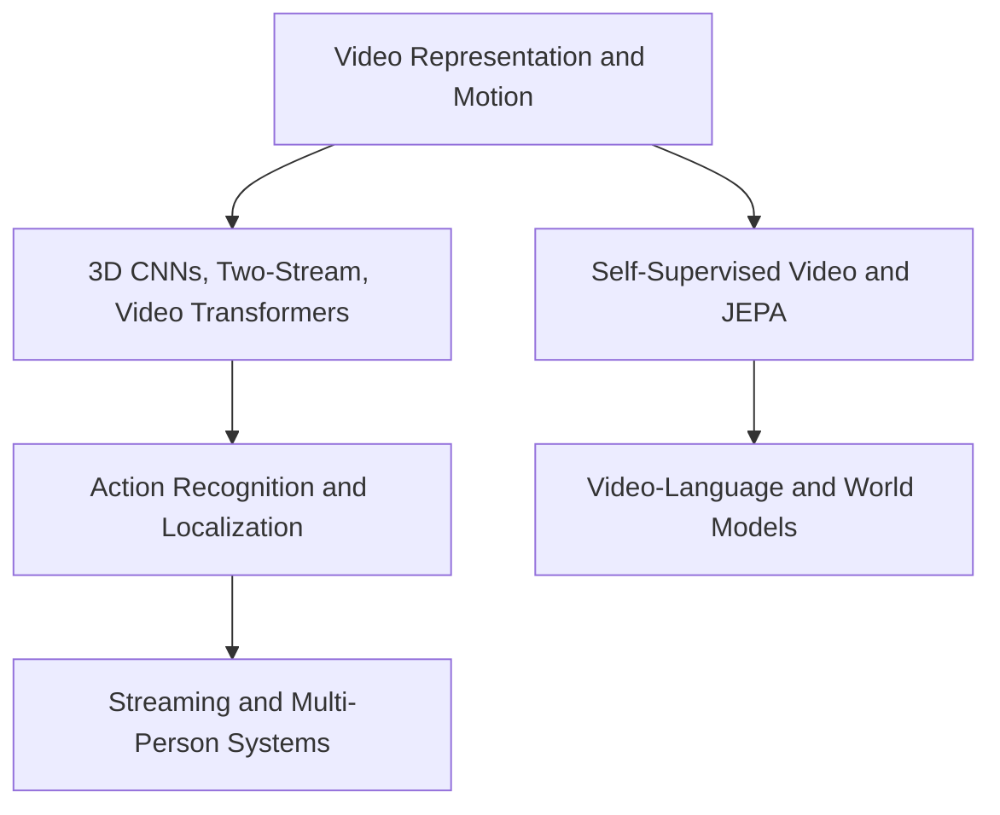

# Video Understanding

Video understanding turns ordered frames into representations, events, tracks, language-facing answers, or predictions about what happens next. The section starts with representations and spatiotemporal cues, then moves through recognition architectures, temporal decision problems, multi-person systems, and world-model-style latent prediction.

## Knowledge map

Representations and motion cues feed the recognition architectures; those support action recognition and streaming multi-person systems, while self-supervised pretraining leads to video-language and world models.

## Reading path

Read representations, then architectures, temporal and multi-person decisions, and finally foundation models and prediction.

1. [Spatial and Temporal Modelling](spatial-and-temporal-modelling.md): how space and time are jointly modeled.
2. [Video Representation](video-representation.md): frames, clips, and tokens.
3. [Optical Flow](optical-flow.md): dense motion between frames.
4. [3D Convolutional Networks](3d-convolutional-networks.md): convolving over time as a third dimension.
5. [Two-Stream Models](two-stream-models.md): separate appearance and motion streams.
6. [Video Transformers](video-transformers.md): attention over space-time tokens.
7. [Temporal Action Recognition](temporal-action-recognition.md): classifying actions in clips.
8. [Temporal Localization](temporal-localization.md): finding when an action occurs.
9. [Sliding Window Inference](sliding-window-inference.md): scanning long video with windows.
10. [Trigger Point Prediction](trigger-point-prediction.md): deciding the moment to act.
11. [Person Tracking and Track Aggregation](person-tracking-and-track-aggregation.md): linking detections into tracks.
12. [Real-Time Video Understanding](real-time-video-understanding.md): latency and throughput constraints.
13. [Gesture Recognition](gesture-recognition.md): recognizing hand and body gestures.
14. [Self-Supervised Video Representation Learning](self-supervised-video-representation-learning.md): pretraining from unlabeled video.
15. [Video-Language Models](video-language-models.md): connecting video to text.
16. [V-JEPA](v-jepa.md): joint-embedding predictive pretraining for video.
17. [V-JEPA 2](v-jepa-2.md): the scaled successor.
18. [V-JEPA 2 versus Vision-Language Models](v-jepa-2-versus-vision-language-models.md): contrasting the two paradigms.
19. [World Models](world-models.md): learned models of environment dynamics.
20. [World Models and JEPA](world-models-and-jepa.md): predictive latent world modeling.

## Connections

- [Computer Vision](../09-computer-vision/index.md) supplies the per-frame representations extended here across time.
- [Generative AI](../11-generative-ai/index.md) shares the foundation-model and world-model ideas.
