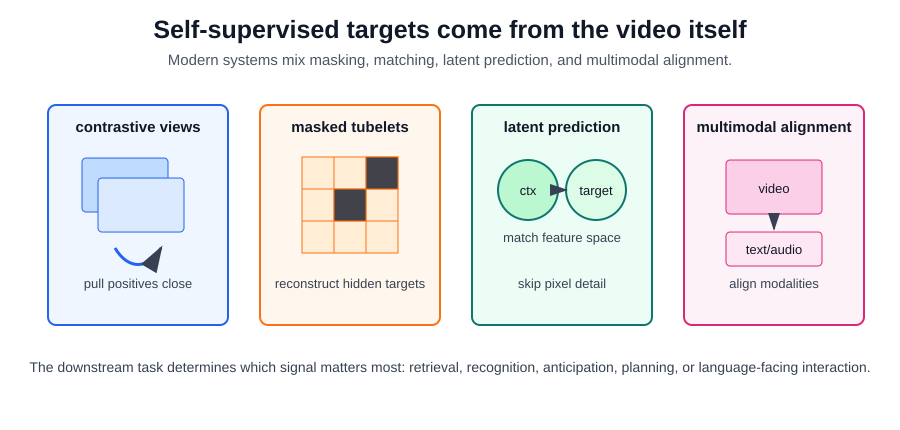

# Self-Supervised Video Representation Learning

Self-supervised video representation learning trains encoders without manual clip labels. The supervision comes from the video itself: predict hidden tubelets, match augmented views, align video with text or audio, order frames, or predict future latent states. The output is a reusable [video representation](video-representation.md) for recognition, retrieval, anticipation, localization, or [V-JEPA](v-jepa.md)-style latent prediction.

The modern state of the art is not one objective. Strong video foundation models usually combine a scalable video-transformer backbone, aggressive masking or latent prediction, large unlabeled video corpora, and sometimes multimodal alignment. V-JEPA 2 is one important example, but the broader pattern includes masked video autoencoders such as VideoMAE, feature-prediction models such as V-JEPA, and multimodal systems such as InternVideo2.

## Defining mechanism

Self-supervised learning creates targets from the clip itself. Three common objectives are:

| objective family          | target made from the video                                                | what the encoder is pushed to learn                                        |
| ------------------------- | ------------------------------------------------------------------------- | -------------------------------------------------------------------------- |
| Contrastive or matching   | Another augmented view, a paired caption, or an audio segment.            | Invariance to harmless changes and alignment across views or modalities.   |
| Masked video modeling     | Hidden patches or tubelets, reconstructed as pixels, tokens, or features. | Spatiotemporal structure that makes missing content predictable.           |
| Latent feature prediction | Target-encoder representations of masked or future regions.               | Semantic and motion-sensitive features without reconstructing every pixel. |

A contrastive objective makes two views of the same clip close and other clips far. With similarity score $s(\cdot,\cdot)$ and temperature $\tau$:

$$
\mathcal{L}_i =
-\log
\frac{\exp(s(z_i,z_i^+) / \tau)}
{\sum_{j=1}^{B}\exp(s(z_i,z_j^+) / \tau)}.
$$

Masked-video objectives hide a set of tubelets $M$ and train a decoder to predict targets $t_m$ from the visible tubelets $x_{\bar M}$:

$$
\mathcal{L}_{mask}
=\sum_{m\in M}\ell\!\left(d_\phi(f_\theta(x_{\bar M}))_m,t_m\right).
$$

JEPA-style methods differ from pixel reconstruction by predicting representation-space targets:

$$
\mathcal{L}_{latent}
=\sum_{m\in M}
\left\lVert
p_\phi(f_\theta(x_{\bar M}),m)
-\operatorname{sg}(g_{\bar\theta}(x)_m)
\right\rVert_2^2.
$$

Here $\operatorname{sg}$ means stop-gradient: the target encoder supplies the latent target, but gradients update the context encoder and predictor. This connects directly to [V-JEPA](v-jepa.md) and [V-JEPA 2](v-jepa-2.md), while masked reconstruction connects directly to VideoMAE-style pretraining.



## Current Method Families

| family                                  | representative direction                                                                   | state-of-the-art detail                                                                                                                                                                         | tradeoff                                                                                                   |
| --------------------------------------- | ------------------------------------------------------------------------------------------ | ----------------------------------------------------------------------------------------------------------------------------------------------------------------------------------------------- | ---------------------------------------------------------------------------------------------------------- |
| Contrastive and cross-view learning     | Match two augmented clips or video-text pairs.                                             | Still useful for retrieval and multimodal alignment, especially when captions or audio are available.                                                                                           | Negative sampling and augmentations can create shortcuts or erase temporal order.                          |
| Masked video autoencoding               | Hide tubelets and reconstruct pixels or token targets.                                     | VideoMAE showed that very high video masking ratios can work because adjacent frames are redundant; VideoMAE V2 adds dual masking to scale masked pretraining efficiently.                      | Pixel reconstruction can spend capacity on texture unless the masking and decoder are designed carefully.  |
| Latent feature prediction               | Predict target-encoder features for masked or future regions.                              | V-JEPA trains from video feature prediction without text, negatives, or pixel reconstruction; V-JEPA 2 scales this idea for understanding, anticipation, and planning-oriented representations. | The learned representation is only as useful as the target features and downstream evaluation reveal.      |
| Dense latent prediction                 | Apply self-supervision across more spatial and temporal positions or intermediate layers.  | Recent V-JEPA 2.1 work focuses on dense features for spatial grounding, temporal consistency, and robot-relevant transfer.                                                                      | Denser targets improve grounding but increase implementation complexity and compute.                       |
| Multimodal video foundation pretraining | Combine masked video modeling, video-text/audio contrastive learning, and language losses. | InternVideo2 uses progressive training that combines masked video modeling, cross-modal contrastive learning, and next-token prediction at large scale.                                         | Better language-facing ability, but the representation may reflect caption bias and data curation choices. |

The practical lesson is to choose the pretraining signal based on the downstream contract. Retrieval and captioning benefit from video-text alignment. Motion recognition and anticipation need temporal perturbations that preserve ordering. Planning or world-model-style transfer benefits from latent prediction and evaluation on dynamics-sensitive tasks rather than only static image recognition.

## Worked example

The snippet below is a small implementation pattern for the contrastive family, not a complete modern video foundation model. It shows how InfoNCE is usually expressed in PyTorch: normalize embeddings, build a similarity matrix, divide by a temperature, and use cross-entropy with diagonal labels.

```python
import torch

torch.manual_seed(4)
z = torch.nn.functional.normalize(torch.randn(3,4), dim=1)
z_aug = torch.nn.functional.normalize(z + 0.15*torch.randn(3,4), dim=1)
logits = z @ z_aug.T / 0.2
loss = torch.nn.functional.cross_entropy(logits, torch.arange(3))
print("similarity_matrix", torch.round(logits, decimals=2).tolist())
print("infonce_loss", round(loss.item(), 4))
print("top_matches", logits.argmax(1).tolist())
```

Observed output:

```text
similarity_matrix [[4.980000019073486, -3.450000047683716, 1.4700000286102295], [-3.7100000381469727, 4.829999923706055, 1.2400000095367432], [1.4500000476837158, 0.9599999785423279, 4.940000057220459]]
infonce_loss 0.035
top_matches [0, 1, 2]
```

Each clip correctly matches its augmented version. In real video, the hard part is choosing augmentations that preserve action identity without making shortcuts too easy.

The diagonal logits, about 4.8 to 5.0, are much larger than most off-diagonal logits, so the cross-entropy target `torch.arange(3)` asks each row to select its own augmented view. This is a meaningful API example because it shows the common InfoNCE implementation pattern: build a similarity matrix, divide by temperature, and use ordinary cross-entropy with diagonal labels.

## Caveats

Temporal augmentations can destroy labels that depend on order. Pixel reconstruction may spend capacity on texture instead of semantics; latent prediction can collapse if targets and predictors are not designed carefully. Multimodal pretraining can improve language-facing tasks while importing caption bias or missing nonverbal motion details. Downstream evaluation should include motion-sensitive tasks, dense prediction, retrieval, and anticipation, not only static scene recognition or top-1 clip classification.

## References

- [Tong et al., 2022, VideoMAE](https://arxiv.org/abs/2203.12602)
- [Wang et al., 2023, VideoMAE V2: Scaling Video Masked Autoencoders with Dual Masking](https://arxiv.org/abs/2303.16727)
- [Bardes et al., 2024, Revisiting Feature Prediction for Learning Visual Representations from Video](https://arxiv.org/abs/2404.08471)
- [Wang et al., 2024, InternVideo2: Scaling Foundation Models for Multimodal Video Understanding](https://arxiv.org/abs/2403.15377)
- [Assran et al., 2025, V-JEPA 2: Self-Supervised Video Models Enable Understanding, Prediction and Planning](https://arxiv.org/abs/2506.09985)
- [Mur-Labadia et al., 2026, V-JEPA 2.1: Unlocking Dense Features in Video Self-Supervised Learning](https://arxiv.org/abs/2603.14482)
