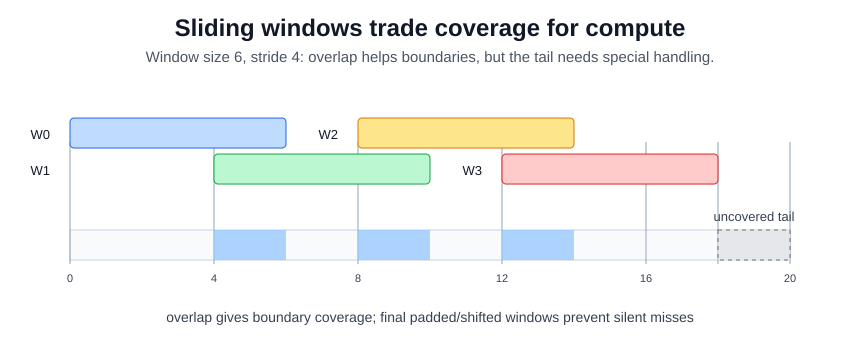

# Sliding Window Inference

Sliding-window inference runs a fixed-size clip model over a long video by choosing window length and stride. It is the practical glue between clip-trained [temporal action recognition](temporal-action-recognition.md) models and untrimmed streams. The same windows can feed [temporal localization](temporal-localization.md), [trigger-point prediction](trigger-point-prediction.md), or offline indexing.

## Windows and strides

For video length $T$, window size $w$, and stride $s$, windows are

$$
W_k = [ks, \min(ks+w, T)).
$$

Overlap improves coverage and boundary recall but increases compute. Predictions are then pooled, smoothed, non-max suppressed, or converted into trigger rules depending on the task.

## Worked example

For $T=20$ frames, window size $w=6$, and stride $s=4$, the full windows are:

| window |  interval | covered frames         |
| -----: | --------: | ---------------------- |
|  $W_0$ |   $[0,6)$ | 0, 1, 2, 3, 4, 5       |
|  $W_1$ |  $[4,10)$ | 4, 5, 6, 7, 8, 9       |
|  $W_2$ |  $[8,14)$ | 8, 9, 10, 11, 12, 13   |
|  $W_3$ | $[12,18)$ | 12, 13, 14, 15, 16, 17 |

Frames 4, 5, 8, 9, 12, and 13 are covered twice because adjacent windows overlap. Frames 18 and 19 are uncovered because the simple full-window schedule stops at frame 18. Production code usually adds a final padded or shifted window so the tail of the stream is not silently missed.

## Caveats

Stride determines both cost and worst-case detection delay. Windows split actions at boundaries, so smoothing and non-max suppression must be tuned with tIoU metrics. For [real-time video understanding](real-time-video-understanding.md), buffering a full window can dominate latency.

## References

- [Wang et al., 2016, Temporal Segment Networks](https://arxiv.org/abs/1608.00859)
- [Wu et al., 2021, Towards High-Quality Temporal Action Detection with Sparse Proposals](https://arxiv.org/abs/2109.08847)

> [!nav]
> **Section** — [Video Understanding](index.md)
>
> [← Temporal Localization](temporal-localization.md) [Trigger Point Prediction →](trigger-point-prediction.md)
