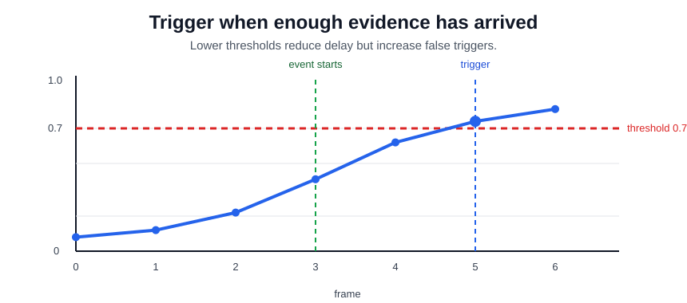

# Trigger Point Prediction

Trigger-point prediction decides when enough streaming evidence has arrived to fire an action. It is not retrospective [temporal localization](temporal-localization.md): the system must choose now, under uncertainty, with latency and false-trigger costs. Gesture interfaces, safety alerts, and sports-event clipping all need this form of decision.

## Thresholding streaming probabilities

For per-frame or per-window probabilities $p_t=P(y=1\mid x_{1:t})$, a threshold trigger is

$$
\tau = \min\{t : p_t \ge \theta\}.
$$

More careful systems add hysteresis, minimum duration, or cost-sensitive stopping rules. Thresholding is part of [real-time video understanding](real-time-video-understanding.md) as much as modelling: a lower threshold reduces delay but increases false alarms.

## Worked example

With threshold $\theta=0.70$, the first frame whose streaming probability crosses the threshold is frame 5:

|    frame |    0 |    1 |    2 |    3 |    4 |       5 |                 6 |
| -------: | ---: | ---: | ---: | ---: | ---: | ------: | ----------------: |
|    $p_t$ | 0.08 | 0.12 | 0.22 | 0.41 | 0.62 |    0.74 |              0.81 |
| decision | wait | wait | wait | wait | wait | trigger | already triggered |

If the event began at frame 3, the trigger fires two frames later with $p_5=0.74$. That delay may be acceptable for review queues but too slow for direct manipulation in [gesture recognition](gesture-recognition.md). A lower threshold would fire earlier, but it would also make ordinary pre-event motion more likely to trigger.

## Caveats

Offline metrics can hide early false positives and late true positives. Calibrated probabilities matter because threshold changes are product decisions. Streaming models also face partial observability: early frames may be compatible with multiple future actions.

## References

- [Assran et al., 2025, V-JEPA 2](https://arxiv.org/abs/2506.09985)
- [Wu et al., 2021, Towards High-Quality Temporal Action Detection with Sparse Proposals](https://arxiv.org/abs/2109.08847)

> [!nav]
> **Section** — [Video Understanding](index.md)
>
> [← Sliding Window Inference](sliding-window-inference.md) [Person Tracking and Track Aggregation →](person-tracking-and-track-aggregation.md)
