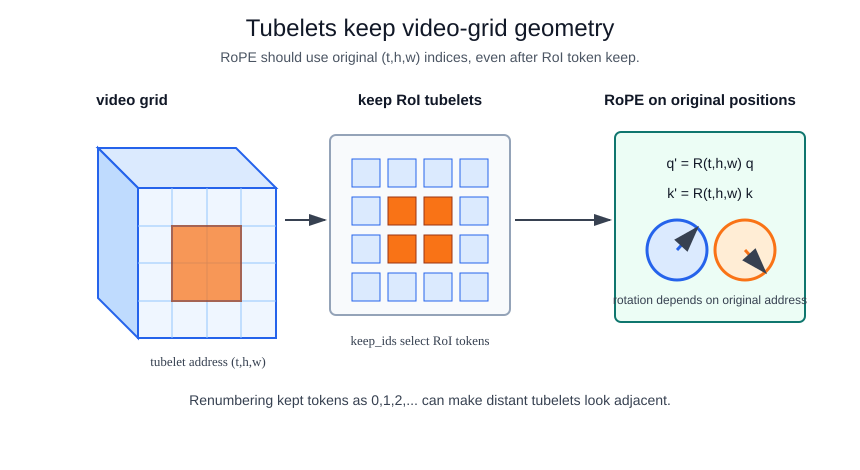

# V-JEPA 2

V-JEPA 2 is a scaled self-supervised video model in the JEPA family. The paper frames it around video understanding, prediction, and planning, including a latent action-conditioned variant for robot planning. It should be read as a [world models](world-models.md) research direction, not as proof that the model has complete physical understanding.

## Defining mechanism

The representation-learning core follows [V-JEPA](v-jepa.md): predict masked or future latent representations from visible context. For planning, an action-conditioned latent dynamics model can score candidate actions:

$$
\hat z_{t+1}=F_\theta(z_t,a_t), \qquad a^*=\arg\min_a C(\hat z_{t+1}, z_{goal}).
$$

That objective is different from a [video-language model](video-language-models.md), which aligns video tokens to text.

## Backbone Pipeline

A V-JEPA 2-style video backbone can be understood as a video-transformer pipeline:

1. Convert a video tensor into tubelet tokens with a 3D patch embedding.
2. Preserve each token's original $(t,h,w)$ address.
3. Apply positional geometry, such as rotary position embeddings, to queries and keys.
4. Run transformer encoder blocks over contextualized tubelet tokens.
5. Use the resulting latent tokens for prediction, probing, or downstream planning.

During self-supervised pretraining, the model does not need gesture labels or a classifier head. The context encoder sees visible tubelets, a predictor estimates hidden target latents, and a target encoder supplies stop-gradient latent targets. During transfer, the backbone may be frozen and a small probe head can test whether those latent tokens already separate a downstream task such as [gesture recognition](gesture-recognition.md).

## Tubelets And RoPE

For a video $X\in\mathbb R^{C\times T\times H\times W}$, a tubelet is a small block of adjacent frames and spatial pixels. With tubelet length $\tau$ and patch size $P$, token $(a,b,c)$ covers

$$
X_{:,\,a\tau:(a+1)\tau,\,bP:(b+1)P,\,cP:(c+1)P}.
$$

A 3D patch embedding flattens that block and projects it into a token:

$$
u_{a,b,c}=W\,\operatorname{vec}\!\left(X_{:,\,a\tau:(a+1)\tau,\,bP:(b+1)P,\,cP:(c+1)P}\right)+b.
$$

The token keeps its original address $(a,b,c)$. That address matters because attention needs positional geometry. Rotary position embeddings (RoPE) rotate query and key coordinates by position-dependent angles. For one two-dimensional feature pair at scalar position $m$,

$$
R(m)
\begin{bmatrix}q_{2r}\\q_{2r+1}\end{bmatrix}
=
\begin{bmatrix}
\cos(\omega_r m) & -\sin(\omega_r m)\\
\sin(\omega_r m) & \cos(\omega_r m)
\end{bmatrix}
\begin{bmatrix}q_{2r}\\q_{2r+1}\end{bmatrix}.
$$

For video tokens, the position is multidimensional, so implementations apply temporal and spatial rotations using the original tubelet coordinates:

$$
q'_{a,b,c}=R_t(a)\,R_h(b)\,R_w(c)\,q_{a,b,c},\qquad
k'_{a,b,c}=R_t(a)\,R_h(b)\,R_w(c)\,k_{a,b,c}.
$$

Attention then uses the rotated queries and keys:

$$
\operatorname{Attention}(Q',K',V)=
\operatorname{softmax}\left(\frac{Q'{K'}^\top}{\sqrt d}\right)V.
$$

RoPE does not detect motion by itself. It gives attention access to relative temporal and spatial offsets so the model can learn motion-sensitive interactions between tubelets.

## Masking Versus Token Keeping

Two operations are easy to confuse:

| operation                 | when it happens                     | what it means                                                                                                   |
| ------------------------- | ----------------------------------- | --------------------------------------------------------------------------------------------------------------- |
| JEPA target masking       | Self-supervised pretraining         | Hide target tubelets and predict their target-encoder latent representations from visible context.              |
| Inference-time token keep | Downstream adaptation or efficiency | Physically keep a subset of tokens, such as person- or hand-region tubelets, before later attention or probing. |

The first is a learning objective. The second is an input-domain or compute-budget choice. If RoI tokens are kept after patch embedding, the kept tokens still need positional encodings based on their original video-grid indices. Replacing original indices with dense post-gather indices can make two physically different tubelets look artificially adjacent.

## Frozen-Backbone Probing

For a frozen checkpoint, a probe head is a measurement instrument. If a lightweight cross-attention or pooling head separates gesture classes, the backbone representation already carries useful motion or body-state information. If full-frame clips underperform person RoI clips, the failure may be input-domain alignment rather than a lack of temporal representation capacity.

## Worked planning example

A latent planner scores candidate actions by rolling them one step forward and comparing the predicted latent state with a goal latent. With current state $z_t=(1.0,0.0)$, goal $z_{goal}=(1.4,0.2)$, and simple transition $\hat z_{t+1}=z_t+0.5a$, the candidate costs are:

| action $a$ | predicted next latent $\hat z_{t+1}$ |       squared distance to goal |
| ---------: | -----------------------------------: | -----------------------------: |
|    $(1,0)$ |                          $(1.5,0.0)$ | $(1.5-1.4)^2+(0.0-0.2)^2=0.05$ |
|    $(0,1)$ |                          $(1.0,0.5)$ | $(1.0-1.4)^2+(0.5-0.2)^2=0.25$ |
|   $(-1,0)$ |                          $(0.5,0.0)$ | $(0.5-1.4)^2+(0.0-0.2)^2=0.85$ |

The action that moves right has the lowest latent cost, so it would be selected. Real V-JEPA 2-style planning uses learned latents and learned dynamics rather than this hand-coded transition.

## Caveats

Planning claims depend on the action-conditioned model, the data distribution, and the evaluation environment. Latent rollouts can be useful without being faithful physical simulation. Keep the distinction clear when comparing to [V-JEPA 2 versus Vision-Language Models](v-jepa-2-versus-vision-language-models.md): V-JEPA 2 is not inherently a conversational model.

## References

- [Assran et al., 2025, V-JEPA 2: Self-Supervised Video Models Enable Understanding, Prediction and Planning](https://arxiv.org/abs/2506.09985)
- [Bardes et al., 2024, Revisiting Feature Prediction for Learning Visual Representations from Video](https://arxiv.org/abs/2404.08471)
