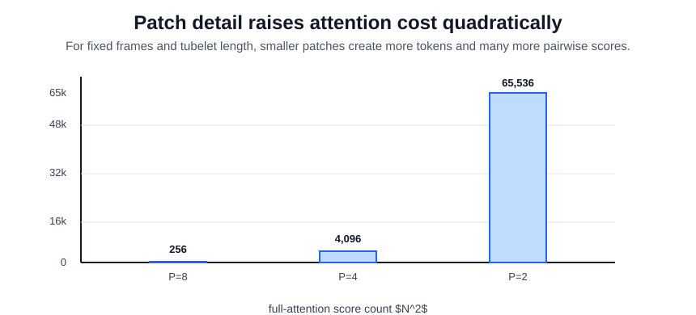

# Video Transformers

Video transformers tokenize a clip into frame patches or tubelets and let attention route information across space and time. Compared with [3D convolutional networks](3d-convolutional-networks.md), they are less tied to local kernels; compared with [two-stream models](two-stream-models.md), they learn motion interactions inside the same token system that carries appearance. Their core operation is the same scaled dot-product [attention](../06-deep-learning/attention.md) used in language models.

## Defining mechanism

For $N$ video tokens with dimension $d_k$,

$$
\operatorname{Attention}(Q,K,V)=\operatorname{softmax}\left(\frac{QK^\top}{\sqrt{d_k}}\right)V.
$$

Full space-time attention forms an $N\times N$ score matrix, where $N=(T/\tau)(H/P)(W/P)$ for tubelet length $\tau$ and patch size $P$. Factorized variants attend spatially and temporally in separate steps to reduce cost and stabilize learning.

The important implementation detail is that video tokens have geometry. A token is not just sequence element $i$; it corresponds to an original address such as $(t,h,w)$ or to a tubelet covering a small block of time and space. Positional encodings must agree with that address. If a system physically keeps only person- or hand-region tokens for [gesture recognition](gesture-recognition.md), the kept tokens should retain their original positions rather than being renumbered as a dense sequence.

## Worked token budget

The useful implementation question is usually not a random attention weight; it is how many tokens and pairwise scores the design creates. For $8$ frames of size $16\times16$, tubelet length $\tau=2$, and patch size $P=8$:

$$
N=(8/2)(16/8)(16/8)=16,\qquad N^2=256.
$$

Changing only the patch size changes the cost quickly:

| patch size | token count $N$ | full-attention score count $N^2$ | interpretation                                    |
| ---------: | --------------: | -------------------------------: | ------------------------------------------------- |
| $8\times8$ |              16 |                              256 | cheap, coarse hand/object detail                  |
| $4\times4$ |              64 |                             4096 | four times more tokens, sixteen times more scores |
| $2\times2$ |             256 |                            65536 | fine detail, expensive full attention             |

This quadratic score growth is why real clips quickly make token count the dominant memory and latency constraint, especially for [real-time video understanding](real-time-video-understanding.md).

## Patch Size And RoI Tradeoffs

Patch size is a budget knob. Smaller patches preserve small objects such as hands, fingers, tools, and signs, but increase token count and attention cost. Larger patches reduce compute but can erase the motion detail needed for fine-grained gestures.

| design choice                       | effect                                                                                      |
| ----------------------------------- | ------------------------------------------------------------------------------------------- |
| Smaller spatial patch               | More hand detail, more tokens, higher attention cost.                                       |
| Larger spatial patch                | Cheaper inference, coarser hand and object geometry.                                        |
| Tubelets                            | Fewer temporal tokens, but each token already mixes adjacent frames.                        |
| Person RoI crop before the backbone | Keeps the actor and nearby context while removing other people and background.              |
| Hand RoI crop before the backbone   | More pixels allocated to the hand, less body and object context.                            |
| RoI token keep inside the backbone  | Lower token budget while preserving the original frame, if positions are handled correctly. |

This is why comparing full-frame, static-crop, tracking-crop, and token-keep variants can reveal more about input-domain alignment than about the model family alone.

## Caveats

Attention can model long-range dependencies, but it does not automatically solve sampling, supervision, or temporal boundary errors. Long videos require sparse, factorized, streaming, or hierarchical designs. Fine-tuning image-pretrained transformers can help, but video-specific motion cues still need adequate temporal coverage. RoI cropping and token keeping can improve signal-to-noise, but they can also remove context or corrupt geometry if token positions no longer match the physical video grid.

## References

- [Bertasius et al., 2021, Is Space-Time Attention All You Need for Video Understanding?](https://arxiv.org/abs/2102.05095)
- [Arnab et al., 2021, ViViT: A Video Vision Transformer](https://arxiv.org/abs/2103.15691)
- [Vaswani et al., 2017, Attention Is All You Need](https://arxiv.org/abs/1706.03762)

> [!nav]
> **Section** — [Video Understanding](index.md)
>
> [← Two-Stream Models](two-stream-models.md) [Temporal Action Recognition →](temporal-action-recognition.md)
