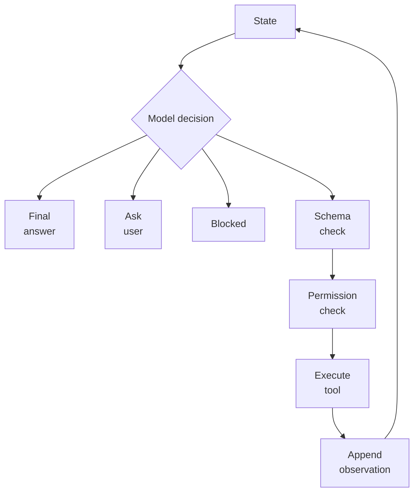

# Agent Loops

An agent loop repeatedly observes state, chooses an action, receives an observation, and decides whether to continue. It is the runtime skeleton under [agentic systems](agentic-systems.md), combining [planning](planning.md), [tool use](tool-use-and-function-calling.md), stopping rules, and sometimes [memory](memory.md).

## Mechanism

A useful loop is a state machine, not an unconstrained conversation:



The application owns the loop invariants: maximum steps, available tools, retry policy, side-effect confirmation, budget limits, and what counts as completion. The model proposes actions inside those constraints. This separation matters because the same model output can be valid in one state and invalid in another.

## Concrete artifact

```json
{
  "run_id": "agent-1842",
  "max_steps": 6,
  "allowed_tools": ["search_docs", "create_ticket"],
  "stop_on": ["final_answer", "blocked", "policy_violation"],
  "retry": { "tool_timeout": 1, "invalid_schema": 0 },
  "requires_confirmation": ["send_email", "issue_refund"],
  "trace_fields": ["step", "state_hash", "tool_call", "observation_hash", "decision"]
}
```

This contract makes failures inspectable for [agent evaluation](agent-evaluation.md). A trace should show whether the agent was missing information, chose the wrong tool, received a bad observation, exceeded budget, or stopped too early.

## Caveats

Loops fail by spinning, compounding bad observations, treating tool output as trusted instructions, or hiding uncertainty behind more actions. Tool observations are data, not policy. Long loops should have replayable traces and deterministic gates around side effects.

## References

- [OpenAI API documentation: Agents SDK](https://platform.openai.com/docs/guides/agents)
- [OpenAI API documentation: Using tools](https://platform.openai.com/docs/guides/tools)

> **Section — [Generative AI and Agentic Systems](index.md):** ← [Tool Routing](tool-routing.md) · [Agentic Systems](agentic-systems.md) →
