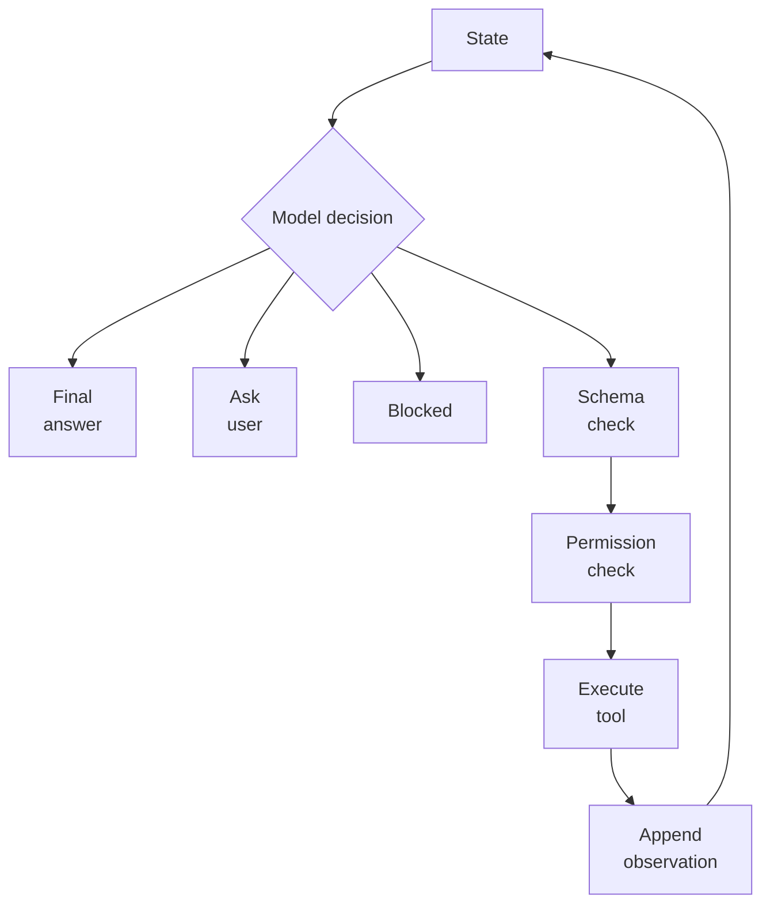

# Agent Loops

An agent loop repeatedly observes state, chooses an action, receives an observation, and decides whether to continue. It is the runtime skeleton under [agentic systems](agentic-systems.md), combining [planning](planning.md), [tool use](tool-use-and-function-calling.md), stopping rules, [guardrails](guardrails.md), and sometimes [memory](memory.md).

The loop is where a language model becomes a system component. The model may decide what to try next, but application code owns the state, available tools, validation, authorization, retries, and termination conditions.

## The loop as a state machine

A useful loop is a state machine, not an unconstrained conversation:



The application owns the loop invariants: maximum steps, available tools, retry policy, side-effect confirmation, budget limits, and what counts as completion. The model proposes actions inside those constraints. This separation matters because the same model output can be valid in one state and invalid in another.

## Loop phases

| Phase    | Runtime responsibility                                       | Model responsibility                          |
| -------- | ------------------------------------------------------------ | --------------------------------------------- |
| Observe  | assemble state, messages, tool results, and budget remaining | interpret the current state                   |
| Decide   | constrain allowed actions and parse the model decision       | answer, ask, call a tool, or stop             |
| Validate | check schema, permissions, side effects, and policy          | none; invalid actions are rejected externally |
| Act      | execute the approved tool or transition                      | use the action result later                   |
| Record   | append observation, trace, cost, latency, and state hash     | condition on the observation                  |
| Stop     | enforce max steps, done condition, blocked state, or failure | produce final answer or explanation           |

This table is the reason "agent" should not mean "unbounded chat loop." A loop without an external state machine will eventually confuse observations, repeat failed actions, or execute a step in the wrong state.

## A loop contract

```json
{
  "run_id": "agent-1842",
  "max_steps": 6,
  "allowed_tools": ["search_docs", "create_ticket"],
  "stop_on": ["final_answer", "blocked", "policy_violation"],
  "retry": { "tool_timeout": 1, "invalid_schema": 0 },
  "requires_confirmation": ["send_email", "issue_refund"],
  "trace_fields": ["step", "state_hash", "tool_call", "observation_hash", "decision"]
}
```

This contract makes failures inspectable for [agent evaluation](agent-evaluation.md). A trace should show whether the agent was missing information, chose the wrong tool, received a bad observation, exceeded budget, or stopped too early.

## Realistic support loop

For a support assistant answering a refund question, a bounded loop might run:

1. Observe the ticket, user role, current tenant, and available read-only policy tools.
2. Decide whether the answer needs retrieval.
3. Validate a `search_refund_policy` call with `policy_version` and `top_k <= 5`.
4. Execute the search and append chunk IDs with provenance.
5. Decide whether the retrieved policy answers the question.
6. Answer with citation or ask for the missing amount/customer type.

The loop does not expose `issue_refund` until a different workflow confirms eligibility and user intent. That separation keeps an answer-seeking loop from turning into an action-taking loop.

## Implementation choices

Simple loops can be a few explicit `while` steps in application code. Framework loops are useful when tool calling, tracing, middleware, and retries follow common patterns. Graph-based loops, such as [LangGraph](langgraph.md), are better when there are durable checkpoints, human interrupts, deterministic branches, or long-running side effects. The more expensive the action, the more the loop should look like a state machine rather than a conversation.

## Caveats

Loops fail by spinning, compounding bad observations, treating tool output as trusted instructions, or hiding uncertainty behind more actions. Tool observations are data, not policy. Long loops should have replayable traces and deterministic gates around side effects. A loop that cannot explain why it stopped is not production-ready.

## References

- [OpenAI API documentation: Agents SDK](https://platform.openai.com/docs/guides/agents)
- [OpenAI API documentation: Using tools](https://platform.openai.com/docs/guides/tools)

> [!nav]
> **Section** — [Generative AI and Agentic Systems](index.md)
>
> [← Tool Routing](tool-routing.md) [Agentic Systems →](agentic-systems.md)
