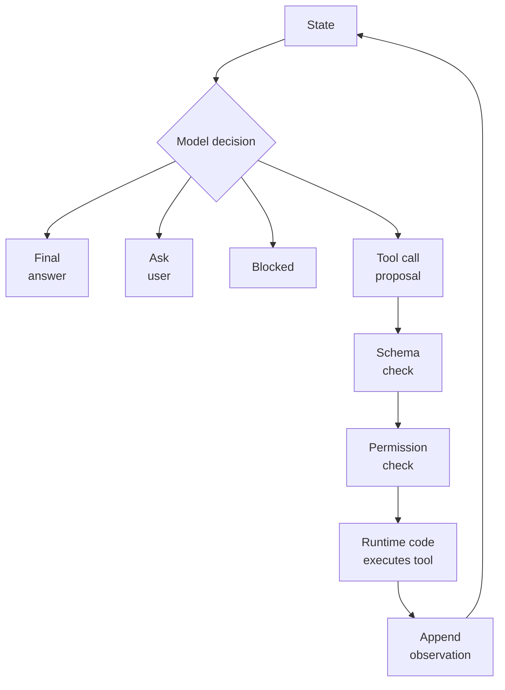
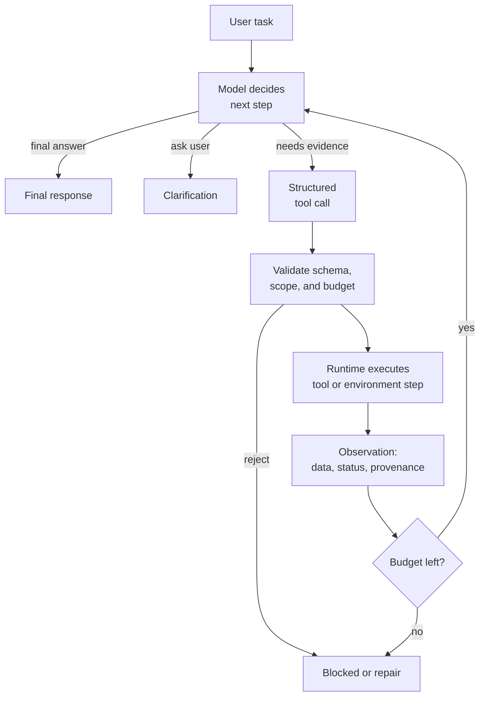
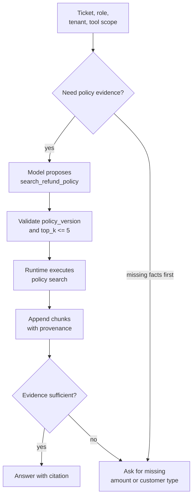
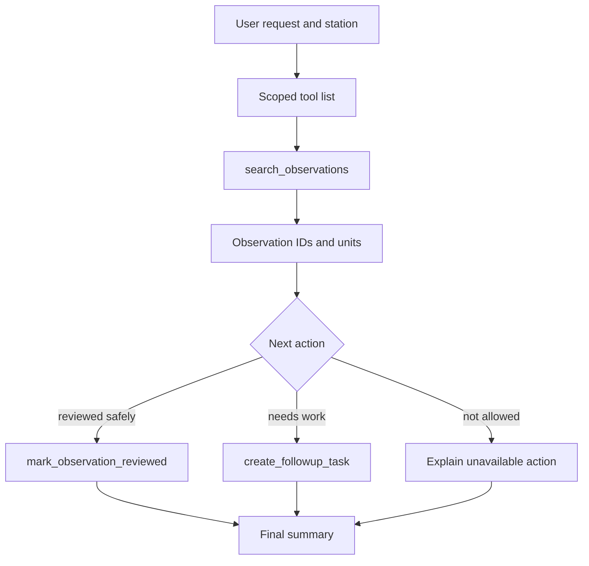

# Agent Loops

An agent loop repeatedly observes state, chooses an action, receives an observation, and decides whether to continue. It is the runtime skeleton under [agentic systems](agentic-systems.md), combining [planning](planning.md), [tool use](tool-use-and-function-calling.md), stopping rules, [guardrails](guardrails.md), and sometimes [memory](memory.md).

The loop is where a language model becomes a system component. The model may decide what to try next, but application code owns the state, available tools, validation, authorization, retries, and termination conditions.

## The loop as a state machine

A useful loop is a state machine, not an unconstrained conversation:


```mermaid
flowchart TD
  State[State] --> Decision{Model decision}
  Decision --> Final["Final<br/>answer"]
  Decision --> Ask["Ask<br/>user"]
  Decision --> Blocked[Blocked]
  Decision --> ToolCall["Tool call<br/>proposal"]
  ToolCall --> Schema["Schema<br/>check"]
  Schema --> Permission["Permission<br/>check"]
  Permission --> Execute["Runtime code<br/>executes tool"]
  Execute --> Observation["Append<br/>observation"]
  Observation --> State
```

The application owns the loop invariants: maximum steps, available tools, retry policy, side-effect confirmation, budget limits, and what counts as completion. The model proposes actions inside those constraints. A tool call is only a structured proposal; runtime code validates it, performs any retrieval, API call, database query, or code execution, and appends the result as an observation. This separation matters because the same model output can be valid in one state and invalid in another.

## Loop phases

| Phase    | Runtime responsibility                                       | Model responsibility                          |
| -------- | ------------------------------------------------------------ | --------------------------------------------- |
| Observe  | assemble state, messages, tool results, and budget remaining | interpret the current state                   |
| Decide   | constrain allowed actions and parse the model decision       | answer, ask, call a tool, or stop             |
| Validate | check schema, permissions, side effects, and policy          | none; invalid actions are rejected externally |
| Act      | execute the approved tool or transition                      | use the action result later                   |
| Record   | append observation, trace, cost, latency, and state hash     | condition on the observation                  |
| Stop     | enforce max steps, done condition, blocked state, or failure | produce final answer or explanation           |

This table is the reason "agent" should not mean "unbounded chat loop." A loop without an external state machine will eventually confuse observations, repeat failed actions, or execute a step in the wrong state.

## A loop contract

```json
{
  "run_id": "agent-1842",
  "max_steps": 6,
  "allowed_tools": ["search_docs", "create_ticket"],
  "stop_on": ["final_answer", "blocked", "policy_violation"],
  "retry": { "tool_timeout": 1, "invalid_schema": 0 },
  "requires_confirmation": ["send_email", "issue_refund"],
  "trace_fields": ["step", "state_hash", "tool_call", "observation_hash", "decision"]
}
```

This contract makes failures inspectable for [agent evaluation](agent-evaluation.md). A trace should show whether the agent was missing information, chose the wrong tool, received a bad observation, exceeded budget, or stopped too early.

## ReAct: reason, act, observe

ReAct (Yao et al.) is the canonical pattern for interleaving reasoning with actions. The original paper used trajectories of thought, action, and observation: the model reasons about what it needs, chooses an external action such as search or environment interaction, receives an observation, and updates the next step from that observation. This differs from one-shot planning because the plan can change after every tool result.

### What the paper showed

The experiments prompted PaLM-540B with a few hand-written trajectories and greedy decoding. Knowledge tasks used a three-action Wikipedia API (`search`, `lookup`, `finish`) with a thought before every action. Decision-making tasks let the model emit sparse thoughts only when it chose to. The paper reports these results:

| Benchmark | Metric                       | Act-only | CoT, no tools | ReAct | Best reported variant                  |
| --------- | ---------------------------- | -------- | ------------- | ----- | -------------------------------------- |
| HotpotQA  | exact match                  | 25.7     | 29.4          | 27.4  | 35.1 (ReAct → CoT-SC)                  |
| FEVER     | accuracy                     | 58.9     | 56.3          | 60.9  | 64.6 (CoT-SC → ReAct)                  |
| ALFWorld  | success %, best of 6 prompts | 45       | —             | 71    | imitation-learning baseline BUTLER: 37 |
| WebShop   | success %                    | 30.1     | —             | 40.0  | imitation + RL baseline: 28.7          |

Four findings matter for system design:

- **Reasoning helps acting.** Act-only was weaker on all four benchmarks. On ALFWorld, even the worst ReAct prompt (48%) beat the best Act-only prompt. Without thoughts, the model failed to decompose goals into subgoals and lost track of environment state.
- **Acting helps reasoning, but not uniformly.** On HotpotQA, ReAct scored below chain-of-thought and below plain prompting (28.7). A manual error analysis of 50 sampled trajectories per method and outcome explains the trade. Hallucination caused 56% of CoT failures and 0% of ReAct failures. ReAct failed instead through reasoning errors (47%, including repetitive loops of the same thought and action) and uninformative search results (23%) that it struggled to recover from.
- **Combinations beat either pure form.** The best variants back off from one method to the other. ReAct → CoT-SC switches to self-consistent chain-of-thought when ReAct produces no answer within 7 steps (HotpotQA) or 5 steps (FEVER). CoT-SC → ReAct switches to tool use when fewer than half of the sampled CoT answers agree.
- **ReAct trajectories are good fine-tuning data.** After fine-tuning on 3,000 correct ReAct trajectories, PaLM-8B beat every PaLM-62B prompting method, and PaLM-62B beat every 540B prompting method. Fine-tuning on standard or CoT traces helped much less.

All prompting results stayed far below supervised state of the art (67.5 exact match on HotpotQA). The contribution was the pattern and its inspectable trajectories, not leaderboard accuracy.

### How far the evidence transfers

Treat the paper's numbers as evidence for the pattern, not as a prediction for your model. The experiments predate native function calling and trained reasoning models: thoughts were plain-text completions shaped by few-shot exemplars. Modern models are post-trained on agentic trajectories and often reason in hidden tokens, so whether an extra visible rationale still helps is an empirical question for each model and task.

A later sensitivity analysis on ALFWorld (Verma et al., 2024), using GPT-3.5, GPT-4, and Claude 3 Opus, perturbed ReAct prompts in controlled ways. Performance barely depended on the interleaving itself or on the content of the reasoning traces. It depended mainly on how similar the few-shot exemplars were to the query. This does not refute tool-grounded loops, but it does mean gains from "adding reasoning" should be attributed carefully. Ablate the content of the reasoning, not just its presence, and control for exemplar similarity.

### ReAct in production loops

The reasoning step still matters as a design concept. The paper's act-only ablation lost the working notes that decomposed the task, tracked progress, and handled exceptions. In modern function-calling systems, those notes may be hidden model reasoning, a short visible rationale field, or a private decision summary rather than a literal `Thought:` line. A bare model -> tool -> model loop is ReAct-style only when the model uses intermediate reasoning to choose and revise actions.

Production implementations are more constrained than the paper's prompt format. The model does not get to execute actions directly, and the system should not show hidden model reasoning tokens to end users. A practical ReAct-style loop looks like this:


```mermaid
flowchart TD
  User[User task] --> Model["Model decides<br/>next step"]
  Model -->|final answer| Final[Final response]
  Model -->|ask user| Ask[Clarification]
  Model -->|needs evidence| ToolCall["Structured<br/>tool call"]
  ToolCall --> Validate["Validate schema,<br/>scope, and budget"]
  Validate -->|reject| Blocked[Blocked or repair]
  Validate --> Execute["Runtime executes<br/>tool or environment step"]
  Execute --> Observation["Observation:<br/>data, status, provenance"]
  Observation --> Budget{Budget left?}
  Budget -->|yes| Model
  Budget -->|no| Blocked
```

For an incident-triage assistant, a ReAct-style trace might be:

| step | decision summary                                    | runtime action                                                            | observation                                                                                                         |
| ---- | --------------------------------------------------- | ------------------------------------------------------------------------- | ------------------------------------------------------------------------------------------------------------------- |
| 1    | Need current symptoms before guessing a cause.      | `get_metric("checkout_5xx_rate")`                                         | 5xx rate rose from 0.2% to 4.8% after 10:05.                                                                        |
| 2    | Need deployment context for the same window.        | `search_deployments(service="checkout", since="10:00")`                   | Version `checkout-api 2026.09.24.3` deployed at 10:03.                                                              |
| 3    | Need evidence for the suspected failing path.       | `search_logs(query="checkout-api payment_authorize timeout after:10:03")` | New timeouts cluster after the deploy; older window is clean.                                                       |
| 4    | Evidence is suggestive but not a proven root cause. | `get_status("payment_provider")`                                          | Provider status is normal; failures are concentrated in the new checkout version.                                   |
| 5    | Evidence is enough for a bounded recommendation.    | final answer                                                              | Likely checkout regression after deployment; ask for rollback approval or inspect the payment authorization change. |

The table deliberately stops short of executing a rollback. The answering loop may gather evidence and recommend a next step; a separate action workflow would expose a rollback tool only after approval. Step 4 shows why observations should revise the path: if the payment provider had been degraded since 10:04, the deploy would be a coincidence and the recommendation should change. The runnable harness below tests exactly that branch.

Decision summaries are useful for debugging, but they are not faithful explanations of hidden model internals. [Agent evaluation](agent-evaluation.md) should rely first on tool calls, arguments, observations, validation decisions, stop reasons, and outcomes. Use summaries as inspectable metadata, not as proof that the model actually reasoned that way.

ReAct sits between several related patterns:

| Pattern                                           | Difference from ReAct                                                                                                                                                                                                                                            |
| ------------------------------------------------- | ---------------------------------------------------------------------------------------------------------------------------------------------------------------------------------------------------------------------------------------------------------------- |
| No tools                                          | The model answers from prompt context and model weights only.                                                                                                                                                                                                    |
| Act-only                                          | The model calls tools without an explicit reasoning step; this was weaker in the ReAct paper.                                                                                                                                                                    |
| Chain-of-thought only                             | The model reasons but does not refresh state from external observations.                                                                                                                                                                                         |
| [Plan-and-execute](planning.md)                   | A planner writes a route first; an executor follows it. ReAct replans after each observation.                                                                                                                                                                    |
| ReWOO                                             | A planner writes all tool calls up front with placeholder variables, workers fill them, and a solver combines the evidence. It reported about 5x token efficiency and about 4% accuracy improvement on HotpotQA, but it cannot adapt the plan to an observation. |
| [Reflection](reflection-and-reviewer-patterns.md) | A reviewer critiques or repairs a draft after generation; ReAct decides the next action during execution.                                                                                                                                                        |

Today, function-calling APIs and agent frameworks are the productized form of this pattern: the model proposes a tool call, runtime code executes it, the observation returns, and the model continues.

### Running a ReAct experiment

A ReAct comparison is only informative if the policy is the only thing that changes. Use this protocol:

1. **Freeze the environment.** Record tool responses once and replay them, so every policy sees identical observations. See [determinism and reproducibility](determinism-and-reproducibility.md).
2. **Hold everything else fixed.** Keep the model, tool set, tool descriptions, `max_steps`, and observation formatting the same, and vary one knob at a time.
3. **Run the baselines.** Compare no tools, act-only (the same loop with no rationale field and minimal reasoning effort), plan-and-execute, ReAct-style, and optionally a CoT-SC backoff.
4. **Ablate the reasoning content.** Compare a required `reason` argument, no rationale, and a placeholder rationale with the same length. If the placeholder matches the real rationale, the gain comes from somewhere else.
5. **Repeat runs.** Sampling makes single runs anecdotal. Run each task k times and report success with confidence intervals, plus $pass^k$, the rate of solving a task in all k trials, from τ-bench.

Knobs worth varying one at a time:

- Require a short `reason` field in tool-call arguments, or keep reasoning hidden and log only decision summaries.
- Change the reasoning effort or thinking budget on models that expose one.
- Change `max_steps`, retry budgets, and whether repeated identical calls are blocked.
- Change how observations are truncated, summarized, or cited back to the model.
- Compare serial tool use with safe parallel tool calls when dependencies permit it.
- Rewrite tool names and descriptions to test whether routing improves or degrades.

Track task success, steps to solution, repeated-call rate, invalid tool-call rate, premature-final-answer rate, stop-reason distribution, latency, cost, and tokens per task. For external comparability, HotpotQA and FEVER with a Wikipedia tool reproduce the paper's knowledge setting, ALFWorld and WebShop cover environment interaction, and τ-bench adds a simulated user and domain policies. For deployment decisions, a frozen set of your own traces usually matters more.

The harness below implements this protocol with scripted policies and frozen fixtures. Two incident scenarios share the same symptoms and the same deploy but have different root causes.

```python
from __future__ import annotations

import json
from collections.abc import Callable
from dataclasses import dataclass, field
from typing import Any

# Frozen tool fixtures: every policy sees identical observations per scenario.
SCENARIOS: dict[str, dict[str, str]] = {
    "bad_deploy": {
        "expected": "rollback_review",
        "checkout_5xx_rate": "5xx rose from 0.2% to 4.8% after 10:05",
        "checkout_deploys": "checkout-api 2026.09.24.3 deployed at 10:03",
        "payment_provider": "operational",
    },
    "provider_outage": {
        "expected": "provider_incident",
        "checkout_5xx_rate": "5xx rose from 0.2% to 5.1% after 10:05",
        "checkout_deploys": "checkout-api 2026.09.24.3 deployed at 10:03",
        "payment_provider": "degraded: authorization latency elevated since 10:04",
    },
}


def make_tools(fixture: dict[str, str]) -> dict[str, Callable[..., str]]:
    return {
        "get_metric": lambda name: fixture[name],
        "search_deployments": lambda service: fixture[f"{service}_deploys"],
        "get_status": lambda component: fixture[component],
    }


@dataclass
class Decision:
    tool: str | None = None
    args: dict[str, Any] = field(default_factory=dict)
    final: str | None = None
    reason: str = ""  # Optional visible rationale; ablate it when testing a real model.


Policy = Callable[[list[dict[str, Any]]], Decision]


def observations(trace: list[dict[str, Any]]) -> list[str]:
    return [event["observation"].get("ok", "") for event in trace if "observation" in event]


def react_policy(trace: list[dict[str, Any]]) -> Decision:
    seen = observations(trace)
    if len(seen) == 0:
        return Decision("get_metric", {"name": "checkout_5xx_rate"}, reason="symptoms first")
    if len(seen) == 1:
        return Decision("search_deployments", {"service": "checkout"}, reason="deploy in window?")
    if len(seen) == 2:
        return Decision("get_status", {"component": "payment_provider"}, reason="rule out dependency")
    if seen[-1].startswith("degraded"):
        return Decision(final="provider_incident", reason="dependency degraded before errors")
    return Decision(final="rollback_review", reason="deploy precedes errors; dependency healthy")


def fixed_plan_policy(trace: list[dict[str, Any]]) -> Decision:
    # Plan-and-execute with a precommitted conclusion: never looks for disconfirming evidence.
    plan = [("get_metric", {"name": "checkout_5xx_rate"}), ("search_deployments", {"service": "checkout"})]
    if len(trace) < len(plan):
        return Decision(*plan[len(trace)])
    return Decision(final="rollback_review")


def looping_policy(trace: list[dict[str, Any]]) -> Decision:
    return Decision("get_metric", {"name": "checkout_5xx_rate"}, reason="check again")


@dataclass
class RunResult:
    trace: list[dict[str, Any]]
    stop_reason: str
    answer: str | None = None


def run_loop(
    policy: Policy,
    tools: dict[str, Callable[..., str]],
    max_steps: int = 6,
    max_observation_chars: int = 200,
) -> RunResult:
    trace: list[dict[str, Any]] = []
    seen_calls: set[str] = set()

    for step in range(1, max_steps + 1):
        decision = policy(trace)  # In production: a model call over the rendered trace.
        if decision.final is not None:
            trace.append({"step": step, "reason": decision.reason, "final": decision.final})
            return RunResult(trace, "final_answer", decision.final)

        call_key = json.dumps([decision.tool, decision.args], sort_keys=True)
        event = {"step": step, "reason": decision.reason, "tool": decision.tool, "args": decision.args}
        if call_key in seen_calls:
            trace.append({**event, "blocked": "repeated_call"})
            return RunResult(trace, "repeated_call")
        seen_calls.add(call_key)

        if decision.tool not in tools:
            observation = {"error": f"unknown tool: {decision.tool}"}
        else:
            try:
                tool = tools[decision.tool]
                result = tool(**decision.args)
                observation = {"ok": str(result)[:max_observation_chars]}
            except Exception as exc:  # Tool errors become observations the model can repair from.
                observation = {"error": f"{type(exc).__name__}: {exc}"}
        trace.append({**event, "observation": observation})

    return RunResult(trace, "max_steps")


def evaluate(policies: dict[str, Policy], max_steps: int = 6) -> None:
    for name, policy in policies.items():
        results = {
            scenario: run_loop(policy, make_tools(fixture), max_steps=max_steps)
            for scenario, fixture in SCENARIOS.items()
        }
        solved = sum(r.answer == SCENARIOS[s]["expected"] for s, r in results.items())
        tool_calls = sum(sum("observation" in e for e in r.trace) for r in results.values())
        stops = sorted({r.stop_reason for r in results.values()})
        print(f"{name:12} success={solved}/{len(SCENARIOS)} tool_calls={tool_calls} stops={stops}")


if __name__ == "__main__":
    evaluate({"react": react_policy, "fixed_plan": fixed_plan_policy, "looping": looping_policy})
    print(json.dumps(run_loop(react_policy, make_tools(SCENARIOS["provider_outage"])).trace, indent=2))
```

The summary lines it prints:

```text
react        success=2/2 tool_calls=6 stops=['final_answer']
fixed_plan   success=1/2 tool_calls=4 stops=['final_answer']
looping      success=0/2 tool_calls=2 stops=['repeated_call']
```

The fixed plan is cheaper but wrong on the provider outage because it never looks for disconfirming evidence. The looping policy is stopped by the runtime guard, not by its own judgment. Try `evaluate(..., max_steps=3)`: the ReAct policy then runs out of budget before its final answer, the same trade-off that motivated the paper's step limits and CoT-SC backoff.

This harness tests the runtime and the evaluation, not reasoning itself. The difference between `react_policy` and `fixed_plan_policy` is whether the policy conditions on observations. A scripted policy cannot reproduce the paper's act-only ablation. That needs a real model run with and without the rationale. To swap one in, replace a policy with a function that:

- renders the trace as messages, where each event becomes an assistant tool call plus a tool-result message with the matching call ID
- sends the tool schemas
- parses the model's tool call or final text into a `Decision`

Keep `run_loop` unchanged, so validation, repeated-call blocking, truncation, and stop reasons stay in runtime code. The [tool-use round trip](tool-use-and-function-calling.md) shows the message format for one provider.

### ReAct failure modes and costs

- **Repeated identical actions:** detect with a hash of tool name plus canonical arguments, then stop or force a different plan. This was the most common ReAct-specific error in the paper.
- **Weak observations:** empty or irrelevant retrieval derails the path, and the model may build a plausible but wrong chain on it. Return explicit "no results" observations and make reformulating the query a visible option.
- **Premature final answer:** for high-risk tasks, require evidence predicates, such as "dependency status checked", before `final_answer` is accepted.
- **Non-termination:** without a step budget, the loop can keep acting instead of answering. Pair `max_steps` with a backoff path (answer without tools, ask the user, or escalate) instead of a silent failure.
- **Context and cost growth:** each step re-sends the growing trace, so total input tokens grow roughly quadratically with the number of steps. Summarize or window observations, reuse cached prefixes through [prefix caching](kv-cache.md), and see [cost and latency optimization](cost-and-latency-optimization.md). ReWOO's plan-first design exists mainly to cut this cost.

## Realistic support loop

For a support assistant answering a refund question, a bounded loop might run:


```mermaid
flowchart TD
  Ticket["Ticket, role,<br/>tenant, tool scope"] --> Decide{Need policy evidence?}
  Decide -->|yes| ToolCall["Model proposes<br/>search_refund_policy"]
  ToolCall --> Validate["Validate policy_version<br/>and top_k <= 5"]
  Validate --> Search["Runtime executes<br/>policy search"]
  Search --> Evidence["Append chunks<br/>with provenance"]
  Evidence --> Covered{Evidence sufficient?}
  Covered -->|yes| Answer["Answer with citation"]
  Covered -->|no| Clarify["Ask for missing<br/>amount or customer type"]
  Decide -->|missing facts first| Clarify
```

1. Observe the ticket, user role, current tenant, and available read-only policy tools.
2. Decide whether the answer needs retrieval.
3. Validate a `search_refund_policy` call with `policy_version` and `top_k <= 5`.
4. Execute the search and append chunk IDs with provenance.
5. Decide whether the retrieved policy answers the question.
6. Answer with citation or ask for the missing amount/customer type.

The loop does not expose `issue_refund` until a different workflow confirms eligibility and user intent. That separation keeps an answer-seeking loop from turning into an action-taking loop.

## Realistic field-monitoring loop

For a field-monitoring assistant, the loop might be:


```mermaid
flowchart TD
  Request[User request and station] --> Scope[Scoped tool list]
  Scope --> Search[search_observations]
  Search --> Observe[Observation IDs and units]
  Observe --> Decide{Next action}
  Decide -->|reviewed safely| Mark[mark_observation_reviewed]
  Decide -->|needs work| Task[create_followup_task]
  Decide -->|not allowed| Stop[Explain unavailable action]
  Mark --> Summary[Final summary]
  Task --> Summary
  Stop --> Summary
```

1. Observe the user request, station identity, and the scoped tool list.
2. Decide to call `search_observations` for unreviewed sensor anomalies.
3. Validate the station filter and execute the search.
4. Observe observation IDs, timestamps, units, and review state.
5. Decide whether to call `mark_observation_reviewed`, `create_followup_task`, or ask for clarification.
6. Stop with a final summary of actions and skipped actions.

A request such as "delete the suspicious pH reading" should take a different path depending on state. If `delete_observation` is not in `allowed_tools`, the loop should stop or explain that deletion is unavailable. If the tool is available, the loop should require confirmation or another deterministic gate before the destructive call. The important lesson is that the loop runs over an explicit action set; it should not improvise capabilities from natural language.

## Implementation choices

Simple loops can be a few explicit `while` steps in application code. Framework loops are useful when tool calling, tracing, middleware, and retries follow common patterns. Graph-based loops, such as [LangGraph](langgraph.md), are better when there are durable checkpoints, human interrupts, deterministic branches, or long-running side effects. The more expensive the action, the more the loop should look like a state machine rather than a conversation.

## Caveats

Loops fail by spinning, compounding bad observations, treating tool output as trusted instructions, or hiding uncertainty behind more actions. Tool observations are data, not policy. Long loops should have replayable traces and deterministic gates around side effects. A loop that cannot explain why it stopped is not production-ready.

## References

- [OpenAI API documentation: Agents SDK](https://platform.openai.com/docs/guides/agents)
- [OpenAI API documentation: Using tools](https://platform.openai.com/docs/guides/tools)
- [Yao et al., 2022/2023, ReAct: Synergizing Reasoning and Acting in Language Models](https://arxiv.org/abs/2210.03629)
- [Google Research blog: ReAct](https://research.google/blog/react-synergizing-reasoning-and-acting-in-language-models/)
- [Xu et al., 2023, ReWOO: Decoupling Reasoning from Observations for Efficient Augmented Language Models](https://arxiv.org/abs/2305.18323)
- [Verma, Bhambri, and Kambhampati, 2024, On the Brittle Foundations of ReAct Prompting for Agentic Large Language Models](https://arxiv.org/abs/2405.13966)
- [Yao et al., 2024, τ-bench: A Benchmark for Tool-Agent-User Interaction in Real-World Domains](https://arxiv.org/abs/2406.12045)

> [!nav]
> **Section** — [Generative AI and Agentic Systems](index.md)
>
> [← Tool Routing](tool-routing.md) [Agentic Systems →](agentic-systems.md)
