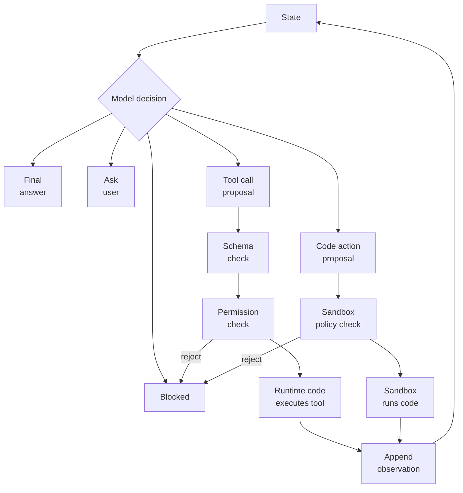
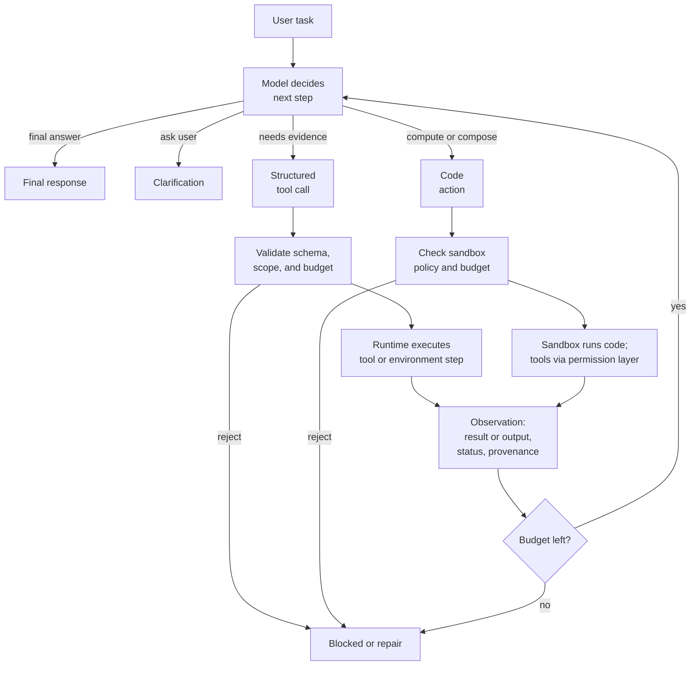
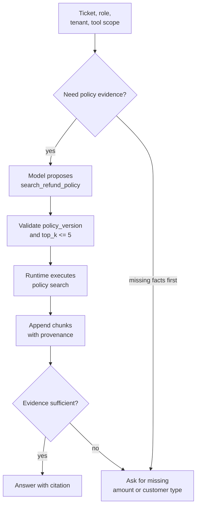
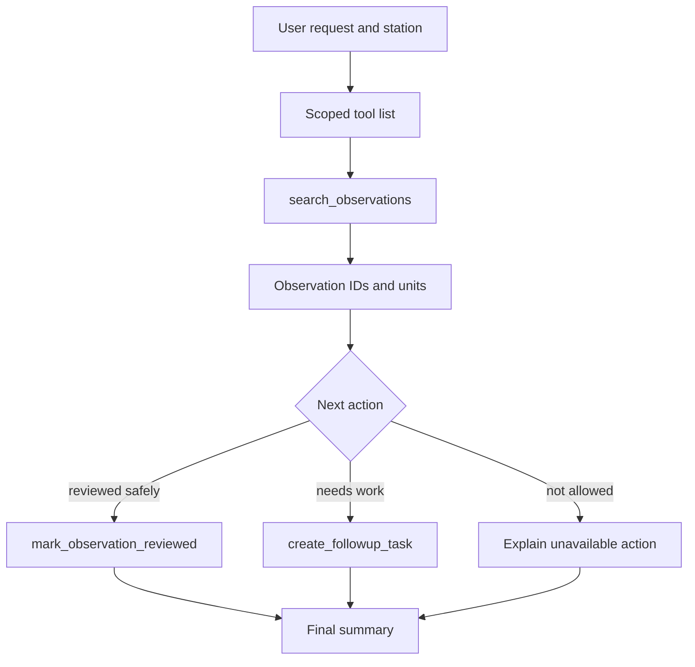

# Agent Loops

An agent loop repeatedly observes state, chooses an action, receives an observation, and decides whether to continue. It is the runtime skeleton under [agentic systems](agentic-systems.md), combining [planning](planning.md), [tool use](tool-use-and-function-calling.md), stopping rules, [guardrails](guardrails.md), and sometimes [memory](memory.md).

The loop is where a language model becomes a system component. The model may decide what to try next, but application code owns the state, available tools, validation, authorization, retries, and termination conditions. The model acts in two main ways: by proposing a typed tool call, or by writing code for the runtime to execute.

## The loop as a state machine

A useful loop is a state machine, not an unconstrained conversation:


```mermaid
flowchart TD
  State[State] --> Decision{Model decision}
  Decision --> Final["Final<br/>answer"]
  Decision --> Ask["Ask<br/>user"]
  Decision --> Blocked[Blocked]
  Decision --> ToolCall["Tool call<br/>proposal"]
  Decision --> CodeAction["Code action<br/>proposal"]
  ToolCall --> Schema["Schema<br/>check"]
  Schema --> Permission["Permission<br/>check"]
  Permission --> Execute["Runtime code<br/>executes tool"]
  Permission -->|reject| Blocked
  CodeAction --> Policy["Sandbox<br/>policy check"]
  Policy --> Sandbox["Sandbox<br/>runs code"]
  Policy -->|reject| Blocked
  Execute --> Observation["Append<br/>observation"]
  Sandbox --> Observation
  Observation --> State
```

The application owns the loop invariants: maximum steps, available tools, retry policy, side-effect confirmation, budget limits, and what counts as completion. The model proposes actions inside those constraints. A tool call is only a structured proposal; runtime code validates it, performs any retrieval, API call, or database query, and appends the result as an observation. A code action is also a proposal: the runtime decides where it runs and what it can reach. This separation matters because the same model output can be valid in one state and invalid in another.

## Loop phases

| Phase    | Runtime responsibility                                       | Model responsibility                          |
| -------- | ------------------------------------------------------------ | --------------------------------------------- |
| Observe  | assemble state, messages, tool results, and budget remaining | interpret the current state                   |
| Decide   | constrain allowed actions and parse the model decision       | answer, ask, call a tool, run code, or stop   |
| Validate | check schema, permissions, side effects, and sandbox policy  | none; invalid actions are rejected externally |
| Act      | execute the approved tool or transition                      | use the action result later                   |
| Record   | append observation, trace, cost, latency, and state hash     | condition on the observation                  |
| Stop     | enforce max steps, done condition, blocked state, or failure | produce final answer or explanation           |

This table is the reason "agent" should not mean "unbounded chat loop." A loop without an external state machine will eventually confuse observations, repeat failed actions, or execute a step in the wrong state.

## A loop contract

```json
{
  "run_id": "agent-1842",
  "max_steps": 6,
  "allowed_tools": ["search_docs", "create_ticket"],
  "stop_on": ["final_answer", "blocked", "policy_violation"],
  "retry": { "tool_timeout": 1, "invalid_schema": 0 },
  "requires_confirmation": ["send_email", "issue_refund"],
  "code_execution": {
    "enabled": true,
    "sandbox": "container",
    "network": "none",
    "timeout_s": 30,
    "max_output_chars": 2000,
    "credentials": "none"
  },
  "trace_fields": ["step", "state_hash", "tool_call", "observation_hash", "decision"]
}
```

This contract makes failures inspectable for [agent evaluation](agent-evaluation.md). A trace should show whether the agent was missing information, chose the wrong tool, received a bad observation, exceeded budget, or stopped too early.

## The loop in code

The loop below is an incident-triage assistant built on the OpenAI Responses API. It has five read-only tools:

- **`get_current_time`:** defined inline.
- **`query_metrics`:** a parameterized query against a metrics database through SQLAlchemy.
- **Deployment, log, and dependency lookups:** imported from an assumed `ops_tools` module that wraps your existing integrations.

Save it as `agent_loop.py`; the code-action and ReAct examples below build on it.

```python
from __future__ import annotations

import json
import os
from collections.abc import Callable
from datetime import datetime, timezone
from typing import Any

from openai import OpenAI
from sqlalchemy import create_engine, text

from ops_tools import get_service_status, search_deployments, search_logs  # your existing integrations

MODEL = os.environ.get("OPENAI_MODEL", "gpt-4o")  # Pin the model you evaluate.
metrics_db = create_engine(os.environ["METRICS_DB_URL"])  # Use a read-only database role.

INSTRUCTIONS = """You investigate production incidents for the on-call engineer.
Gather evidence with the tools before concluding. Check alternative causes, such as
dependency outages, before blaming a deployment. You cannot roll back or change anything.
If the evidence is insufficient, say so and set cause to "unknown"."""

# The final answer is structured, so runs can be graded without a model judge.
FINAL_ANSWER_FORMAT = {
    "type": "json_schema",
    "name": "incident_assessment",
    "schema": {
        "type": "object",
        "properties": {
            "cause": {"type": "string", "enum": ["deploy_regression", "dependency_outage", "unknown"]},
            "evidence": {"type": "array", "items": {"type": "string"}},
            "next_step": {"type": "string"},
        },
        "required": ["cause", "evidence", "next_step"],
        "additionalProperties": False,
    },
    "strict": True,
}


def get_current_time() -> str:
    return datetime.now(timezone.utc).isoformat(timespec="seconds")


def query_metrics(metric: str, since: str) -> list[dict[str, Any]]:
    with metrics_db.connect() as conn:
        rows = conn.execute(
            text("SELECT ts, value FROM metrics WHERE name = :name AND ts >= :since ORDER BY ts LIMIT 500"),
            {"name": metric, "since": since},
        )
        return [dict(row) for row in rows.mappings()]


TOOL_FUNCTIONS: dict[str, Callable[..., Any]] = {
    "get_current_time": get_current_time,
    "query_metrics": query_metrics,
    "search_deployments": search_deployments,
    "search_logs": search_logs,
    "get_service_status": get_service_status,
}


def tool(name: str, description: str, properties: dict[str, Any], require_reason: bool) -> dict[str, Any]:
    if require_reason:  # Experiment knob: a visible rationale before every call.
        properties = {**properties, "reason": {"type": "string", "description": "Why this is the next step."}}
    return {
        "type": "function",
        "name": name,
        "description": description,
        "parameters": {
            "type": "object",
            "properties": properties,
            "required": list(properties),
            "additionalProperties": False,
        },
        "strict": True,
    }


def build_tools(require_reason: bool = False) -> list[dict[str, Any]]:
    since = {"type": "string", "description": "ISO 8601 timestamp, UTC."}
    return [
        tool("get_current_time", "Current UTC time. Use it to build time windows.", {}, require_reason),
        tool("query_metrics", "Time series for one metric, e.g. checkout_5xx_rate.",
             {"metric": {"type": "string"}, "since": since}, require_reason),
        tool("search_deployments", "Deployments of a service since a time.",
             {"service": {"type": "string"}, "since": since}, require_reason),
        tool("search_logs", "Log lines of a service matching a query since a time.",
             {"service": {"type": "string"}, "query": {"type": "string"}, "since": since}, require_reason),
        tool("get_service_status", "Status of a dependency, e.g. payment_provider.",
             {"component": {"type": "string"}}, require_reason),
    ]


def execute(name: str, args: dict[str, Any], tool_functions: dict[str, Callable[..., Any]]) -> dict[str, Any]:
    if name not in tool_functions:
        return {"error": f"unknown tool: {name}"}
    try:
        fn = tool_functions[name]
        return {"ok": fn(**args)}
    except Exception as exc:  # Tool errors become observations the model can recover from.
        return {"error": f"{type(exc).__name__}: {exc}"}


def run_agent(
    task: str,
    tools: list[dict[str, Any]],
    tool_functions: dict[str, Callable[..., Any]],
    instructions: str = INSTRUCTIONS,
    max_steps: int = 8,
    max_observation_chars: int = 4_000,
) -> dict[str, Any]:
    client = OpenAI()
    request = {"model": MODEL, "instructions": instructions, "tools": tools, "text": {"format": FINAL_ANSWER_FORMAT}}
    response = client.responses.create(input=task, **request)
    trace: list[dict[str, Any]] = []
    seen_calls: set[str] = set()

    for step in range(1, max_steps + 1):
        calls = [item for item in response.output if item.type == "function_call"]
        if not calls:
            return {"answer": json.loads(response.output_text), "stop_reason": "final_answer", "trace": trace}

        outputs = []
        for call in calls:
            args = json.loads(call.arguments or "{}")
            reason = args.pop("reason", "")
            call_key = json.dumps([call.name, args], sort_keys=True)
            if call_key in seen_calls:
                result = {"error": "identical call already made; use its result or try something else"}
            else:
                result = execute(call.name, args, tool_functions)
            seen_calls.add(call_key)
            observation = json.dumps(result, default=str)[:max_observation_chars]
            trace.append({"step": step, "tool": call.name, "args": args, "reason": reason, "observation": observation})
            outputs.append({"type": "function_call_output", "call_id": call.call_id, "output": observation})

        response = client.responses.create(previous_response_id=response.id, input=outputs, **request)

    if not any(item.type == "function_call" for item in response.output):
        return {"answer": json.loads(response.output_text), "stop_reason": "final_answer", "trace": trace}
    return {"answer": None, "stop_reason": "max_steps", "trace": trace}


if __name__ == "__main__":
    result = run_agent(
        "Checkout errors spiked in the last hour. What is the most likely cause?",
        tools=build_tools(),
        tool_functions=TOOL_FUNCTIONS,
    )
    print(json.dumps(result["answer"], indent=2))
    for event in result["trace"]:
        print(event["step"], event["tool"], event["args"], event["observation"][:100])
```

Each part of the loop contract maps to code:

- **Tool contract:** tools are declared with strict schemas.
- **Validation and error handling:** unknown tools, tool exceptions, and repeated identical calls come back to the model as error observations it can recover from, not as crashes.
- **Observation size:** observations are truncated before they enter the context.
- **Budget and stopping:** `max_steps` bounds the loop, and every run ends with an explicit `stop_reason`.
- **Structured answer:** the final answer must match a JSON schema, so evaluation can check `cause` directly instead of asking a model to grade prose.
- **Conversation state:** `previous_response_id` chains the turns, so the model's reasoning between tool calls stays on the server rather than in your prompt.

The tools are read-only, and the database connection should use a read-only role. Rollback belongs to a separate, approved workflow.

## Code as an action

Instead of filling in the arguments of one declared tool, the model can write a program that the runtime executes. The program can call several tools, loop, filter, compute, and handle errors, all in one step. CodeAct (Wang et al., 2024) made this the whole action space. Across 17 models, executable Python actions beat JSON and text actions by up to 20% in success rate, because code composes tools and lets the model debug itself from error messages. In 2025, Anthropic reported two vendor-measured savings:

- **Calling tools from code** instead of one call per model turn cut average tokens on complex research tasks from 43,588 to 27,297 (37%).
- **Presenting MCP tools as code files** that the model reads on demand cut one workflow from 150,000 tokens to 2,000.

Both savings come from intermediate data staying in the execution environment instead of passing through the model's context.

|                 | Typed tool call                                 | Code action                                                                      |
| --------------- | ----------------------------------------------- | -------------------------------------------------------------------------------- |
| Model output    | tool name plus JSON arguments                   | a program                                                                        |
| Validation      | schema and per-tool permission check            | sandbox policy; the program itself cannot be fully validated upfront             |
| Permission unit | which tool, with which arguments                | what the sandbox can reach: files, network, credentials, tools                   |
| Observation     | tool result                                     | exit code, stdout, stderr, created files                                         |
| Best for        | side effects that need approval; simple lookups | computation, data transformation, composing many read-only calls                 |
| Main risk       | wrong tool or arguments                         | anything the sandbox can reach, including injected instructions turned into code |

Most production agents use both. Code handles analysis and read-only composition. Typed tools with confirmation handle refunds, emails, deletions, and deployments.

Code execution changes the loop in a few ways:

- **Validation moves from the call to the environment.** A schema check cannot tell what a program will do, so safety comes from where it runs:
  - an isolated container or microVM
  - no network, or an egress allow-list
  - read-only mounts except a scratch directory
  - no credentials in the environment
  - CPU, memory, time, and output limits
- **Tools inside the sandbox must go through the same permission layer.** If generated code can import a raw API client with write credentials, every tool-level permission check is bypassed. Expose tools to code as functions that call the same gated tool layer.
- **Observations need structure.** Return the exit code, truncated stdout, and the tail of stderr. Errors are useful observations: the model can fix its own code from a traceback. Count each execution against the step budget.
- **Output is data, not instructions.** Code that reads web pages, files, or tool results can print text that was written by an attacker. The model reads that output as an observation; it must not be treated as policy. See [prompt injection](prompt-injection.md).

The same assistant with code execution adds two tools to `agent_loop.py`:

- **`export_logs`** runs outside the sandbox, through the normal tool layer, and writes the logs to a workspace file.
- **`run_python`** executes model-written code in a Docker container with no network, a read-only file system, a non-root user, memory, CPU, and process limits, and a timeout. The workspace is mounted read-only.

Because the sandbox has no network, the only data the code can see is what a gated tool placed in the workspace.

```python
from __future__ import annotations

import json
import subprocess
import tempfile
import uuid
from pathlib import Path
from typing import Any

from ops_tools import search_logs
from agent_loop import INSTRUCTIONS, TOOL_FUNCTIONS, build_tools, run_agent, tool

SANDBOX_IMAGE = "python:3.12-slim"  # Or your own image with pandas preinstalled.

CODE_INSTRUCTIONS = """
For large data, call export_logs, then analyze the exported file with run_python.
Print only a compact summary from your code; raw data should not come back to you."""


def make_code_tools(workspace: Path) -> dict[str, Any]:
    def export_logs(service: str, since: str) -> dict[str, Any]:
        # Runs outside the sandbox, through the same permission-checked tool layer as other tools.
        lines = search_logs(service=service, query="", since=since)
        path = workspace / f"{service}_logs.jsonl"
        path.write_text("\n".join(json.dumps(line, default=str) for line in lines))
        return {"file": f"/work/{path.name}", "lines": len(lines)}

    def run_python(code: str) -> dict[str, Any]:
        (workspace / "action.py").write_text(code)
        name = f"code-action-{uuid.uuid4().hex[:8]}"
        command = [
            "docker", "run", "--rm", "--name", name,
            "--network", "none",  # no exfiltration, no calls around the tool layer
            "--read-only", "--tmpfs", "/tmp:size=64m",
            "--memory", "512m", "--cpus", "1", "--pids-limit", "64",
            "--user", "65534:65534",  # nobody
            "--volume", f"{workspace}:/work:ro", "--workdir", "/work",
            SANDBOX_IMAGE, "python", "action.py",
        ]  # fmt: skip
        try:
            proc = subprocess.run(command, capture_output=True, text=True, timeout=30)
        except subprocess.TimeoutExpired:
            subprocess.run(["docker", "kill", name], capture_output=True)
            return {"exit_code": None, "error": "timeout after 30s"}
        return {"exit_code": proc.returncode, "stdout": proc.stdout[:4_000], "stderr": proc.stderr[-2_000:]}

    return {"export_logs": export_logs, "run_python": run_python}


def code_tools() -> list[dict[str, Any]]:
    return [
        tool("export_logs", "Export a service's logs since a time to a file for run_python. Returns the path.",
             {"service": {"type": "string"}, "since": {"type": "string"}}, require_reason=False),
        tool("run_python", "Run a Python 3.12 script (standard library only) in a sandbox without network. "
             "Files from export_logs are in /work. Returns exit code, stdout, and stderr.",
             {"code": {"type": "string"}}, require_reason=False),
    ]


if __name__ == "__main__":
    with tempfile.TemporaryDirectory() as tmp:
        workspace = Path(tmp)
        workspace.chmod(0o755)  # readable by the sandbox user
        result = run_agent(
            "Checkout errors spiked in the last hour. What is the most likely cause?",
            tools=build_tools() + code_tools(),
            tool_functions={**TOOL_FUNCTIONS, **make_code_tools(workspace)},
            instructions=INSTRUCTIONS + CODE_INSTRUCTIONS,
        )
    print(json.dumps(result["answer"], indent=2))
    for event in result["trace"]:
        print(event["step"], event["tool"], event["observation"][:120])
```

A typical run: the model calls `get_current_time`, then `export_logs` for checkout. The tool returns only the file path and a line count, not thousands of log lines. The model then writes a short script that counts error types and timestamps in the file, and it receives a few lines of summary as the observation. If the script fails, the traceback comes back as `stderr`, and the model can fix the code in its next step. The sandbox image here has only the standard library; build your own image if the model should use pandas or other packages. For higher isolation than containers, run the same interface on gVisor or a microVM such as Firecracker.

## ReAct: reason, act, observe

ReAct (Yao et al.) is the canonical pattern for interleaving reasoning with actions. The original paper used trajectories of thought, action, and observation: the model reasons about what it needs, chooses an external action such as search or environment interaction, receives an observation, and updates the next step from that observation. This differs from one-shot planning because the plan can change after every tool result.

### What the paper showed

The experiments prompted PaLM-540B with a few hand-written trajectories and greedy decoding. Knowledge tasks used a three-action Wikipedia API (`search`, `lookup`, `finish`) with a thought before every action. Decision-making tasks let the model emit sparse thoughts only when it chose to. The paper reports these results:

| Benchmark | Metric                       | Act-only | CoT, no tools | ReAct | Best reported variant                  |
| --------- | ---------------------------- | -------- | ------------- | ----- | -------------------------------------- |
| HotpotQA  | exact match                  | 25.7     | 29.4          | 27.4  | 35.1 (ReAct → CoT-SC)                  |
| FEVER     | accuracy                     | 58.9     | 56.3          | 60.9  | 64.6 (CoT-SC → ReAct)                  |
| ALFWorld  | success %, best of 6 prompts | 45       | —             | 71    | imitation-learning baseline BUTLER: 37 |
| WebShop   | success %                    | 30.1     | —             | 40.0  | imitation + RL baseline: 28.7          |

Four findings matter for system design:

- **Reasoning helps acting.** Act-only was weaker on all four benchmarks. On ALFWorld, even the worst ReAct prompt (48%) beat the best Act-only prompt. Without thoughts, the model failed to decompose goals into subgoals and lost track of environment state.
- **Acting helps reasoning, but not uniformly.** On HotpotQA, ReAct scored below chain-of-thought and below plain prompting (28.7). A manual error analysis of 50 sampled trajectories per method and outcome explains the trade. Hallucination caused 56% of CoT failures and 0% of ReAct failures. ReAct failed instead through reasoning errors (47%, including repetitive loops of the same thought and action) and uninformative search results (23%) that it struggled to recover from.
- **Combinations beat either pure form.** The best variants back off from one method to the other. ReAct → CoT-SC switches to self-consistent chain-of-thought when ReAct produces no answer within 7 steps (HotpotQA) or 5 steps (FEVER). CoT-SC → ReAct switches to tool use when fewer than half of the sampled CoT answers agree.
- **ReAct trajectories are good fine-tuning data.** After fine-tuning on 3,000 correct ReAct trajectories, PaLM-8B beat every PaLM-62B prompting method, and PaLM-62B beat every 540B prompting method. Fine-tuning on standard or CoT traces helped much less.

All prompting results stayed far below supervised state of the art (67.5 exact match on HotpotQA). The contribution was the pattern and its inspectable trajectories, not leaderboard accuracy.

### How far the evidence transfers

Treat the paper's numbers as evidence for the pattern, not as a prediction for your model. The experiments predate native function calling and trained reasoning models: thoughts were plain-text completions shaped by few-shot exemplars. Modern models are post-trained on agentic trajectories and often reason in hidden tokens, so whether an extra visible rationale still helps is an empirical question for each model and task.

A later sensitivity analysis on ALFWorld (Verma et al., 2024), using GPT-3.5, GPT-4, and Claude 3 Opus, perturbed ReAct prompts in controlled ways. Performance barely depended on the interleaving itself or on the content of the reasoning traces. It depended mainly on how similar the few-shot exemplars were to the query. This does not refute tool-grounded loops, but it does mean gains from "adding reasoning" should be attributed carefully. Ablate the content of the reasoning, not just its presence, and control for exemplar similarity.

Since 2025, the pattern has increasingly been trained into models rather than prompted. Search-R1 (Jin et al., 2025) and related work use reinforcement learning to train a model to decide when to search and how to use the results inside its reasoning, with no few-shot exemplars at all. A survey of agentic reinforcement learning (Zhang et al., 2025) describes planning, tool use, and self-checking learned this way. Frontier models now reason between tool calls natively. This reduces the importance of the literal `Thought:` prompt format, but it does not settle whether visible rationales, hidden reasoning tokens, exemplar similarity, or a structured `reason` field help on a given task. Treat those as empirical knobs. The runtime concerns in the rest of this section still belong in application code: budgets, validation, repeated-call detection, and evaluation.

### ReAct in production loops

The reasoning step still matters as a design concept. The paper's act-only ablation lost the working notes that decomposed the task, tracked progress, and handled exceptions. In modern function-calling systems, those notes may be hidden model reasoning, a short visible rationale field, or a private decision summary rather than a literal `Thought:` line. A bare model -> tool -> model loop is ReAct-style only when the model uses intermediate reasoning to choose and revise actions.

Production implementations are more constrained than the paper's prompt format. The model does not get to execute actions directly, and the system should not show hidden model reasoning tokens to end users. The action can be a typed tool call or a [code action](#code-as-an-action). A practical ReAct-style loop looks like this:


```mermaid
flowchart TD
  User[User task] --> Model["Model decides<br/>next step"]
  Model -->|final answer| Final[Final response]
  Model -->|ask user| Ask[Clarification]
  Model -->|needs evidence| ToolCall["Structured<br/>tool call"]
  Model -->|compute or compose| CodeAction["Code<br/>action"]
  ToolCall --> Validate["Validate schema,<br/>scope, and budget"]
  CodeAction --> Policy["Check sandbox<br/>policy and budget"]
  Validate -->|reject| Blocked[Blocked or repair]
  Policy -->|reject| Blocked
  Validate --> Execute["Runtime executes<br/>tool or environment step"]
  Policy --> Sandbox["Sandbox runs code;<br/>tools via permission layer"]
  Execute --> Observation["Observation:<br/>result or output,<br/>status, provenance"]
  Sandbox --> Observation
  Observation --> Budget{Budget left?}
  Budget -->|yes| Model
  Budget -->|no| Blocked
```

For an incident-triage assistant, a ReAct-style trace might be:

| step | decision summary                                    | runtime action                                                                      | observation                                                                                                         |
| ---- | --------------------------------------------------- | ----------------------------------------------------------------------------------- | ------------------------------------------------------------------------------------------------------------------- |
| 1    | Need current symptoms before guessing a cause.      | `query_metrics(metric="checkout_5xx_rate", since="09:30")`                          | 5xx rate rose from 0.2% to 4.8% after 10:05.                                                                        |
| 2    | Need deployment context for the same window.        | `search_deployments(service="checkout", since="10:00")`                             | Version `checkout-api 2026.09.24.3` deployed at 10:03.                                                              |
| 3    | Need evidence for the suspected failing path.       | `search_logs(service="checkout", query="payment_authorize timeout", since="10:03")` | New timeouts cluster after the deploy; older window is clean.                                                       |
| 4    | Evidence is suggestive but not a proven root cause. | `get_service_status(component="payment_provider")`                                  | Provider status is normal; failures are concentrated in the new checkout version.                                   |
| 5    | Evidence is enough for a bounded recommendation.    | final answer                                                                        | Likely checkout regression after deployment; ask for rollback approval or inspect the payment authorization change. |

The table deliberately stops short of executing a rollback. The answering loop may gather evidence and recommend a next step; a separate action workflow would expose a rollback tool only after approval. Step 4 shows why observations should revise the path: if the payment provider had been degraded since 10:04, the deploy would be a coincidence and the recommendation should change. The experiment below uses both kinds of incident as test cases.

Decision summaries are useful for debugging, but they are not faithful explanations of hidden model internals. [Agent evaluation](agent-evaluation.md) should rely first on tool calls, arguments, observations, validation decisions, stop reasons, and outcomes. Use summaries as inspectable metadata, not as proof that the model actually reasoned that way.

ReAct sits between several related patterns:

| Pattern                                           | Difference from ReAct                                                                                                                                                                                                                                            |
| ------------------------------------------------- | ---------------------------------------------------------------------------------------------------------------------------------------------------------------------------------------------------------------------------------------------------------------- |
| No tools                                          | The model answers from prompt context and model weights only.                                                                                                                                                                                                    |
| Act-only                                          | The model calls tools without an explicit reasoning step; this was weaker in the ReAct paper.                                                                                                                                                                    |
| Chain-of-thought only                             | The model reasons but does not refresh state from external observations.                                                                                                                                                                                         |
| [Plan-and-execute](planning.md)                   | A planner writes a route first; an executor follows it. ReAct replans after each observation.                                                                                                                                                                    |
| ReWOO                                             | A planner writes all tool calls up front with placeholder variables, workers fill them, and a solver combines the evidence. It reported about 5x token efficiency and about 4% accuracy improvement on HotpotQA, but it cannot adapt the plan to an observation. |
| [Reflection](reflection-and-reviewer-patterns.md) | A reviewer critiques or repairs a draft after generation; ReAct decides the next action during execution.                                                                                                                                                        |

Today, function-calling APIs and agent frameworks are the productized form of this pattern: the model proposes a tool call, runtime code executes it, the observation returns, and the model continues.

### Running a ReAct experiment

A ReAct comparison is only informative if the policy is the only thing that changes. Use this protocol:

1. **Freeze the environment.** Record tool responses once and replay them, so every policy sees identical observations. See [determinism and reproducibility](determinism-and-reproducibility.md).
2. **Hold everything else fixed.** Keep the model, tool set, tool descriptions, `max_steps`, and observation formatting the same, and vary one knob at a time.
3. **Run the baselines.** Compare no tools, act-only (the same loop with no rationale field and minimal reasoning effort), plan-and-execute, ReAct-style, and optionally a CoT-SC backoff.
4. **Ablate the reasoning content.** Compare a required `reason` argument, no rationale, and a placeholder rationale with the same length. If the placeholder matches the real rationale, the gain comes from somewhere else.
5. **Repeat runs.** Sampling makes single runs anecdotal. Run each task k times and report success with confidence intervals, plus $pass^k$, the rate of solving a task in all k trials, introduced by τ-bench. See [evaluation harnesses](evaluation-harnesses.md) for paired comparisons.

Knobs worth varying one at a time:

- Require a short `reason` field in tool-call arguments, or keep reasoning hidden and log only decision summaries.
- Change the reasoning effort or thinking budget on models that expose one.
- Change `max_steps`, retry budgets, and whether repeated identical calls are blocked.
- Change how observations are truncated, summarized, or cited back to the model.
- Compare serial tool use with safe parallel tool calls when dependencies permit it.
- Rewrite tool names and descriptions to test whether routing improves or degrades.

Track task success, steps to solution, repeated-call rate, invalid tool-call rate, premature-final-answer rate, stop-reason distribution, latency, cost, and tokens per task. For external comparability, HotpotQA and FEVER with a Wikipedia tool reproduce the paper's knowledge setting, ALFWorld and WebShop cover environment interaction, and τ²-bench (2025) adds a simulated user who can also act on the shared environment, plus domain policies. Prefer τ²-bench over the original τ-bench, which the Agentic Benchmark Checklist found could count empty responses as successes. For deployment decisions, a frozen set of your own traces usually matters more.

The experiment below implements this protocol on top of `agent_loop.py`. It compares the loop with and without a required `reason` argument on every tool call:

- **Frozen environment:** tool results are recorded once against the live systems, together with a fixed clock, and replayed in every experiment run.
- **Two test cases:** the incidents have the same symptoms and the same deploy but different root causes.
- **Repeats:** each case runs five times, and the output reports success rate, $pass^k$, tool calls per run, and calls that left the recording.

```python
from __future__ import annotations

import json
from collections.abc import Callable
from pathlib import Path
from typing import Any

from agent_loop import TOOL_FUNCTIONS, build_tools, run_agent

CASES = [
    {
        "id": "2026-09-24-checkout",
        "now": "2026-09-24T10:30:00Z",
        "task": "Checkout errors spiked in the last hour. What is the most likely cause?",
        "expected_cause": "deploy_regression",
    },
    {
        "id": "2026-08-02-checkout",
        "now": "2026-08-02T16:45:00Z",
        "task": "Checkout errors spiked in the last hour. What is the most likely cause?",
        "expected_cause": "dependency_outage",
    },
]
ARMS = {"no_reason": build_tools(require_reason=False), "with_reason": build_tools(require_reason=True)}


def frozen_tools(
    tool_functions: dict[str, Callable[..., Any]], path: Path, mode: str
) -> dict[str, Callable[..., Any]]:
    """record: call the live tools and save every result. replay: serve saved results only."""
    store = json.loads(path.read_text()) if path.exists() else {}

    def wrap(name: str, fn: Callable[..., Any]) -> Callable[..., Any]:
        def call(**args: Any) -> Any:
            key = json.dumps([name, args], sort_keys=True)
            if mode == "replay":
                if key not in store:
                    raise LookupError("call not in recording: the run left the frozen environment")
                return store[key]
            store[key] = json.loads(json.dumps(fn(**args), default=str))
            path.parent.mkdir(parents=True, exist_ok=True)
            path.write_text(json.dumps(store, indent=2))
            return store[key]

        return call

    return {name: wrap(name, fn) for name, fn in tool_functions.items()}


def tools_for(case: dict[str, Any], mode: str) -> dict[str, Callable[..., Any]]:
    functions = {**TOOL_FUNCTIONS, "get_current_time": lambda: case["now"]}  # Freeze the clock too.
    return frozen_tools(functions, Path("recordings") / f"{case['id']}.json", mode)


def record(runs_per_case: int = 3) -> None:
    # Run against live systems while the incident data is still available; several runs
    # cover more of the paths a policy might take.
    for case in CASES:
        for _ in range(runs_per_case):
            run_agent(case["task"], ARMS["with_reason"], tools_for(case, mode="record"))


def run_experiment(repeats: int = 5) -> None:
    for arm, tools in ARMS.items():
        runs = []
        for case in CASES:
            for _ in range(repeats):
                result = run_agent(case["task"], tools, tools_for(case, mode="replay"))
                runs.append(
                    {
                        "case": case["id"],
                        "correct": bool(result["answer"]) and result["answer"]["cause"] == case["expected_cause"],
                        "tool_calls": len(result["trace"]),
                        "off_recording": sum("LookupError" in e["observation"] for e in result["trace"]),
                        "stop": result["stop_reason"],
                    }
                )
        success = sum(r["correct"] for r in runs) / len(runs)
        pass_hat_k = sum(all(r["correct"] for r in runs if r["case"] == c["id"]) for c in CASES) / len(CASES)
        calls = sum(r["tool_calls"] for r in runs) / len(runs)
        off = sum(r["off_recording"] for r in runs)
        print(f"{arm:12} success={success:.2f} pass^{repeats}={pass_hat_k:.2f} calls={calls:.1f} off_recording={off}")


if __name__ == "__main__":
    run_experiment()
```

Two details matter when you run it:

- **Replay only covers recorded paths.** If a policy makes a call that no recorded run made, it gets a `LookupError` observation, and `off_recording` counts it. A high count means the comparison is no longer like for like. Record more runs, or record with each arm.
- **Two cases are a smoke test, not evidence.** Use dozens of cases, add a no-tools arm and a plan-and-execute arm, and compare arms on the same cases with the paired statistics in [evaluation harnesses](evaluation-harnesses.md).

For a placeholder-rationale ablation, add a third arm that sends a fixed filler string in place of the model's `reason`.

### ReAct failure modes and costs

- **Repeated identical actions:** detect with a hash of tool name plus canonical arguments, then stop or force a different plan. This was the most common ReAct-specific error in the paper.
- **Weak observations:** empty or irrelevant retrieval derails the path, and the model may build a plausible but wrong chain on it. Return explicit "no results" observations and make reformulating the query a visible option.
- **Premature final answer:** for high-risk tasks, require evidence predicates, such as "dependency status checked", before `final_answer` is accepted.
- **Non-termination:** without a step budget, the loop can keep acting instead of answering. Pair `max_steps` with a backoff path (answer without tools, ask the user, or escalate) instead of a silent failure.
- **Context and cost growth:** each step re-sends the growing trace, so total input tokens grow roughly quadratically with the number of steps. Summarize or window observations, reuse cached prefixes through [prefix caching](kv-cache.md), and see [cost and latency optimization](cost-and-latency-optimization.md). ReWOO's plan-first design exists mainly to cut this cost.

## Realistic support loop

For a support assistant answering a refund question, a bounded loop might run:


```mermaid
flowchart TD
  Ticket["Ticket, role,<br/>tenant, tool scope"] --> Decide{Need policy evidence?}
  Decide -->|yes| ToolCall["Model proposes<br/>search_refund_policy"]
  ToolCall --> Validate["Validate policy_version<br/>and top_k <= 5"]
  Validate --> Search["Runtime executes<br/>policy search"]
  Search --> Evidence["Append chunks<br/>with provenance"]
  Evidence --> Covered{Evidence sufficient?}
  Covered -->|yes| Answer["Answer with citation"]
  Covered -->|no| Clarify["Ask for missing<br/>amount or customer type"]
  Decide -->|missing facts first| Clarify
```

1. Observe the ticket, user role, current tenant, and available read-only policy tools.
2. Decide whether the answer needs retrieval.
3. Validate a `search_refund_policy` call with `policy_version` and `top_k <= 5`.
4. Execute the search and append chunk IDs with provenance.
5. Decide whether the retrieved policy answers the question.
6. Answer with citation or ask for the missing amount/customer type.

The loop does not expose `issue_refund` until a different workflow confirms eligibility and user intent. That separation keeps an answer-seeking loop from turning into an action-taking loop.

## Realistic field-monitoring loop

For a field-monitoring assistant, the loop might be:


```mermaid
flowchart TD
  Request[User request and station] --> Scope[Scoped tool list]
  Scope --> Search[search_observations]
  Search --> Observe[Observation IDs and units]
  Observe --> Decide{Next action}
  Decide -->|reviewed safely| Mark[mark_observation_reviewed]
  Decide -->|needs work| Task[create_followup_task]
  Decide -->|not allowed| Stop[Explain unavailable action]
  Mark --> Summary[Final summary]
  Task --> Summary
  Stop --> Summary
```

1. Observe the user request, station identity, and the scoped tool list.
2. Decide to call `search_observations` for unreviewed sensor anomalies.
3. Validate the station filter and execute the search.
4. Observe observation IDs, timestamps, units, and review state.
5. Decide whether to call `mark_observation_reviewed`, `create_followup_task`, or ask for clarification.
6. Stop with a final summary of actions and skipped actions.

A request such as "delete the suspicious pH reading" should take a different path depending on state. If `delete_observation` is not in `allowed_tools`, the loop should stop or explain that deletion is unavailable. If the tool is available, the loop should require confirmation or another deterministic gate before the destructive call. The important lesson is that the loop runs over an explicit action set; it should not improvise capabilities from natural language.

## Implementation choices

Simple loops can be a few explicit `while` steps in application code. Framework loops are useful when tool calling, tracing, middleware, and retries follow common patterns. Graph-based loops, such as [LangGraph](langgraph.md), are better when there are durable checkpoints, human interrupts, deterministic branches, or long-running side effects. The more expensive the action, the more the loop should look like a state machine rather than a conversation.

## Caveats

Loops fail by spinning, compounding bad observations, treating tool output as trusted instructions, or hiding uncertainty behind more actions. Code actions add their own failure: a sandbox that can reach more than the task needs. Tool observations are data, not policy. Long loops should have replayable traces and deterministic gates around side effects. A loop that cannot explain why it stopped is not production-ready.

## References

- [OpenAI API documentation: Agents SDK](https://platform.openai.com/docs/guides/agents)
- [OpenAI API documentation: Using tools](https://platform.openai.com/docs/guides/tools)
- [Yao et al., 2022/2023, ReAct: Synergizing Reasoning and Acting in Language Models](https://arxiv.org/abs/2210.03629)
- [Wang et al., 2024, Executable Code Actions Elicit Better LLM Agents](https://arxiv.org/abs/2402.01030)
- [Anthropic Engineering, 2025, Code execution with MCP: Building more efficient agents](https://www.anthropic.com/engineering/code-execution-with-mcp)
- [Anthropic Engineering, 2025, Introducing advanced tool use on the Claude Developer Platform](https://www.anthropic.com/engineering/advanced-tool-use)
- [Google Research blog: ReAct](https://research.google/blog/react-synergizing-reasoning-and-acting-in-language-models/)
- [Xu et al., 2023, ReWOO: Decoupling Reasoning from Observations for Efficient Augmented Language Models](https://arxiv.org/abs/2305.18323)
- [Verma, Bhambri, and Kambhampati, 2024, On the Brittle Foundations of ReAct Prompting for Agentic Large Language Models](https://arxiv.org/abs/2405.13966)
- [Yao et al., 2024, τ-bench: A Benchmark for Tool-Agent-User Interaction in Real-World Domains](https://arxiv.org/abs/2406.12045)
- [Barres et al., 2025, τ²-Bench: Evaluating Conversational Agents in a Dual-Control Environment](https://arxiv.org/abs/2506.07982)
- [Zhu et al., 2025, Establishing Best Practices for Building Rigorous Agentic Benchmarks](https://arxiv.org/abs/2507.02825)
- [Jin et al., 2025, Search-R1: Training LLMs to Reason and Leverage Search Engines with Reinforcement Learning](https://arxiv.org/abs/2503.09516)
- [Zhang et al., 2025, The Landscape of Agentic Reinforcement Learning for LLMs: A Survey](https://arxiv.org/abs/2509.02547)

> [!nav]
> **Section** — [Generative AI and Agentic Systems](index.md)
>
> [← Tool Routing](tool-routing.md) [Harnesses →](harnesses.md)
