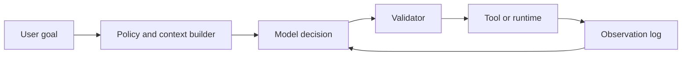

# Agentic Systems

An agentic system gives a model conditional control over a workflow. The model may choose when to search, call tools, ask for clarification, or stop, while application code enforces [tool routing](tool-routing.md), [guardrails](guardrails.md), and traceable [agent evaluation](agent-evaluation.md).

## Mechanism

The core design split is model judgement versus deterministic control. A practical architecture is:



[Planning](planning.md) can be a private scratch step, a visible task graph, or no separate step at all. The important contract is that actions are typed and observations are appended as data, not silently merged into hidden state.

An agent loop should make each transition auditable:

| Step           | Model responsibility                                         | Deterministic responsibility                                       |
| -------------- | ------------------------------------------------------------ | ------------------------------------------------------------------ |
| Interpret goal | Propose next intent or missing information.                  | Attach policy, identity, budget, and relevant context.             |
| Choose action  | Select a tool call, ask a question, or stop.                 | Validate schema, permission, rate limit, and cost.                 |
| Observe result | Incorporate the returned observation into the next decision. | Log the call, redact sensitive data, and preserve source metadata. |
| Terminate      | Produce final answer or completion state.                    | Check success criteria and escalation rules.                       |

## Concrete artifact

```json
{
  "decision": {
    "type": "tool_call",
    "name": "search_docs",
    "arguments": { "query": "refund approval limit" }
  },
  "state": { "step": 2, "remaining_steps": 4 }
}
```

The action is only a proposal until the orchestrator validates name, schema, user permission, and budget. This separation keeps autonomy useful without letting the model silently bypass product controls.

## Caveats

Agentic systems are inappropriate when a fixed pipeline is enough. Added autonomy increases test surface: tool misuse, prompt injection, stale memory, and runaway cost.

## References

- [OpenAI API documentation: Agents SDK](https://platform.openai.com/docs/guides/agents)
- [OpenAI API documentation: Function calling](https://platform.openai.com/docs/guides/function-calling)
- [OWASP Top 10 for LLM Applications](https://owasp.org/www-project-top-10-for-large-language-model-applications/)
