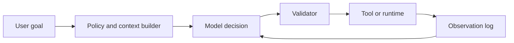

# Agentic Systems

An agentic system gives a model conditional control over a workflow. The model may choose when to search, call tools, ask for clarification, or stop, while application code enforces [tool routing](tool-routing.md), [guardrails](guardrails.md), and traceable [agent evaluation](agent-evaluation.md). The useful autonomy is bounded: the model can choose among allowed actions, not redefine the workflow's authority.

## Workflows and agents

A widely used distinction (Anthropic, 2024):

- **Workflows** orchestrate models and tools through predefined code paths.
- **Agents** let the model direct its own process and tool use.

Most production systems mix both. Five workflow patterns recur:

- **Prompt chaining:** fixed sequential steps.
- **Routing:** classify the request, then dispatch it.
- **Parallelization:** independent calls or votes.
- **Orchestrator-workers:** a lead model delegates subtasks.
- **Evaluator-optimizer:** a draft is critiqued and revised.

The same guidance still holds: start with the simplest design, measure it, and add autonomy only when simpler designs fall short.

## Pattern catalog

| Pattern                                           | Use when                                   | Cost                                                        | Typical failure                                     | Model now handles                      | Harness must still own                              |
| ------------------------------------------------- | ------------------------------------------ | ----------------------------------------------------------- | --------------------------------------------------- | -------------------------------------- | --------------------------------------------------- |
| [Tool routing](tool-routing.md)                   | Requests need external data or actions     | Tool definitions in every request; tool search reduces this | Wrong tool from a large catalog; unauthorized route | Choosing among visible tools           | Which tools exist, authorization, confirmation      |
| [Agent loop and ReAct](agent-loops.md)            | The next step depends on observations      | One model call per step; growing context                    | Repeated actions, premature answers                 | Interleaving reasoning with tool calls | Budgets, stop rules, validation                     |
| [Planning](planning.md)                           | Dependencies, approvals, or resumable work | Planning calls plus replans                                 | Greedy commitments on long horizons                 | Implicit planning, parallel calls      | Plan validation, forbidden actions, done predicates |
| [Memory](memory.md)                               | State must survive the request or session  | Extraction and retrieval per turn                           | Stale or leaked memories                            | Deciding what seems worth remembering  | Scope, provenance, deletion                         |
| [Reflection](reflection-and-reviewer-patterns.md) | An independent signal can check the draft  | An extra review call per iteration                          | Rubber-stamping; damaging correct drafts            | Within-answer self-checking            | External evidence, iteration caps, release gates    |
| [Multi-agent](multi-agent-systems.md)             | Parallel breadth or context isolation      | About 15× chat tokens in one production system              | Lossy handoffs; errors that spread between agents   | Delegation and summarization           | Budgets, handoff schemas, verification              |
| [Harness](harnesses.md)                           | Always, once a model acts                  | Engineering and maintenance                                 | Context rot; unverified completion                  | Context summarization                  | Context policy, durable state, permissions          |

## Model judgement versus deterministic control

The core design split is model judgement versus deterministic control. A practical architecture is:


```mermaid
flowchart LR
  Goal[User goal] --> Builder[Policy and context builder]
  Builder --> Decision[Model decision]
  Decision --> Validator[Validator]
  Validator --> Runtime[Tool or runtime]
  Runtime --> Log[Observation log]
  Log --> Decision
```

[Planning](planning.md) can be a private scratch step, a visible task graph, or no separate step at all. The important contract is that actions are typed and observations are appended as data, not silently merged into hidden state.

An agent loop should make each transition auditable:

| Step           | Model responsibility                                         | Deterministic responsibility                                       |
| -------------- | ------------------------------------------------------------ | ------------------------------------------------------------------ |
| Interpret goal | Propose next intent or missing information.                  | Attach policy, identity, budget, and relevant context.             |
| Choose action  | Select a tool call, ask a question, or stop.                 | Validate schema, permission, rate limit, and cost.                 |
| Observe result | Incorporate the returned observation into the next decision. | Log the call, redact sensitive data, and preserve source metadata. |
| Terminate      | Produce final answer or completion state.                    | Check success criteria and escalation rules.                       |

## A validated decision

```json
{
  "decision": {
    "type": "tool_call",
    "name": "search_docs",
    "arguments": { "query": "refund approval limit" }
  },
  "state": { "step": 2, "remaining_steps": 4 }
}
```

The action is only a proposal until the orchestrator validates name, schema, user permission, and budget. This separation keeps autonomy useful without letting the model silently bypass product controls.

## When an agent is justified

Use an agentic system when the next step depends on observations that are not known upfront: retrieval may fail, tools may return conflicting state, the user may need a clarification, or a task may require several conditional actions. Use a fixed pipeline when the path is known and stable. A deterministic RAG pipeline is usually better than an agent for "answer from these documents"; an agent is more justified for "investigate why this deployment failed and propose a rollback plan."

Budget for the difference. In Anthropic's production research system, a single agent used about 4× the tokens of a chat interaction, and a multi-agent system about 15×. Controlled studies (see [multi-agent systems](multi-agent-systems.md)) show that extra agents help only when the task structure fits. The gain has to justify the cost.

## What has changed since 2023

Three developments shape how these patterns should be built in 2026:

1. **Patterns are becoming model capabilities.** Models are now trained with reinforcement learning to interleave reasoning with tool calls, decide when to search, and check their own work (Search-R1; Zhang et al.'s survey of agentic RL, 2025). Prompt-level loops that once added these behaviors add less. The harness responsibilities do not shrink: budgets, permissions, verification, and evidence.
2. **Horizons are getting longer.** METR measures agent capability as the length of task, in human expert time, that an agent completes with 50% reliability. That horizon doubled about every seven months from 2019 to early 2025, and the trend may have accelerated since 2024. The measured tasks are mostly software, ML, and security, and horizons at 80% reliability are shorter. Longer autonomous runs make context management, durable state, and checkpoints more important, not less.
3. **Evaluation must control for compute and scaffolding.** Many reported gains from multiple agents, reflection, and more reasoning shrink once token budgets are matched. Agent scores depend on the harness as well as the model. Compare every added pattern against a simpler design with the same budget, using an [evaluation harness](evaluation-harnesses.md).

## Evaluation and improvement

Agentic systems should be evaluated by traces: task success, route choice, tool arguments, forbidden actions, retries, latency, and cost. Those traces should feed a [pipeline improvement methodology](pipeline-improvement-methodology.md): classify the earliest failing stage, fix the smallest responsible layer, then rerun component and end-to-end checks. They also need operational limits such as max steps, max tool calls, tool timeouts, budget ceilings, and explicit blocked states. Without those limits, the system can spend tokens and tool calls hiding uncertainty rather than resolving it.

## Caveats

Agentic systems are inappropriate when a fixed pipeline is enough. Added autonomy increases test surface: tool misuse, prompt injection, stale memory, hidden retries, and runaway cost. The more autonomy a system has, the more its state and permissions must be explicit.

## References

- [OpenAI API documentation: Agents SDK](https://platform.openai.com/docs/guides/agents)
- [OpenAI API documentation: Function calling](https://platform.openai.com/docs/guides/function-calling)
- [Anthropic Engineering, 2024, Building effective agents](https://www.anthropic.com/engineering/building-effective-agents)
- [Anthropic Engineering, 2025, How we built our multi-agent research system](https://www.anthropic.com/engineering/multi-agent-research-system)
- [Kwa et al., 2025, Measuring AI Ability to Complete Long Software Tasks](https://arxiv.org/abs/2503.14499)
- [METR: Task-completion time horizons of frontier AI models](https://metr.org/time-horizons/)
- [Jin et al., 2025, Search-R1: Training LLMs to Reason and Leverage Search Engines with Reinforcement Learning](https://arxiv.org/abs/2503.09516)
- [Zhang et al., 2025, The Landscape of Agentic Reinforcement Learning for LLMs: A Survey](https://arxiv.org/abs/2509.02547)
- [Kim et al., 2025, Towards a Science of Scaling Agent Systems](https://arxiv.org/abs/2512.08296)
- [OWASP Top 10 for LLM Applications](https://owasp.org/www-project-top-10-for-large-language-model-applications/)

> [!nav]
> **Section** — [Generative AI and Agentic Systems](index.md)
>
> [← Harnesses](harnesses.md) [Planning →](planning.md)
