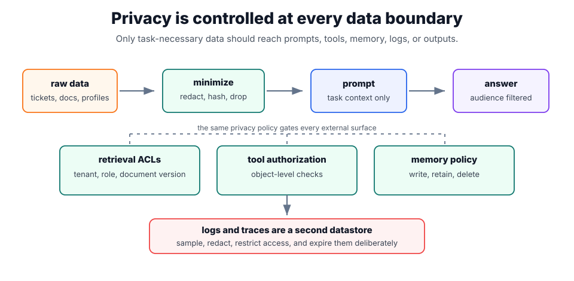

# Data Privacy

Data privacy in generative systems is a boundary problem. Sensitive data can leak through prompts, [memory](memory.md), retrieval indexes, [tool use](tool-use-and-function-calling.md), logs, citations, model outputs, and evaluation traces. [PII protection](pii-protection.md) is one control, not the whole privacy program.

The practical question is not "can the model be trusted?" but "which data is allowed to cross each boundary, for which user, for which purpose, and for how long?"

## The privacy contract

A privacy contract should define data classes, allowed processors, retention windows, access filters, redaction rules, and logging policy before model calls. Retrieval should apply permissions before ranking. Tools should fetch private records only after user authorization. Prompt and response logs should store the minimum needed for debugging and evaluation.

[Prompt injection](prompt-injection.md) matters because retrieved text can ask the model to reveal hidden data. Privacy controls should therefore be enforced outside the model: access checks, field-level filtering, redaction, audit logs, and deletion workflows.



The top row shows data moving toward the model: raw sources are minimized before prompt construction, and the final answer is filtered for its audience. The dashed bracket is not a data path; it marks policy gates that should be enforced wherever the system touches external surfaces such as retrieval, tools, and memory. The bottom box is separated deliberately because logs and traces are persistent data stores, not harmless debugging exhaust.

## Data surfaces

Privacy reviews should enumerate every surface where data can enter, persist, or leave the system.

| Surface               | Example risk                                                      | Control                                                                               |
| --------------------- | ----------------------------------------------------------------- | ------------------------------------------------------------------------------------- |
| Prompt construction   | Full support ticket includes phone numbers and card-like strings. | redact or mask before [context construction](context-construction.md).                |
| Retrieval index       | Employee-only policy chunks are embedded into a shared index.     | metadata ACLs before retrieval and before reranking.                                  |
| Tool calls            | Model asks for another tenant's order details.                    | server-side authorization on every [tool use](tool-use-and-function-calling.md) call. |
| Memory                | Assistant stores a medical note as durable preference memory.     | classify memory writes and require a retention policy.                                |
| Logs and eval traces  | Debug logs capture raw prompts with secrets.                      | redaction, access controls, retention windows, and sampled logging.                   |
| Citations and outputs | Answer quotes private content into a public channel.              | audience-aware output filters and [citations](citations.md) checks.                   |

## A field-level privacy policy

```yaml
fields:
  employee_salary:
    send_to_model: false
    retrieval_filter: manager_only
  support_ticket_text:
    send_to_model: true
    redact: [email, phone, card]
  account_id:
    send_to_model: true
    transform: stable_hash
logs:
  store_raw_prompts: false
  retention_days: 30
  access: security_and_eval_team
```

This policy is enforceable outside the model and testable with fixtures. A model instruction that says "do not reveal salaries" is not enough if salary fields are still retrieved and placed in context.

## Realistic workflow

Consider an internal HR assistant answering: "What is the parental-leave policy for my location?" The user profile contains country, role, manager, compensation band, home address, and employee ID. The prompt only needs country and employment type. The retrieval system should filter to public HR policy chunks for that employee's region. It should not retrieve salary records, manager notes, or medical accommodations. The answer may cite the policy document, but logs should store a redacted trace such as `country=DE`, `policy=parental_leave_2026`, and a hash of the request rather than the full employee profile.

That workflow shows the difference between privacy and convenience. The model could answer better with every field, but the system should provide only what is necessary for the task.

## Evaluation

Test privacy controls with fixtures that contain realistic sensitive fields, not only obvious examples such as `alice@example.com`. Include names, addresses, account numbers, employee IDs, free-text secrets, prompt-injection attempts, and retrieved documents that mix public and private paragraphs. A test should fail if private fields enter the prompt, if unauthorized chunks are retrieved, if tool calls cross tenant boundaries, or if logs retain raw sensitive text beyond policy.

## Caveats

Summaries can still contain personal data. Synthetic examples copied from production tickets are production data unless de-identified. Redaction can break downstream retrieval or citation if identifiers are removed inconsistently, so privacy controls should be tested with realistic workflows. Privacy also conflicts with observability: traces must be useful enough to debug, but not so rich that they become a second sensitive datastore.

## References

- [OpenAI platform documentation: Data controls](https://platform.openai.com/docs/guides/your-data)
- [NIST AI Risk Management Framework 1.0](https://nvlpubs.nist.gov/nistpubs/ai/NIST.AI.100-1.pdf)
- [OWASP Top 10 for LLM Applications](https://owasp.org/www-project-top-10-for-large-language-model-applications/)

> [!nav]
> **Section** — [Generative AI and Agentic Systems](index.md)
>
> [← Prompt Injection](prompt-injection.md) [PII Protection →](pii-protection.md)
