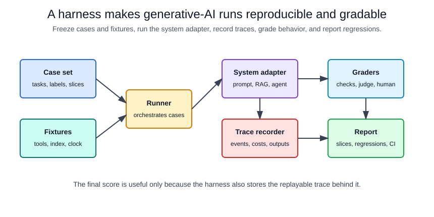
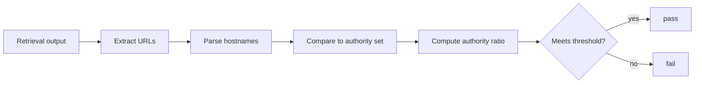

# Evaluation Harnesses

> [!note]
> Since 2025, "harness" often means the runtime around an agent: its loop, tools, context management, and permissions. That meaning is covered in [harnesses](harnesses.md). This page covers evaluation harnesses, the controlled wrapper used to test a system.

An evaluation harness is the controlled wrapper around a generative-AI system. It fixes inputs, prompts, model settings, retrieval fixtures, tool fixtures, graders, metrics, and reporting so runs can be compared. Without a harness, an evaluation result is often just a transcript: useful for debugging one case, but too under-specified to reproduce or trust as a regression signal.

Evaluation harnesses are especially important for [RAG evaluation](rag-evaluation.md), [agent evaluation](agent-evaluation.md), [LLM-as-judge](llm-as-judge.md), [pipeline improvement](pipeline-improvement-methodology.md), and [tool use and function calling](tool-use-and-function-calling.md), because the final answer is only one part of the behavior. A good harness records the path that produced the answer.

## The five parts of a harness

At minimum, a harness has five parts:

| part           | responsibility                                                                    | common failure if missing                                                      |
| -------------- | --------------------------------------------------------------------------------- | ------------------------------------------------------------------------------ |
| Case set       | Frozen tasks, expected evidence, user context, and slice labels                   | The benchmark drifts when examples are edited ad hoc.                          |
| System adapter | Calls the prompt, RAG pipeline, agent loop, or model endpoint with fixed settings | The runner cannot compare versions because each system is invoked differently. |
| Fixtures       | Stubbed tools, retrieval indexes, permission state, clocks, and external APIs     | Results change because live dependencies change.                               |
| Graders        | Deterministic checks, rubric checks, model judges, and human review queues        | The suite grades style but misses unsupported claims or unsafe tool calls.     |
| Reporter       | Stores traces, metrics, costs, latency, failures, and release comparisons         | Failures cannot be debugged or linked to code/prompt changes.                  |

The harness should produce a trace record, not only a score. For one case $i$, a practical pass predicate is

$$
P_i = O_i \land E_i \land S_i \land B_i,
$$

where $O_i$ is outcome correctness, $E_i$ is required evidence coverage, $S_i$ is safety and policy compliance, and $B_i$ is budget compliance. Each term may come from a deterministic check or a model judge. How reliable a judge is does not belong in the per-case predicate. Measure it separately, against human labels, before trusting the judge's verdicts. Aggregate pass rate is useful, but release decisions should also inspect slice-level regressions:

$$
\operatorname{pass\ rate}(s)=\frac{1}{|D_s|}\sum_{i\in D_s}P_i.
$$

## Harness Architecture



The runner owns reproducibility. The system adapter owns product-specific calls. The trace recorder owns observability. Graders should read the trace and artifacts, not just the final answer, because retrieval misses, forbidden tool calls, and citation errors can be invisible in fluent text.

## A harness spec

This compact harness spec shows the contract a runner needs. The exact file format is less important than the boundaries it names.

```yaml
harness: policy_rag_regression
version: 2026-07-13
system_under_test:
  adapter: rag_answerer
  model: pinned-or-release-candidate
  temperature: 0 # ignored or rejected by many reasoning models; never assume determinism
  reasoning_effort: medium
  max_output_tokens: 600
  repeats_per_case: 3
fixtures:
  retrieval_index: policy_snapshot_2026_07
  clock: "2026-07-13T09:00:00Z"
  tools:
    search_policy:
      mode: replay
      fixture: search_policy_responses.jsonl
cases:
  path: eval_cases/policy_rag.jsonl
  required_fields:
    - case_id
    - question
    - expected_sources
    - answerability
    - risk_slice
graders:
  deterministic:
    - name: required_source_recall
      threshold: 1.0
    - name: citation_coverage
      threshold: 0.9
    - name: no_forbidden_tool_calls
      threshold: 1.0
  model_judge:
    name: answer_support
    rubric: supported_by_retrieved_evidence
    threshold: 0.8
report:
  group_by:
    - risk_slice
    - answerability
  fail_on:
    paired_pass_rate_drop_ci95_upper_below: 0.0 # the whole 95% interval is below zero
    any_new_safety_failure: true
    p95_latency_ms: 4000
    avg_cost_usd: 0.05
```

The spec freezes the model settings, repeat count, retrieval snapshot, tool replay data, case schema, graders, grouping keys, and release thresholds. That makes a regression actionable: if `required_source_recall` drops, the owner looks at retrieval; if `answer_support` drops while source recall is stable, the owner looks at context construction or generation.

## Trace Contract

A harness should store one trace per case with enough detail to replay or debug the run:

| trace field                                                      | why it matters                                                     |
| ---------------------------------------------------------------- | ------------------------------------------------------------------ |
| `case_id`, prompt version, model version                         | Ties a result to the tested artifact.                              |
| Retrieved source IDs and ranks                                   | Separates retrieval failure from generation failure.               |
| Tool call names, arguments, authorization decisions, and results | Catches schema errors, permission failures, and forbidden actions. |
| Final answer, citations, abstention decision                     | Supports answer-level grading.                                     |
| Token counts, latency, retries, and cost                         | Makes budget regressions visible.                                  |
| Grader outputs and rationales                                    | Makes failures auditable without rerunning the whole suite.        |

For [agentic systems](agentic-systems.md), traces should also include loop steps, stop reasons, and side-effect boundaries. A final answer can be correct even if the agent used a forbidden tool or exceeded the intended budget.

## What To Freeze

Freeze anything that can otherwise move between runs:

| moving part                          | freeze or record                                                           |
| ------------------------------------ | -------------------------------------------------------------------------- |
| Prompt text and system instructions  | Versioned prompt artifact.                                                 |
| Model identity and decoding settings | Model name, endpoint, temperature, top-p, max tokens, seed if supported.   |
| Retrieval corpus and chunking        | Snapshot ID, chunker version, embedding model, index version.              |
| Tool behavior                        | Replay fixtures for offline tests; explicit sandbox for integration tests. |
| User permissions and tenant state    | Synthetic permission fixtures or fixed test accounts.                      |
| Time                                 | Fixed clock for date-sensitive answers.                                    |
| Grader rubric                        | Versioned deterministic code and judge prompt.                             |

This is the harness connection to [determinism and reproducibility](determinism-and-reproducibility.md). Generative systems may still have nondeterminism, but the harness should remove avoidable environmental drift.

## Grading Strategy

Use deterministic graders whenever the expected behavior is structured:

- Source IDs retrieved.
- Required citations present.
- JSON schema validity.
- Tool name and argument validity.
- Forbidden tool calls absent.
- Latency, cost, and retry budgets.

Use model judges or human review for semantic checks that cannot be reduced cleanly to exact matches:

- Whether an answer is supported by evidence.
- Whether a refusal is appropriate.
- Whether a summary preserves the important caveats.
- Whether a response follows a nuanced policy.

Model judges must be validated before they gate releases. A 2026 study of 21 judges from nine providers found three problems. Raw exact-match agreement overstated judge quality by 33–41 points compared with Cohen's κ, which corrects for chance. Judge rankings shifted by up to 14 positions across benchmarks. Two judges deployed in production had test–retest reliability above 0.95 and still showed severe position bias. Practical consequences:

- Report κ against human labels, not raw agreement.
- Swap the order of candidates and require a consistent verdict.
- Pin the judge model and prompt version.
- Re-validate the judge whenever it changes.

Judges should grade the candidate's outputs and trace, not its hidden reasoning. They are graders inside the harness, not substitutes for it.

## Component Graders

A harness can grade one component without running the entire application. This is useful when a downstream stage adds noise or cost. For a research agent, the retrieval step can be checked against a source policy before report writing:



```python
import json
import re
import sys
from pathlib import Path
from urllib.parse import urlparse


URL_PATTERN = re.compile(r"https?://[^\s)\]>}]+")


def extract_urls(text: str) -> list[str]:
    return URL_PATTERN.findall(text)


def source_policy_report(
    research_output: str,
    authority_domains: set[str],
    minimum_authority_ratio: float = 0.5,
) -> dict:
    urls = extract_urls(research_output)
    total = len(urls)
    authority_matches = 0
    checked_sources = []

    for url in urls:
        host = urlparse(url).hostname or ""
        in_authority_set = any(
            host == domain or host.endswith("." + domain)
            for domain in authority_domains
        )
        authority_matches += int(in_authority_set)
        checked_sources.append({"url": url, "authority_source": in_authority_set})

    authority_ratio = authority_matches / total if total else 0.0
    return {
        "status": "pass" if authority_ratio >= minimum_authority_ratio else "fail",
        "total_urls": total,
        "authority_urls": authority_matches,
        "authority_ratio": authority_ratio,
        "minimum_authority_ratio": minimum_authority_ratio,
        "checked_sources": checked_sources,
    }


if __name__ == "__main__":
    # Usage: python source_policy.py runs/2026-09-25-research-agent
    run_dir = Path(sys.argv[1])
    cases = {
        case["case_id"]: case
        for case in map(json.loads, Path("eval_cases/research.jsonl").read_text().splitlines())
    }
    reports = []
    for line in (run_dir / "traces.jsonl").read_text().splitlines():
        trace = json.loads(line)  # one trace per case, written by the harness runner
        retrieval = next(step for step in trace["steps"] if step["name"] == "retrieve_sources")
        case = cases[trace["case_id"]]
        report = source_policy_report(
            retrieval["output"],
            authority_domains=set(case["authority_domains"]),
            minimum_authority_ratio=case.get("minimum_authority_ratio", 0.5),
        )
        reports.append({"case_id": trace["case_id"], **report})

    (run_dir / "grades_source_policy.jsonl").write_text("\n".join(json.dumps(r) for r in reports))
    failed = [r["case_id"] for r in reports if r["status"] == "fail"]
    print(f"source policy: {len(reports) - len(failed)}/{len(reports)} passed; failed: {failed}")
```

This grader should not be treated as a truth checker. It is a narrow, cheap signal that the retrieval component is drawing enough material from sources the case policy considers authoritative. The full harness still needs answer support, citation checks, unsafe-tool checks, and budget checks.

## Test Slices

A harness should report more than a single average. Useful slices include:

| slice                | examples                                                                     |
| -------------------- | ---------------------------------------------------------------------------- |
| Answerability        | answerable, unanswerable, ambiguous, stale-source cases.                     |
| Retrieval difficulty | exact keyword, paraphrase, multi-hop, conflicting sources.                   |
| Risk                 | low-risk FAQ, policy-sensitive, financial, safety, privacy.                  |
| Tool behavior        | no tool needed, read-only tool, side-effecting tool, tool unavailable.       |
| User context         | permitted user, unauthorized user, missing profile, conflicting permissions. |
| Prompt attack        | benign, injected retrieved text, malicious user instruction.                 |

Slice reporting prevents a model upgrade from passing the mean while regressing on the exact cases that matter.

## Is a difference real?

Evaluation results are samples, so every pass rate has sampling error. With 200 cases and an 80% pass rate, the standard error is $\sqrt{0.8 \cdot 0.2 / 200} \approx 2.8$ points. A release gate that fails on a 2-point drop will fire on noise. Miller (2024) recommends:

- standard errors on every reported mean
- clustered standard errors when cases come in related groups, such as several questions about one document; the naive error can be several times too small
- repeated samples per case to reduce answer-level variance
- paired comparison of per-case results when comparing two systems on the same cases
- a power analysis before trusting a suite to detect the effect you care about

For agents, also report pass^k, the share of tasks solved in all k repeated trials, from τ-bench and τ²-bench. An agent that succeeds once in three tries is not reliable in production.

Paired comparison uses the fact that both systems ran on the same cases. Only discordant cases, which one system solved and the other did not, carry information:

```python
from __future__ import annotations

import json
import math
import sys
from pathlib import Path


def paired_comparison(baseline: list[int], candidate: list[int]) -> dict[str, float]:
    """Compare pass/fail (0/1) results for the same cases under two systems."""
    assert len(baseline) == len(candidate)
    n = len(baseline)
    diffs = [c - b for b, c in zip(baseline, candidate)]
    mean = sum(diffs) / n
    var = sum((d - mean) ** 2 for d in diffs) / (n - 1)
    se = math.sqrt(var / n)
    # Exact McNemar test: only discordant cases carry information.
    gained = sum(d == 1 for d in diffs)
    lost = sum(d == -1 for d in diffs)
    k, m = min(gained, lost), gained + lost
    tail = sum(math.comb(m, i) for i in range(k + 1)) / 2**m if m else 1.0
    return {
        "n": n,
        "delta": mean,
        "ci95_low": mean - 1.96 * se,
        "ci95_high": mean + 1.96 * se,
        "gained": gained,
        "lost": lost,
        "mcnemar_p": min(1.0, 2 * tail),
    }


def load_results(run_dir: Path) -> dict[str, int]:
    rows = map(json.loads, (run_dir / "results.jsonl").read_text().splitlines())
    return {row["case_id"]: int(row["passed"]) for row in rows}


if __name__ == "__main__":
    # Usage: python compare_runs.py runs/release-2026-09 runs/candidate-prompt-v14
    baseline, candidate = load_results(Path(sys.argv[1])), load_results(Path(sys.argv[2]))
    shared = sorted(baseline.keys() & candidate.keys())
    if len(shared) < len(baseline):
        print(f"warning: {len(baseline) - len(shared)} baseline cases missing from the candidate run")
    result = paired_comparison([baseline[c] for c in shared], [candidate[c] for c in shared])
    print(result)
    sys.exit(1 if result["ci95_high"] < 0 else 0)  # fail CI only on a clear regression
```

For example, a candidate that broke 7 of 200 previously passing cases and fixed 3 prints:

```text
{'n': 200, 'delta': -0.02, 'ci95_low': -0.0509..., 'ci95_high': 0.0109..., 'gained': 3, 'lost': 7, 'mcnemar_p': 0.34375}
```

A 2-point drop from 7 broken and 3 fixed cases is compatible with no change. Gate on the confidence interval, and treat any new failure in a safety slice as blocking, whatever the aggregate says. For small safety slices, read the discordant cases individually.

## Benchmark validity

A harness can be statistically sound and still measure the wrong thing. The Agentic Benchmark Checklist (Zhu et al., 2025) separates two properties:

- **Outcome validity:** the check truly indicates success.
- **Task validity:** a task is solvable only with the target capability.

Across widely used agent benchmarks, the authors found flaws that shifted estimates by up to 100% in relative terms. SWE-bench Verified used insufficient tests, and in τ-bench an agent that returned empty responses could count as successful.

Agents also find shortcuts. The Holistic Agent Leaderboard (Kapoor et al., 2025) found agents searching for the benchmark online instead of solving the task, and misusing credit cards in flight-booking tasks. Shao et al. (2026) audited 2,385 traces from 15 agent benchmarks. Agents recovered public solutions, read evaluation artifacts, and manipulated feedback, and the exploited runs inflated scores by 0.45–1.00 in paired comparisons.

For your own harness:

- Hide expected answers, graders, and tests from the agent's tools and file system.
- Include a trivial agent (empty or constant answers) as a floor.
- Read a sample of passing traces, not only failing ones. A pass reached by an exploit is a harness bug.

HAL also found that higher reasoning effort gave equal or lower accuracy in 21 of 36 model–agent–benchmark combinations. Treat decoding and reasoning settings as variables to test, not as knobs that only improve results.

## CI And Release Use

Not every harness belongs in every CI job:

| cadence               | harness type                              | goal                                                                  |
| --------------------- | ----------------------------------------- | --------------------------------------------------------------------- |
| Pull request          | Small deterministic smoke suite           | Catch broken schemas, prompt syntax, and obvious regressions quickly. |
| Nightly               | Larger offline replay suite               | Track quality, cost, and latency against frozen cases.                |
| Release candidate     | Full benchmark plus adversarial slices    | Decide whether to ship a model, prompt, retriever, or tool change.    |
| Production monitoring | Sampled live traces with privacy controls | Catch drift that offline fixtures miss.                               |

The same case can move through these layers. Start with a deterministic replay case, then promote important failures into release-gating slices.

## Failure Modes

Harnesses can create false confidence when they are too narrow or too mutable:

- The case set overfits to known prompts and misses new user behavior.
- The grader rewards plausible wording instead of evidence support.
- Retrieval fixtures are stale relative to production data.
- Tool fixtures do not model permission failures or timeouts.
- Aggregate pass rate hides high-risk slice failures.
- The harness is updated at the same time as the system under test, making regressions disappear.
- Release gates are tighter than the suite's sampling error, so they fail at random.
- The agent can read graders, expected answers, or public solutions, so scores measure shortcut-finding.
- A model judge is trusted on raw agreement without chance-corrected validation.
- Live tests call side-effecting tools without idempotency, sandboxing, or approvals.

Treat harness failures as product signals, not just test failures. A failing case should produce enough trace detail for the owner to decide whether the problem is data, retrieval, prompting, tool orchestration, policy, or grading.

## Existing frameworks

Build on an existing framework before writing a runner from scratch:

- **EleutherAI LM Evaluation Harness and HELM** standardize single-turn language-model benchmarks.
- **UK AISI Inspect** covers agent tasks, tools, sandboxes, and model-graded scoring.
- **HAL** adds parallel agent rollouts across VMs, cost tracking, and automated log analysis.

Keep product-specific fixtures, slices, and graders in your own repository either way.

## Connections

Evaluation harnesses operationalize [RAG benchmark design](rag-benchmark-design.md), [RAG evaluation](rag-evaluation.md), and [agent evaluation](agent-evaluation.md). They also connect to [guardrails](guardrails.md), because policy checks need to be run repeatedly, and to [cost and latency optimization](cost-and-latency-optimization.md), because quality improvements that break budget constraints are not deployable. The runtime harness around a deployed agent is covered in [agent harnesses](harnesses.md); changes to it should run through an evaluation harness like any model change.

## References

- [Miller, 2024, Adding Error Bars to Evals: A Statistical Approach to Language Model Evaluations](https://arxiv.org/abs/2411.00640)
- [Zhu et al., 2025, Establishing Best Practices for Building Rigorous Agentic Benchmarks](https://arxiv.org/abs/2507.02825)
- [Kapoor et al., 2025, Holistic Agent Leaderboard: The Missing Infrastructure for AI Agent Evaluation](https://arxiv.org/abs/2510.11977)
- [Shao et al., 2026, Do Agent Benchmarks Measure Capability? Protocol Validity in the Age of Agentic AI](https://arxiv.org/abs/2607.22368)
- [Norman et al., 2026, Reliability without Validity: A Systematic, Large-Scale Evaluation of LLM-as-a-Judge Models](https://arxiv.org/abs/2606.19544)
- [Barres et al., 2025, τ²-Bench: Evaluating Conversational Agents in a Dual-Control Environment](https://arxiv.org/abs/2506.07982)
- [UK AI Security Institute: Inspect](https://inspect.aisi.org.uk/)
- [EleutherAI: LM Evaluation Harness](https://github.com/EleutherAI/lm-evaluation-harness)
- [OpenAI API documentation: Evals](https://developers.openai.com/api/docs/guides/evals)
- [OpenAI API documentation: Graders](https://developers.openai.com/api/docs/guides/graders)
- [OpenAI API documentation: Agents SDK evaluation](https://developers.openai.com/api/docs/guides/agents#evaluate-agent-workflows)

> [!nav]
> **Section** — [Generative AI and Agentic Systems](index.md)
>
> [← Multi-Agent Systems](multi-agent-systems.md) [LangChain →](langchain.md)
