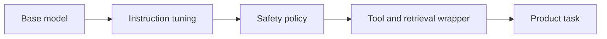

# Foundation Models

A foundation model is pretrained broadly enough to serve as a base for many tasks. In this section, [pretraining](pretraining.md) creates the base distribution, [instruction tuning](instruction-tuning.md) adapts behavior, and [fine tuning versus RAG](fine-tuning-versus-rag.md) decides how applications specialize it. The point is reuse: one base model can support many products when wrapped with the right context, tools, and controls.

## Base objective and adaptation paths

For language models, the base objective is often next-token prediction: maximize $\sum_t \log p_\theta(x_t\mid x_{<t})$. The same base [language model architecture](language-model-architecture.md) can then be prompted, fine-tuned, aligned, or connected to retrieval and tools. [Multimodal models](multimodal-models.md) extend the foundation idea to image, audio, or video tokens.

The "foundation" property comes from reuse, not from size alone. A model becomes a platform when the same pretrained representation supports several adaptation paths:

| Adaptation path                             | What changes                                       | Typical use                                                  |
| ------------------------------------------- | -------------------------------------------------- | ------------------------------------------------------------ |
| Prompting                                   | Only the input context changes.                    | Fast task steering without weight updates.                   |
| [RAG](rag.md)                               | The context is filled with retrieved evidence.     | Current or auditable facts.                                  |
| [Instruction tuning](instruction-tuning.md) | Model weights learn instruction-response behavior. | Stable task style and output formats.                        |
| [Alignment](alignment.md)                   | Preferences and policies shape behavior.           | Safer assistant behavior under ambiguity.                    |
| Tool wrapper                                | Application code gives controlled actions.         | Search, calculation, database lookup, or workflow execution. |

## The adaptation stack

The diagram shows why application behavior should not be attributed only to the base weights. A good or bad answer may come from the pretrained distribution, the instruction-tuning data, the retrieval layer, tool permissions, or the product wrapper.

## What foundation models do and do not provide

Foundation models provide broad reusable capability:

- broad language and reasoning priors;
- reusable representations;
- general task adaptation from prompting or fine-tuning;
- multimodal or code capability, depending on the model;
- fluent generation.

An application still has to supply the product boundary around that capability:

- current private evidence through RAG or tools;
- product-specific prompts, schemas, and workflows;
- domain evaluation and failure analysis;
- privacy, access control, and auditability;
- grounding, citations, and hallucination mitigation.

The same foundation model can behave very differently in a chat UI, a retrieval system, a coding agent, or a batch extraction pipeline. The wrapper is part of the system, not decoration.

## Realistic specialization path

A company building a support assistant might start with a hosted foundation model, add RAG for policies, add structured outputs for ticket routing, add tool calls for order lookup, and only later fine-tune for tone or repeated extraction behavior. This sequence keeps facts outside the weights while using the base model's general capability.

## Caveats

Foundation-model capability is uneven across languages, domains, modalities, and time-sensitive facts. Avoid relying on implicit parametric memory when the answer must be current or auditable. Broad capability also creates broad failure modes; product systems should narrow the task and evaluate the deployed workflow.

## References

- [Kaplan et al., 2020, Scaling Laws for Neural Language Models](https://arxiv.org/abs/2001.08361)
- [Touvron et al., 2023, Llama 2](https://arxiv.org/abs/2307.09288)
- [Vaswani et al., 2017, Attention Is All You Need](https://arxiv.org/abs/1706.03762)

> [!nav]
> **Section** — [Generative AI and Agentic Systems](index.md)
>
> [Language Model Architecture →](language-model-architecture.md)
>
> **Learning path** — [Generative AI systems](../00-home-and-navigation/learning-paths.md#generative-ai-systems)
>
> [← Generative AI and Agentic Systems](index.md) [Retrieval Pipelines →](retrieval-pipelines.md)
