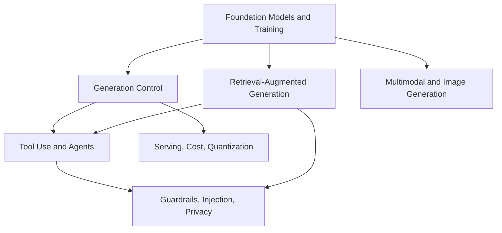

# Generative AI and Agentic Systems

Generative AI covers models and systems that create text, images, structured outputs, plans, tool calls, or multimodal responses. This section separates model-training concepts from application architecture: a language model can be pretrained and aligned, but a useful product still needs retrieval, context construction, tools, evaluation, privacy controls, and serving constraints.

Read the early pages for foundation-model mechanics, then follow the branch for the system you are building — RAG for evidence and retrieval, agents for tool-mediated loops, and the safety pages for behavior constraints.

## Knowledge map

Foundation-model mechanics feed generation control, retrieval, and multimodal generation; retrieval and generation combine into agents; serving and safety wrap everything that ships.

## Reading path

Read foundation-model mechanics and generation control first, then retrieval, agents, multimodal generation, serving, and safety.

1. [Foundation Models](foundation-models.md): what a large pretrained model is and is not.
2. [Language Model Architecture](language-model-architecture.md): the transformer stack behind LLMs.
3. [Tokenization](tokenization.md): the units an LLM reads and generates.
4. [Pretraining](pretraining.md): self-supervised learning on large corpora.
5. [LLM Training](llm-training.md): the full pretraining-to-alignment pipeline.
6. [Instruction Tuning](instruction-tuning.md): teaching a base model to follow instructions.
7. [Alignment](alignment.md): shaping behavior toward helpfulness and safety.
8. [In-Context Learning](in-context-learning.md): adapting from examples in the prompt.
9. [Prompting](prompting.md): structuring inputs to steer generation.
10. [Sampling and Decoding](sampling-and-decoding.md): turning logits into tokens.
11. [Top-k and Top-p Sampling](top-k-and-top-p-sampling.md): truncated sampling rules.
12. [Temperature and Determinism](temperature-and-determinism.md): controlling randomness.
13. [Determinism and Reproducibility](determinism-and-reproducibility.md): making runs repeatable.
14. [Structured Output](structured-output.md): constraining generations to a schema.
15. [RAG](rag.md): grounding generation in retrieved evidence.
16. [Embeddings](embeddings.md): vector representations for retrieval.
17. [Chunking](chunking.md): splitting documents into retrievable units.
18. [Vector Databases](vector-databases.md): storing and searching embeddings.
19. [Retrieval Pipelines](retrieval-pipelines.md): the offline and online retrieval contracts.
20. [Hybrid Retrieval](hybrid-retrieval.md): combining lexical and dense signals.
21. [Query Rewriting](query-rewriting.md): reshaping the query before retrieval.
22. [Reranking](reranking.md): reordering candidates with a stronger model.
23. [Context Construction](context-construction.md): assembling the final prompt context.
24. [Grounding](grounding.md): tying claims to sources.
25. [Citations](citations.md): attributing generated statements to evidence.
26. [Hallucination Mitigation](hallucination-mitigation.md): reducing unsupported output.
27. [RAG Evaluation](rag-evaluation.md): measuring retrieval and answer quality.
28. [RAG Architecture Comparison](rag-architecture-comparison.md): trade-offs across RAG designs.
29. [RAG Benchmark Design](rag-benchmark-design.md): building trustworthy RAG benchmarks.
30. [Fine Tuning Versus RAG](fine-tuning-versus-rag.md): when to train versus retrieve.
31. [Tool Use and Function Calling](tool-use-and-function-calling.md): the model's action layer.
32. [Tool Schemas](tool-schemas.md): declaring callable tools.
33. [Tool Routing](tool-routing.md): choosing which tool to call.
34. [Agent Loops](agent-loops.md): the observe-decide-act cycle.
35. [Agentic Systems](agentic-systems.md): systems that plan and act over many steps.
36. [Planning](planning.md): decomposing goals into steps.
37. [Memory](memory.md): persisting state across steps and sessions.
38. [Reflection and Reviewer Patterns](reflection-and-reviewer-patterns.md): self-critique against a rubric.
39. [Multi-Agent Systems](multi-agent-systems.md): coordinating multiple roles.
40. [Harnesses](harnesses.md): the runtime scaffolding around a model.
41. [Agent Evaluation](agent-evaluation.md): measuring multi-step task success.
42. [LLM-as-Judge](llm-as-judge.md): using models to score outputs.
43. [Multimodal Models](multimodal-models.md): models over text, image, and more.
44. [Vision-Language Models](vision-language-models.md): joint image-text models.
45. [Stable Diffusion](stable-diffusion.md): latent-diffusion image generation.
46. [Local Versus Hosted Models](local-versus-hosted-models.md): where the model runs.
47. [Model Serving](model-serving.md): the runtime layer for reliable calls.
48. [Quantization](quantization.md): lower-precision weights for cheaper serving.
49. [Cost and Latency Optimization](cost-and-latency-optimization.md): making systems affordable and fast.
50. [Guardrails](guardrails.md): runtime behavior constraints.
51. [Prompt Injection](prompt-injection.md): the core adversarial-input risk.
52. [Data Privacy](data-privacy.md): protecting user and training data.
53. [PII Protection](pii-protection.md): detecting and redacting personal information.

## Connections

- [Deep Learning](../06-deep-learning/index.md) and [Natural Language Processing](../08-natural-language-processing/index.md) supply the architectures and language tasks underneath.
- [Information Retrieval](../12-information-retrieval-and-search/index.md) provides the retrieval half of RAG, and [Responsible AI](../18-responsible-ai-safety-and-governance/index.md) governs deployed behavior.

> **Learning path — [Generative AI systems](../00-home-and-navigation/learning-paths.md#generative-ai-systems):** [Foundation Models](foundation-models.md) →
