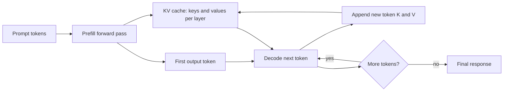

# KV Cache

The KV cache is the inference-time storage of attention **keys** and **values** for previous tokens in a decoder language model. It lets the model generate the next token without recomputing key and value projections for the entire prompt and all previously generated tokens.

It belongs conceptually to [transformer attention](../06-deep-learning/attention.md), but it matters most in [model serving](model-serving.md): it controls first-token latency, decode speed, memory capacity, batching, and the maximum number of concurrent requests a server can handle.

## Why it exists

In decoder self-attention, every token produces a query $q$, a key $k$, and a value $v$. When generating token $t$, the model needs the new query for token $t$ and the keys and values for all visible previous tokens. Without caching, the server would repeatedly run the full prefix through every transformer layer after each generated token.

With a KV cache, the serving loop separates two phases:

| Phase   | What happens                                       | KV-cache role                                                         |
| ------- | -------------------------------------------------- | --------------------------------------------------------------------- |
| Prefill | The model processes the prompt tokens in parallel. | Build and store keys and values for the prompt.                       |
| Decode  | The model generates one new token at a time.       | Reuse cached keys and values; append the new token's keys and values. |

The cache does not make generation free. Each new token still runs through the model layers, computes a new query, attends over the cached prefix, and updates the cache. The cache saves repeated prefix computation.

## Serving loop



The first pass over the prompt is often called **prefill**. The repeated one-token steps are **decode**. Long prompts mostly increase prefill time and initial cache size. Long outputs increase decode time and cache growth.

## Step-by-step generation example

Suppose a user sends this prompt:

```text
User: Name two planets.
Assistant:
```

Assume the tokenizer turns it into these prompt tokens:

```text
[User, :, Name, two, planets, ., Assistant, :]
```

The exact tokens depend on the tokenizer, but the cache mechanics are the same. The model will generate an answer such as:

```text
 Mars and Venus.
```

Step by step:

1. **Tokenize the prompt.** The serving layer converts the prompt string into token IDs. At this moment there is no KV cache for this request.

2. **Run prefill over all prompt tokens.** The model processes the full prompt in parallel through every decoder layer. At each layer and token position, it computes a key vector and a value vector. Those keys and values are written into the KV cache. After prefill, the cache contains entries for:

   ```text
   [User, :, Name, two, planets, ., Assistant, :]
   ```

3. **Predict the first output token.** The final hidden state at the last prompt position produces logits over the vocabulary. The decoder chooses the next token, for example `Mars`. The model has not yet cached `Mars`; it has only selected it.

4. **Append and decode `Mars`.** The selected token `Mars` becomes the next input token. The model computes a new query for `Mars`, attends to the cached keys and values for the prompt, and computes the key and value for `Mars` itself. The runtime appends those new key/value tensors to the cache:

   ```text
   [User, :, Name, two, planets, ., Assistant, :, Mars]
   ```

5. **Predict and append the next token.** Using the updated cache, the model predicts the next token, perhaps `and`. The decode step for `and` reuses all cached prompt and `Mars` keys/values, computes `and`'s own key/value tensors, and appends them:

   ```text
   [User, :, Name, two, planets, ., Assistant, :, Mars, and]
   ```

6. **Continue until a stop condition.** The same loop repeats for `Venus` and `.`. A stop condition can be an end-of-sequence token, a stop string, a maximum-token limit, or an application policy.

7. **Render the answer.** The output tokens are detokenized into user-visible text:

   ```text
   Mars and Venus.
   ```

The important detail is that each decode step computes only the new token's key and value tensors. The prompt's key/value tensors and earlier output token tensors are reused from the cache. The cache length grows from 8 prompt tokens to 12 total cached tokens after generating four output tokens.

## Memory formula

For one sequence, an approximate KV-cache memory estimate is

$$
M_{\text{KV}}
\approx
2 \cdot L \cdot T \cdot H_{\text{kv}} \cdot d_{\text{head}} \cdot b,
$$

where:

| Symbol            | Meaning                                                                                                     |
| ----------------- | ----------------------------------------------------------------------------------------------------------- |
| $M_{\text{KV}}$   | KV-cache memory for one sequence.                                                                           |
| $L$               | Number of transformer layers.                                                                               |
| $T$               | Number of cached tokens: prompt tokens plus generated tokens kept in context.                               |
| $H_{\text{kv}}$   | Number of key-value heads. With grouped-query attention this can be smaller than the number of query heads. |
| $d_{\text{head}}$ | Width of one attention head.                                                                                |
| $b$               | Bytes per stored element, such as 2 bytes for fp16 or bf16.                                                 |

The leading factor $2$ appears because the cache stores two tensors per layer and token position: one for keys and one for values.

For $C$ concurrent sequences, multiply by $C$ before adding fragmentation, batching overhead, runtime buffers, and model weights.

## Worked memory example

Consider a decoder model with:

| Quantity                     |   Value |
| ---------------------------- | ------: |
| Layers $L$                   |      32 |
| Cached tokens $T$            |    2048 |
| KV heads $H_{\text{kv}}$     |      32 |
| Head width $d_{\text{head}}$ |     128 |
| Element size $b$             | 2 bytes |

Then

$$
M_{\text{KV}}
\approx
2\cdot32\cdot2048\cdot32\cdot128\cdot2
=1{,}073{,}741{,}824\text{ bytes}
\approx1\text{ GiB}.
$$

That is for one active sequence before extra runtime overhead. With 40 simultaneous long-context requests, the same cache shape would require roughly 40 GiB just for keys and values. This is why serving systems can run out of memory even when the model weights themselves fit on the GPU.

## What the cache changes

| Question                                                        | Without KV cache                       | With KV cache                                                                           |
| --------------------------------------------------------------- | -------------------------------------- | --------------------------------------------------------------------------------------- |
| Does the model recompute old key/value projections every token? | Yes.                                   | No, it reuses cached K and V tensors.                                                   |
| Does attention still look back over prior tokens?               | Yes.                                   | Yes. The new query attends to cached prior keys and values.                             |
| Does decode become constant time as context grows?              | No.                                    | Still no; attention over a longer cache costs more, though implementations optimize it. |
| What limits concurrency?                                        | Compute and repeated prefix work.      | Often KV-cache memory, scheduler policy, and decode bandwidth.                          |
| What happens when the context window is exceeded?               | The model cannot attend to all tokens. | The runtime must evict, truncate, page, or reject according to policy.                  |

## Prefix caching versus KV cache

The ordinary KV cache is per active sequence. It stores the keys and values needed as that sequence continues decoding.

Prefix caching reuses cache blocks across requests that share the same beginning, such as the same system prompt, tool schemas, or few-shot examples. Serving engines such as [vLLM](vllm.md) and [SGLang](sglang.md) use cache-aware scheduling to reduce repeated prefill work when many requests have shared prefixes.

The distinction matters:

| Cache type   | Reused within one response?            | Reused across different requests?                       |
| ------------ | -------------------------------------- | ------------------------------------------------------- |
| KV cache     | Yes.                                   | Usually no, unless the runtime adds prefix-cache reuse. |
| Prefix cache | Yes, through the underlying KV blocks. | Yes, when requests share token-identical prefixes.      |

## Design implications

KV-cache behavior affects system design:

- Long prompts increase time to first token and reserve more cache memory before generation starts.
- Long outputs keep growing the cache and can reduce server concurrency.
- Batching improves throughput but can make memory and tail latency harder to predict.
- Grouped-query or multi-query attention reduces $H_{\text{kv}}$, which reduces cache memory.
- Quantizing the KV cache can increase capacity, but may change quality or numerical behavior.
- Prompt templates should keep shared prefixes token-identical if the serving runtime supports prefix caching.
- Logs should record input tokens, output tokens, context length, and cache-related failures.

## Caveats

The formula above is an estimate. Real memory depends on tensor layout, padding, paging block size, attention backend, batch scheduler, quantization, parallelism strategy, and runtime buffers. PagedAttention and similar systems reduce fragmentation and improve utilization; they do not remove the fact that long contexts and high concurrency need memory.

KV-cache reuse is also not a correctness guarantee. The application still has to handle stale context, authorization, prompt injection, truncation policy, and output validation.

## References

- [Vaswani et al., 2017, Attention Is All You Need](https://arxiv.org/abs/1706.03762)
- [Kwon et al. 2023, Efficient Memory Management for Large Language Model Serving with PagedAttention](https://arxiv.org/abs/2309.06180)
- [vLLM documentation: Paged Attention](https://docs.vllm.cc/en/latest/)
- [SGLang documentation](https://docs.sglang.io/)

> [!nav]
> **Section** — [Generative AI and Agentic Systems](index.md)
>
> [← Language Model Architecture](language-model-architecture.md) [Tokenization →](tokenization.md)
