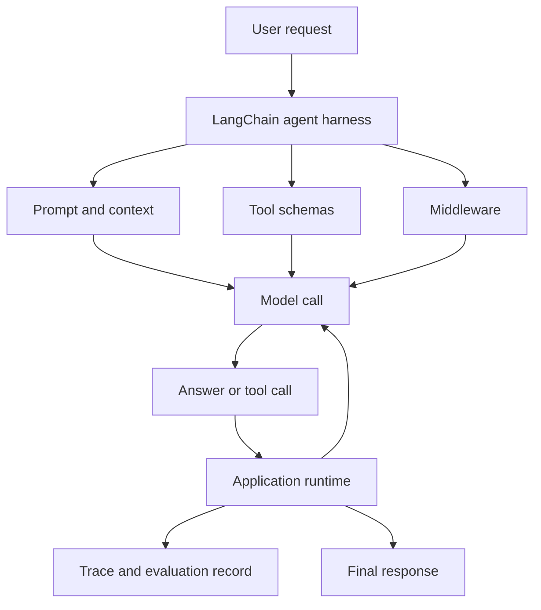

# LangChain

LangChain is an open-source framework for building language-model applications and agents. In its current form, it is best understood as a configurable harness around a model loop: it standardizes how an application calls models, exposes [tools](tool-use-and-function-calling.md), shapes prompts, applies middleware, requests [structured output](structured-output.md), and connects to retrieval or memory systems.

The important design point is separation of responsibility. The model predicts text or tool calls. LangChain supplies the application scaffolding around that prediction: provider interfaces, tool declarations, message state, middleware hooks, invocation methods, streaming, tracing integration, and common agent patterns. For lower-level graph orchestration, persistence, and durable multi-step workflows, use [LangGraph](langgraph.md), which LangChain agents are built on top of.

## What problem it solves

Raw model APIs are powerful but intentionally narrow. A production LLM feature usually needs more than one model call:

1. Construct task-specific context.
2. Select a model and decoding configuration.
3. Declare tools and validate tool arguments.
4. Execute tools outside the model.
5. Add observations back into the message state.
6. Stop, retry, escalate, or return structured output.
7. Trace the run for debugging and [agent evaluation](agent-evaluation.md).

LangChain gives this loop a common programming model. That is useful when the application should stay portable across model providers, tool backends, retrievers, and observability systems.



## Core concepts

| Concept                 | Role in a LangChain application                                                                                                  |
| ----------------------- | -------------------------------------------------------------------------------------------------------------------------------- |
| Model interface         | A common way to call chat models and other model providers without rewriting the application around each provider API.           |
| Messages                | Conversation state passed to the model, including user messages, assistant messages, tool calls, and tool observations.          |
| Prompt or system prompt | Developer instructions and task framing that define the model's role and constraints.                                            |
| Tools                   | Python functions, services, retrievers, or APIs exposed through schemas so the model can request actions.                        |
| Agent harness           | The loop that calls the model, interprets tool calls, appends observations, and decides when the run is complete.                |
| Middleware              | Hooks around the agent, model call, or tool call for logging, retries, guardrails, context editing, routing, and human approval. |
| Structured output       | A schema for the final response or intermediate model output, reducing the gap between free-form text and application data.      |
| Integrations            | Connectors for model providers, vector stores, retrievers, tools, and tracing systems.                                           |

The framework is not the intelligence. It is the runtime contract around the intelligence. A weak prompt, poor retriever, unsafe tool, or badly specified success criterion remains weak even when wrapped in LangChain.

## A minimal agent shape

The current LangChain entry point for agents is `create_agent`. The concrete provider package and model name depend on the stack, but the shape is stable: define tools, create the agent, invoke it with messages, and inspect the returned message state.

```python
import os

from langchain.agents import create_agent


def search_policy(query: str) -> str:
    """Return policy passages relevant to a user question."""
    return "Enterprise refunds require manager approval above 500 USD."


agent = create_agent(
    model=os.environ["CHAT_MODEL"],
    tools=[search_policy],
    system_prompt=(
        "Answer policy questions using the available tools. "
        "If the policy is not found, say what is missing."
    ),
)

result = agent.invoke(
    {"messages": [{"role": "user", "content": "Can I refund a 900 USD invoice?"}]}
)

print(result["messages"][-1].content)
```

The code is short because LangChain owns the common loop mechanics. The application still owns the hard parts: tool correctness, permission checks, data access, prompt quality, evaluation, and deployment controls.

## Where it fits with adjacent concepts

LangChain is often used as the implementation layer for several patterns already covered in this wiki:

| Pattern                                      | LangChain's contribution                                                                         | Page to read first                            |
| -------------------------------------------- | ------------------------------------------------------------------------------------------------ | --------------------------------------------- |
| [RAG](rag.md)                                | Document loaders, embeddings, vector-store integrations, retrievers, and model-call composition. | [Retrieval Pipelines](retrieval-pipelines.md) |
| [Tool use](tool-use-and-function-calling.md) | Tool declarations, model tool-call handling, and middleware around tool execution.               | [Tool Schemas](tool-schemas.md)               |
| [Agent loops](agent-loops.md)                | A prebuilt loop for common model-tool interaction patterns.                                      | [Agentic Systems](agentic-systems.md)         |
| [Structured output](structured-output.md)    | Schema-bound outputs for final answers or intermediate decisions.                                | [Structured Output](structured-output.md)     |
| [Harnesses](harnesses.md)                    | Repeatable invocation and trace records for evaluation.                                          | [Agent Evaluation](agent-evaluation.md)       |

Use LangChain when the application benefits from these abstractions but does not need to expose every runtime transition as a custom graph.

## When to use LangChain

Use LangChain when:

| Scenario                                                             | Why it fits                                                                                                              |
| -------------------------------------------------------------------- | ------------------------------------------------------------------------------------------------------------------------ |
| You need a quick but inspectable agent loop.                         | `create_agent` gives a common tool-calling loop while still allowing configuration and middleware.                       |
| You want provider portability.                                       | The framework normalizes many model and integration interfaces.                                                          |
| You are combining prompts, tools, retrieval, and structured outputs. | The abstractions line up with the parts of a real LLM application.                                                       |
| You need middleware around model or tool calls.                      | Hooks can add retries, fallbacks, context trimming, limits, logging, or human approval without rewriting the whole loop. |
| You plan to evaluate or trace agent runs.                            | LangChain integrates naturally with trace-oriented observability such as LangSmith.                                      |

LangChain is especially useful early in a project when the team is still learning which models, retrievers, tools, and prompts will survive contact with real tasks.

## When not to use LangChain

Do not reach for LangChain just because an LLM is involved.

| Situation                                                                             | Better choice                                                                                                       |
| ------------------------------------------------------------------------------------- | ------------------------------------------------------------------------------------------------------------------- |
| A single prompt and one model call solve the task.                                    | Call the model API directly and keep the code small.                                                                |
| The workflow is a fixed deterministic pipeline with no tool-selection loop.           | Plain application code, a job orchestrator, or a typed service boundary may be clearer.                             |
| You need exact control over every state transition, replay point, or human interrupt. | Use [LangGraph](langgraph.md) or a custom state machine.                                                            |
| The team cannot observe or test agent traces.                                         | Build an [evaluation harness](harnesses.md) first; abstractions will not make an unmeasured agent reliable.         |
| Tool calls carry high-risk side effects.                                              | Add explicit authorization, idempotency, human approval, and audit logging before giving the model any action path. |

The common failure mode is abstraction-first development: importing a framework before defining the task, success criteria, tool permissions, and failure budget. LangChain should reduce orchestration friction, not hide product design.

## Worked design example

Consider an internal policy assistant. The user asks whether a specific refund is allowed. A good LangChain design might use:

| Component         | Concrete choice                                                                                                           |
| ----------------- | ------------------------------------------------------------------------------------------------------------------------- |
| Model             | A hosted chat model with deterministic settings for policy answers.                                                       |
| Tools             | `search_policy`, `lookup_invoice`, and `create_approval_ticket`.                                                          |
| Middleware        | PII redaction before model calls, model-call limits, tool retries, and human approval for side-effecting ticket creation. |
| Retrieval         | A policy retriever over versioned policy documents.                                                                       |
| Structured output | `{answer, cited_policy_ids, needs_manager_approval, next_action}`.                                                        |
| Evaluation        | Frozen cases for allowed, denied, ambiguous, stale-policy, and injection-bearing examples.                                |

The model may decide to search policy, inspect invoice metadata, and answer. It should not decide whether the user has permission to issue a refund; application code should enforce that. LangChain coordinates the model and tools, while the product code owns authorization and the release harness owns regression testing.

## Historical relevance

LangChain became historically important because it arrived during the first large wave of post-ChatGPT LLM application development. Starting as Harrison Chase's side project in late 2022, it gave developers a shared vocabulary for chains, prompts, tools, retrievers, memory, and agents at a time when the ecosystem was changing weekly. LangChain, the company, was formed in early 2023, and the project became one of the most visible open-source entry points for RAG and agent prototypes.

Its relevance has changed. Early LangChain was often associated with "chains" and fast prototyping. Current LangChain is more focused on agent engineering: a configurable harness, provider-neutral integrations, middleware, structured output, and a runtime built on LangGraph. The historical lesson is that LLM frameworks tend to evolve from convenience wrappers into control surfaces for reliability, observability, and evaluation.

## Caveats

LangChain does not guarantee correctness, grounding, safety, or cost control. It can make a poor agent easier to assemble. Use traces, deterministic checks, and task-specific benchmarks before treating a LangChain agent as production-ready.

Version churn matters. The framework's recommended abstractions have changed over time, so older tutorials may use patterns that are no longer the best starting point. Prefer the current documentation and keep framework usage behind application-owned interfaces.

Finally, portability has limits. Provider-neutral interfaces are useful, but model behavior, tool-calling formats, structured-output reliability, context limits, latency, and pricing still differ across providers.

## References

- [LangChain documentation: LangChain overview](https://docs.langchain.com/oss/python/langchain/overview)
- [LangChain documentation: Agents](https://docs.langchain.com/oss/python/langchain/agents)
- [LangChain documentation: Retrieval](https://docs.langchain.com/oss/python/langchain/retrieval)
- [LangChain reference: Runnable](https://reference.langchain.com/python/langchain-core/runnables/base/Runnable)
- [LangChain reference: Middleware](https://reference.langchain.com/python/langchain/middleware)
- [LangChain company: About LangChain](https://www.langchain.com/about)
- [LangChain GitHub repository](https://github.com/langchain-ai/langchain)

> [!nav]
> **Section** — [Generative AI and Agentic Systems](index.md)
>
> [← Harnesses](harnesses.md) [LangGraph →](langgraph.md)
