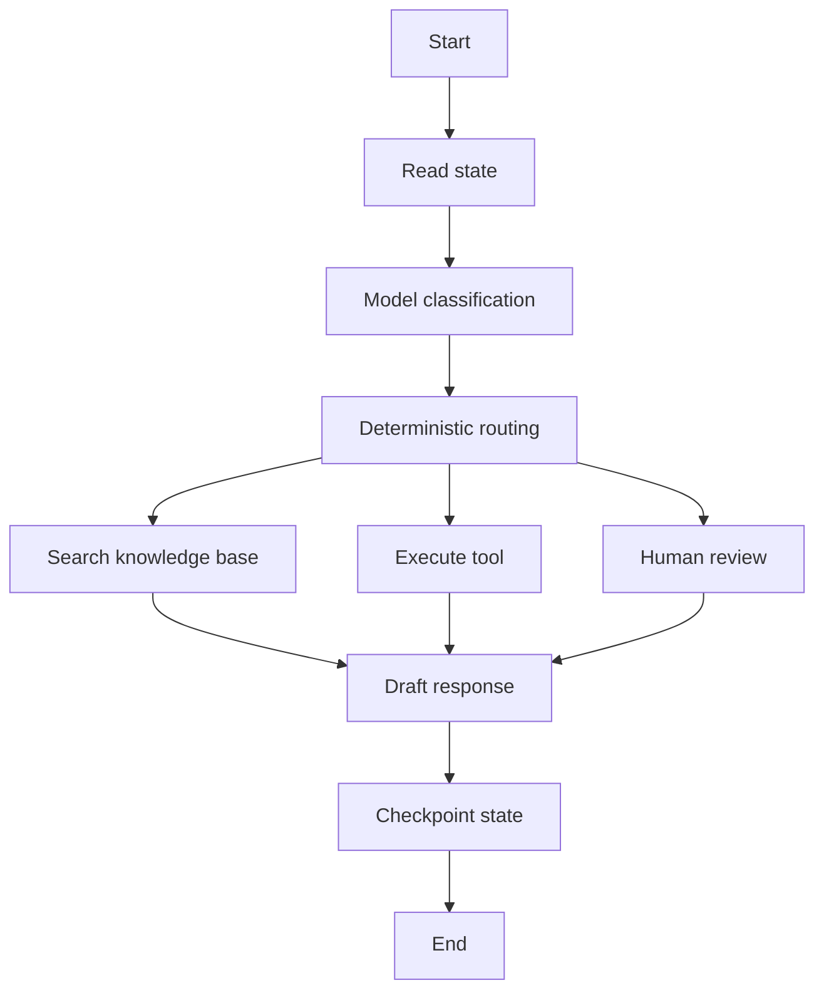
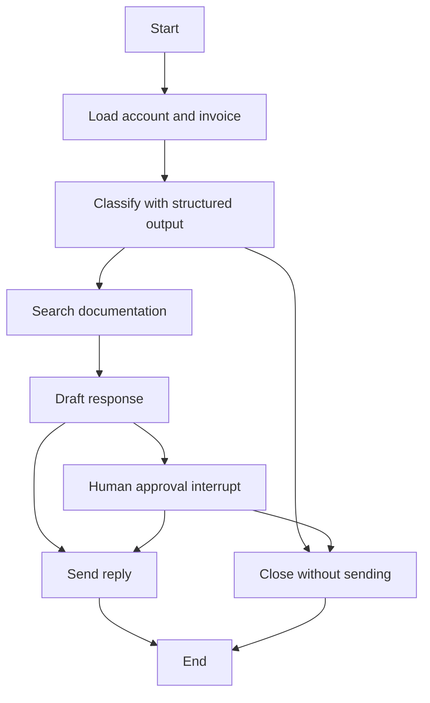

# LangGraph

LangGraph is a low-level orchestration framework and runtime for building stateful, long-running LLM agents as graphs. Where [LangChain](langchain.md) gives a higher-level agent harness and integrations, LangGraph exposes the execution structure: state schema, nodes, edges, routing, persistence, interrupts, retries, streaming, and checkpoints.

The central idea is that an agent is easier to control when it is treated as a state machine rather than a hidden chat loop. Some nodes can be deterministic functions, some can call a model, some can call tools, and some can pause for human input. The graph defines which transitions are allowed.

## What problem it solves

Many agent failures are orchestration failures rather than model failures:

- The agent loses state after a worker restart.
- A human approval step cannot resume exactly where the run paused.
- A long task has no checkpoint, so retrying repeats side effects.
- A tool failure is swallowed inside an opaque loop.
- A model is allowed to decide a transition that should be deterministic.
- Debugging requires reading a transcript instead of a state trace.

LangGraph addresses these problems by making state and control flow explicit. It is useful when the workflow needs durable execution, human-in-the-loop control, memory, branching, replay, or a mix of deterministic and model-driven steps.



## Core concepts

| Concept          | Meaning                                                                                                                                           |
| ---------------- | ------------------------------------------------------------------------------------------------------------------------------------------------- |
| State            | The typed data carried through the graph, such as messages, classification, retrieved documents, tool results, approval status, and final answer. |
| Node             | A function or runnable that reads state and returns updates. A node can be deterministic, model-driven, tool-executing, or human-facing.          |
| Edge             | A transition between nodes. Edges encode allowed control flow.                                                                                    |
| Conditional edge | A routing decision based on state, often used after classification, validation, or tool execution.                                                |
| Reducer          | Logic for merging node updates into state, especially for append-heavy fields such as messages.                                                   |
| Checkpointer     | Persistence layer that saves state snapshots so a run can resume, be inspected, or be replayed.                                                   |
| Thread           | A sequence of checkpoints for one conversation, task, user session, or workflow instance.                                                         |
| Store            | Longer-term memory shared across threads, such as user preferences or durable facts.                                                              |
| Interrupt        | A pause point where execution waits for human input, approval, or external information.                                                           |
| Runtime          | The execution context that supplies configuration, store access, streaming, tracing, and deployment behavior.                                     |

These concepts match the design advice on [agent loops](agent-loops.md): keep the model inside explicit invariants instead of letting it silently own the whole workflow.

## A support triage graph

This example models a support workflow. The graph enriches a case with account data, uses a model to classify the request, retrieves policy evidence, drafts a reply, pauses for human approval when the refund is high-risk, and sends only after the approval branch resolves. It also uses a checkpointer, so the state can be inspected or resumed by thread ID.

The in-memory account and policy dictionaries stand in for real service calls. The production-relevant parts are the typed state, model nodes, deterministic routing, interrupt, checkpointer, and explicit side-effect boundary.

```python
from operator import add
from typing import Annotated, Literal, TypedDict

from langchain.chat_models import init_chat_model
from langgraph.checkpoint.memory import InMemorySaver
from langgraph.graph import END, START, StateGraph
from langgraph.types import Command, interrupt
from pydantic import BaseModel, Field


ACCOUNT_DB = {
    "cust_enterprise_17": {
        "tier": "enterprise",
        "open_invoice_id": "INV-9001",
        "open_invoice_total_usd": 900,
    }
}

POLICY_INDEX = {
    "refund": [
        "refunds-2026-07: enterprise refunds above 500 USD require "
        "manager approval before a customer-facing refund commitment.",
        "refunds-2026-07: approved refunds must be logged with the "
        "case ID and invoice ID.",
    ]
}


class SupportState(TypedDict, total=False):
    case_id: str
    customer_id: str
    email: str
    account_tier: str
    invoice_id: str
    invoice_total_usd: int
    intent: str
    urgency: str
    risk_flags: list[str]
    docs: list[str]
    draft: str
    approved: bool
    sent_reply_id: str
    final_status: str
    audit_log: Annotated[list[str], add]


class CaseClassification(BaseModel):
    intent: Literal["refund", "billing_question", "unsupported"]
    urgency: Literal["normal", "high"]
    risk_flags: list[str] = Field(default_factory=list)


classifier = init_chat_model(
    model="openai:gpt-4.1-mini"
).with_structured_output(CaseClassification)
writer = init_chat_model(model="openai:gpt-4.1-mini")


def lookup_account(customer_id: str) -> dict:
    """Read account data visible to this support workflow."""
    return ACCOUNT_DB[customer_id]


def retrieve_policy(intent: str) -> list[str]:
    """Retrieve approved policy passages for the classified intent."""
    return POLICY_INDEX.get(intent, [])


def enrich_customer(state: SupportState) -> dict:
    account = lookup_account(state["customer_id"])
    return {
        "account_tier": account["tier"],
        "invoice_id": account["open_invoice_id"],
        "invoice_total_usd": account["open_invoice_total_usd"],
        "audit_log": ["loaded account and invoice metadata"],
    }


def classify_intent(state: SupportState) -> dict:
    classification = classifier.invoke(
        [
            {
                "role": "system",
                "content": (
                    "Classify the support email. Mark urgency as high for "
                    "legal threats, chargebacks, or refunds above policy limits."
                ),
            },
            {
                "role": "user",
                "content": (
                    f"Email: {state['email']}\n"
                    f"Account tier: {state['account_tier']}\n"
                    f"Invoice total: {state['invoice_total_usd']} USD"
                ),
            },
        ]
    )
    return {
        "intent": classification.intent,
        "urgency": classification.urgency,
        "risk_flags": classification.risk_flags,
        "audit_log": [f"classified case as {classification.intent}"],
    }


def route_after_classification(
    state: SupportState,
) -> Literal["search_documentation", "close_without_sending"]:
    if state["intent"] == "unsupported":
        return "close_without_sending"
    return "search_documentation"


def search_documentation(state: SupportState) -> dict:
    docs = retrieve_policy(state["intent"])
    return {
        "docs": docs,
        "audit_log": [f"retrieved {len(docs)} policy passages"],
    }


def draft_response(state: SupportState) -> dict:
    message = writer.invoke(
        [
            {
                "role": "system",
                "content": (
                    "Draft a concise support reply. Cite policy IDs. "
                    "Do not promise that a refund has been issued."
                ),
            },
            {
                "role": "user",
                "content": (
                    f"Customer email: {state['email']}\n"
                    f"Invoice: {state['invoice_id']} "
                    f"({state['invoice_total_usd']} USD)\n"
                    f"Policy evidence: {state['docs']}"
                ),
            },
        ]
    )
    return {"draft": message.content, "audit_log": ["drafted customer reply"]}


def route_after_draft(state: SupportState) -> Literal["human_approval", "send_reply"]:
    high_value_refund = state["invoice_total_usd"] > 500
    if state["urgency"] == "high" or high_value_refund or state["risk_flags"]:
        return "human_approval"
    return "send_reply"


def human_review(state: SupportState) -> dict:
    review = interrupt(
        {
            "case_id": state["case_id"],
            "question": "Approve this customer reply?",
            "draft": state["draft"],
            "risk_flags": state["risk_flags"],
            "invoice_total_usd": state["invoice_total_usd"],
        }
    )

    if review["decision"] == "approve":
        return {
            "approved": True,
            "draft": review.get("edited_draft", state["draft"]),
            "audit_log": ["human reviewer approved reply"],
        }

    return {
        "approved": False,
        "final_status": "blocked_by_review",
        "audit_log": ["human reviewer blocked reply"],
    }


def route_after_review(
    state: SupportState,
) -> Literal["send_reply", "close_without_sending"]:
    return "send_reply" if state["approved"] else "close_without_sending"


def send_reply(state: SupportState) -> dict:
    # Real code would call the ticketing API with this idempotency key.
    reply_id = f"{state['case_id']}:{state['invoice_id']}:reply-v1"
    return {
        "sent_reply_id": reply_id,
        "final_status": "sent",
        "audit_log": [f"sent reply with idempotency key {reply_id}"],
    }


def close_without_sending(state: SupportState) -> dict:
    return {
        "final_status": state.get("final_status", "closed_without_sending"),
        "audit_log": ["closed case without customer-facing reply"],
    }


builder = StateGraph(SupportState)
builder.add_node("enrich_customer", enrich_customer)
builder.add_node("classify_intent", classify_intent)
builder.add_node("search_documentation", search_documentation)
builder.add_node("draft_response", draft_response)
builder.add_node("human_review", human_review)
builder.add_node("send_reply", send_reply)
builder.add_node("close_without_sending", close_without_sending)

builder.add_edge(START, "enrich_customer")
builder.add_edge("enrich_customer", "classify_intent")
builder.add_conditional_edges("classify_intent", route_after_classification)
builder.add_edge("search_documentation", "draft_response")
builder.add_conditional_edges("draft_response", route_after_draft)
builder.add_conditional_edges("human_review", route_after_review)
builder.add_edge("send_reply", END)
builder.add_edge("close_without_sending", END)

# InMemorySaver is for development and tests. Production graphs usually use
# a persistent checkpointer such as PostgreSQL.
graph = builder.compile(checkpointer=InMemorySaver())

config = {"configurable": {"thread_id": "support-case-1842"}}
first_run = graph.invoke(
    {
        "case_id": "case-1842",
        "customer_id": "cust_enterprise_17",
        "email": (
            "Customer asks whether we can refund enterprise invoice INV-9001 "
            "for 900 USD."
        ),
        "audit_log": [],
    },
    config,
)

if "__interrupt__" in first_run:
    print(first_run["__interrupt__"][0].value)
    final_state = graph.invoke(
        Command(
            resume={
                "decision": "approve",
                "edited_draft": first_run["__interrupt__"][0].value["draft"],
            }
        ),
        config,
    )
else:
    final_state = first_run

print(final_state["final_status"])
print(final_state["audit_log"])
```

The graph encoded by the code is:



The important object is `SupportState`. Each node reads the current state and returns only the fields it updates. `enrich_customer` adds account and invoice fields, `classify_intent` adds model-derived intent and risk flags, `search_documentation` adds evidence, `draft_response` adds the customer-facing draft, and `send_reply` records the final side effect. The `audit_log` field uses a reducer so every node can append trace entries instead of overwriting earlier ones.

The conditional edges are the main reason to use LangGraph here. The model classifies the case and drafts text, but deterministic functions decide whether the workflow may continue, whether a human must approve, and whether a customer-facing reply may be sent. That split keeps judgement where the model is useful while keeping policy, routing, and side effects under application control.

The interrupt gives the example its production shape. For the 900 USD enterprise refund, the graph pauses inside `human_review` and returns a payload containing the draft, risk flags, and invoice total. Reusing the same `thread_id` with `Command(resume=...)` resumes the saved checkpoint; the graph then records reviewer approval and sends the reply with an idempotency key. With a persistent checkpointer, this same pattern supports a real review queue without repeating completed retrieval, classification, or drafting work.

A trace from this run would read like an operational audit record:

| Step                   | State update                                     | Why it matters                                      |
| ---------------------- | ------------------------------------------------ | --------------------------------------------------- |
| `enrich_customer`      | account tier, invoice ID, invoice total          | External business facts enter the graph explicitly. |
| `classify_intent`      | intent, urgency, risk flags                      | Model judgement is structured and inspectable.      |
| `search_documentation` | policy passages                                  | The draft is grounded in retrieved evidence.        |
| `draft_response`       | customer-facing draft                            | Text generation happens before side effects.        |
| `human_review`         | interrupt payload, approval, optional edit       | A reviewer controls high-risk communication.        |
| `send_reply`           | final status, idempotency key, audit-log message | The side effect is explicit and replay-safe.        |

## Persistence and memory

LangGraph distinguishes short-term execution state from longer-term memory.

| Layer      | Scope                                                   | Typical use                                                                             |
| ---------- | ------------------------------------------------------- | --------------------------------------------------------------------------------------- |
| State      | One active graph run.                                   | Current messages, pending tool call, classification, retrieved documents, draft answer. |
| Checkpoint | A saved state snapshot inside a thread.                 | Resume after failure, inspect before human approval, time-travel debug.                 |
| Thread     | A sequence of checkpoints for one conversation or task. | Conversational memory and replayable task history.                                      |
| Store      | Memory shared across threads.                           | User preferences, durable facts, cross-session profile fields.                          |

For production, in-memory checkpointing is not enough because state disappears on process restart. Persistent backends such as SQLite for local development or PostgreSQL for production are the usual shape. The checkpointer must be treated as part of the reliability design: retention, encryption, deletion, and schema evolution matter because agent state can contain sensitive user data and tool results.

## When to use LangGraph

Use LangGraph when:

| Scenario                                                        | Why it fits                                                                                   |
| --------------------------------------------------------------- | --------------------------------------------------------------------------------------------- |
| The agent must survive failures or long runtimes.               | Checkpointing lets runs resume from saved state instead of starting over.                     |
| Humans need to approve, edit, or inspect intermediate state.    | Interrupts and checkpoints make human-in-the-loop workflows explicit.                         |
| Control flow mixes deterministic and model-driven steps.        | The graph can keep high-risk routing deterministic and leave flexible decisions to the model. |
| The workflow has branches, retries, compensation, or subgraphs. | Graph structure keeps transitions inspectable.                                                |
| You need replayable traces for debugging and evaluation.        | State snapshots and graph steps expose more than a final transcript.                          |
| Multi-agent coordination needs boundaries.                      | Supervisor, handoff, and subgraph patterns can encode role boundaries and routing.            |

LangGraph is often the right choice once an agent moves from demo to product workflow.

## When not to use LangGraph

LangGraph is intentionally low-level. Do not use it when a simpler abstraction is enough.

| Situation                                    | Better choice                                                                          |
| -------------------------------------------- | -------------------------------------------------------------------------------------- |
| A single tool-calling loop is sufficient.    | Use [LangChain](langchain.md) agents or direct model-tool code.                        |
| The workflow is a short fixed pipeline.      | Ordinary Python, a job orchestrator, or a service function may be clearer.             |
| The team has not defined state ownership.    | First define state, side effects, approvals, and success criteria.                     |
| Persistence creates more risk than value.    | Avoid storing sensitive intermediate state unless retention and deletion are designed. |
| The graph exists only to mirror a flowchart. | A graph should enforce runtime behavior, not merely document it.                       |

The main cost is complexity. Explicit state machines make production behavior more controllable, but they also force the team to design state schemas, merge rules, storage, routing, and failure semantics.

## Relationship to LangChain

LangChain and LangGraph are complementary:

| Need                                                                    | Prefer                       |
| ----------------------------------------------------------------------- | ---------------------------- |
| Quick agent with model, tools, prompt, and middleware                   | LangChain                    |
| Provider integrations for models, retrievers, vector stores, and tools  | LangChain                    |
| Exact graph control over a long-running workflow                        | LangGraph                    |
| Durable execution, checkpoints, interrupts, and time-travel debugging   | LangGraph                    |
| A high-level agent loop that still benefits from persistence underneath | LangChain built on LangGraph |

The practical pattern is to use LangChain components inside LangGraph nodes. For example, a graph node might call a LangChain model, retriever, or structured-output helper, while LangGraph owns the surrounding state machine.

## Historical relevance

LangGraph emerged after the first wave of LangChain agent abstractions exposed a production gap: developers wanted agentic behavior, but also wanted deterministic control over state, branching, persistence, and human review. LangGraph answered that by moving from "chain of calls" thinking to graph-shaped orchestration.

It is also historically interesting because its design acknowledges older distributed-systems ideas. The project documentation credits Pregel and Apache Beam as inspirations, and the public graph interface draws from NetworkX. In other words, LangGraph is not only an LLM framework; it is part of a broader pattern of applying workflow, graph, and dataflow ideas to AI agents.

Its current relevance comes from long-running agents. As systems move from chat demos to workflows that read data, write tickets, ask humans, recover from failures, and keep memory across sessions, durable graph orchestration becomes more important than prompt composition alone.

## Caveats

Durable state is a product commitment. Once a graph stores checkpoints, the team must handle privacy, retention, migrations, and access control. Time-travel debugging is powerful, but it also means sensitive intermediate states may be stored unless deliberately redacted or encrypted.

Graph control does not remove model uncertainty. It only makes uncertainty easier to contain. You still need [guardrails](guardrails.md), [tool schemas](tool-schemas.md), trace-level [agent evaluation](agent-evaluation.md), and release gates.

Avoid over-graphing. Too many tiny nodes can make the system harder to understand; too few nodes can hide important transition boundaries. Split nodes where ownership, retry policy, human review, side effects, or evaluation semantics differ.

## References

- [LangGraph documentation: overview](https://docs.langchain.com/oss/python/langgraph/overview)
- [LangGraph documentation: persistence](https://docs.langchain.com/oss/python/langgraph/persistence)
- [LangGraph documentation: interrupts](https://docs.langchain.com/oss/python/langgraph/interrupts)
- [LangGraph documentation: thinking in LangGraph](https://docs.langchain.com/oss/python/langgraph/thinking-in-langgraph)
- [LangGraph Python API reference](https://reference.langchain.com/python/langgraph/overview)
- [LangGraph GitHub repository](https://github.com/langchain-ai/langgraph)
- [Google Research: Pregel](https://research.google/pubs/pregel-a-system-for-large-scale-graph-processing/)
- [Apache Beam](https://beam.apache.org/)
- [NetworkX](https://networkx.org/)

> [!nav]
> **Section** — [Generative AI and Agentic Systems](index.md)
>
> [← LangChain](langchain.md) [Agent Evaluation →](agent-evaluation.md)
