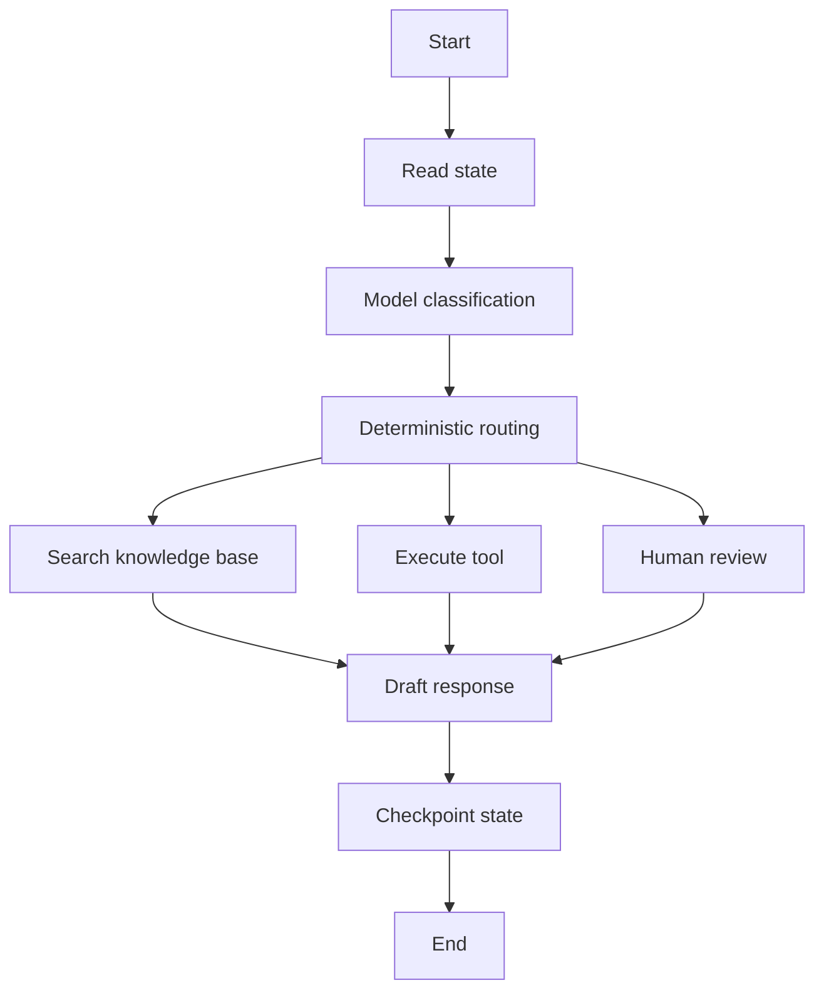

# LangGraph

LangGraph is a low-level orchestration framework and runtime for building stateful, long-running LLM agents as graphs. Where [LangChain](langchain.md) gives a higher-level agent harness and integrations, LangGraph exposes the execution structure: state schema, nodes, edges, routing, persistence, interrupts, retries, streaming, and checkpoints.

The central idea is that an agent is easier to control when it is treated as a state machine rather than a hidden chat loop. Some nodes can be deterministic functions, some can call a model, some can call tools, and some can pause for human input. The graph defines which transitions are allowed.

## What problem it solves

Many agent failures are orchestration failures rather than model failures:

- The agent loses state after a worker restart.
- A human approval step cannot resume exactly where the run paused.
- A long task has no checkpoint, so retrying repeats side effects.
- A tool failure is swallowed inside an opaque loop.
- A model is allowed to decide a transition that should be deterministic.
- Debugging requires reading a transcript instead of a state trace.

LangGraph addresses these problems by making state and control flow explicit. It is useful when the workflow needs durable execution, human-in-the-loop control, memory, branching, replay, or a mix of deterministic and model-driven steps.



## Core concepts

| Concept          | Meaning                                                                                                                                           |
| ---------------- | ------------------------------------------------------------------------------------------------------------------------------------------------- |
| State            | The typed data carried through the graph, such as messages, classification, retrieved documents, tool results, approval status, and final answer. |
| Node             | A function or runnable that reads state and returns updates. A node can be deterministic, model-driven, tool-executing, or human-facing.          |
| Edge             | A transition between nodes. Edges encode allowed control flow.                                                                                    |
| Conditional edge | A routing decision based on state, often used after classification, validation, or tool execution.                                                |
| Reducer          | Logic for merging node updates into state, especially for append-heavy fields such as messages.                                                   |
| Checkpointer     | Persistence layer that saves state snapshots so a run can resume, be inspected, or be replayed.                                                   |
| Thread           | A sequence of checkpoints for one conversation, task, user session, or workflow instance.                                                         |
| Store            | Longer-term memory shared across threads, such as user preferences or durable facts.                                                              |
| Interrupt        | A pause point where execution waits for human input, approval, or external information.                                                           |
| Runtime          | The execution context that supplies configuration, store access, streaming, tracing, and deployment behavior.                                     |

These concepts match the design advice on [agent loops](agent-loops.md): keep the model inside explicit invariants instead of letting it silently own the whole workflow.

## A minimal graph shape

This sketch shows the core structure. A real graph would add typed state fields, tools, error handling, persistence, and trace configuration.

```python
from typing import TypedDict

from langgraph.graph import END, START, StateGraph


class State(TypedDict):
    question: str
    answer: str


def draft_answer(state: State) -> dict:
    return {"answer": f"Draft answer for: {state['question']}"}


builder = StateGraph(State)
builder.add_node("draft_answer", draft_answer)
builder.add_edge(START, "draft_answer")
builder.add_edge("draft_answer", END)

graph = builder.compile()
result = graph.invoke({"question": "What policy applies?"})
print(result["answer"])
```

The value is not that this example is shorter than ordinary Python. It is that the same graph model can grow into branches, retries, interrupts, checkpoints, and state inspection without turning the workflow into an untraceable loop.

## Persistence and memory

LangGraph distinguishes short-term execution state from longer-term memory.

| Layer      | Scope                                                   | Typical use                                                                             |
| ---------- | ------------------------------------------------------- | --------------------------------------------------------------------------------------- |
| State      | One active graph run.                                   | Current messages, pending tool call, classification, retrieved documents, draft answer. |
| Checkpoint | A saved state snapshot inside a thread.                 | Resume after failure, inspect before human approval, time-travel debug.                 |
| Thread     | A sequence of checkpoints for one conversation or task. | Conversational memory and replayable task history.                                      |
| Store      | Memory shared across threads.                           | User preferences, durable facts, cross-session profile fields.                          |

For production, in-memory checkpointing is not enough because state disappears on process restart. Persistent backends such as SQLite for local development or PostgreSQL for production are the usual shape. The checkpointer must be treated as part of the reliability design: retention, encryption, deletion, and schema evolution matter because agent state can contain sensitive user data and tool results.

## When to use LangGraph

Use LangGraph when:

| Scenario                                                        | Why it fits                                                                                   |
| --------------------------------------------------------------- | --------------------------------------------------------------------------------------------- |
| The agent must survive failures or long runtimes.               | Checkpointing lets runs resume from saved state instead of starting over.                     |
| Humans need to approve, edit, or inspect intermediate state.    | Interrupts and checkpoints make human-in-the-loop workflows explicit.                         |
| Control flow mixes deterministic and model-driven steps.        | The graph can keep high-risk routing deterministic and leave flexible decisions to the model. |
| The workflow has branches, retries, compensation, or subgraphs. | Graph structure keeps transitions inspectable.                                                |
| You need replayable traces for debugging and evaluation.        | State snapshots and graph steps expose more than a final transcript.                          |
| Multi-agent coordination needs boundaries.                      | Supervisor, handoff, and subgraph patterns can encode role boundaries and routing.            |

LangGraph is often the right choice once an agent moves from demo to product workflow.

## When not to use LangGraph

LangGraph is intentionally low-level. Do not use it when a simpler abstraction is enough.

| Situation                                    | Better choice                                                                          |
| -------------------------------------------- | -------------------------------------------------------------------------------------- |
| A single tool-calling loop is sufficient.    | Use [LangChain](langchain.md) agents or direct model-tool code.                        |
| The workflow is a short fixed pipeline.      | Ordinary Python, a job orchestrator, or a service function may be clearer.             |
| The team has not defined state ownership.    | First define state, side effects, approvals, and success criteria.                     |
| Persistence creates more risk than value.    | Avoid storing sensitive intermediate state unless retention and deletion are designed. |
| The graph exists only to mirror a flowchart. | A graph should enforce runtime behavior, not merely document it.                       |

The main cost is complexity. Explicit state machines make production behavior more controllable, but they also force the team to design state schemas, merge rules, storage, routing, and failure semantics.

## Worked design example

Suppose a support email agent must classify an incoming email, search documentation, draft a response, and route high-risk cases to a human. A LangGraph design could use:

| Node                   | Deterministic or model-driven       | State update                                       |
| ---------------------- | ----------------------------------- | -------------------------------------------------- |
| `read_email`           | deterministic                       | parse sender, subject, body, and tenant ID         |
| `classify_intent`      | model-driven with structured output | intent, urgency, topic, confidence                 |
| `route_case`           | deterministic                       | next node based on urgency, policy, and confidence |
| `search_documentation` | deterministic retrieval tool        | source IDs and snippets                            |
| `draft_response`       | model-driven                        | draft answer and citations                         |
| `human_review`         | interrupt                           | approval, edits, or escalation                     |
| `send_reply`           | deterministic side-effecting tool   | delivery result and audit ID                       |

This graph keeps the model where judgement is useful: classification and drafting. It keeps permissions, routing, and sending under deterministic application control. Checkpoints make it possible to pause before `send_reply`, show a reviewer the exact state, resume after approval, and avoid re-running completed retrieval or classification steps.

## Relationship to LangChain

LangChain and LangGraph are complementary:

| Need                                                                    | Prefer                       |
| ----------------------------------------------------------------------- | ---------------------------- |
| Quick agent with model, tools, prompt, and middleware                   | LangChain                    |
| Provider integrations for models, retrievers, vector stores, and tools  | LangChain                    |
| Exact graph control over a long-running workflow                        | LangGraph                    |
| Durable execution, checkpoints, interrupts, and time-travel debugging   | LangGraph                    |
| A high-level agent loop that still benefits from persistence underneath | LangChain built on LangGraph |

The practical pattern is to use LangChain components inside LangGraph nodes. For example, a graph node might call a LangChain model, retriever, or structured-output helper, while LangGraph owns the surrounding state machine.

## Historical relevance

LangGraph emerged after the first wave of LangChain agent abstractions exposed a production gap: developers wanted agentic behavior, but also wanted deterministic control over state, branching, persistence, and human review. LangGraph answered that by moving from "chain of calls" thinking to graph-shaped orchestration.

It is also historically interesting because its design acknowledges older distributed-systems ideas. The project documentation credits Pregel and Apache Beam as inspirations, and the public graph interface draws from NetworkX. In other words, LangGraph is not only an LLM framework; it is part of a broader pattern of applying workflow, graph, and dataflow ideas to AI agents.

Its current relevance comes from long-running agents. As systems move from chat demos to workflows that read data, write tickets, ask humans, recover from failures, and keep memory across sessions, durable graph orchestration becomes more important than prompt composition alone.

## Caveats

Durable state is a product commitment. Once a graph stores checkpoints, the team must handle privacy, retention, migrations, and access control. Time-travel debugging is powerful, but it also means sensitive intermediate states may be stored unless deliberately redacted or encrypted.

Graph control does not remove model uncertainty. It only makes uncertainty easier to contain. You still need [guardrails](guardrails.md), [tool schemas](tool-schemas.md), trace-level [agent evaluation](agent-evaluation.md), and release gates.

Avoid over-graphing. Too many tiny nodes can make the system harder to understand; too few nodes can hide important transition boundaries. Split nodes where ownership, retry policy, human review, side effects, or evaluation semantics differ.

## References

- [LangGraph documentation: overview](https://docs.langchain.com/oss/python/langgraph/overview)
- [LangGraph documentation: persistence](https://docs.langchain.com/oss/python/langgraph/persistence)
- [LangGraph documentation: thinking in LangGraph](https://docs.langchain.com/oss/python/langgraph/thinking-in-langgraph)
- [LangGraph Python API reference](https://reference.langchain.com/python/langgraph/overview)
- [LangGraph GitHub repository](https://github.com/langchain-ai/langgraph)
- [Google Research: Pregel](https://research.google/pubs/pregel-a-system-for-large-scale-graph-processing/)
- [Apache Beam](https://beam.apache.org/)
- [NetworkX](https://networkx.org/)

> [!nav]
> **Section** — [Generative AI and Agentic Systems](index.md)
>
> [← LangChain](langchain.md) [Agent Evaluation →](agent-evaluation.md)
