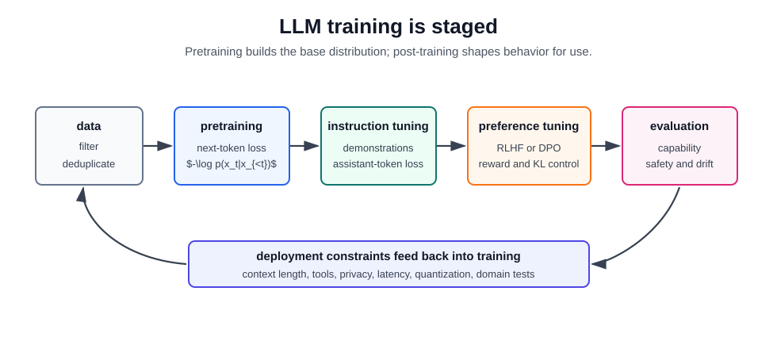

# LLM Training

LLM training is a staged process. A base model first learns a broad next-token distribution from large text or multimodal corpora. Post-training then turns that base model into a usable assistant or domain model through supervised demonstrations, [preference optimization](../07-reinforcement-learning/reinforcement-learning-from-human-feedback.md), safety data, and evaluation.

## Stage 1: Data and Tokenization

Training begins with corpus construction: collection, deduplication, filtering, quality scoring, contamination checks, safety filtering, and mixture design. [Tokenization](tokenization.md) maps text to discrete IDs so the model can optimize a vocabulary distribution.

Data mixture matters because the model learns the conditional distribution induced by the training set. More tokens are not automatically better if they are duplicated, low quality, contaminated with benchmarks, or mismatched to the intended use.

## Stage 2: Self-Supervised Pretraining

Decoder-only language models usually minimize next-token cross-entropy:

$$
L_{\mathrm{pre}}(\theta)
=-\sum_{t=1}^{T}\log p_\theta(x_t\mid x_{<t}).
$$

No human label is needed for each token; the next token in the sequence supplies the target. This is why language-model pretraining is a form of [self-supervised learning](../06-deep-learning/self-supervised-learning.md). The result is a base model that can continue text, answer some prompts, and perform in-context learning, but it is not yet reliably instruction-following.

Scaling work shows that model size, training tokens, compute, and data quality interact. A compute budget can be wasted by training a model that is too large on too few tokens or too small on too many tokens. Chinchilla-style compute-optimal training made this tradeoff explicit by arguing that parameter count and token count should scale together.

## Stage 3: Supervised Instruction Tuning

[Instruction tuning](instruction-tuning.md), also called supervised fine-tuning (SFT) in many LLM pipelines, trains on prompt-response demonstrations. For a prompt $x$ and target response tokens $y_1,\ldots,y_m$, the supervised loss is

$$
L_{\mathrm{SFT}}(\theta)
=-\sum_{t=1}^{m}\log p_\theta(y_t\mid x,y_{<t}).
$$

In chat training, the loss is usually applied to assistant tokens, not user tokens. This teaches the model how to map instructions to helpful response formats. It does not by itself solve preference tradeoffs, refusal behavior, truthfulness, or long-horizon tool use.

## Stage 4: Preference Optimization

Preference data compares candidate responses. In [RLHF](../07-reinforcement-learning/reinforcement-learning-from-human-feedback.md), a reward model learns from chosen/rejected pairs and the policy is optimized with a reward-minus-[KL](../01-mathematical-foundations/kl-divergence.md)-regularized objective:

$$
\max_\pi\;
\mathbb{E}_{x,y\sim\pi}
\left[
r_\phi(x,y)
-\beta D_{\mathrm{KL}}\left(\pi(\cdot\mid x)\,\|\,\pi_{\mathrm{ref}}(\cdot\mid x)\right)
\right].
$$

The [KL](../01-mathematical-foundations/kl-divergence.md) term matters: it prevents the model from drifting too far from the supervised model while it optimizes an imperfect reward model. Direct methods such as [DPO](../07-reinforcement-learning/reinforcement-learning-from-human-feedback.md#direct-preference-optimization) optimize from preference pairs without running a separate [PPO](../07-reinforcement-learning/policy-gradients-and-actor-critic.md#ppo) rollout/update loop, but they still depend on the same core ingredients: a reference policy, preference data, and careful evaluation.

## Stage 5: Adaptation and Serving Constraints

Domain adaptation can use continued pretraining, full fine-tuning, parameter-efficient methods such as [LoRA](../06-deep-learning/fine-tuning.md#lora-footprint), or [RAG](rag.md). Fine-tuning changes model weights; RAG changes context at inference time. For volatile facts, private corpora, or citation-heavy answers, [fine tuning versus RAG](fine-tuning-versus-rag.md) is often the more important design decision than another training run.

Serving constraints feed back into training choices. Context length, quantization, latency, refusal behavior, tool schemas, and cost targets shape what data and evaluations matter.

## Evaluation

Evaluate each stage separately:

| Stage                   | Useful checks                                                                                                     |
| ----------------------- | ----------------------------------------------------------------------------------------------------------------- |
| Pretraining             | loss curves, held-out perplexity, contamination audits, capability benchmarks                                     |
| Instruction tuning      | task-following tests, format adherence, regression sets                                                           |
| Preference optimization | win-rate studies, reward-model audits, [KL](../01-mathematical-foundations/kl-divergence.md) drift, safety checks |
| Deployment              | latency, cost, grounding quality, privacy, human review outcomes                                                  |

Training loss is not enough. A lower next-token loss can coexist with worse instruction behavior, and a higher preference score can hide reward hacking or over-refusal.

## Caveats

LLM training is not a linear recipe. Modern systems often iterate: collect failures, add demonstrations, revise preference data, update safety policies, and evaluate again. The important engineering discipline is separation of concerns: pretraining builds broad representations, instruction tuning teaches task format, preference optimization shapes behavior, and runtime systems handle retrieval, tools, privacy, and monitoring.

## Connections

- [Pretraining](pretraining.md) gives the local next-token objective in a narrower page.
- [Self-Supervised Learning](../06-deep-learning/self-supervised-learning.md) explains why next-token prediction does not require manual labels.
- [Reinforcement Learning from Human Feedback](../07-reinforcement-learning/reinforcement-learning-from-human-feedback.md) covers preference modeling and RLHF in detail.
- [Alignment](alignment.md) covers training-time and runtime controls for intended behavior.

## References

- [Kaplan et al., 2020, Scaling Laws for Neural Language Models](https://arxiv.org/abs/2001.08361)
- [Brown et al., 2020, Language Models are Few-Shot Learners](https://arxiv.org/abs/2005.14165)
- [Hoffmann et al., 2022, Training Compute-Optimal Large Language Models](https://arxiv.org/abs/2203.15556)
- [Ouyang et al., 2022, Training Language Models to Follow Instructions with Human Feedback](https://arxiv.org/abs/2203.02155)
- [Wei et al., 2022, Scaling Instruction-Finetuned Language Models](https://arxiv.org/abs/2210.11416)
- [Hu et al., 2021, LoRA: Low-Rank Adaptation of Large Language Models](https://arxiv.org/abs/2106.09685)
- [Rafailov et al., 2023, Direct Preference Optimization](https://arxiv.org/abs/2305.18290)

> [!nav]
> **Section** — [Generative AI and Agentic Systems](index.md)
>
> [← Pretraining](pretraining.md) [Instruction Tuning →](instruction-tuning.md)
