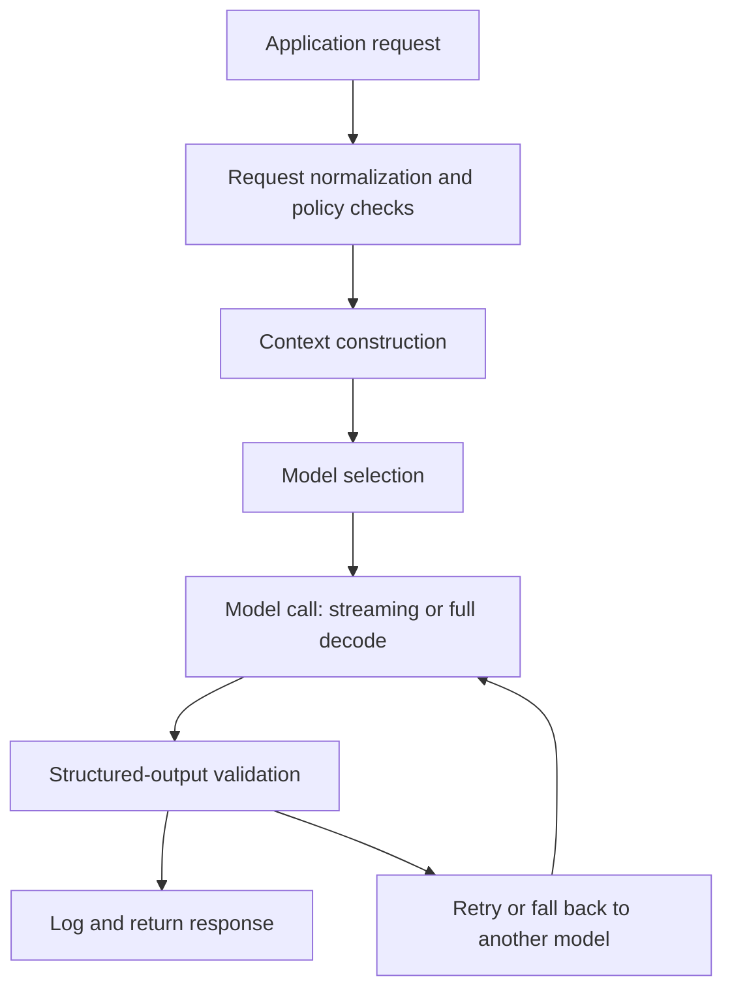

# Model Serving

Model serving is the runtime layer that turns application requests into model responses. It handles routing, rate limits, streaming, batching, retries, fallbacks, validation, and observability across [local versus hosted models](local-versus-hosted-models.md).

## Mechanism

A serving path typically runs request normalization, policy checks, [context construction](context-construction.md), model selection, model call, streaming or full decode, [structured output](structured-output.md) validation, logging, and retry or fallback. Local serving adds scheduler choices such as batching, KV-cache reuse, [quantization](quantization.md), and GPU memory management. Hosted serving adds provider rate limits, network latency, data-retention policy, and vendor-specific request features.



The serving layer should log enough to reproduce and debug behavior without storing sensitive prompts unnecessarily: model identifier, prompt or context hash, tool versions, schema version, token counts, latency, retry count, validation result, and final status.

## Concrete artifact

```yaml
route: support_answer_v3
model_policy:
  primary: hosted_reasoning_model
  fallback: smaller_hosted_model
  timeout_ms: 12000
  max_retries: 1
validation:
  response_schema: support_answer.schema.json
  on_schema_fail: retry_once_then_escalate
observability:
  log_fields:
    [model, prompt_hash, context_hash, input_tokens, output_tokens, latency_ms, validator_result]
```

This record supports [determinism and reproducibility](determinism-and-reproducibility.md): if an answer changes, the team can tell whether the model, prompt, context, schema, or serving route changed.

## Caveats

Retries can duplicate side effects unless tool calls are idempotent. Fallback models may not satisfy the same schema, latency, or safety behavior. Streaming improves perceived latency but complicates validation because the application may need to buffer before showing or acting on unsafe partial output.

## References

- [OpenAI API documentation: Latency optimization](https://platform.openai.com/docs/guides/latency-optimization)
- [OpenAI API documentation: Text generation](https://platform.openai.com/docs/guides/text-generation)
- [OpenAI API documentation: Structured outputs](https://platform.openai.com/docs/guides/structured-outputs)
