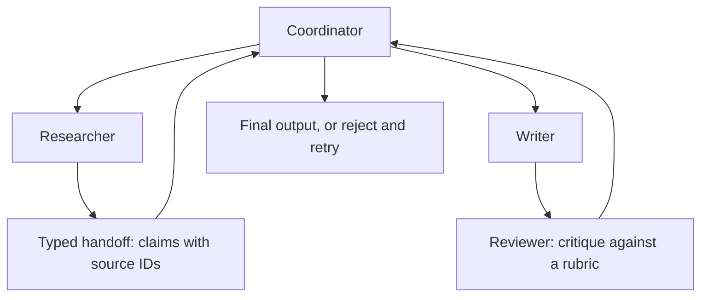

# Multi-Agent Systems

A multi-agent system uses more than one model role or policy loop, such as researcher, planner, coder, reviewer, and coordinator. It extends [agentic systems](agentic-systems.md), but it also increases coordination cost and [agent evaluation](agent-evaluation.md) complexity.

## Mechanism

The reliable version is not free-form chat between personas. It is a protocol: role, input contract, output schema, allowed tools, handoff condition, and stop rule. [Tool routing](tool-routing.md) should remain centralized when tools have permissions or side effects. [Reflection and reviewer patterns](reflection-and-reviewer-patterns.md) are a two-role special case where one role produces and another critiques against a rubric.

Shared evidence matters more than role labels. If the researcher passes unsourced prose to the writer, the writer inherits unverified claims. A better handoff passes claim objects with source IDs, confidence, and unresolved questions. The coordinator then decides whether the next role has enough evidence to proceed.



## Concrete artifact

```json
{
  "handoff": "researcher_to_writer",
  "payload": {
    "claims": [
      {
        "text": "Enterprise refunds above 500 EUR require manager approval.",
        "source_id": "policy-7"
      }
    ],
    "open_questions": ["Does the customer have enterprise status?"]
  },
  "acceptance": "all_claims_have_sources"
}
```

This artifact makes the handoff auditable. The writer receives source-linked claims rather than a free-form summary, and the coordinator can reject the handoff when a claim lacks evidence or when an open question blocks a safe answer. That is the difference between a multi-agent workflow and several prompts passing unverified prose to each other.

## Caveats

More agents can amplify errors through plausible summaries. Use typed handoffs, shared evidence stores, and centralized permission checks rather than relying on conversational memory. Add agents only when the role boundary removes real complexity or creates an auditable review point.

## References

- [OpenAI API documentation: Agents SDK](https://platform.openai.com/docs/guides/agents)
- [OpenAI API documentation: Using tools](https://platform.openai.com/docs/guides/tools)
- [OpenAI API documentation: Evals](https://platform.openai.com/docs/guides/evals)

> [!nav]
> **Section** — [Generative AI and Agentic Systems](index.md)
>
> [← Reflection and Reviewer Patterns](reflection-and-reviewer-patterns.md) [Harnesses →](harnesses.md)
