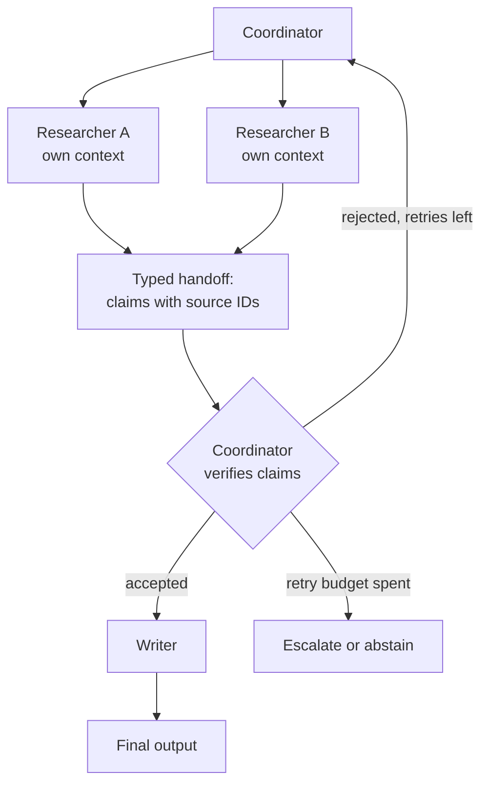

# Multi-Agent Systems

A multi-agent system uses more than one model role or policy loop, such as researcher, planner, coder, reviewer, and coordinator. It extends [agentic systems](agentic-systems.md), but it also increases coordination cost and [agent evaluation](agent-evaluation.md) complexity. Add roles only when the boundary creates better evidence, review, parallelism, or context isolation. Controlled studies from 2025–26 show that many reported multi-agent gains disappear once compute is matched.

## Protocol over personas

The reliable version is not free-form chat between personas. It is a protocol: role, input contract, output schema, allowed tools, handoff condition, and stop rule. [Tool routing](tool-routing.md) should remain centralized when tools have permissions or side effects. [Reflection and reviewer patterns](reflection-and-reviewer-patterns.md) are a two-role special case where one role produces and another critiques against a rubric.

Shared evidence matters more than role labels. If the researcher passes unsourced prose to the writer, the writer inherits unverified claims. A better handoff passes claim objects with source IDs, confidence, and unresolved questions. The coordinator then decides whether the next role has enough evidence to proceed.

[LangGraph](langgraph.md) is a natural fit when those roles need explicit state, handoffs, checkpoints, or human interrupts. [LangChain](langchain.md) components can still run inside individual role nodes for model calls, tools, retrieval, and structured outputs.

The most common productive shape is orchestrator-workers: a coordinator fans independent subtasks out to workers with their own context windows, collects typed results, and verifies before writing.


```mermaid
flowchart TD
  Coordinator[Coordinator] --> R1["Researcher A<br/>own context"]
  Coordinator --> R2["Researcher B<br/>own context"]
  R1 --> Handoff["Typed handoff:<br/>claims with source IDs"]
  R2 --> Handoff
  Handoff --> Verify{"Coordinator<br/>verifies claims"}
  Verify -->|accepted| Writer[Writer]
  Verify -->|"rejected, retries left"| Coordinator
  Verify -->|"retry budget spent"| Escalate[Escalate or abstain]
  Writer --> Output[Final output]
```

## A typed handoff

```json
{
  "handoff": "researcher_to_writer",
  "payload": {
    "claims": [
      {
        "text": "Enterprise refunds above 500 EUR require manager approval.",
        "source_id": "policy-7"
      }
    ],
    "open_questions": ["Does the customer have enterprise status?"]
  },
  "acceptance": "all_claims_have_sources"
}
```

This artifact makes the handoff auditable. The writer receives source-linked claims rather than a free-form summary, and the coordinator can reject the handoff when a claim lacks evidence or when an open question blocks a safe answer. That is the difference between a multi-agent workflow and several prompts passing unverified prose to each other.

## What the evidence shows

Most multi-agent systems spend more tokens than the single-agent baselines they are compared with. Recent work separates architecture effects from compute effects:

| Study                | Setup                                                                                                                                                                                         | Finding                                                                                                                                                                                                                                                                                                                                                                                                   |
| -------------------- | --------------------------------------------------------------------------------------------------------------------------------------------------------------------------------------------- | --------------------------------------------------------------------------------------------------------------------------------------------------------------------------------------------------------------------------------------------------------------------------------------------------------------------------------------------------------------------------------------------------------- |
| Tran and Kiela, 2026 | Single agent versus several multi-agent architectures on multi-hop QA (FRAMES, MuSiQue), with equal thinking-token budgets, across Qwen3, DeepSeek-R1-Distill-Llama, and Gemini 2.5           | Single agents consistently matched or beat the multi-agent systems. Multi-agent systems became competitive only when the single agent's context was degraded (long, noisy, or distractor-heavy) or when they spent more compute. API-level budget controls and benchmark artifacts inflated apparent multi-agent gains.                                                                                   |
| Kim et al., 2025     | 260 configurations: single agent plus independent, centralized, decentralized, and hybrid multi-agent designs, six benchmarks, three model families, standardized tools, prompts, and compute | The effect ranged from +80.8% (decomposable financial reasoning, centralized) to −70% (sequential planning, independent). Every multi-agent variant lost 39–70% on planning. Once the single agent solved more than about 45% of tasks, additional agents showed diminishing or negative returns. Independent agents amplified trace-level errors 17.2×; centralized verification contained this to 4.4×. |
| Fu et al., 2026      | Single agent versus six multi-agent workflows under one execution, tool-access, and usage-accounting protocol, ten benchmarks, GPT-4.1                                                        | At most one of six multi-agent workflows exceeded the matched single agent. The other five trailed by 2.6–11.3 points at higher cost.                                                                                                                                                                                                                                                                     |
| Anthropic, 2025      | Production research agent: Claude Opus 4 lead with Claude Sonnet 4 subagents                                                                                                                  | The multi-agent system beat a single Opus 4 agent by 90.2% on an internal research eval but used about 15× the tokens of a chat. On BrowseComp, token usage alone explained 80% of performance variance. The authors flag coding and tasks with many inter-agent dependencies as poor fits.                                                                                                               |
| Cemri et al., 2025   | 1,600+ annotated traces from seven open-source multi-agent frameworks                                                                                                                         | 14 failure modes in three groups: system design and specification, inter-agent misalignment, and task verification. Failure rates across the seven frameworks ranged from 41% to 86.7%.                                                                                                                                                                                                                   |

Read together, these results point one way. Multi-agent systems help when the task decomposes into independent parts that exceed one context window, such as breadth-first research. They hurt on sequential tasks where each step depends on the last, on tool-heavy workflows where coordination fragments the tool budget, and when a single agent is already strong. Much of the headline benefit is extra compute and fresh context, not collaboration. A multi-agent result reported without a budget-matched single-agent baseline cannot be attributed to the architecture. Liu et al. (2026) give a theory for this: finite context windows, lossy messages between agents, and correlated errors among similar agents decide whether adding agents under a fixed budget helps, saturates, or collapses.

These are recent studies, several of them preprints, on specific benchmarks and 2025–26 models. The direction is consistent across them, but thresholds such as the 45% baseline level will move as models change.

## When multiple agents help

| Task structure                                                      | Recommendation                            | Why                                                                        |
| ------------------------------------------------------------------- | ----------------------------------------- | -------------------------------------------------------------------------- |
| Many independent subtasks, such as a wide literature or market scan | Orchestrator with parallel workers        | Each worker gets a fresh context; wall-clock time drops.                   |
| Exploration would flood the main context                            | Subagent returns a compact typed summary  | Context isolation; the main agent keeps only the result.                   |
| High-risk output needs independent critique                         | Drafter → reviewer with evidence          | Adds a verification point, which limits error propagation.                 |
| Tool execution needs approval                                       | Planner → executor → human gate           | Separates proposing from acting.                                           |
| Sequential steps with tight dependencies                            | Single agent                              | Handoffs lose information; planning tasks lost 39–70% in controlled tests. |
| Many tools in one workflow                                          | Single agent, or centralized tool routing | Splitting agents splits the tool budget and adds coordination overhead.    |
| Single agent already solves most cases                              | Improve the single agent                  | Coordination overhead exceeds the remaining headroom.                      |

The split is also less useful when all roles see the same context, use the same tools, and produce free-form summaries. That usually adds latency without adding control.

## Model versus harness

Agent SDKs and frontier models now support delegation natively: a lead agent can spawn subagents, write task briefs, and merge results. That makes the orchestration step cheaper to build but not safer. The harness still owns:

- the maximum number of agents, parallel fan-out, and total token budget
- which tools and permissions each role receives
- the schema of handoffs and the acceptance check at the coordinator
- verification before aggregation, which is where Kim et al. found error amplification dropping from 17.2× to 4.4×
- retry limits and escalation when verification keeps failing

## Running a fair comparison

Before adopting a multi-agent design, compare it with a single agent that gets the same budget:

```json
{
  "experiment": "research_agent_architecture",
  "cases": "eval_cases/research_questions.jsonl",
  "repeats_per_case": 5,
  "arms": [
    { "name": "single_agent", "max_total_tokens": 400000 },
    {
      "name": "single_agent_long_thinking",
      "max_total_tokens": 400000,
      "reasoning_effort": "high"
    },
    { "name": "orchestrator_3_workers", "max_total_tokens": 400000, "max_parallel_workers": 3 }
  ],
  "report": [
    "success_rate_ci95",
    "pass_hat_k",
    "tokens_per_success",
    "wall_clock_p50",
    "handoff_rejection_rate"
  ]
}
```

The rules that make the comparison valid:

1. **Match total tokens across all agents,** including reasoning tokens. Verify the budget from usage logs, not from the API parameter. Tran and Kiela found artifacts in API-based budget controls, notably for Gemini 2.5.
2. **Include a "single agent, longer thinking" arm.** If it closes the gap, the gain came from compute.
3. **Hold tools, prompts, and the answer contract fixed** across arms.
4. **Test at more than one base-model strength.** Gains that exist only with a weaker model will fade as models improve.
5. **Report cost per solved task and wall-clock latency.** Parallel workers can win on time while losing on cost.

## Evaluation

Evaluate role handoffs, not only final output. A trace should show which role produced each claim, which source supports it, which role accepted or rejected it, and which unresolved questions remained. Classify failures with the three MAST groups: specification, inter-agent misalignment, and verification. Each group points to a different fix: the prompt and role contract, the handoff schema, or the verifier.

Metrics include:

- handoff rejection rate
- unsupported-claim rate after review
- number of role turns
- tokens per solved task
- latency
- human-escalation rate
- the gap to the budget-matched single-agent baseline

## Caveats

More agents can amplify errors through plausible summaries. Use typed handoffs, shared evidence stores, and centralized permission checks rather than relying on conversational memory. Add agents only when the role boundary removes real complexity, enables real parallelism, or creates an auditable review point. Otherwise, a single well-instrumented [agent loop](agent-loops.md) is easier to test and operate.

## History

Multi-agent prompting took off in 2023 with role-playing frameworks (CAMEL, MetaGPT, AutoGen) and multi-agent debate. These systems usually reported gains without matching compute to a single-agent baseline. The 2025–26 studies above reassess those claims under controlled budgets.

## References

- [Tran and Kiela, 2026, Single-Agent LLMs Outperform Multi-Agent Systems on Multi-Hop Reasoning Under Equal Thinking Token Budgets](https://arxiv.org/abs/2604.02460)
- [Kim et al., 2025, Towards a Science of Scaling Agent Systems](https://arxiv.org/abs/2512.08296)
- [Fu et al., 2026, Do More Agents Help? Controlled and Protocol-Aligned Evaluation of LLM Agent Workflows](https://arxiv.org/abs/2606.05670)
- [Cemri et al., 2025, Why Do Multi-Agent LLM Systems Fail?](https://arxiv.org/abs/2503.13657)
- [Liu et al., 2026, Phase Transition for Budgeted Multi-Agent Synergy](https://arxiv.org/abs/2601.17311)
- [Anthropic Engineering, 2025, How we built our multi-agent research system](https://www.anthropic.com/engineering/multi-agent-research-system)
- [OpenAI API documentation: Agents SDK](https://platform.openai.com/docs/guides/agents)

> [!nav]
> **Section** — [Generative AI and Agentic Systems](index.md)
>
> [← Reflection and Reviewer Patterns](reflection-and-reviewer-patterns.md) [Evaluation Harnesses →](evaluation-harnesses.md)
