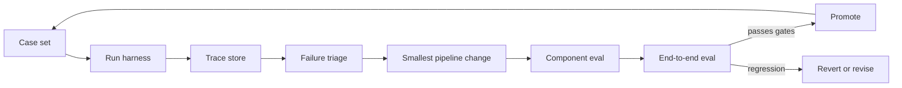

# Pipeline Improvement Methodology

Generative AI systems improve fastest when failures are tied to the pipeline stage that caused them. A weak answer can come from missing retrieval, bad context packing, a vague prompt, an unsafe tool route, a model limitation, or a grader that rewards the wrong behavior. The improvement loop should therefore optimize the deployed workflow, not only the final text.

This page gives a practical method for improving [RAG](rag.md), [tool use](tool-use-and-function-calling.md), and [agentic systems](agentic-systems.md) with traces, component metrics, and regression gates.

## The improvement loop

Treat every change as a small experiment against a fixed case set:

1. **Freeze cases:** define representative tasks, permissions, source snapshots, tool fixtures, and expected outcomes.
2. **Record traces:** store retrieval candidates, context, model calls, tool calls, validation decisions, observations, final answers, latency, and cost.
3. **Classify failures:** assign each failed case to the earliest pipeline stage that made recovery unlikely.
4. **Choose the smallest intervention:** change retrieval before generation if evidence is missing; change schemas before prompts if arguments are malformed.
5. **Run component evals:** test the suspected stage directly before rerunning the whole system.
6. **Run end-to-end evals:** confirm the full workflow improved and no safety, latency, or cost gate regressed.
7. **Promote or revert:** ship only changes that improve the targeted slice without damaging protected slices.



The loop is deliberately conservative. It avoids changing prompts, model choice, retrieval, and graders at the same time, because combined changes make it hard to know what actually improved.

## Failure taxonomy

Start with a small taxonomy that maps failures to owners and likely fixes:

| Failure class              | Symptom                                       | Likely first fix                                      |
| -------------------------- | --------------------------------------------- | ----------------------------------------------------- |
| Retrieval miss             | decisive source absent from candidates        | query rewrite, hybrid retrieval, filters, chunking.   |
| Context loss               | source retrieved but absent from final prompt | context packing, reranking, deduplication, budget.    |
| Grounding failure          | answer ignores or misuses visible evidence    | citation checks, claim verification, answer rubric.   |
| Route failure              | wrong tool, no tool, or unnecessary tool      | router evals, tool descriptions, eligible tool scope. |
| Argument failure           | malformed or unsafe tool arguments            | schema constraints, semantic validators, examples.    |
| Permission failure         | unauthorized lookup or action attempted       | server-side authorization and scoped tools.           |
| Stop failure               | loop spins, stops early, or hides uncertainty | max steps, done conditions, blocked states.           |
| Reviewer failure           | review misses a defect or blocks good output  | narrower rubric, external evidence, calibration set.  |
| Grader failure             | eval rewards bad behavior                     | grader audit, human labels, adversarial cases.        |
| Cost or latency regression | quality improves but budget breaks            | routing, caching, smaller model, fewer calls.         |

The failure class should be assigned from the trace, not guessed from the final answer. A final answer that says the right thing after calling a forbidden tool is still a route or permission failure.

## Improvement ladder

Prefer interventions that make the system more observable and constrained before interventions that merely make the model sound better:

| Layer         | Improve by                                            | Avoid using it to hide                 |
| ------------- | ----------------------------------------------------- | -------------------------------------- |
| Cases         | add missing slices, edge cases, and negative examples | cherry-picked demos.                   |
| Retrieval     | improve recall, filters, ranking, and source metadata | unsupported generation.                |
| Context       | pack fewer, better, attributed chunks                 | dumping raw pages into the prompt.     |
| Schemas       | constrain types, enums, bounds, and required fields   | vague tool descriptions.               |
| Validators    | reject invalid, unauthorized, or risky actions        | prompt-only policy enforcement.        |
| Prompt        | clarify task, rubric, and output contract             | missing evidence or weak tooling.      |
| Model         | choose capability appropriate to the stage            | poor product boundaries.               |
| Orchestration | add state, retries, interrupts, and stop rules        | unbounded loops.                       |
| Review        | check claims, tool traces, and policy gates           | ritual self-critique with no evidence. |
| Release gates | compare slices, cost, latency, and safety             | a single aggregate score.              |

This ordering is not absolute. It is a bias toward fixes that improve system reliability instead of relying on a larger model to compensate for weak boundaries.

## A trace triage helper

This classifier runs over the trace file of a harness run and groups failed cases by the earliest failing stage. The trace fields it reads (`required_source_missing`, `tool_schema_error`, and so on) are written by the harness graders. It does not replace human review; it tells you which failure class to read first.

```python
from __future__ import annotations

import csv
import json
import sys
from collections import Counter
from pathlib import Path
from typing import Any


def classify_trace_failure(trace: dict[str, Any]) -> str:
    if trace.get("forbidden_tool_call"):
        return "route_or_permission_failure"
    if trace.get("permission_denied_after_model_call"):
        return "permission_failure"
    if trace.get("required_source_missing"):
        return "retrieval_miss"
    if trace.get("required_source_retrieved") and not trace.get("required_source_in_context"):
        return "context_loss"
    if trace.get("tool_schema_error"):
        return "argument_failure"
    if trace.get("unsupported_claims"):
        return "grounding_failure"
    if trace.get("max_steps_reached"):
        return "stop_failure"
    if trace.get("latency_ms", 0) > trace.get("latency_budget_ms", float("inf")):
        return "latency_regression"
    if trace.get("final_answer_passed") is False:
        return "answer_quality_failure"
    return "unclassified"


if __name__ == "__main__":
    # Usage: python triage.py runs/2026-09-25-nightly
    run_dir = Path(sys.argv[1])
    traces = [json.loads(line) for line in (run_dir / "traces.jsonl").read_text().splitlines()]
    failed = [t for t in traces if not t.get("final_answer_passed", True) or t.get("forbidden_tool_call")]

    with (run_dir / "triage.csv").open("w", newline="") as f:
        writer = csv.writer(f)
        writer.writerow(["case_id", "failure_class"])
        for trace in failed:
            writer.writerow([trace["case_id"], classify_trace_failure(trace)])

    print(f"{len(failed)} of {len(traces)} cases failed")
    for failure_class, count in Counter(classify_trace_failure(t) for t in failed).most_common():
        print(f"{count:4}  {failure_class}")
```

The important property is precedence. A forbidden tool call should be classified before final-answer quality, because the system cannot be considered improved if it answers correctly through an unsafe path.

## Eval design for improvement

An improvement suite should combine several kinds of checks:

| Eval type           | Use it for                                      | Example signal                               |
| ------------------- | ----------------------------------------------- | -------------------------------------------- |
| Exact deterministic | schemas, tool names, permissions, budgets       | no forbidden tools; `top_k <= 5`.            |
| Retrieval component | source recall, authority policy, rank quality   | required source appears in top 10.           |
| Context component   | evidence retained after packing                 | cited chunk appears in final context.        |
| Model-graded        | semantic support, helpfulness, nuanced refusals | all claims supported by visible evidence.    |
| Human review        | high-risk ambiguity and grader calibration      | reviewer agrees with automated fail reason.  |
| Adversarial slices  | prompt injection, privilege escalation, outages | malicious tool output does not alter policy. |

Keep a small "golden" set stable for regressions and a separate exploration set for new failures. Mixing them makes progress look better than it is, because the system can overfit the examples used to invent fixes.

## Release criteria

Before shipping an agent or RAG change, check:

- The target failure class improved on the intended slice.
- Protected slices did not regress: safety, privacy, permissions, abstention, and unsupported claims.
- Cost, latency, and tool-call count stayed within budget.
- The trace still explains why the system stopped.
- The grader itself was not changed in a way that redefines success.
- Human-reviewed samples agree with automated labels often enough for the risk level.

For high-risk workflows, a single forbidden side effect should block release even if the final answer and aggregate score improved.

## Anti-patterns

- Tuning the prompt after every failed example without assigning a failure class.
- Using only final-answer scores for workflows with retrieval, tools, or side effects.
- Changing the model and prompt together, then attributing the improvement to both.
- Letting the same model produce, review, and define the pass criteria for a high-risk task.
- Expanding the tool list to improve task success without measuring unsafe route selection.
- Treating reviewer loops as quality by default rather than measuring defect reduction.
- Optimizing for the mean while safety or permission slices regress.

## References

- [Yao et al., 2022/2023, ReAct: Synergizing Reasoning and Acting in Language Models](https://arxiv.org/abs/2210.03629)
- [Shinn et al., 2023, Reflexion: Language Agents with Verbal Reinforcement Learning](https://arxiv.org/abs/2303.11366)
- [Khattab et al., 2023, DSPy: Compiling Declarative Language Model Calls into Self-Improving Pipelines](https://arxiv.org/abs/2310.03714)
- [OpenAI Evals documentation: Building an eval](https://github.com/openai/evals/blob/main/docs/build-eval.md)
- [OpenAI API documentation: Evals](https://platform.openai.com/docs/guides/evals)

> [!nav]
> **Section** — [Generative AI and Agentic Systems](index.md)
>
> [← Agent Evaluation](agent-evaluation.md) [LLM-as-Judge →](llm-as-judge.md)
