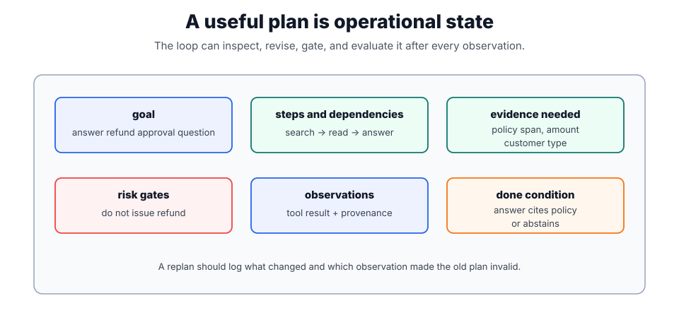

# Planning

Planning decomposes a goal into actions before execution or replans after observations. In [agent loops](agent-loops.md), a plan is useful only when it improves tool choice, dependency ordering, evidence gathering, or stopping behavior. It is not valuable as hidden prose that cannot be inspected, evaluated, or revised.

For generative systems, planning is a control mechanism. It should reduce the search space and expose dependencies; it should not become an excuse for an unconstrained model to take more actions.

## The plan as a state object

A plan should be a state object. Useful fields include goal, steps, dependencies, allowed tools, evidence needed, risk gates, and done condition. [Tool routing](tool-routing.md) maps planned steps to callable tools, while [agent evaluation](agent-evaluation.md) checks whether the trace followed the plan or revised it for a valid reason.

Planning can happen once at the beginning, incrementally after each observation, or through a planner/reviewer split. Incremental planning is safer for workflows where tool output can invalidate the original path. The loop should log both the previous plan and the reason for any replan.

When plans become operational state rather than explanatory text, [LangGraph](langgraph.md) can encode plan fields, allowed transitions, replanning nodes, and approval interrupts directly in the graph.



The plot treats a plan like state that software can inspect. The top row says what the agent is trying to do, which steps are allowed, and what evidence must exist before answering. The bottom row records risk gates, observations, and the done condition; these fields are what make replanning and evaluation possible after each tool result.

## Planning patterns

| Pattern              | How it works                                   | Best when                                    | Failure mode                                |
| -------------------- | ---------------------------------------------- | -------------------------------------------- | ------------------------------------------- |
| Next-action planning | Decide only the next tool or question.         | tool output is uncertain or tasks are short. | myopic loops that miss dependencies.        |
| Upfront plan         | Generate a step list before acting.            | dependencies are stable and reviewable.      | stale plan after new evidence arrives.      |
| Plan-and-execute     | Planner writes steps; executor performs them.  | workflows need separation of concerns.       | executor follows a weak plan too literally. |
| Replanning loop      | Revise the plan after observations.            | tools can fail or evidence changes the path. | hidden churn unless plan diffs are logged.  |
| Planner-reviewer     | A reviewer checks risk gates before execution. | side effects, compliance, or high cost.      | latency and over-refusal.                   |

## A plan object

```json
{
  "goal": "answer refund approval question",
  "steps": [
    { "id": "s1", "action": "search_refund_policy", "needs": ["policy_version"] },
    { "id": "s2", "action": "read approval threshold", "depends_on": ["s1"] },
    { "id": "s3", "action": "answer_with_citation", "depends_on": ["s2"] }
  ],
  "risk_gates": ["do_not_issue_refund", "cite_policy_span"],
  "done_when": "answer cites policy span or abstains"
}
```

The important fields are not the prose labels; they are the invariants. `risk_gates` says what must not happen, `depends_on` says what evidence is needed before a step can run, and `done_when` prevents endless action. A plan that lacks a done condition is just a suggestion.

## Refund Approval Plan

A user asks, "Can we approve this enterprise refund?" A weak plan might be:

```text
1. Look up customer.
2. Check policy.
3. Approve refund.
```

That plan is unsafe because it smuggles a side effect into the final step. A better plan separates answering from acting:

```text
1. Retrieve the refund policy for the current policy version.
2. Read the ticket amount and customer type already visible in the case.
3. Determine whether approval is required.
4. Answer with citation; do not issue a refund.
5. If the user asks to issue the refund, route to a separate confirmed workflow.
```

This plan is narrower, testable, and compatible with [tool use and function calling](tool-use-and-function-calling.md) controls.

## Evaluation

Planning quality should be evaluated from traces, not from how plausible the plan sounds. Useful checks include whether the plan names required evidence, whether every tool call maps to a planned step or a logged replan, whether risk gates are respected, and whether the done condition is reached without unnecessary actions.

## Caveats

Plans become harmful when the model follows an obsolete plan after tool output contradicts it. Replanning must be explicit and logged. Long plans also create false confidence; for uncertain tasks, the next best action and evidence requirement are often more useful than a fully specified route. Planning is not a substitute for authorization, confirmation, or deterministic stop rules.

## References

- [OpenAI API documentation: Agents SDK](https://platform.openai.com/docs/guides/agents)
- [OpenAI API documentation: Using tools](https://platform.openai.com/docs/guides/tools)
- [OpenAI API documentation: Evals](https://platform.openai.com/docs/guides/evals)

> [!nav]
> **Section** — [Generative AI and Agentic Systems](index.md)
>
> [← Agentic Systems](agentic-systems.md) [Memory →](memory.md)
