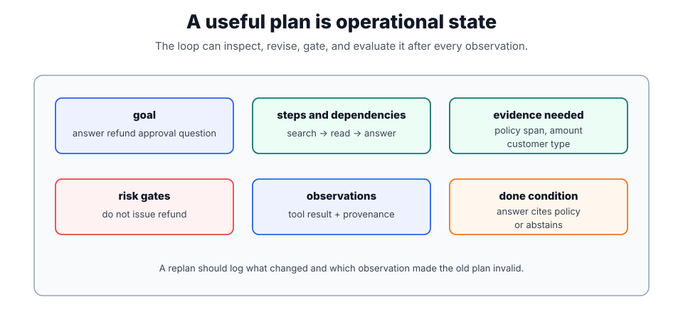

# Planning

Planning decomposes a goal into actions before execution or replans after observations. In [agent loops](agent-loops.md), a plan is useful only when it improves tool choice, dependency ordering, evidence gathering, or stopping behavior. It is not valuable as hidden prose that cannot be inspected, evaluated, or revised.

For generative systems, planning is a control mechanism. It should reduce the search space and expose dependencies; it should not become an excuse for an unconstrained model to take more actions. Current evidence (below) supports one division of labor: the model proposes plans, and deterministic code checks them.

## The plan as a state object

A plan should be a state object. Useful fields include goal, steps, dependencies, allowed tools, evidence needed, risk gates, and done condition. [Tool routing](tool-routing.md) maps planned steps to callable tools, while [agent evaluation](agent-evaluation.md) checks whether the trace followed the plan or revised it for a valid reason.

Planning can happen once at the beginning, incrementally after each observation, or through a planner/reviewer split. Incremental planning is safer for workflows where tool output can invalidate the original path. The loop should log both the previous plan and the reason for any replan.

When plans become operational state rather than explanatory text, [LangGraph](langgraph.md) can encode plan fields, allowed transitions, replanning nodes, and approval interrupts directly in the graph.



The diagram treats a plan like state that software can inspect. The top row says what the agent is trying to do, which steps are allowed, and what evidence must exist before answering. The bottom row records risk gates, observations, and the done condition; these fields are what make replanning and evaluation possible after each tool result.

## Planning patterns

| Pattern                                                                 | How it works                                                               | Best when                                               | Cost                                                                   | Failure mode                                        |
| ----------------------------------------------------------------------- | -------------------------------------------------------------------------- | ------------------------------------------------------- | ---------------------------------------------------------------------- | --------------------------------------------------- |
| Next-action planning ([ReAct](agent-loops.md#react-reason-act-observe)) | Decide only the next tool or question.                                     | Tool output is uncertain or tasks are short.            | One model call per step; context grows each step.                      | Greedy, short-sighted commitments on long horizons. |
| Upfront plan                                                            | Generate a step list before acting.                                        | Dependencies are stable and reviewable.                 | One planning call; cheap execution.                                    | Stale plan after new evidence arrives.              |
| Plan-and-execute                                                        | Planner writes steps; executor performs them.                              | Workflows need separation of concerns.                  | Planner call plus executor calls; the executor can be a cheaper model. | Executor follows a weak plan too literally.         |
| Parallel plan graph                                                     | Planner emits a dependency graph; independent calls run concurrently.      | Many independent lookups.                               | Lower latency; similar tokens.                                         | A wrong dependency edge hides a needed input.       |
| Replanning loop                                                         | Revise the plan after observations.                                        | Tools can fail or evidence changes the path.            | Extra planning calls per replan.                                       | Hidden churn unless plan versions are logged.       |
| Lookahead or search                                                     | Score candidate actions by estimated downstream outcome before committing. | Long horizons where early choices constrain later ones. | Several times the tokens of greedy planning.                           | Value estimates are themselves model guesses.       |
| Planner-verifier                                                        | A validator or reviewer checks the plan before execution.                  | Side effects, compliance, or high cost.                 | Validator is cheap; model reviewer adds a call.                        | Latency and over-refusal with model reviewers.      |

## A plan object

```json
{
  "plan_version": 1,
  "goal": "answer whether an enterprise refund needs approval",
  "steps": [
    { "id": "s1", "tool": "search_refund_policy", "produces": "policy_span" },
    { "id": "s2", "tool": "get_ticket", "produces": "ticket" },
    {
      "id": "s3",
      "tool": "answer_with_citation",
      "depends_on": ["s1", "s2"],
      "requires": ["policy_span", "ticket"]
    }
  ],
  "risk_gates": { "forbidden_tools": ["issue_refund"] },
  "done_when": {
    "any_of": [
      { "fact": "answer.citation", "exists": true },
      { "fact": "answer.abstained", "equals": true }
    ]
  }
}
```

The important fields are the invariants, and each one can be checked by code:

- Every step names a callable tool, not a prose activity.
- `risk_gates` lists what must not happen.
- `depends_on` and `requires` say what evidence must exist before a step can run.
- `done_when` is a predicate over facts the runtime records, so the model cannot end the task just by claiming it is finished.

A plan whose done condition is prose is only a suggestion.

When the plan changes, log a new version rather than editing in place:

```json
{
  "from_version": 1,
  "to_version": 2,
  "trigger": "s1 returned no policy for version 2026-07",
  "change": "add s1b: search policy version 2026-04 and flag the version gap in the answer",
  "proposed_by": "model",
  "accepted_by": "plan_validator"
}
```

## Checking plans before execution

The most reliable use of a model in planning is to propose a plan that deterministic code then verifies. This is the LLM-Modulo design (Kambhampati et al., 2024). In the code below, a model call proposes the plan, a validator checks it, and validation errors go back to the model for repair:

```python
from __future__ import annotations

import json
import os
from typing import Any

from openai import OpenAI

MODEL = os.environ.get("OPENAI_MODEL", "gpt-4o")
client = OpenAI()

TOOL_DESCRIPTIONS = {  # the same tools the executor exposes
    "search_refund_policy": "Search approved refund policy passages. Produces policy_span.",
    "get_ticket": "Read the support ticket: amount, customer tier. Produces ticket.",
    "answer_with_citation": "Write the final answer citing a policy span. Requires policy_span and ticket.",
}

PLAN_FORMAT = {
    "type": "json_schema",
    "name": "plan",
    "schema": {
        "type": "object",
        "properties": {
            "goal": {"type": "string"},
            "steps": {
                "type": "array",
                "items": {
                    "type": "object",
                    "properties": {
                        "id": {"type": "string"},
                        "tool": {"type": "string"},
                        "depends_on": {"type": "array", "items": {"type": "string"}},
                        "requires": {"type": "array", "items": {"type": "string"}},
                        "produces": {"type": "string"},
                    },
                    "required": ["id", "tool", "depends_on", "requires", "produces"],
                    "additionalProperties": False,
                },
            },
        },
        "required": ["goal", "steps"],
        "additionalProperties": False,
    },
    "strict": True,
}


class PlanRejected(Exception):
    pass


def validate_plan(plan: dict[str, Any], allowed_tools: set[str]) -> list[str]:
    """Return every reason the runtime should reject this plan; empty means executable."""
    errors: list[str] = []
    steps = {step["id"]: step for step in plan["steps"]}
    forbidden = set(plan.get("risk_gates", {}).get("forbidden_tools", []))

    for step in plan["steps"]:
        if step["tool"] in forbidden:
            errors.append(f"{step['id']}: forbidden tool {step['tool']}")
        elif step["tool"] not in allowed_tools:
            errors.append(f"{step['id']}: unknown tool {step['tool']}")
        for dep in step.get("depends_on", []):
            if dep not in steps:
                errors.append(f"{step['id']}: depends on missing step {dep}")
        available = {steps[d].get("produces") for d in step.get("depends_on", []) if d in steps}
        for need in step.get("requires", []):
            if need not in available:
                errors.append(f"{step['id']}: requires {need!r}, which no dependency produces")

    # Depth-first search for dependency cycles.
    state: dict[str, str] = {}

    def visit(step_id: str) -> None:
        state[step_id] = "active"
        for dep in steps[step_id].get("depends_on", []):
            if dep in steps and state.get(dep) == "active":
                errors.append(f"cycle through {step_id} -> {dep}")
            elif dep in steps and dep not in state:
                visit(dep)
        state[step_id] = "done"

    for step_id in steps:
        if step_id not in state:
            visit(step_id)

    if "done_when" not in plan:
        errors.append("plan has no done_when predicate")
    return errors


def is_done(predicate: dict[str, Any], facts: dict[str, Any]) -> bool:
    """Evaluate a done_when predicate against facts recorded by the runtime, not by the model."""
    if "any_of" in predicate:
        return any(is_done(p, facts) for p in predicate["any_of"])
    if "all_of" in predicate:
        return all(is_done(p, facts) for p in predicate["all_of"])
    value = facts.get(predicate["fact"])
    return value is not None if predicate.get("exists") else value == predicate["equals"]


def propose_plan(goal: str, feedback: list[str]) -> dict[str, Any]:
    response = client.responses.create(
        model=MODEL,
        instructions="Write the shortest executable plan for the goal. Use only these tools:\n"
        + "\n".join(f"- {name}: {desc}" for name, desc in TOOL_DESCRIPTIONS.items())
        + "\nIf validator_errors are given, fix exactly those problems.",
        input=json.dumps({"goal": goal, "validator_errors": feedback}),
        text={"format": PLAN_FORMAT},
    )
    return json.loads(response.output_text)


def plan_with_validation(
    goal: str, risk_gates: dict[str, Any], done_when: dict[str, Any], max_attempts: int = 3
) -> dict[str, Any]:
    feedback: list[str] = []
    for _ in range(max_attempts):
        plan = propose_plan(goal, feedback)
        # Risk gates and the done predicate come from the application, never from the model.
        plan.update({"plan_version": 1, "risk_gates": risk_gates, "done_when": done_when})
        feedback = validate_plan(plan, set(TOOL_DESCRIPTIONS))
        if not feedback:
            return plan
    raise PlanRejected(feedback)


if __name__ == "__main__":
    plan = plan_with_validation(
        goal="Answer whether the refund on ticket T-5521 needs manager approval.",
        risk_gates={"forbidden_tools": ["issue_refund"]},
        done_when={"any_of": [{"fact": "answer.citation", "exists": True},
                              {"fact": "answer.abstained", "equals": True}]},
    )
    print(json.dumps(plan, indent=2))
    # The executor runs the steps and records facts such as answer.citation; the loop ends
    # only when is_done(plan["done_when"], recorded_facts) is true or the budget runs out.
```

The model sees only the tools the executor exposes and returns a plan in a strict JSON schema. The validator rejects:

- forbidden or unknown tools
- broken or cyclic dependencies
- inputs that no earlier step produces

Its error messages go back to the model as `validator_errors`, with at most three repair attempts before the request fails loudly. The risk gates and the done predicate are set by the application for this task type. The model plans the route; it does not decide what counts as finished or what is forbidden.

## Refund Approval Plan

A user asks, "Can we approve this enterprise refund?" A weak plan might be:

```text
1. Look up customer.
2. Check policy.
3. Approve refund.
```

That plan is unsafe because it smuggles a side effect into the final step. A better plan separates answering from acting:

```text
1. Retrieve the refund policy for the current policy version.
2. Read the ticket amount and customer type already visible in the case.
3. Determine whether approval is required.
4. Answer with citation; do not issue a refund.
5. If the user asks to issue the refund, route to a separate confirmed workflow.
```

This plan is narrower, testable, and compatible with [tool use and function calling](tool-use-and-function-calling.md) controls.

## What the evidence shows

Reasoning models improved planning sharply, but not to the point of reliability:

| Study                                          | Finding                                                                                                                                                                                                                                                                                                                                                                       |
| ---------------------------------------------- | ----------------------------------------------------------------------------------------------------------------------------------------------------------------------------------------------------------------------------------------------------------------------------------------------------------------------------------------------------------------------------- |
| Valmeekam et al., 2024 (PlanBench, o1-preview) | 97.8% on standard Blocksworld, far above earlier LLMs. Accuracy fell to 52.8% on an obfuscated but logically identical version, and to 23.6% on problems needing 20–40 steps. It correctly flagged only 27% of unsolvable instances.                                                                                                                                          |
| Goebel and Zips, 2025                          | Reasoning models (including o1 and o3-mini) given PDDL domains did well on simple tasks. Compared with the Fast Downward classical planner, they still broke strict domain constraints and produced plans that failed on execution over long horizons.                                                                                                                        |
| Wang et al., 2026                              | Step-by-step reasoning acts like a greedy policy. Locally plausible early choices compound into failures on long horizons. Adding explicit lookahead with estimated rewards often let LLaMA-8B beat GPT-4o using plain step-by-step reasoning.                                                                                                                                |
| Agent Planning Benchmark, 2026                 | A diagnostic benchmark that separates planning from execution failures: 4,209 cases in 22 domains. Twelve multimodal models showed systematic weaknesses in long-horizon planning, robustness to extraneous or broken tools, and calibrated refusal of infeasible tasks. Plan refinement guided by the benchmark improved plan correctness on τ²-bench and ToolSandbox tasks. |

Three design consequences follow:

1. **Verify plans externally.** Model-generated plans are useful candidates, not guarantees. A validator like the one above catches the constraint violations these studies report.
2. **Replan instead of committing early.** Greedy step-wise reasoning is the documented failure on long horizons. Keep plans short, attach evidence requirements, and replan on each surprising observation. Use lookahead or search only when early choices really constrain later ones.
3. **Test infeasibility explicitly.** Models still claim success on impossible tasks. Include unsolvable cases and broken-tool cases in evaluation, and reward a correct refusal.

Most of these results come from structured environments such as Blocksworld, PDDL domains, and benchmark suites. Open-ended business workflows have fuzzier constraints, so treat the numbers as directional.

## Model versus harness

Reasoning models plan internally before acting, and many can emit parallel tool calls without an explicit plan object. An explicit plan still earns its place when the harness needs to:

- enforce forbidden actions
- show a plan to a human before side effects
- resume work across sessions
- evaluate whether the agent followed its own plan

Keep the plan in harness state when any of those apply, and let the model plan implicitly otherwise.

## Evaluation

Planning quality should be evaluated from traces, not from how plausible the plan sounds. Useful checks include:

- whether the plan names required evidence
- whether every tool call maps to a planned step or a logged replan
- whether risk gates are respected
- whether the done condition is reached without unnecessary actions
- validator rejection rate
- repairs per accepted plan
- correct refusal rate on infeasible tasks

Compare planning variants against a next-action baseline with the same token budget, and report success separately for short and long horizons, since that is where the patterns diverge.

## Caveats

Plans become harmful when the model follows an obsolete plan after tool output contradicts it. Replanning must be explicit and logged. Long plans also create false confidence; for uncertain tasks, the next best action and evidence requirement are often more useful than a fully specified route. Planning is not a substitute for authorization, confirmation, or deterministic stop rules.

## History

Prompted planning patterns appeared in 2023 with Plan-and-Solve, ReWOO, Tree of Thoughts, and LLM+P, which translates tasks into PDDL for a classical planner. They were evaluated mostly on pre-reasoning-model LLMs. The studies above test the same questions with reasoning models.

## References

- [Valmeekam et al., 2024, LLMs Still Can't Plan; Can LRMs? A Preliminary Evaluation of OpenAI's o1 on PlanBench](https://arxiv.org/abs/2409.13373)
- [Kambhampati et al., 2024, Position: LLMs Can't Plan, But Can Help Planning in LLM-Modulo Frameworks](https://arxiv.org/abs/2402.01817)
- [Goebel and Zips, 2025, Can LLM-Reasoning Models Replace Classical Planning? A Benchmark Study](https://arxiv.org/abs/2507.23589)
- [Wang et al., 2026, Why Reasoning Fails to Plan: A Planning-Centric Analysis of Long-Horizon Decision Making in LLM Agents](https://arxiv.org/abs/2601.22311)
- [Sun et al., 2026, Agent Planning Benchmark: A Diagnostic Framework for Planning Capabilities in LLM Agents](https://arxiv.org/abs/2606.04874)
- [OpenAI API documentation: Agents SDK](https://platform.openai.com/docs/guides/agents)
- [OpenAI API documentation: Using tools](https://platform.openai.com/docs/guides/tools)
- [OpenAI API documentation: Evals](https://platform.openai.com/docs/guides/evals)

> [!nav]
> **Section** — [Generative AI and Agentic Systems](index.md)
>
> [← Agentic Systems](agentic-systems.md) [Memory →](memory.md)
