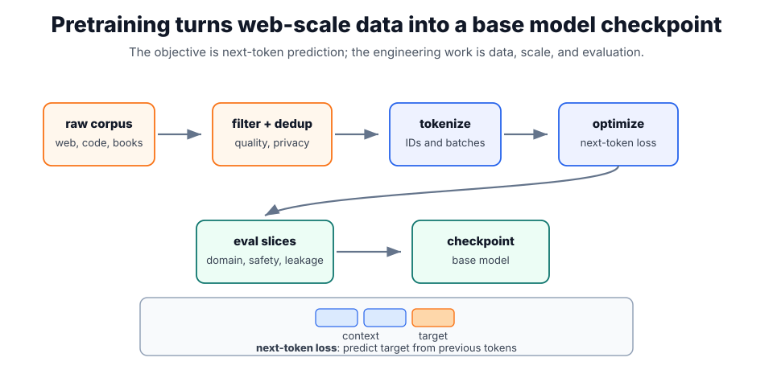

# Pretraining

Pretraining is the large-scale self-supervised stage that gives [foundation models](foundation-models.md) broad linguistic or multimodal capability. For decoder language models, it trains the [language model architecture](language-model-architecture.md) to predict the next token from previous [tokenization](tokenization.md) outputs. It is the stage where the model learns broad statistical structure before later [instruction tuning](instruction-tuning.md) and alignment make it behave like an assistant.

## Next-token pretraining

For sequence $x_1,\ldots,x_T$, next-token pretraining minimizes

$$
L(\theta)=-\sum_{t=1}^{T}\log p_\theta(x_t\mid x_{<t}).
$$

This is cross-entropy over the vocabulary at each position. Softmax converts logits $z$ to probabilities,

$$
p_i=\frac{\exp(z_i)}{\sum_j \exp(z_j)}.
$$

Use a small sequence to make the objective concrete:

```text
The refund requires finance approval above 5000 EUR.
```

During training, the model does not receive one label for the whole sentence. It receives many next-token targets, one position at a time:

| Prefix                                            | Target next token |
| ------------------------------------------------- | ----------------- |
| `The refund requires`                             | `finance`         |
| `The refund requires finance approval above`      | `5000`            |
| `The refund requires finance approval above 5000` | `EUR`             |

The loss is then computed position by position:

1. For the prefix `The refund requires`, the model produces one probability for every possible next token.
2. Training looks at the probability assigned to the actual target token, `finance`. If that probability is $0.77$, the loss at this position is $-\log(0.77)\approx0.26$.
3. For a later prefix, suppose the actual target token is `5000`, but the model assigns it only probability $0.16$. That position has larger loss: $-\log(0.16)\approx1.83$.
4. The batch loss is the mean over target positions. For these two positions, the mean loss is $(0.26+1.83)/2\approx1.05$.
5. Perplexity converts the mean log loss back to an intuitive scale: $\exp(1.05)\approx2.86$. On this toy batch, the model is about as uncertain as choosing among roughly three equally likely next tokens.

Lower loss therefore means the model put more probability mass on the actual next tokens. It does not mean the model has verified that the sentence is true.



The diagram separates the training objective from the engineering pipeline. Data is first filtered and tokenized, then optimization updates model parameters using next-token loss. Evaluation slices and checkpoints sit outside the forward training path because they are control mechanisms: they decide whether a run is improving, contaminated, unsafe, or ready to continue.

## Training pipeline

| Stage                            | Why it matters                                                                                         |
| -------------------------------- | ------------------------------------------------------------------------------------------------------ |
| Data filtering and deduplication | Removes obvious noise, duplicates, and evaluation contamination.                                       |
| Tokenization                     | Converts text or multimodal inputs into the units the model consumes.                                  |
| Distributed optimization         | Trains on many accelerators with checkpointing, learning-rate schedules, and loss monitoring.          |
| Evaluation slices                | Tracks domain, language, safety, and memorization behavior instead of relying on aggregate loss alone. |

## What the model learns

Next-token prediction is simple to state but rich in consequence. To predict the next token well, the model must learn syntax, facts, styles, code patterns, long-range dependencies, and latent task structure from context. It does not learn these as explicit database rows. It learns parameters that make many continuations more or less likely.

That distinction matters. Pretraining can make a model fluent and knowledgeable, but it does not guarantee truthfulness, calibrated uncertainty, obedience to instructions, privacy behavior, or tool-use discipline. Those properties require later training, system design, retrieval, evaluation, and policy controls.

Across trillions of tokens, this objective creates a model that can continue text, answer questions, write code, and follow patterns, but the training signal is still "predict the next token," not "verify the world."

## Data and contamination

The dataset is part of the model. Deduplication prevents the model from over-weighting repeated pages. Quality filters remove obvious boilerplate and corrupt text. Evaluation contamination checks try to keep benchmark answers out of training. Privacy filtering reduces the chance that secrets or personal data are memorized, but it is imperfect; deployed systems still need [data privacy](data-privacy.md) controls around prompts, retrieval, logs, and outputs.

## Caveats

Pretraining data quality, deduplication, and contamination matter. Better pretraining loss does not automatically imply safer or more useful assistant behavior. Perplexity can improve while factuality, refusal behavior, or downstream task quality remains uneven, so pretrained checkpoints need broad evaluation before release or fine-tuning.

## References

- [Kaplan et al., 2020, Scaling Laws for Neural Language Models](https://arxiv.org/abs/2001.08361)
- [Vaswani et al., 2017, Attention Is All You Need](https://arxiv.org/abs/1706.03762)

> [!nav]
> **Section** — [Generative AI and Agentic Systems](index.md)
>
> [← Tokenization](tokenization.md) [LLM Training →](llm-training.md)
