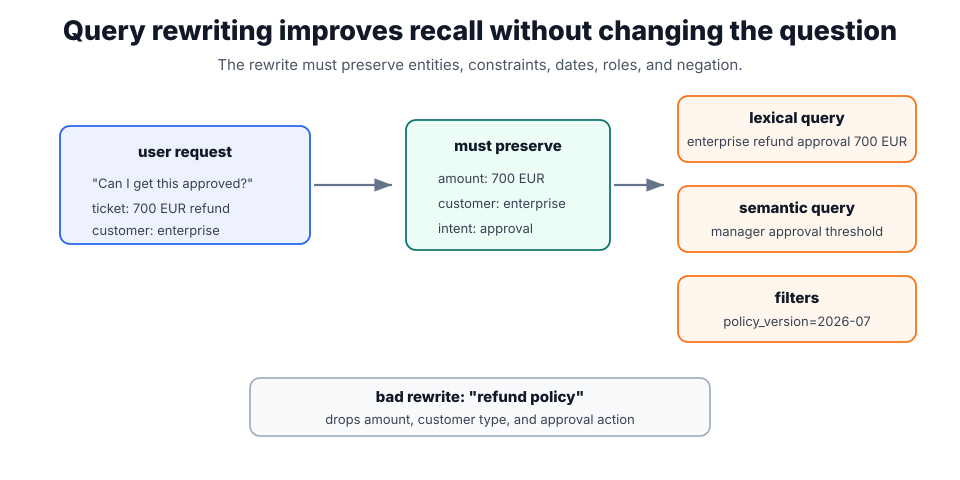

# Query Rewriting

Query rewriting converts a user request into one or more search queries for [retrieval pipelines](retrieval-pipelines.md). It helps [RAG](rag.md) when the user uses pronouns, conversational context, task language, or partial identifiers that differ from source documents. Good rewriting improves recall without changing the question.

## What a good rewrite preserves

A rewrite should preserve answer intent while making retrieval terms explicit. The system can produce lexical queries, dense-search text, filters, date constraints, and permission constraints. [Hybrid retrieval](hybrid-retrieval.md) benefits when rewrites include both exact entities for sparse search and semantic paraphrases for dense retrieval.

The rewrite should be logged beside the original request. If evaluation only sees the final answer, a bad rewrite can masquerade as model hallucination. If [rag evaluation](rag-evaluation.md) sees both, the team can tell whether retrieval failed because the corpus lacked evidence or because the system searched for the wrong thing.



The plot shows why rewriting is more than paraphrase. The middle box lists constraints that must survive the transformation, while the right side splits retrieval into lexical terms, semantic wording, and metadata filters. The bad rewrite at the bottom is short and plausible, but it drops the amount, customer type, and approval action, so it can retrieve evidence for the wrong question.

## Rewrite types

| Rewrite type                   | Example                                                                            | Useful for                                   |
| ------------------------------ | ---------------------------------------------------------------------------------- | -------------------------------------------- |
| Decontextualization            | "Can I get this approved?" -> "Does a 700 EUR enterprise refund require approval?" | conversational RAG.                          |
| Entity expansion               | "EU AI law" -> "EU AI Act regulation compliance obligations"                       | sparse and hybrid retrieval.                 |
| Query decomposition            | "Compare refund limits and escalation owners" -> two focused searches.             | multi-hop answers.                           |
| Filter extraction              | "current German policy" -> `country=DE`, `version=current`                         | metadata filtering.                          |
| HyDE-style hypothetical answer | generate a plausible answer-shaped query, then embed it                            | dense retrieval when user wording is sparse. |

The rewrite can be model-generated, rule-generated, or hybrid. Rules are useful for dates, locales, product versions, and identifiers. Models are useful for paraphrase, missing context, and decomposition.

## A logged rewrite

```json
{
  "user_question": "Can I get this approved?",
  "conversation_hint": "700 EUR refund request for enterprise customer",
  "rewritten_queries": [
    "enterprise refund approval threshold 700 EUR",
    "manager approval refund policy enterprise account"
  ],
  "filters": { "document_type": "policy", "policy_version": "2026-07" },
  "must_preserve": ["amount", "customer_type", "approval_action"]
}
```

The `must_preserve` list is the safety rail: it names the entities a rewrite may not drop, so an evaluator can automatically flag a rewrite that silently changed the amount, customer type, or requested action even when the retrieved text looks plausible.

## Bad rewrite example

```json
{
  "user_question": "Can we waive the fee for the German enterprise contract from May 2026?",
  "bad_rewrite": "enterprise fee waiver policy",
  "problem": "dropped Germany, contract type, and May 2026 effective date",
  "better_rewrite": "Germany enterprise contract fee waiver policy effective May 2026"
}
```

The bad rewrite may retrieve a plausible global policy that is wrong for the user's jurisdiction and date. This is why query rewriting must preserve constraints, not merely make a query sound more search-like.

## Evaluation

Evaluate rewriting separately from answer generation. A rewrite is good if it retrieves answer-bearing evidence, preserves constraints, and does not add unsupported assumptions. Useful metrics include recall of gold chunks after rewriting, constraint-preservation rate, and downstream answer support after [reranking](reranking.md). For sensitive workflows, keep the original question visible to the model so the final answer can notice if retrieved evidence no longer matches the user's wording.

## Caveats

Bad rewrites can answer a different question. Rewriters often drop negation, dates, jurisdiction, product version, amount, customer segment, or user role. They can also over-expand acronyms and retrieve a different domain. For high-risk workflows, keep the original query available to the model and cite which retrieved evidence came from which rewritten query.

## References

- [Lewis et al., 2020, Retrieval-Augmented Generation](https://arxiv.org/abs/2005.11401)
- [Karpukhin et al., 2020, Dense Passage Retrieval](https://arxiv.org/abs/2004.04906)
- [OpenAI API documentation: Embeddings](https://platform.openai.com/docs/guides/embeddings)

> [!nav]
> **Section** — [Generative AI and Agentic Systems](index.md)
>
> [← Hybrid Retrieval](hybrid-retrieval.md) [Reranking →](reranking.md)
