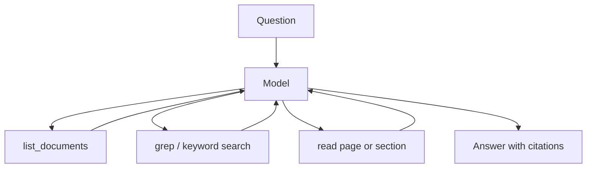
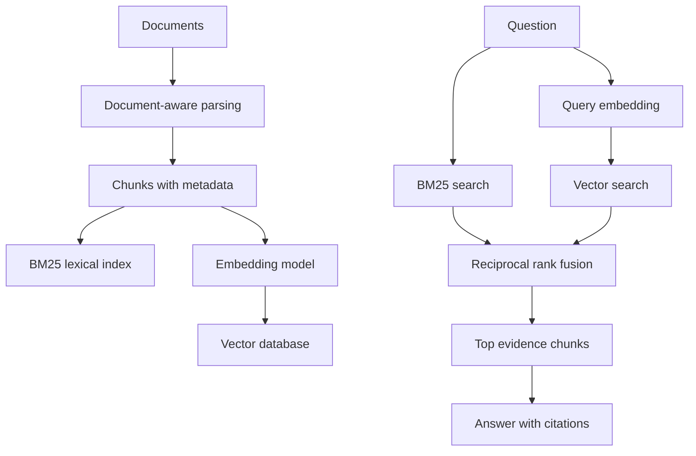
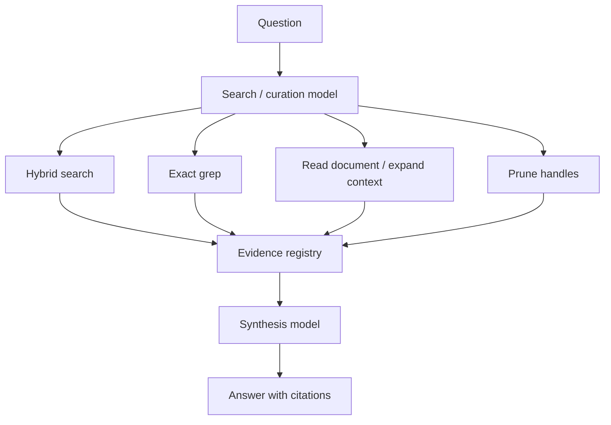

# RAG Architecture Comparison

[RAG](rag.md) is a pattern, not a single design. The same goal — answer from external evidence with citations — can be built as several architectures that trade auditability, recall, latency, and operational cost differently. This page compares three families along one axis: how much retrieval machinery sits between the question and the evidence. They range from a retrieve-first loop with no index, through an indexed hybrid retriever, to a two-phase design that separates evidence curation from answer synthesis.

## Minimal tool-based loop agent

A retrieve-first [agent](agentic-systems.md) with no vector or BM25 index. Documents (or pages) are loaded into memory and the model is given simple tools — list available documents, keyword or regex search over text, read a selected page or section. The model chooses which [tool](tool-use-and-function-calling.md) to call, the host application executes it, and the model answers only after inspecting the evidence it retrieved.

- **Strengths:** very auditable (every step is an explicit tool call); tiny implementation surface; no embedding model or vector database; a strong baseline for small corpora, smoke tests, and debugging.
- **Limitations:** relies on exact or near-exact lexical matches, so it is weak for paraphrased questions; the model must guess good search terms; it does not scale to large corpora; and retrieval quality is bounded by the raw text-extraction quality.

## Hybrid RAG agent

The default indexed architecture. Documents are parsed and split with [document-aware chunking](chunking.md), then indexed twice: a lexical [BM25](../12-information-retrieval-and-search/bm25.md) index and a dense [embedding](embeddings.md) vector index. A query runs against both, and the two ranked lists are merged with reciprocal rank fusion (see [hybrid search](../12-information-retrieval-and-search/hybrid-search.md) for the RRF formula and a worked example). The top chunks become evidence; the model may expand neighbouring [context](context-construction.md) before answering with citations.

Rank fusion is what makes the pair robust: BM25 and dense scores are on incompatible scales, so fusing by _rank_ rather than raw score avoids calibration. For retrievers $R$ and a rank constant $k$, $\operatorname{RRF}(d)=\sum_{r\in R} 1/(k+\operatorname{rank}_r(d))$ — chunks found by both methods rise, while a strong single-method hit stays eligible.

- **Strengths:** BM25 handles exact terms, identifiers, codes, and numbers; dense embeddings handle paraphrase and concept-level matches; RRF avoids comparing incompatible scores; evidence stays auditable at chunk level. A good default for medium-sized corpora.
- **Limitations:** needs an indexing pipeline and an available embedding model; the index must be refreshed when source data changes; dense retrieval is less interpretable than lexical; and chunking mistakes degrade both retrieval and citation quality.

## Context-curation agent

A two-phase design that separates gathering evidence from writing the answer. In phase one a search or curation agent explores the corpus — semantic search, lexical [grep](../12-information-retrieval-and-search/hybrid-search.md), reading larger regions, and pruning irrelevant chunks — and registers the survivors under stable handles. In phase two a synthesis-only prompt receives just the curated evidence set and answers from it. It reuses the same hybrid retriever as the second architecture but adds an explicit curation stage.

- **Strengths:** evidence curation and pruning are explicit architectural steps; the final answer is constrained to a smaller, vetted evidence set; well suited to broad questions that need multiple evidence fragments; more inspectable than a single black-box retrieval call.
- **Limitations:** more model turns, so higher latency and cost; curation quality depends on the model; it requires context-budget management; and it has more moving parts than the standard hybrid agent.

## Comparison

| Dimension           | Loop agent                         | Hybrid RAG agent             | Context-curation agent            |
| ------------------- | ---------------------------------- | ---------------------------- | --------------------------------- |
| Retrieval method    | Exact search / read tools          | BM25 + dense + RRF           | BM25 + dense + RRF, plus curation |
| Index required      | No                                 | Yes                          | Yes                               |
| Embeddings required | No                                 | Yes                          | Yes                               |
| Handles paraphrase  | Weak                               | Good                         | Good                              |
| Auditability        | Very high                          | High                         | Very high                         |
| Latency             | Low to medium                      | Medium                       | Higher                            |
| Best use            | Baseline, debugging, small corpora | Default production candidate | Complex multi-evidence questions  |

## Choosing an architecture

The loop agent is valuable as a baseline and an auditability reference, but it should not be the default for larger or paraphrase-heavy corpora. The hybrid RAG agent is usually the best default because it balances lexical precision, semantic recall, and operational simplicity. The context-curation agent earns its extra turns when answer quality depends on assembling and pruning several evidence fragments.

The retrieval trade-offs generalize beyond these three designs: BM25-only retrieval misses paraphrases, dense-only retrieval misses exact identifiers, numbers, and rare wording, and hybrid retrieval with RRF is a pragmatic default because it improves robustness without requiring calibrated score normalization. Whichever architecture is chosen, evaluate both retrieval and generation — strong generation cannot compensate for missing evidence, and strong retrieval is wasted if the answer fabricates or cites incorrectly. See [RAG benchmark design](rag-benchmark-design.md) for a methodology that scores each architecture on the same questions, and [RAG evaluation](rag-evaluation.md) for stage-wise metrics.

## Caveats

These families are reference points on a spectrum, not mutually exclusive products: a system can start as a loop-agent baseline, add a hybrid index, and later wrap curation around it. The table is qualitative — the right choice depends on corpus size, query mix, latency budget, and how much auditability the use case needs, so treat the ranking as a hypothesis to confirm on a representative benchmark rather than a fixed verdict.

## References

- [Lewis et al., 2020, Retrieval-Augmented Generation for Knowledge-Intensive NLP Tasks](https://arxiv.org/abs/2005.11401)
- [Yao et al., 2022, ReAct: Synergizing Reasoning and Acting in Language Models](https://arxiv.org/abs/2210.03629)
- [Gao et al., 2023, Retrieval-Augmented Generation for Large Language Models: A Survey](https://arxiv.org/abs/2312.10997)
- [Cormack, Clarke, and Buettcher, Reciprocal Rank Fusion Outperforms Condorcet and Individual Rank Learning Methods](https://doi.org/10.1145/1571941.1572114)

> [!nav]
> **Section** — [Generative AI and Agentic Systems](index.md)
>
> [← RAG Evaluation](rag-evaluation.md) [RAG Benchmark Design →](rag-benchmark-design.md)
