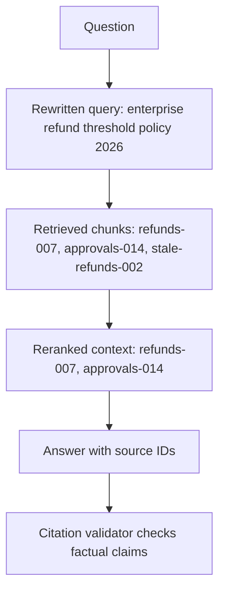

# RAG

Retrieval-augmented generation retrieves external evidence and places it into the model request before generation. It is the pattern connecting [chunking](chunking.md), [embeddings](embeddings.md), [retrieval pipelines](retrieval-pipelines.md), [context construction](context-construction.md), and [citations](citations.md). The same pattern can be built as several designs — a tool-based loop, an indexed hybrid retriever, or a two-phase curation agent — compared in [RAG architecture comparison](rag-architecture-comparison.md).

RAG is best understood as a system contract: answer from selected evidence, cite it, and abstain when evidence is missing. It is not simply "add vector search to a prompt."

Implementation frameworks can help, but they do not change the concept. [LangChain](langchain.md) commonly supplies retriever and model-call abstractions for RAG systems; the evidence quality still comes from corpus preparation, retrieval evaluation, citation checks, and product-specific permissions.

## The retrieval-to-answer path

A common RAG path is: ingest documents, split them into chunks, embed and index those chunks, rewrite or normalize the user query, retrieve candidates, rerank them, pack selected evidence into context, generate an answer, and validate citations. In probabilistic notation, the answer is generated from both the request $x$ and retrieved evidence $d$:

$$
p(y \mid x, d).
$$

That notation hides the engineering risk: $d$ is not guaranteed to contain the answer. RAG quality depends on each upstream stage, not only on the final model.

## A traced RAG pipeline

This trace is useful because each stage can be evaluated separately with [rag evaluation](rag-evaluation.md). If the answer is wrong, the team can inspect whether retrieval missed the right document, reranking chose stale evidence, context packing dropped the key sentence, or generation ignored the source.

## When RAG is the right lever

Use RAG when answers depend on current, private, auditable, or source-specific information. Examples include support policies, internal documentation, contracts, product catalogs, legal clauses, and operational runbooks. Use fine-tuning instead when the problem is stable behavior, tone, or output format despite correct evidence being present.

## Failure modes

| Failure                                  | Where to look                                              |
| ---------------------------------------- | ---------------------------------------------------------- |
| right document missing                   | ingestion, permissions, query rewriting, retrieval recall. |
| right document retrieved but not used    | reranking, context packing, prompt, generation.            |
| answer cites irrelevant passage          | citation validation and grounding.                         |
| stale policy used                        | metadata filters, index freshness, source versioning.      |
| malicious retrieved instruction followed | prompt-injection defenses and tool gates.                  |

RAG quality is therefore multi-stage. Evaluating only final answers makes failures hard to repair.

## Caveats

RAG does not guarantee truth. Retrieval can miss the answer, stale indexes can retrieve obsolete policy, and the model can ignore the evidence. RAG is also the main place where [prompt injection](prompt-injection.md) enters through untrusted documents, so retrieved text should be treated as data, not instructions.

## References

- [Lewis et al., 2020, Retrieval-Augmented Generation](https://arxiv.org/abs/2005.11401)
- [Karpukhin et al., 2020, Dense Passage Retrieval](https://arxiv.org/abs/2004.04906)
- [OpenAI API documentation: Embeddings](https://platform.openai.com/docs/guides/embeddings)

> [!nav]
> **Section** — [Generative AI and Agentic Systems](index.md)
>
> [← Structured Output](structured-output.md) [Embeddings →](embeddings.md)
>
> **Learning path** — [Generative AI systems](../00-home-and-navigation/learning-paths.md#generative-ai-systems)
>
> [← Retrieval Pipelines](retrieval-pipelines.md) [Tool Use and Function Calling →](tool-use-and-function-calling.md)
