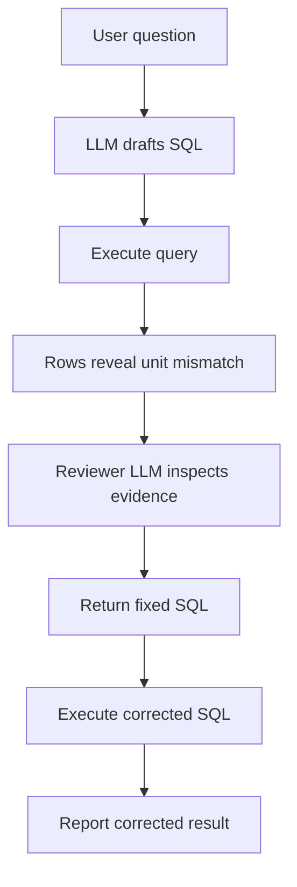

# Reflection and Reviewer Patterns

Reflection and reviewer patterns add a critique step after a draft. The reviewer can be the same model, another model, deterministic validators, or a human. In [multi-agent systems](multi-agent-systems.md), this is the simplest useful role split. The pattern is valuable when the review step has independent evidence or a narrow rubric; otherwise it can become expensive self-reassurance.

## The review loop

The safe pattern gives the reviewer the draft, task, rubric, and evidence, then asks for structured defects rather than vague advice. [LLM-as-judge](llm-as-judge.md) can identify unsupported claims, while deterministic validators check schemas and citations. The [agentic systems](agentic-systems.md) loop decides whether to revise, escalate, or stop.

| Step   | Input                                       | Output                          |
| ------ | ------------------------------------------- | ------------------------------- |
| Draft  | user request, context, tools                | candidate answer or action plan |
| Review | draft, rubric, trusted evidence             | specific defects with locations |
| Repair | draft plus defects                          | revised answer or tool call     |
| Gate   | validators, risk policy, human review rules | release, retry, or escalate     |

The reviewer should be asked for falsifiable checks: unsupported claim, missing citation, schema mismatch, unsafe tool call, contradiction, or incomplete answer. A vague prompt such as "reflect on your answer" often produces style edits rather than evidence-based corrections.

## Reviewer types

| Reviewer                | Good for                                | Weakness                           |
| ----------------------- | --------------------------------------- | ---------------------------------- |
| Same model self-review  | cheap style and completeness pass       | shares blind spots with the draft. |
| Stronger model reviewer | semantic critique and citation checks   | higher cost and latency.           |
| Deterministic validator | schemas, citations, policy gates, tests | cannot judge nuanced prose.        |
| Human reviewer          | high-risk decisions and ambiguous cases | slow and expensive.                |

The best systems combine them: deterministic validators catch exact failures, model reviewers flag semantic defects, and humans handle high-impact uncertainty.

## A defect report

```json
{
  "defects": [
    { "type": "unsupported_claim", "claim": "shipping is two days", "source_id": "policy-9" }
  ],
  "action": "revise"
}
```

## Realistic workflow

For a RAG answer, the draft step writes an answer with citations. The reviewer receives the answer, cited chunks, and a rubric:

```text
Check each factual claim. Mark unsupported, contradicted, missing citation, or okay.
Do not improve style unless a claim defect is present.
```

The repair step then edits only the defective claims or abstains if evidence is missing. This is more reliable than asking the model to "think again," because it converts review into a bounded verification task.

## Reflection with external feedback

Reflection is stronger when the reviewer sees an external artifact, not only the model's draft. In an energy-management assistant, a model might translate a question into SQL and label the requested output in kilowatt-hours:

```sql
SELECT building_id, SUM(energy_wh) AS energy_kwh
FROM meter_readings
WHERE reading_date = '2026-07-01'
GROUP BY building_id
ORDER BY energy_kwh DESC
LIMIT 1;
```

The query is syntactically valid and may look reasonable in a text-only review. But suppose the executed result is:

| building_id | energy_kwh |
| ----------- | ---------: |
| library     |      18450 |

For one building-day, 18450 is plausible in watt-hours but implausible as kilowatt-hours. The execution output reveals a unit conversion error that the SQL text alone may not expose. A useful reviewer prompt should include the user question, schema, SQL, and execution output, then ask for a structured repair:

```json
{
  "finding": "implausible_values",
  "feedback": "The output column is labelled kilowatt-hours, but the expression sums watt-hours. Divide by 1000 before reporting energy_kwh.",
  "revised_sql": "SELECT building_id, SUM(energy_wh) / 1000.0 AS energy_kwh FROM meter_readings WHERE reading_date = '2026-07-01' GROUP BY building_id ORDER BY energy_kwh DESC LIMIT 1;"
}
```

This example shows the difference between self-review and grounded review. The SQL text alone did not expose the problem reliably; executing the query produced evidence the reviewer could use. The same pattern applies to code tests, citation checks, retrieval results, browser observations, and tool traces.

Here is the same workflow with the LLM boundaries made explicit. The first model call drafts SQL. The application executes that SQL against the energy database. The reviewer model then sees the question, schema, SQL, and result rows, and returns a structured repair. The code applies the same controls a production system needs, in miniature:

- a read-only database role, plus a read-only transaction as a second guard
- a statement timeout
- a single-SELECT validator
- a row limit
- a bounded review loop that validates, re-executes, and re-reviews every revision, then escalates when the budget runs out

The reviewer's prompt and output categories are generic on purpose. A reviewer prompt that names the defect it is expected to find ("check the units") turns a test of review into a test of instruction-following.



```python
from __future__ import annotations

import json
import os
from typing import Any

from openai import OpenAI
from sqlalchemy import create_engine, inspect, text

MODEL = os.environ.get("OPENAI_MODEL", "gpt-4o")  # Pin the model you actually evaluate.
MAX_REVIEWS = 2
MAX_ROWS = 50
energy_db = create_engine(os.environ["ENERGY_DB_URL"])  # Connect with a read-only database role.

SQL_DRAFT_FORMAT = {
    "type": "json_schema",
    "name": "sql_draft",
    "schema": {
        "type": "object",
        "properties": {
            "sql": {"type": "string"},
            "explanation": {"type": "string"},
        },
        "required": ["sql", "explanation"],
        "additionalProperties": False,
    },
    "strict": True,
}

SQL_REVIEW_FORMAT = {
    "type": "json_schema",
    "name": "sql_review",
    "schema": {
        "type": "object",
        "properties": {
            "finding": {
                "type": "string",
                "enum": ["ok", "wrong_columns", "wrong_filter", "wrong_aggregation", "implausible_values", "unsafe"],
            },
            "feedback": {"type": "string"},
            "revised_sql": {"type": "string"},
        },
        "required": ["finding", "feedback", "revised_sql"],
        "additionalProperties": False,
    },
    "strict": True,
}


def describe_schema(tables: list[str]) -> str:
    inspector = inspect(energy_db)
    lines = []
    for table in tables:
        columns = ", ".join(f"{column['name']} {column['type']}" for column in inspector.get_columns(table))
        lines.append(f"{table}({columns})")
    return "\n".join(lines)


def validate_select(sql: str) -> str:
    statement = sql.strip().rstrip(";")
    if ";" in statement or not statement.lower().startswith(("select", "with")):
        raise ValueError(f"expected one read-only SELECT statement, got: {sql!r}")
    return statement


def fetch_rows(sql: str) -> list[dict[str, Any]]:
    with energy_db.begin() as conn:
        conn.execute(text("SET TRANSACTION READ ONLY"))  # second guard besides the role
        conn.execute(text("SET LOCAL statement_timeout = '5s'"))  # PostgreSQL
        result = conn.execute(text(validate_select(sql)))
        return [dict(row) for row in result.mappings().fetchmany(MAX_ROWS)]


def draft_sql_with_llm(client: OpenAI, question: str, schema: str) -> dict[str, str]:
    response = client.responses.create(
        model=MODEL,
        input=[
            {
                "role": "developer",
                "content": (
                    "Write one read-only PostgreSQL SELECT query for the user question. "
                    "Use only the provided schema. Return JSON only."
                ),
            },
            {
                "role": "user",
                "content": f"Question: {question}\nSchema: {schema}",
            },
        ],
        text={"format": SQL_DRAFT_FORMAT},
    )
    return json.loads(response.output_text)


def review_sql_with_llm(
    client: OpenAI,
    query_label: str,
    question: str,
    schema: str,
    sql: str,
    rows: list[dict[str, Any]],
) -> dict[str, str]:
    response = client.responses.create(
        model=MODEL,
        input=[
            {
                "role": "developer",
                "content": (
                    "Check whether the SQL answers the question as asked, using the schema "
                    "and the executed rows as evidence: selected columns, filters, aggregation, "
                    "and whether the returned values are plausible. Return finding 'ok' and the "
                    "unchanged SQL if it is correct; otherwise return corrected read-only PostgreSQL."
                ),
            },
            {
                "role": "user",
                "content": json.dumps(
                    {
                        "query_label": query_label,
                        "question": question,
                        "schema": schema,
                        "candidate_sql": sql,
                        "executed_rows": rows,
                    },
                    indent=2,
                    default=str,  # dates and decimals from the database
                ),
            },
        ],
        text={"format": SQL_REVIEW_FORMAT},
    )
    return json.loads(response.output_text)


def run_energy_query_review() -> None:
    client = OpenAI()
    question = "Which building used the most energy on 2026-07-01? Report kilowatt-hours."
    schema = describe_schema(["meter_readings"])

    draft = draft_sql_with_llm(client, question, schema)
    # Example draft from the SQL-writing LLM:
    # {
    #   "sql": "SELECT building_id, SUM(energy_wh) AS energy_kwh FROM meter_readings ...",
    #   "explanation": "Sum each building's readings for the day and sort descending."
    # }
    sql = draft["sql"]
    rows = fetch_rows(sql)
    history: list[dict[str, Any]] = [{"sql": sql, "rows": rows}]

    # Bounded review loop: every revision is validated, re-executed, and reviewed again.
    for _ in range(MAX_REVIEWS):
        review = review_sql_with_llm(
            client,
            query_label="highest_building_energy_kwh",
            question=question,
            schema=schema,
            sql=sql,
            rows=rows,
        )
        # Example response from the reviewer LLM after seeing 18450 labelled as kWh:
        # {
        #   "finding": "implausible_values",
        #   "feedback": "energy_wh is watt-hours; divide by 1000 before reporting kWh.",
        #   "revised_sql": "SELECT building_id, SUM(energy_wh) / 1000.0 AS energy_kwh ..."
        # }
        history[-1]["review"] = review
        if review["finding"] == "ok":
            break
        sql = review["revised_sql"]
        rows = fetch_rows(sql)
        history.append({"sql": sql, "rows": rows})
    else:
        history.append({"status": "escalate: review budget spent without an 'ok' finding"})

    print(json.dumps(history, indent=2, default=str))


if __name__ == "__main__":
    run_energy_query_review()
```

## What the evidence shows

The value of reflection depends on what the reviewer can see and which model drafted the answer:

| Study                                            | Finding                                                                                                                                                                                                                                                                                                                                                                                                                                                                                          |
| ------------------------------------------------ | ------------------------------------------------------------------------------------------------------------------------------------------------------------------------------------------------------------------------------------------------------------------------------------------------------------------------------------------------------------------------------------------------------------------------------------------------------------------------------------------------ |
| CorrectBench (Tie et al., 2025)                  | Compared intrinsic self-correction (no external input), external correction (search or tools), and fine-tuned correction across commonsense, math, and code tasks. For instruction-tuned models, both intrinsic and external correction improved accuracy on complex multi-step tasks, and external methods generally gained more. For reasoning models such as DeepSeek-R1, added correction gave only marginal gains at high time cost, and a plain chain-of-thought baseline was competitive. |
| Holistic Agent Leaderboard (Kapoor et al., 2025) | In 21 of 36 model–agent–benchmark combinations, higher reasoning effort gave equal or lower accuracy. More internal deliberation is not a free improvement.                                                                                                                                                                                                                                                                                                                                      |
| Xiong et al., 2025                               | Trained models to judge and correct their own reasoning within one generation, using reinforcement learning. Self-verification is moving into model training rather than external loops.                                                                                                                                                                                                                                                                                                         |

The practical reading for 2026:

- **Prompted self-review of a reasoning model's answer adds little.** The model already deliberates, verifies, and backtracks inside its reasoning. A second pass of "check your work" mostly adds cost.
- **Grounded review still pays.** The reviewer needs something the drafter did not have: executed results, test outcomes, retrieved sources, validator errors, or a human decision. The SQL example works because the reviewer sees rows the drafter never saw.
- **Measure against the cheapest alternative.** Compare draft plus review with a single draft at higher reasoning effort and the same total token budget.

## Model versus harness

Reasoning models now do much of the within-answer checking that early reflection loops did. The harness still owns what the model cannot do for itself:

- executing code and queries
- running tests and validators
- fetching independent evidence
- deciding who may approve a release
- capping review iterations

Keep reviewer loops for those external signals, and for independent review by a different model or a human when a shared blind spot would be costly.

## Evaluation

Evaluate a reviewer like a classifier, on cases with known defects:

1. Build a set of drafts with seeded or naturally occurring defects, plus correct drafts.
2. Measure reviewer precision (flagged defects that are real) and recall (real defects that are flagged).
3. Measure the regression rate: correct drafts that the repair step made wrong. Repair loops can damage good answers.
4. Compare end-to-end quality and cost against a draft-only baseline and a higher-reasoning-effort baseline with the same budget. Use paired statistics from [evaluation harnesses](evaluation-harnesses.md).

Also track false-positive review blocks, escalation rate, latency, and cost. Reviewer patterns should be justified by risk or measured quality gain; they should not be default loops added to every request.

## Caveats

Self-review can rubber-stamp confident errors because the same model may share the same blind spot in both draft and review. Reviewer patterns work best when the reviewer has independent evidence, a narrow rubric, and permission to say "not enough evidence." They are weaker for factuality if retrieval is missing the relevant source; in that case the reviewer can only catch unsupported claims, not recover missing knowledge.

Reviewer loops also add latency and cost. Use them selectively for high-risk tasks, long outputs, tool calls, citations, code generation, or content that will be shown to users without human review.

## History

Self-Refine (2023) popularized draft–critique–revise loops with a single model. CRITIC (2023) grounded critique in tool outputs such as search and code execution, which is the pattern of the SQL example. Reflexion (2023) is a different pattern: an agent writes verbal lessons after a failed episode and reuses them in later attempts, which makes it a form of experiential [memory](memory.md). Huang et al. (2023) showed that intrinsic self-correction often lowered reasoning accuracy for the models of that time. The 2025 studies above revisit these questions for reasoning models.

## References

- [Tie et al., 2025, Can LLMs Correct Themselves? A Benchmark of Self-Correction in LLMs](https://arxiv.org/abs/2510.16062)
- [Kapoor et al., 2025, Holistic Agent Leaderboard: The Missing Infrastructure for AI Agent Evaluation](https://arxiv.org/abs/2510.11977)
- [Xiong et al., 2025, Self-rewarding correction for mathematical reasoning](https://arxiv.org/abs/2502.19613)
- [Huang et al., 2023, Large Language Models Cannot Self-Correct Reasoning Yet](https://arxiv.org/abs/2310.01798)
- [Gou et al., 2023, CRITIC: Large Language Models Can Self-Correct with Tool-Interactive Critiquing](https://arxiv.org/abs/2305.11738)
- [Shinn et al., 2023, Reflexion: Language Agents with Verbal Reinforcement Learning](https://arxiv.org/abs/2303.11366)
- [DeepLearning.AI: Agentic AI](https://www.deeplearning.ai/courses/agentic-ai/)
- [OpenAI API documentation: Evals](https://platform.openai.com/docs/guides/evals)
- [Anthropic Claude docs: Reduce hallucinations](https://docs.anthropic.com/en/docs/test-and-evaluate/strengthen-guardrails/reduce-hallucinations)

> [!nav]
> **Section** — [Generative AI and Agentic Systems](index.md)
>
> [← Memory](memory.md) [Multi-Agent Systems →](multi-agent-systems.md)
