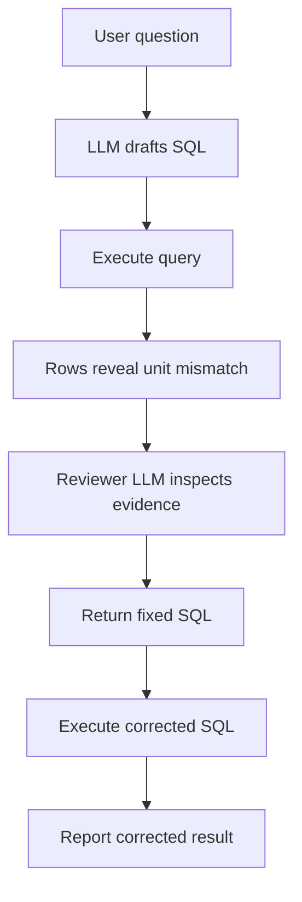

# Reflection and Reviewer Patterns

Reflection and reviewer patterns add a critique step after a draft. The reviewer can be the same model, another model, deterministic validators, or a human. In [multi-agent systems](multi-agent-systems.md), this is the simplest useful role split. The pattern is valuable when the review step has independent evidence or a narrow rubric; otherwise it can become expensive self-reassurance.

## The review loop

The safe pattern gives the reviewer the draft, task, rubric, and evidence, then asks for structured defects rather than vague advice. [LLM-as-judge](llm-as-judge.md) can identify unsupported claims, while deterministic validators check schemas and citations. The [agentic systems](agentic-systems.md) loop decides whether to revise, escalate, or stop.

| Step   | Input                                       | Output                          |
| ------ | ------------------------------------------- | ------------------------------- |
| Draft  | user request, context, tools                | candidate answer or action plan |
| Review | draft, rubric, trusted evidence             | specific defects with locations |
| Repair | draft plus defects                          | revised answer or tool call     |
| Gate   | validators, risk policy, human review rules | release, retry, or escalate     |

The reviewer should be asked for falsifiable checks: unsupported claim, missing citation, schema mismatch, unsafe tool call, contradiction, or incomplete answer. A vague prompt such as "reflect on your answer" often produces style edits rather than evidence-based corrections.

## Reviewer types

| Reviewer                | Good for                                | Weakness                           |
| ----------------------- | --------------------------------------- | ---------------------------------- |
| Same model self-review  | cheap style and completeness pass       | shares blind spots with the draft. |
| Stronger model reviewer | semantic critique and citation checks   | higher cost and latency.           |
| Deterministic validator | schemas, citations, policy gates, tests | cannot judge nuanced prose.        |
| Human reviewer          | high-risk decisions and ambiguous cases | slow and expensive.                |

The best systems combine them: deterministic validators catch exact failures, model reviewers flag semantic defects, and humans handle high-impact uncertainty.

## A defect report

```json
{
  "defects": [
    { "type": "unsupported_claim", "claim": "shipping is two days", "source_id": "policy-9" }
  ],
  "action": "revise"
}
```

## Realistic workflow

For a RAG answer, the draft step writes an answer with citations. The reviewer receives the answer, cited chunks, and a rubric:

```text
Check each factual claim. Mark unsupported, contradicted, missing citation, or okay.
Do not improve style unless a claim defect is present.
```

The repair step then edits only the defective claims or abstains if evidence is missing. This is more reliable than asking the model to "think again," because it converts review into a bounded verification task.

## Reflection with external feedback

Reflection is stronger when the reviewer sees an external artifact, not only the model's draft. In an energy-management assistant, a model might translate a question into SQL and label the requested output in kilowatt-hours:

```sql
SELECT building_id, SUM(energy_wh) AS energy_kwh
FROM meter_readings
WHERE reading_date = '2026-07-01'
GROUP BY building_id
ORDER BY energy_kwh DESC
LIMIT 1;
```

The query is syntactically valid and may look reasonable in a text-only review. But suppose the executed result is:

| building_id | energy_kwh |
| ----------- | ---------: |
| library     |      18450 |

For one building-day, 18450 is plausible in watt-hours but implausible as kilowatt-hours. The execution output reveals a unit conversion error that the SQL text alone may not expose. A useful reviewer prompt should include the user question, schema, SQL, and execution output, then ask for a structured repair:

```json
{
  "finding": "unit_mismatch",
  "feedback": "The output column is labelled kilowatt-hours, but the expression sums watt-hours. Divide by 1000 before reporting energy_kwh.",
  "revised_sql": "SELECT building_id, SUM(energy_wh) / 1000.0 AS energy_kwh FROM meter_readings WHERE reading_date = '2026-07-01' GROUP BY building_id ORDER BY energy_kwh DESC LIMIT 1;"
}
```

This example shows the difference between self-review and grounded review. The SQL text alone did not expose the problem reliably; executing the query produced evidence the reviewer could use. The same pattern applies to code tests, citation checks, retrieval results, browser observations, and tool traces.

Here is the same workflow with the LLM boundaries made explicit. The first model call drafts SQL. The application executes that SQL against a controlled database fixture. The reviewer model then sees the question, schema, SQL, and result rows, and returns a structured repair. In production, the execution step should run through a read-only connection, SQL validator, timeout, and row limit before any model-generated query touches data.



```python
from __future__ import annotations

import json
import sqlite3
from typing import Any

from openai import OpenAI


SQL_DRAFT_FORMAT = {
    "type": "json_schema",
    "name": "sql_draft",
    "schema": {
        "type": "object",
        "properties": {
            "sql": {"type": "string"},
            "explanation": {"type": "string"},
        },
        "required": ["sql", "explanation"],
        "additionalProperties": False,
    },
    "strict": True,
}

SQL_REVIEW_FORMAT = {
    "type": "json_schema",
    "name": "sql_review",
    "schema": {
        "type": "object",
        "properties": {
            "finding": {"type": "string", "enum": ["ok", "unit_mismatch", "unsafe", "unsupported"]},
            "feedback": {"type": "string"},
            "revised_sql": {"type": "string"},
        },
        "required": ["finding", "feedback", "revised_sql"],
        "additionalProperties": False,
    },
    "strict": True,
}


def open_energy_fixture() -> sqlite3.Connection:
    conn = sqlite3.connect(":memory:")
    conn.row_factory = sqlite3.Row
    conn.execute(
        """
        CREATE TABLE meter_readings (
            building_id TEXT NOT NULL,
            reading_date TEXT NOT NULL,
            energy_wh REAL NOT NULL,
            meter_state TEXT NOT NULL
        )
        """
    )
    conn.executemany(
        """
        INSERT INTO meter_readings
        VALUES (?, ?, ?, ?)
        """,
        [
            ("library", "2026-07-01", 9200, "valid"),
            ("library", "2026-07-01", 9250, "valid"),
            ("lab", "2026-07-01", 6100, "valid"),
            ("lab", "2026-07-01", 5900, "valid"),
        ],
    )
    return conn


def fetch_rows(conn: sqlite3.Connection, sql: str) -> list[dict[str, Any]]:
    return [dict(row) for row in conn.execute(sql).fetchall()]


def draft_sql_with_llm(client: OpenAI, question: str, schema: str) -> dict[str, str]:
    response = client.responses.create(
        model="gpt-4o",
        input=[
            {
                "role": "developer",
                "content": (
                    "Write one read-only SQLite SELECT query for the user question. "
                    "Use only the provided schema. Return JSON only."
                ),
            },
            {
                "role": "user",
                "content": f"Question: {question}\nSchema: {schema}",
            },
        ],
        text={"format": SQL_DRAFT_FORMAT},
    )
    return json.loads(response.output_text)


def review_sql_with_llm(
    client: OpenAI,
    query_label: str,
    question: str,
    schema: str,
    sql: str,
    rows: list[dict[str, Any]],
) -> dict[str, str]:
    response = client.responses.create(
        model="gpt-4o",
        input=[
            {
                "role": "developer",
                "content": (
                    "Review the SQL using the question, schema, and executed rows. "
                    "If the result units or semantics are wrong, return corrected SQL. "
                    "Keep the query read-only SQLite."
                ),
            },
            {
                "role": "user",
                "content": json.dumps(
                    {
                        "query_label": query_label,
                        "question": question,
                        "schema": schema,
                        "candidate_sql": sql,
                        "executed_rows": rows,
                    },
                    indent=2,
                ),
            },
        ],
        text={"format": SQL_REVIEW_FORMAT},
    )
    return json.loads(response.output_text)


def run_energy_query_review() -> None:
    client = OpenAI()
    conn = open_energy_fixture()
    question = "Which building used the most energy on 2026-07-01? Report kilowatt-hours."
    schema = "meter_readings(building_id, reading_date, energy_wh, meter_state)"

    draft = draft_sql_with_llm(client, question, schema)
    # Example draft from the SQL-writing LLM:
    # {
    #   "sql": "SELECT building_id, SUM(energy_wh) AS energy_kwh FROM meter_readings ...",
    #   "explanation": "Sum valid meter readings per building and sort descending."
    # }
    first_sql = draft["sql"]
    first_rows = fetch_rows(conn, first_sql)

    review = review_sql_with_llm(
        client,
        query_label="highest_building_energy_kwh",
        question=question,
        schema=schema,
        sql=first_sql,
        rows=first_rows,
    )
    # Example response from the reviewer LLM after seeing 18450 labelled as kWh:
    # {
    #   "finding": "unit_mismatch",
    #   "feedback": "energy_wh is watt-hours; divide by 1000 before reporting kWh.",
    #   "revised_sql": "SELECT building_id, SUM(energy_wh) / 1000.0 AS energy_kwh ..."
    # }
    corrected_sql = review["revised_sql"] if review["finding"] != "ok" else first_sql
    corrected_rows = fetch_rows(conn, corrected_sql)

    print(
        json.dumps(
            {
                "first_rows": first_rows,
                "review": review,
                "corrected_rows": corrected_rows,
            },
            indent=2,
        )
    )


if __name__ == "__main__":
    run_energy_query_review()
```

## Evaluation

Measure whether review catches defects that the draft system misses, and whether it introduces new errors. Track false-positive review blocks, unsupported-claim reduction, latency, cost, and escalation rate. Reviewer patterns should be justified by risk or quality gain; they should not be default loops added to every request.

## Caveats

Self-review can rubber-stamp confident errors because the same model may share the same blind spot in both draft and review. Reviewer patterns work best when the reviewer has independent evidence, a narrow rubric, and permission to say "not enough evidence." They are weaker for factuality if retrieval is missing the relevant source; in that case the reviewer can only catch unsupported claims, not recover missing knowledge.

Reviewer loops also add latency and cost. Use them selectively for high-risk tasks, long outputs, tool calls, citations, code generation, or content that will be shown to users without human review.

## References

- [Kim et al., 2023, Prometheus](https://arxiv.org/abs/2310.08491)
- [DeepLearning.AI: Agentic AI](https://www.deeplearning.ai/courses/agentic-ai/)
- [OpenAI API documentation: Evals](https://platform.openai.com/docs/guides/evals)
- [Anthropic Claude docs: Reduce hallucinations](https://docs.anthropic.com/en/docs/test-and-evaluate/strengthen-guardrails/reduce-hallucinations)

> [!nav]
> **Section** — [Generative AI and Agentic Systems](index.md)
>
> [← Memory](memory.md) [Multi-Agent Systems →](multi-agent-systems.md)
