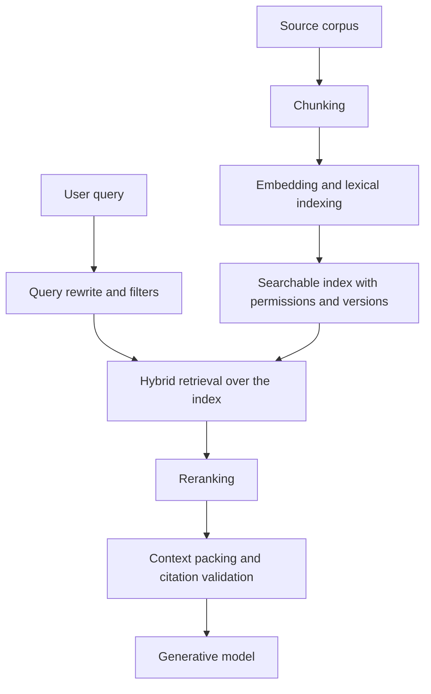

# Retrieval Pipelines

A retrieval pipeline turns a changing corpus into ranked evidence for a model. In [RAG](rag.md), it spans ingestion, [chunking](chunking.md), embedding, lexical indexing, metadata filters, query rewriting, [hybrid retrieval](hybrid-retrieval.md), [reranking](reranking.md), context packing, and citation validation.

[LangChain](langchain.md) is often used to assemble these pieces because it provides integrations for loaders, embedding models, vector stores, retrievers, and model-call composition. The retrieval contract still belongs to the application: source versions, permissions, and trace fields must be explicit even when a framework supplies the connectors.

## Offline and online contracts

The pipeline has two contracts. The offline contract builds searchable records: source document, chunk boundaries, text hash, permissions, embedding model, index version, and deletion state. The online contract turns a user request into evidence: normalized query, filters, first-stage candidates, scores, reranker output, selected chunks, and the final context handed to the model.

Those logs make failures diagnosable. A bad answer can come from missing ingestion, stale permissions, poor chunk boundaries, a query rewrite that removed the key term, a dense index that missed an exact identifier, a reranker that preferred fluent but irrelevant text, or context packing that dropped the decisive passage.



## A retrieval trace

```json
{
  "trace_id": "ret-2026-07-12-1842",
  "query": "refund approval threshold for enterprise accounts",
  "filters": { "acl": "support", "policy_version": "2026-07" },
  "candidate_sets": {
    "bm25": [{ "chunk_id": "refunds-007", "score": 13.8 }],
    "dense": [{ "chunk_id": "refunds-011", "score": 0.78 }]
  },
  "reranked": [{ "chunk_id": "refunds-007", "rank": 1, "score": 0.92 }],
  "selected_for_context": ["refunds-007"]
}
```

This is a retrieval artifact, not a generation artifact. It should be evaluated against retrieval labels or hard negatives before judging final answer quality with [rag evaluation](rag-evaluation.md).

## Operational contracts

| Contract  | Fields to record                                                         |
| --------- | ------------------------------------------------------------------------ |
| Ingestion | source ID, source version, text hash, parser version, deletion state.    |
| Chunking  | chunk ID, heading path, token count, neighboring chunks, permissions.    |
| Indexing  | embedding model, index version, lexical analyzer, build time.            |
| Querying  | original query, rewritten query, filters, user/tenant scope.             |
| Ranking   | candidate lists, scores, fusion method, reranker version.                |
| Handoff   | selected chunks, dropped high-score chunks, context order, citation IDs. |

Without these fields, teams cannot tell whether a bad answer came from the model or from stale retrieval state.

## Realistic failure trace

A policy answer cites `refunds-007`, but the user says the threshold is outdated. The retrieval trace shows `policy_version=2025-12` even though the UI selected July 2026. The fix is not a different language model; it is filter propagation and index freshness. Retrieval traces make that kind of root cause visible.

## Caveats

Do not tune retrieval only through final answer fluency. A model can answer from prior knowledge even when retrieval failed, or produce a plausible answer from irrelevant chunks. Keep retrieval-specific metrics such as recall@k, [nDCG](../12-information-retrieval-and-search/precision-recall-map-mrr-ndcg.md), filter correctness, and citation support separate from answer style.

## References

- [Lewis et al., 2020, Retrieval-Augmented Generation](https://arxiv.org/abs/2005.11401)
- [Karpukhin et al., 2020, Dense Passage Retrieval](https://arxiv.org/abs/2004.04906)
- [Faiss documentation](https://faiss.ai/)

> [!nav]
> **Section** — [Generative AI and Agentic Systems](index.md)
>
> [← Vector Databases](vector-databases.md) [Hybrid Retrieval →](hybrid-retrieval.md)
>
> **Learning path** — [Generative AI systems](../00-home-and-navigation/learning-paths.md#generative-ai-systems)
>
> [← Foundation Models](foundation-models.md) [RAG →](rag.md)
